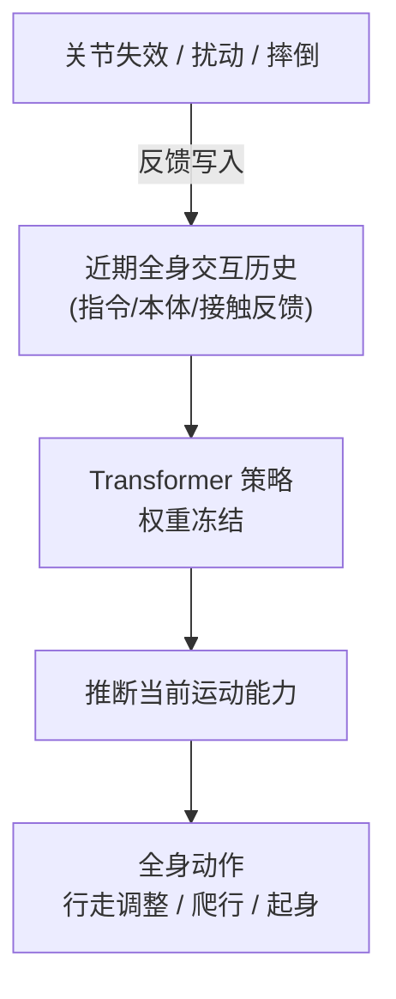

# Light REACT

**Light REACT**（**REsilient humAnoid ConTrol**，亮源新创 **2026-09-09** [官方发布](https://mp.weixin.qq.com/s/Xfps8-XAv3u1S--EpS5Ezw)）是面向 **人形机器人规模化部署** 的 **全身韧性控制** 框架：在 **部分关节失效、外部扰动或摔倒** 后，**单策略** 仍能根据 **近期全身交互历史** 自主调整步态、转入爬行或尝试恢复——**无需故障标签、无需人工切换控制模式、无需在线更新模型权重**。

> **落地状态（2026-09-09）：** 仅微信公众号发布与文内仿真/真机演示叙述；**无 arXiv、无独立项目页、无公开代码**。

## 一句话定义

**把「当前还能怎么动」写进近期交互上下文，让冻结的 Transformer 全身策略在故障与扰动下自行重组行走、爬行与恢复行为。**

## 英文缩写速查

| 缩写 | 英文全称 | 简要说明 |
|------|----------|----------|
| REACT | REsilient humAnoid ConTrol | 本文框架名：人形韧性全身控制 |
| ICL | In-Context Learning | 上下文学习；本文指权重不变、靠历史交互适应 |
| WBCL | Whole-Body Context Learning | 亮源新创对全身 ICL 的命名 |
| WBC | Whole-Body Control | 全身协调控制；本文覆盖行走—爬行—恢复行为族 |
| RL | Reinforcement Learning | 训练阶段在仿真中合成上下文数据（文内未披露算法细节） |

## 为什么重要

- **部署「最后一公里」：** 导航对齐（[LightNav-0](./paper-lightnav-0.md)）解决「去哪」后，REACT 直指 **运行中能力变化**——关节掉电、摔伤后是否还能动。
- **单策略覆盖多行为模态：** 行走调整、爬行、摔倒恢复 **同一策略** 内切换，避免传统 **故障检测 → 模式切换 → 重训** 运维链。
- **具身 ICL 新轴：** 与操作臂「示范当 prompt」不同，上下文是 **自身运动反馈序列**，归纳对象是 **当前运动能力** 而非新任务映射（见 [机器人 ICL](../concepts/robot-in-context-learning.md)）。
- **机构范式第三段：** 亮源新创 **规模化预训练 → 规模化对齐 → 规模化部署** 中，REACT 为 **部署段** 首个公开成果。

## 核心信息

| 项 | 内容 |
|----|------|
| **机构** | 光原点（Light Origins） |
| **发布** | 2026-09-09 微信公众号 |
| **策略形态** | **Transformer**；训练于仿真合成的全身交互上下文 |
| **部署输入** | 近期全身交互历史 + 常规定义（文内未披露完整观测维） |
| **适应方式** | **权重冻结**；滚动更新上下文 |
| **开源** | **未开源**（无项目页/GitHub；见 [核查归档](../../sources/sites/light-react.md)） |

## 核心原理

### 问题设定

- 关节失效后，同一高层指令对应的 **可行全身运动** 改变；预期动作未完成、实际反馈与原先不同——这些差异编码在 **近期交互历史** 中。
- 策略须 **推断当前运动能力** 并调整后续全身控制，且 **不依赖** 故障部位标注。

### 训练（文内披露）

1. 仿真合成 **大量全身交互上下文**，覆盖不同故障条件下的行走、爬行、摔倒恢复。
2. 训练 **Transformer 策略**，学会从 **连续交互历史** 推断能力并输出协调全身动作。

### 部署（文内披露）

- **无** 故障标签；**无** 在线梯度更新。
- 以 **滚动全身交互历史** 为上下文，根据实时运动反馈持续调整。

### 流程总览

## 工程实践

| 项 | 建议 |
|----|------|
| 复现入口 | 截至 2026-09-09 **无公开仓库**；以官方后续项目页为准 |
| 与导航分工 | [LightNav-0](./paper-lightnav-0.md) 管空间意图；REACT 管 **本体能力变化下的运动执行** |
| ICL 判别 | 读完历史后 **「怎么协调全身」** 变了 → 具身 ICL；仅换任务指令 → 条件化选择 |
| 运维预期 | 文内叙事减少 **现场人工切换模式**；仍须验证安全急停与能力边界 |
| 开源跟进 | 上线 GitHub/论文后补 `sources/repos/` 与 **源码运行时序图**（若可运行） |

## 局限与风险

- **未开源 / 无论文：** 机制与指标仅以公众号叙述为准，无法独立复现或核对。
- **上下文窗口与延迟：** 历史长度、推理频率、真机算力约束未披露。
- **安全边界：** 故障下继续运动可能加剧硬件损伤；需与急停/降级策略联调（文内未展开）。
- **与跑酷线关系：** 同机构 [Light-Loco-Parkour](./paper-light-loco-parkour.md) 偏 **感知跑酷技能蒸馏**；REACT 偏 **能力退化适应**——是否共享底座未说明。

## 关联页面

- [机器人 In-Context Learning](../concepts/robot-in-context-learning.md) — 全身上下文 vs 操作示范 ICL
- [LightNav-0](./paper-lightnav-0.md) — 同机构规模化对齐成果
- [Light-Loco-Parkour](./paper-light-loco-parkour.md) — 同机构全身运动另一能力轴
- [Humanoid Locomotion](../tasks/humanoid-locomotion.md) — 人形运动任务中心
- [Whole-Body Tracking Pipeline](../concepts/whole-body-tracking-pipeline.md) — 全身控制管线
- [Sim2Real](../concepts/sim2real.md) — 仿真合成上下文 → 真机部署链

## 参考来源

- [亮源新创 Light REACT 微信发布归档](../../sources/blogs/wechat_lightorigins_light_react_2026-09-09.md)
- [Light REACT 项目页归档](../../sources/sites/light-react.md)

## 推荐继续阅读

- [亮源新创官网](https://www.lightorigins.com/)
- [LightNav-0 技术博客](https://www.lightorigins.com/en/blog/lightnav-0)
- [WAM-TTT / RoboTTT / StellaVLA / Zero-WAM 四路线 ICL 对比](../comparisons/wam-ttt-robottt-stellavla-zero-wam-embodied-icl.md)
