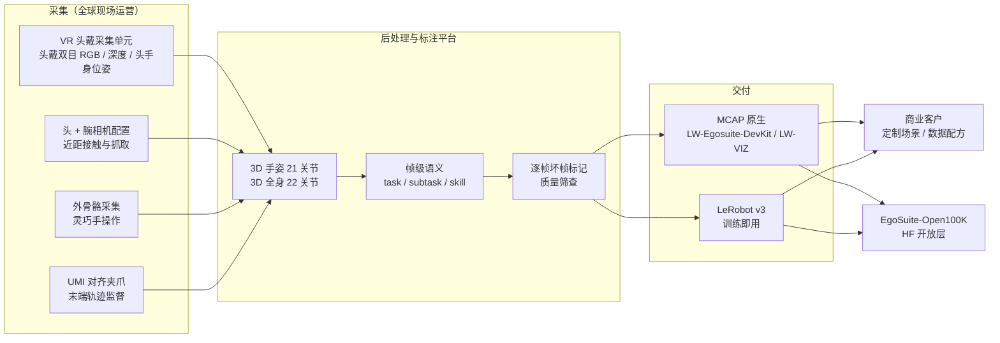

# Lightwheel EgoSuite

**EgoSuite** 是 [光轮智能（Lightwheel）](./lightwheel.md) 于 **2025-12-04** 以官方博客「Lightwheel Introduces EgoSuite — A High-Quality, Multi-Modality, Globally Scalable Egocentric Human Data Solution」发布的 **egocentric 人类数据产品线**（[产品页](https://lightwheel.ai/egosuite)）。它与 SimReady（仿真资产）、RoboFinals（策略评测）并列为光轮三大产品，2026-08 起其中一部分以 [EgoSuite-Open100K](./egosuite-open100k.md) 开放到 Hugging Face。

## 一句话定义

**EgoSuite = 采集硬件 + 全球现场采集运营 + 统一后处理/标注平台的「人类第一视角数据工厂」：按客户需求批量产出带 3D 手姿、3D 全身姿态与帧级语义标签的多模态 egocentric 演示，以 MCAP / LeRobot v3 交付给 VLA 与世界模型团队，主体是商业数据服务，开放的只是其中 10 万小时规划的公共层。**

## 英文缩写速查

| 缩写 | 英文全称 | 简要说明 |
|------|----------|----------|
| Ego | Egocentric | 第一人称视角；头戴（或头+腕）相机记录人的操作 |
| VR | Virtual Reality | 博客所称「VR 一体式采集单元」的头显形态 |
| UMI | Universal Manipulation Interface | 手持夹爪式采集接口；EgoSuite 提供「UMI 对齐」夹爪 |
| RGB-D | Red-Green-Blue + Depth | 彩色 + 深度图像模态 |
| MCAP | MCAP Container Format | EgoSuite 原生录制容器（Protobuf + Foxglove schema） |
| VLA | Vision-Language-Action | 视觉–语言–动作策略，主要下游消费者 |
| HDCP | Human Data Capture Platform | 光轮 2026-07 宣布在建的标准化人类数据采集平台 |
| DoF | Degrees of Freedom | 自由度；MANUS 手套每手 25 DoF |

## 为什么重要

- **把「人类视频」从被动抓取变成可下单的数据产品：** 博客以 Yuke Zhu 的具身 [数据金字塔](./paper-data-pyramid-embodied-manipulation.md) 立论——底层 web/人类视频量大但缺接触信号，顶层真机遥操作贵且难扩展——EgoSuite 主张 egocentric 人类数据是 **robot-agnostic、可规模化** 的中间解，和 [EgoScale](../methods/egoscale.md) 等人视频缩放实证形成供需闭环。
- **规模叙事是行业量级参照：** 自报 **7 国、500+ 环境并行、周产 20,000+ 小时、累计 300,000+ 小时**（2025-12 博客正文；产品页统计图 2026-10 已写 **400,000+**）。即便打折看，也远超学术语料（如 [Ego4D](./paper-ego4d.md) ~3.7k h），是判断「人类数据工厂」产能的少数公开数字之一。
- **多采集形态并存：** 同一方案内覆盖 VR 头戴、外骨骼（灵巧手）、UMI 对齐夹爪三类设备，正好横跨 [具身数采五大路线](../queries/embodied-data-collection-five-routes-landscape.md) 中的「第一视角」「动捕」「UMI」三条——是理解「路线组合」而非单选的产业样本。
- **把标注做成标准化 schema：** 21 关节手、22 关节全身、task/subtask/skill 语义段、逐帧坏帧标记全部落到公开的 MCAP/LeRobot 规范与 [LW-Egosuite-DevKit](./cn-os-lw-egosuite-devkit.md)，并通过 [EgoVerse](./paper-egoverse.md) 联盟推动对齐，降低跨数据集拼接成本。

## 核心原理

### 产品构成（2025-12 博客）

| 层 | 内容 | 关键点（均为自报） |
|----|------|------------------|
| **采集设备** | ① VR 一体式采集单元（头戴多模态传感器）② 定制外骨骼采集系统（高精度灵巧操作）③ UMI 对齐夹爪接口（镜像机器人末端运动学，直接轨迹监督） | 模态：RGB-D、上半身与手部姿态、触觉；NVIDIA AR/VR 栈做实时人体/手跟踪，**Jetson Orin NX** 端侧推理 |
| **现场运营** | 全球 field-operations 网络 | 10,000+ 任务 · 500+ 环境并行 · 7 国 · 20,000+ h/周；场景含家庭、商业服务、制造车间、物流仓储、户外、公共基础设施 |
| **后处理 / 标注** | 统一数据管理与后处理平台 | 3D 手姿 + 3D 全身姿态，宣称 **毫米级**、自遮挡与近距交互下稳定；帧级动作分段 + 语言描述，标注场景上下文、动作片段、被操作物体 |
| **交付** | Book a Demo / early access / 定制场景 | 无公开价目；面向具身 AI、世界模型与前沿机器人团队 |

产品页演示视频分 **Head Only Capture** 与 **Head and Wrist Camera Capture** 两类，对应后来 Open100K 的 EgoStandard（头戴）与 EgoPro（头+腕）两条产品线。头戴示例视频在 CDN 上命名为 `Pico_0x.mp4`，**推测** 头戴单元基于 PICO 头显（博客正文未点名；可对照 [Pico 4 Ultra 采集平台](./pico-4-ultra-egocentric-capture.md)）。

### 数据格式（官方文档 v1.0.0）

| 格式 | 定位 | 主要内容 |
|------|------|----------|
| **MCAP**（原生） | 回放、质检、转换、可视化 | Protobuf topic：`/session/metadata`（设备、任务/场景 id、操作员臂展身高、采集范式）、头/头相机位姿、左右手各 **21 关节**（世界系位置+四元数）、全身 **22 关节**（或上身 14 / 下身 8）、`/annotation/semantic_segments`（task / subtask / skill + 起止时间）、头部双目 RGB（H.264，已去畸变）；可选腕部双相机、头部深度、原始视频与标定、音频、逐帧 bad-frame 质量标记 |
| **LeRobot v3** | 训练与数据加载 | 每 episode 一个目录：逐帧 parquet（fp32 世界系姿态）、按相机分的 mp4、`tasks`/`subtasks` 映射、episode 统计、可选深度 PNG / 点云、原始 `annotation.json` |

格式取舍可对照 [HDF5 / MCAP / LeRobot 数据格式对比](../comparisons/hdf5-mcap-lerobot-data-formats.md)。

### 流程总览

### 演进时间线

| 日期 | 事件 |
|------|------|
| 2025-12-04 | 博客发布 EgoSuite（与 RoboFinals 同日） |
| 2026-03-03 | `lw-egosuite-devkit` 首个 PyPI 版本（0.1.2） |
| 2026-05-06 | 新闻稿：Q1 2026 订单约 **1 亿美元**（含仿真、数据生成、评测、部署，未拆分 EgoSuite）；EgoSuite 定位为 World→**Behavior**→Evaluation→Deployment 中的 Behavior 阶段，按客户逐个定义 data recipe |
| 2026-07-03 | 与 **MANUS**（数据手套）战略合作：MANUS 成为 **HDCP** 核心采集伙伴，每手 25 DoF 手部数据接入光轮多模态管线；光轮自报可经合成数据把单条演示放大 100–1,000 倍 |
| 2026-07-09 | 与 **PICO**（XR 头显）战略合作：组建联合产品团队，共研 **下一代通用人类数据采集硬件**，目标从项目制走向标准化、平台级 |
| 2026-08-06 | DevKit 1.0.2（Apache-2.0） |
| 2026-08-21 | 官方博客发布 [EgoSuite-Open100K](./egosuite-open100k.md)（HF blog 版 2026-08-26）：规划 10 万小时开放、首批上线，学术 + 商业训练许可 |

## 工程实践

| 目标 | 做法 |
|------|------|
| 评估 EgoSuite 数据是否适合自家模型 | 先下 [EgoSuite-Open100K](./egosuite-open100k.md) 的 EgoDemo（50 h，覆盖头戴/头+腕、有无全身姿态四种 Sub-SKU），再决定是否走商业定制 |
| 读取 / 质检 MCAP | `pip install lw-egosuite-devkit` → `lw-egosuite convert --mcap x.mcap` 生成 `_vis.mcap`，在 LW-VIZ（Foxglove 系，见 [Foxglove Studio](./foxglove-studio.md)）叠加手/身骨架与语义段 |
| 进训练管线 | 直接用 LeRobot v3 导出；姿态在 **世界系**（X 前 Y 左 Z 上），用于人→机 retarget 前需换到机器人基座系 |
| 过滤低质量帧 | 读取 `/annotation/bad_frame/*` 或 `bad_frame_ratio.json`，按手/身/相机分别剔除 |
| 灵巧手数据需求 | 头戴视觉手姿精度受遮挡限制；需要关节级真值时考虑外骨骼 / 手套路线（MANUS 合作），选型见 [数据手套 vs 视觉遥操作](../comparisons/data-gloves-vs-vision-teleop.md) |

**开源 / 开放状态（2026-10-10 核查）：**

| 组件 | 状态 |
|------|------|
| EgoSuite 全量商业数据（30 万+ h 级） | **未开放**，商业交付 |
| EgoSuite-Open100K（EgoStandard / EgoPro / EgoDemo） | **已开放（HF 门控）**，`license:other`，学术 + 商业训练 |
| [LW-Egosuite-DevKit](./cn-os-lw-egosuite-devkit.md) | **已开源**，Apache-2.0，PyPI 1.0.2 |
| 采集硬件、手姿恢复等标注算法 | **未开源**（博客称 in-house） |
| HDCP 采集平台 | 新闻稿称「open platform」，截至 2026-10-10 **未见公开实现** |

## 局限与风险

- **规模数字全为自报且口径不一：** 博客正文「300,000+ 小时已交付」与产品页统计图「400,000+ hours delivered」并存（**推测** 图片后来更新）；周产 2 万小时、7 国 500+ 环境、毫米级姿态精度均无第三方审计或公开基准。
- **「交付小时 ≠ 机器人可用监督」：** 人类 egocentric 数据只有手/身姿态与语义，不含机器人关节轨迹与力；上真机仍需 retarget 或 mid-training（见 [EgoScale](../methods/egoscale.md)、[人形数采六范式地图](../queries/humanoid-robot-data-collection-landscape.md)）。
- **公开层 ≠ 产品全貌：** 博客宣称的触觉、外骨骼、UMI 夹爪模态在 Open100K 的 MCAP/LeRobot 文档中 **未见** 对应 topic；公开数据主要是头戴/头+腕视觉 + 姿态 + 语义。
- **硬件品牌与型号不透明：** 2025-12 博客未点名设备厂商；PICO 合作的新一代硬件截至 2026-10-10 尚未公布规格。
- **商业条款不公开：** 定制采集的价格、交付周期、数据所有权与独占性需个案谈判。

## 关联页面

- [光轮智能（Lightwheel）](./lightwheel.md) — 公司主页面（SimReady / EgoSuite / RoboFinals 三产品线）
- [EgoSuite-Open100K](./egosuite-open100k.md) — 本产品线的开放数据层（HF，2026-08）
- [LW-Egosuite-DevKit](./cn-os-lw-egosuite-devkit.md) — MCAP 转换、可视化与读取工具链
- [具身数据金字塔](./paper-data-pyramid-embodied-manipulation.md) — 博客立论框架
- [EgoScale](../methods/egoscale.md) — 人类 egocentric 视频缩放实证
- [EgoVerse](./paper-egoverse.md) — egocentric 采集/标注标准联盟
- [Ego4D](./paper-ego4d.md) — 学术 egocentric 语料对照
- [Pico 4 Ultra 采集平台](./pico-4-ultra-egocentric-capture.md) — 头显式 egocentric 采集同类实践
- [Isaac Teleop](./isaac-teleop.md) — MANUS 手套所在的 NVIDIA 遥操作生态
- [具身数采五大路线](../queries/embodied-data-collection-five-routes-landscape.md) — 第一视角 / 动捕 / UMI 路线全景
- [数据手套 vs 视觉遥操作](../comparisons/data-gloves-vs-vision-teleop.md) — 手部数据采集选型
- [HDF5 / MCAP / LeRobot 数据格式](../comparisons/hdf5-mcap-lerobot-data-formats.md) — 交付格式取舍

## 参考来源

- [Lightwheel EgoSuite 官方博客、新闻稿与开源核查归档](../../sources/blogs/lightwheel_egosuite.md)
- [HF Blog：EgoSuite-Open100K](../../sources/blogs/hf_lightwheel_egosuite_open100k.md)
- [LW-Egosuite-DevKit 源码归档](../../sources/repos/lw-egosuite-devkit.md)

## 推荐继续阅读

- [Lightwheel Introduces EgoSuite（官方博客 / 产品页）](https://lightwheel.ai/egosuite)
- [EgoSuite 数据文档（MCAP / LeRobot 格式规范）](https://docs.lightwheel.net/egocentric_data/)
- [Lightwheel × PICO 合作新闻稿](https://lightwheel.ai/media/lightwheel-pico-partnership) · [Lightwheel × MANUS 合作新闻稿](https://lightwheel.ai/media/lightwheel-manus-partnership)
