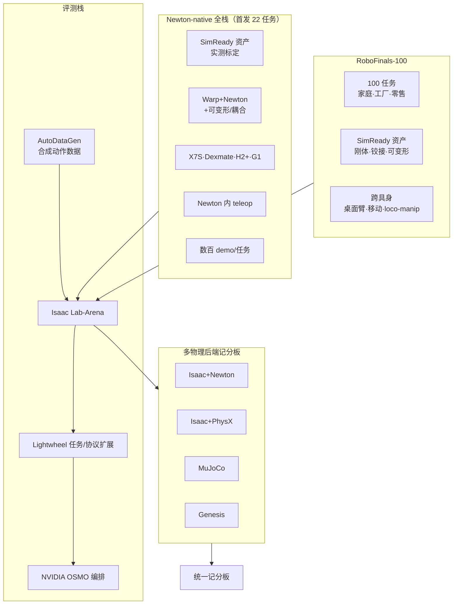

# Lightwheel RoboFinals

**Lightwheel RoboFinals** 是光轮科技（Lightwheel）发布的 **工业级仿真评测平台**，面向已超越学术 benchmark 的 **VLA / 通才机器人基础模型**。长期目标是 **RoboFinals-100**（100 任务、SimReady 资产、跨家庭/工厂/零售）；**2026 年起** 发布业界首个 **Newton-native 全栈评测 benchmark**——资产、求解器、机器人、遥操作数据、训练与评测均在 [Newton](./newton-physics.md) 上原生构建并端到端验证，首发 **22** 个家庭/医院/工厂接触丰富任务。评测执行层仍经 **NVIDIA Isaac Lab-Arena** + **BenchHub**（[LW-BenchHub](./lw-benchhub-tour.md)），并可通过 **NVIDIA OSMO** 与云 GPU 大规模并行 rollout。平台为 **商业服务（Coming soon）**；开源底座为 [Isaac Lab-Arena](https://github.com/isaac-sim/IsaacLab-Arena) 与 LW-BenchHub。

## 一句话定义

**当 LIBERO/RoboCasa 刷不动前沿 VLA 时，用 100 个工业对齐任务 + 多物理后端 + Arena 并行栈，把「评测」做成可扩展基础设施——而不是靠几百套真机硬测。**

## 英文缩写速查

| 缩写 | 英文全称 | 简要说明 |
|------|----------|----------|
| VLA | Vision-Language-Action | 视觉-语言-动作多模态策略；RoboFinals 主要评测对象 |
| SimReady | Lightwheel SimReady Asset | 光轮 Real2Sim 标定资产标准，支撑 RoboFinals-100 |
| Arena | Isaac Lab-Arena | NVIDIA×光轮联合评测框架；环境/机器人/任务解耦 |
| OSMO | NVIDIA OSMO | 分布式 AI 工作负载编排，用于大规模 benchmark rollout |
| TSC | Technical Steering Committee | Newton 技术指导委员会；光轮参与并主导可变形求解器 |
| BenchHub | Lightwheel BenchHub | Arena 之上的 benchmark 托管/执行/规模化层（实现见 LW-BenchHub） |
| Real2Sim | Real to Simulation | 用真机数据标定仿真资产动力学 |
| SR | Success Rate | 统一成功判据下的任务成功率 |

## 为什么重要

- **评测瓶颈叙事与工程对齐：** 光轮与 Qwen 等早期采用方共识：训练提速后，**学术仿真榜饱和 + 真机无 shadow mode** 使评测成为 Physical AI 主瓶颈（见 [具身评测选型闭环](../queries/embodied-eval-benchmark-selection-loop.md)）。
- **与 Arena 生态锚定：** [Isaac Lab-Arena](./isaac-lab-arena.md) README 已将 RoboFinals 列为共建 benchmark；本页是 **商业任务包 + 编排服务** 的产品层，不是第二个 Arena  fork。
- **多物理后端记分板：** 同一任务可在 Isaac+Newton、Isaac+PhysX、MuJoCo、Genesis 上跑，检验 **跨仿真器鲁棒性**——与 [Newton](./newton-physics.md)、[Genesis](./genesis-sim.md) 实体直接相关。
- **Newton 从后端到全栈：** 2026 媒体文称 RoboFinals 为 **首个 fully Newton-native benchmark**——不仅是换求解器，而是 SimReady 资产按 Newton schema 重建、线缆/布料可变形求解器、四类具身（X7S / Dexmate / H2+ / G1）与 **Newton 内 teleop 数据** 全链路验证；光轮在 Newton **TSC** 制定资产标准。
- **工业域覆盖：** 相对 [RoboCasa](./robocasa.md) 厨房通才榜与 [DexBench](./dexbench.md) 工业灵巧**规格**，RoboFinals 强调 **长程 household + factory + retail** 与铰接/可变形交互的 **统一 SR 榜**。

## 核心结构

| 组件 | 角色 |
|------|------|
| **RoboFinals-100** | 100 任务 benchmark 路线图；统一成功判据 |
| **Newton-native 首发集** | **22 任务**（家庭/医院/工厂）；全栈 Newton 构建；接触丰富长时域 |
| **BenchHub** | Arena 之上 benchmark 托管/执行；域随机化 + teleop 校准 horizon/成功判据 |
| **SimReady** | Real2Sim 标定资产库 |
| **Isaac Lab-Arena** | 开源评测核：Scene / Embodiment / Task |
| **AutoDataGen** | LLM 分解 + Isaac Lab 包；为 benchmark 自动生成动作数据（**未开源**） |
| **OSMO + 云 GPU** | 数千 episode 并行（文内提及 Nebius 集群） |
| **Real 验证轨** | 受控真机 benchmark + Sim–Real 相关性数据集（建设中） |

## 开源与访问（步骤 2.5）

| 项 | 状态（2026-09-14） |
|----|-------------------|
| RoboFinals 平台 / API | **商业闭源**；[发布页](https://lightwheel.ai/robofinals) 标注 **Coming soon**，需 Book a Demo |
| RoboFinals-100 完整任务包 | **未公开下载**；任务域与交互类型见官方文 |
| **Newton-native 22 任务** | **平台内**；全栈资产/数据/协议未公开；媒体文列任务族与闭环管线 |
| Newton teleop 数据集 | 文称每任务数百条 + 质检；**未列公开 HF/GitHub** |
| [Isaac Lab-Arena](https://github.com/isaac-sim/IsaacLab-Arena) | **已开源** Apache 2.0 |
| [Newton](https://github.com/newton-physics/newton) | **已开源** Apache 2.0（Linux Foundation） |
| [LW-BenchHub](https://github.com/LightwheelAI/LW-BenchHub) | **已开源** Apache 2.0；138+ RoboCasa/LIBERO 任务 |
| AutoDataGen | 官方媒体介绍；**无公开仓库链接** |

## 早期采用方（官方文）

| 团队 | 用途 |
|------|------|
| Qwen | 共建场景与评测标准；高吞吐行业对齐评测 |
| Fourier | 人形复杂交互 |
| RoboForce | 工业策略部署前压力测试 |
| Peritas | 医疗机器人安全关键验证 |

## 工程实践

| 目标 | 做法 |
|------|------|
| 等 RoboFinals 开放前 | 先用 [Arena](./isaac-lab-arena.md) + [LW-BenchHub](./lw-benchhub-tour.md) / EnvHub 跑通评测管线 |
| 对齐工业难度 | 对照 [DexBench](./dexbench.md) OSC/Regime 语言，理解 RoboFinals 工厂域任务设计 |
| 多后端对比 | 规划同一策略在 Newton vs PhysX vs MuJoCo 的 SR 差异实验 |
| Newton 全栈 | 区分「仅换后端」与 **Newton-native 资产+teleop+评测**；首发 22 任务覆盖工厂线缆插拔、医院器械整理等 |
| 数据飞轮 | 关注 AutoDataGen 是否开源；现阶段可参考 Tour 仓 LLM 场景扩增 + 自过滤示范 |
| 真机验证 | 跟踪光轮 Sim–Real 相关性数据集发布，勿把仿真 SR 当部署保证 |

## 局限与风险

- **不可自助复现：** 截至入库日平台需商务接入，**不能**像 LIBERO 一样 `git clone` 即跑。
- **与学术榜不可直接横比：** RoboFinals-100 难度与资产复杂度高于传统 kitchen benchmark；数值勿与 [RoboCasa](./robocasa.md) 公开榜混谈。
- **AutoDataGen 黑盒：** 合成数据管线未开源，复现「官方数据 + 官方榜」存在信息缺口。
- **多后端 ≠ 多真机：** 跨仿真器一致仍不保证真机；Real2Sim 数据集尚在建设。
- **Newton 闭环自述：** 官方文承认训练/评测均在仿真内，**不单独证明真机一致**；Sim–Real 相关性结果计划后续发布。
- **营销叙事：** 「ImageNet of robotics」为愿景表述，需用独立第三方复现与公开榜单验证。

## 关联页面

- [Isaac Lab-Arena](./isaac-lab-arena.md) — 开源评测底座
- [LW BENCHHUB TOUR](./lw-benchhub-tour.md) — 光轮厨房 + EnvHub 工程样例
- [RoboCasa](./robocasa.md) — 厨房通才仿真榜（难度低于 RoboFinals 叙事）
- [DexBench](./dexbench.md) — 工业灵巧规格（Arena coming soon）
- [Newton Physics](./newton-physics.md) — RoboFinals 主工业求解器后端
- [具身评测基准选型闭环](../queries/embodied-eval-benchmark-selection-loop.md)

## 参考来源

- [RoboFinals 发布页归档](../../sources/sites/lightwheel_robofinals.md)
- [Newton-native Benchmark 媒体文归档](../../sources/sites/lightwheel_robofinals_newton_native_benchmark.md)
- [Isaac Lab-Arena / BenchHub 技术文归档](../../sources/sites/lightwheel_robofinals_isaac_lab_arena.md)
- [Industrial Benchmark 媒体文归档](../../sources/sites/lightwheel_robofinals_industrial_benchmark.md)
- [Isaac Lab-Arena 仓库归档](../../sources/repos/isaaclab_arena.md)
- [官方发布页](https://lightwheel.ai/robofinals)
- [Newton-native 媒体文](https://lightwheel.ai/media/lightwheel-launches-robofinals-full-stack-robot-evaluation-benchmark-newton)

## 推荐继续阅读

- [Isaac Lab-Arena GitHub](https://github.com/isaac-sim/IsaacLab-Arena)
- [Newton-native 全栈评测文](https://lightwheel.ai/media/lightwheel-launches-robofinals-full-stack-robot-evaluation-benchmark-newton)
- [LW-BenchHub 文档](https://docs.lightwheel.net/lw_benchhub)
- [NVIDIA 博客：通才策略评测](https://developer.nvidia.com/blog/accelerating-generalist-robot-policy-evaluation-with-nvidia-isaac-lab-arena/)
