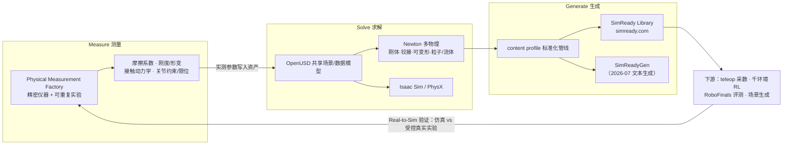
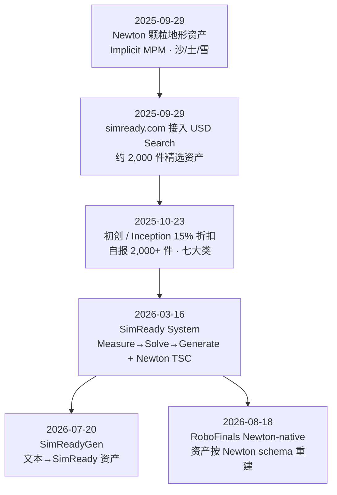

# Lightwheel SimReady（光轮 SimReady 资产体系）

**Lightwheel SimReady** 是 [光轮智能](./lightwheel.md)（Lightwheel）的 **物理准确 OpenUSD 仿真资产体系**：对外是 **SimReady Library**（产品页 [lightwheel.ai/asset-library](https://lightwheel.ai/asset-library)，资产商城 [simready.com](https://simready.com/)），对内是一条 **Measure → Solve → Generate** 管线——在自建 **Physical Measurement Factory** 测量真实物体的摩擦、刚度/形变、接触与关节约束，经 [Newton](./newton-physics.md) 等多物理求解器复现，再以 OpenUSD 标准化管线批量生成资产与环境。它是 [RoboFinals](./lightwheel-robofinals.md) 评测任务与 [SimReadyGen](./lightwheel-simreadygen.md) 生成引擎的共同底座；其免费子集见 [Lightwheel-simready-asset](./cn-os-lightwheel-simready-asset.md)（259 件，CC BY-NC 4.0）与 [Lightwheel-YCB](./cn-os-lightwheel-ycb.md)（125 件，USD + MJCF）。

## 一句话定义

**把「看起来像」的 3D 模型变成「物理上测过、能直接进 Isaac Sim / Newton 做遥操作和 RL」的 OpenUSD 资产，并把测量—求解—生成做成可规模化的数据基础设施。**

## 英文缩写速查

| 缩写 | 英文全称 | 简要说明 |
|------|----------|----------|
| SimReady | Simulation-Ready | 可直接导入仿真并具备物理/碰撞/关节/语义的资产；本页指光轮品牌化资产体系（与 NVIDIA SimReady 规范同名，见局限） |
| USD / OpenUSD | (Open) Universal Scene Description | 光轮资产的统一载体；几何 + 物理 + 语义一个文件描述，跨 Isaac Sim / Newton 复用 |
| MPM | Material Point Method | 物质点法；Newton 中的 Implicit MPM 用于沙/土/雪颗粒地形 |
| MJCF | MuJoCo XML Format | MuJoCo 模型格式；Lightwheel-YCB 与 USD 双格式发布 |
| DCC | Digital Content Creation | Houdini / Blender 等内容制作工具；光轮在其中写入 Newton 属性 |
| TSC | Technical Steering Committee | Newton（Linux Foundation 项目）技术指导委员会；光轮 2026-03 宣布加入 |
| YCB | Yale-CMU-Berkeley Object Set | 经典操作物体集；光轮重建为 Lightwheel-YCB |
| RL | Reinforcement Learning | SimReady 资产宣称的主要下游用法之一（另一个是 teleop 采数） |
| CC BY-NC | Creative Commons Attribution-NonCommercial | 光轮开源资产的许可：可署名使用、禁止商用 |
| ADI | Analog Devices, Inc. | 工业伙伴；联合做传感器对齐的仿真（力/力矩/接触信号） |

## 为什么重要

- **资产是仿真数据的「原材料」瓶颈：** 遥操作采数、RL 并行训练、benchmark 评测都依赖带正确物理的资产；多数公开资产只做到视觉逼真，摩擦/质量/刚度靠估计，直接放大 [物理保真度 sim2real gap](../concepts/physics-fidelity-sim2real-gap.md)。光轮把「测量后再建模」作为卖点（自报）。
- **OpenUSD 中立资产 → 多引擎复用：** 同一资产按 content profile 编写，可喂 [Isaac Sim](./isaac-sim.md)、[Newton](./newton-physics.md) 与其它 OpenUSD 工作流；对需要做 **跨仿真器鲁棒性**（如 RoboFinals 多后端记分板）的团队，减少格式转换造成的物理漂移。
- **Newton 生态的资产标准参与者：** 光轮从 2025-09 的 Newton 颗粒地形资产贡献者，到 2026-03 宣布加入 Newton TSC，负责复杂物理资产的 SimReady schema、Real-to-Sim 调参工具与参考资产——Newton 资产格式演进值得跟踪。
- **商业化资产市场的现实参照：** simready.com 按件售卖（样例 $50 / $145）+ 部分 CC BY-NC 免费，是「仿真资产商品化」的一个可观察样本，可与 [NVIDIA Physical AI 数据集](./nvidia-physical-ai-datasets.md) 的开放 SimReady 场景对照。

## 核心原理

### Measure → Solve → Generate 闭环（2026-03-16 版叙事）

| 环节 | 机制 | 公开程度 |
|------|------|----------|
| **Measure** | 自建测量工厂测摩擦、刚度/形变、接触动力学、关节约束；Real-to-Sim 验证对比仿真与受控真实实验，持续校准 | 测量数据、精度与误差 **未公开**（自报） |
| **Solve** | 依赖能处理刚体 + 铰接 + 布料/线缆 + 粒子/流体 + 多接触的求解层；与 NVIDIA 在 Newton 中实现 **USD 可变形资产解析**、扩展复杂操作求解 | Newton 本体开源；光轮具体贡献 **未列 PR 链接** |
| **Generate** | 遵循 OpenUSD 内容规范；资产 = 几何 + 物理 + 语义的结构化机器可读描述；按 content profile 编写，跨引擎复用 | 商业库 + 部分 CC BY-NC 开源 |

### 资产物理属性：从开源仓库可核实的部分

光轮商业资产的具体 schema 未公开，但两个开源仓库给出了可核实的属性形态：

| 来源 | 物理属性 | 说明 |
|------|----------|------|
| [Lightwheel-YCB](./cn-os-lightwheel-ycb.md) README | mass、friction、density、friction loss、damping、stiffness、armature | 按交互模式（刚体/铰接/可变形）配置；USD + MJCF 双格式 |
| [Newton-Lightwheel](https://github.com/LightwheelAI/Newton-Lightwheel) README | 碰撞：`_newton__contact_ke/kd/kf/ka`、thickness、静/动摩擦、restitution、density、collision_group、凸近似方法（如 `coacd`） | USD 自定义属性 → Newton `ShapeConfig` |
| 同上 | 粒子：mass、radius、friction、**Young's modulus、Poisson ratio、damping、hardening、yield pressure/stress、tensile yield ratio** | USD 自定义属性 → Newton `ImplicitMPMOptions`；作者称后续迁移到官方 Newton USD schema |
| [Lightwheel-simready-asset](./cn-os-lightwheel-simready-asset.md) README | 预配置 articulation（门、抽屉、柜） | 目标 Isaac Sim 4.5 / 5；宣称经 Isaac Lab、teleop、RL 验证 |

## 版本与事件时间线

### 2025-09-29 · Lightwheel–Newton 运动资产合作

- **背景**：Newton 由 NVIDIA、Google DeepMind、Disney Research 发起；光轮自称以核心贡献者身份加入，目标是为 Newton 提供高质量资产。文中同时称刚上线的 simready.com 是「最大的 Isaac Sim SimReady 开源资产库」，并把 YCB 升级为 Isaac Sim `.usd` + MuJoCo `.mjcf` 跨平台（自报）。
- **求解器**：选 Newton 的 **Implicit MPM**（源自 Daviet 等 SIGGRAPH 2016 的 CPU 方法），理由是大规模稳定、适合沙/土/雪等连续介质，且可作为 Newton MPM 的压力测试。
- **资产**：12 m × 12 m 地形 + 岩石/树桩障碍；Houdini 自动配置碰撞与材质；**双求解器碰撞**——MPM 直接用高精三角网格，[MuJoCo Warp](./mujoco-warp.md) 用缓存的凸分解；沙/土/雪粒子各配内聚力、摩擦、弹性参数。
- **实验**：Newton 示例的 [ANYmal](./anymal.md) 用平地预训练策略，在可变形起伏地形上明显走不稳（定性，未给数值）——用来说明需要在这类资产上重新训练。
- **性能（自报）**：Windows + RTX 4090、约 **1.5M** 粒子 **8–12 FPS**；预期 Linux + 更强 GPU **≥20 FPS**。
- **开源**：[LightwheelAI/Newton-Lightwheel](https://github.com/LightwheelAI/Newton-Lightwheel)（USD 场景、Houdini HIP/HDA、`uv run mpm_test.py`，依赖 fork `LightwheelAI/newton_corl`）；**根目录未见 LICENSE**。

### 2025-09-29 · USD Search 资产检索

- simready.com 上把 NVIDIA **USD Search API**（NVCLIP，ViT-H）部署在约 **2,000** 件精选操作/运动资产上；支持自然语言（如 "kitchen items under 500 grams"）、以图搜资产、类型过滤（lightwheel.ai 上用于 Lightwheel-YCB 子集）。
- 自报亚秒级响应、**预期**每日 10,000 次查询；USD Search 本身需 Omniverse 商业授权。
- 工程含义：资产库规模上来后，**检索**成为搭场景的第一道工序；但「按物理属性检索」（如 500 g 以下）依赖资产元数据是否真实可靠。

### 2025-10-23 · 初创与 NVIDIA Inception 折扣

- simready.com 对机器人初创（含 Inception 成员）**15% 折扣**；自报 **2,000+** 资产，含刚体/铰接/可变形/液体，覆盖服装、制造、电子、医疗、食品饮料、住宅、仓储七大类。
- 页脚声明 simready.com 由光轮运营，**不是 NVIDIA 官方**资产库。

### 2026-03-16 · SimReady: The Physics Data Infrastructure for Physical AI

- 把 SimReady 从「资产库」升级表述为 **物理数据基础设施**：Measure → Solve → Generate 闭环（见上图）。
- **与 NVIDIA 的分工（自报）**：共同定义 SimReady 资产标准、在 Newton 中实现 USD 可变形资产解析、扩展复杂操作求解能力；OpenUSD 让同一资产同时喂 Newton 与 Isaac Sim。
- **工业验证（自报）**：与 **Samsung** 共同开发/标定 Newton，用于装配机器人线缆操作；与 **ADI** 做传感器感知仿真，对齐仿真与真实工业传感器的力/力矩/接触信号，面向高精度插装。
- **Newton TSC**：宣布「将」加入 Newton（Linux Foundation）TSC，关注复杂物理资产 schema、求解器真实标定、Real-to-Sim 调参工具、参考资产与场景。
- 全文**没有**资产数量、测量精度或 sim–real 误差的量化数字。

### 之后：SimReadyGen 与 Newton-native 评测

- **2026-07-20**：[SimReadyGen](./lightwheel-simreadygen.md) 把 Generate 环节做成 agentic 文本生成服务，底层称为 **SimReady Foundry**（实测物理管线）。
- **2026-08-18**：[RoboFinals](./lightwheel-robofinals.md) 宣称首个 Newton-native benchmark，SimReady 资产按 Newton schema 重建。

## 开源与访问（步骤 2.5，2026-10-10 核查）

| 项 | 状态 |
|----|------|
| SimReady Library / simready.com | **商业为主**：按件售卖（首页样例 $50 / $145），可定制；所有商业授权资产含在 Lightwheel Lab Enterprise Package；首页快照 24 件中 9 件标 "Open Sourced"（CC BY-NC 4.0） |
| [Lightwheel-simready-asset](https://github.com/LightwheelAI/Lightwheel-simready-asset) | **已开源（非商用）**：259 件 USD（251 操作 + 8 运动），CC BY-NC 4.0，Google Drive 下载 |
| [Lightwheel-YCB](https://github.com/LightwheelAI/Lightwheel-YCB) | **已开源**：125 件，USD + MJCF |
| [Newton-Lightwheel](https://github.com/LightwheelAI/Newton-Lightwheel) | **已公开**，但**未见 LICENSE**，再分发与商用边界不明 |
| 测量数据 / 标定参数 / SimReady schema 规范文本 | **未公开** |
| Hugging Face | `LightwheelAI` 组织无 SimReady 资产库镜像 |

## 工程实践

| 目标 | 做法 |
|------|------|
| 学术原型、零预算 | 先用 [Lightwheel-simready-asset](./cn-os-lightwheel-simready-asset.md)（259 件）+ [Lightwheel-YCB](./cn-os-lightwheel-ycb.md)；注意 **CC BY-NC**，产品化前须换商业授权 |
| Isaac Sim / Isaac Lab 操作任务 | 资产以 USD 原生发布、预配置 articulation，可直接放进 [Isaac Lab](./isaac-lab.md) 场景；导入后仍应抽查质量/惯量/摩擦与碰撞近似，再做 [域随机化](../concepts/domain-randomization.md) |
| MuJoCo 系对照实验 | 优先 Lightwheel-YCB 的 MJCF 版本；同一物体 USD vs MJCF 跑同一策略，可量化格式转换引入的物理差异 |
| Newton 颗粒/可变形地形 | 参考 Newton-Lightwheel 的 `_newton__*` USD 属性约定与双求解器碰撞做法（MPM 用原网格、MuJoCo Warp 用凸分解）；Newton 官方 USD schema 成熟后迁移 |
| 物理参数可信度 | 光轮"实测"参数无公开误差报告：关键接触任务（插装、线缆）自己做小规模 Real-to-Sim 对照（如推/滑实验拟合摩擦），再决定是否信任资产默认值 |
| 场景搭建效率 | 在 simready.com 上用自然语言 / 以图检索定位资产；要批量生成长尾物体时看 [SimReadyGen](./lightwheel-simreadygen.md) |
| 评测对齐 | 若目标是 [RoboFinals](./lightwheel-robofinals.md) 或 [Isaac Lab-Arena](./isaac-lab-arena.md) 系榜单，尽量用同源 SimReady 资产，避免资产差异混入策略差异 |

## 局限与风险

- **"实测物理"不可独立验证：** 测量工厂的方法、样本量、精度、sim–real 误差均未公开；"grounded in measured physical data" 应视为 **自报**。
- **名称易混：** "SimReady" 同时是 NVIDIA 的 OpenUSD 资产规范/生态叫法（如 NVIDIA SimReady Foundation 仓库与 [NVIDIA Physical AI 数据集](./nvidia-physical-ai-datasets.md) 中的 SimReady 场景）。光轮称其资产"遵循 OpenUSD 内容规范 / content profile"，与 NVIDIA SimReady 规范的具体对应关系 **推测为兼容子集，未见官方逐条说明**。
- **"开源最大库"措辞与实际不符：** 2025-09 博文称 simready.com 为最大开源 SimReady 库，但 2026-10-10 快照显示多数资产付费、免费部分为 **CC BY-NC**（非商用）——商用项目不能直接用开源子集。
- **Newton-Lightwheel 无许可文件：** 只能作研究参考，二次分发前需联系光轮确认。
- **规模数字口径不一：** "约 2,000 件精选（USD Search 覆盖）"、"2,000+ 件"、开源仓库 259 件、YCB 125 件分属不同集合，勿混为一个总量。
- **性能数字为早期单机：** 1.5M 粒子 8–12 FPS 为 Windows + 4090 演示，非 RL 训练吞吐；"≥20 FPS" 为预期。
- **TSC 为宣布时态：** 2026-03 文用 "will join"，以 Newton 项目治理文件为准（入库日未在 newton 仓库找到 GOVERNANCE/TSC 名单文件核实）。

## 关联页面

- [光轮智能（Lightwheel）](./lightwheel.md) — 公司主页
- [Lightwheel SimReadyGen](./lightwheel-simreadygen.md) — 基于 SimReady Foundry 的文本→资产生成引擎
- [Lightwheel-simready-asset](./cn-os-lightwheel-simready-asset.md) — 259 件 CC BY-NC 开源子集
- [Lightwheel-YCB](./cn-os-lightwheel-ycb.md) — YCB 物体 SimReady 重建（USD + MJCF）
- [Lightwheel RoboFinals](./lightwheel-robofinals.md) — 以 SimReady 资产为底座的工业评测平台
- [Newton Physics](./newton-physics.md) — 光轮参与资产标准与可变形解析的多物理引擎
- [Isaac Sim](./isaac-sim.md) / [Isaac Lab](./isaac-lab.md) — 资产主要目标平台
- [Isaac Lab-Arena](./isaac-lab-arena.md) — 光轮共建的评测框架
- [NVIDIA Omniverse](./nvidia-omniverse.md) / [Learn OpenUSD](./nvidia-learn-openusd.md) — OpenUSD 生态背景
- [物理保真度与 Sim2Real Gap](../concepts/physics-fidelity-sim2real-gap.md)
- [具身数据采集五路线全景](../queries/embodied-data-collection-five-routes-landscape.md) — SimReady 在「场景重建」路线中的位置

## 参考来源

- [光轮 SimReady 官方博文合集归档](../../sources/blogs/lightwheel_simready.md)（含 3 篇博文 + 折扣公告 + 产品页 + simready.com 快照）
- [Lightwheel-simready-asset 仓库归档](../../sources/repos/lightwheel-simready-asset.md)
- [Lightwheel-YCB 仓库归档](../../sources/repos/lightwheel-ycb.md)
- [SimReady: The Physics Data Infrastructure for Physical AI（2026-03-16）](https://lightwheel.ai/media/simready)
- [Lightwheel–Newton Partnership（2025-09-29）](https://lightwheel.ai/media/lightwheel-newton)
- [USD Search 资产检索（2025-09-29）](https://lightwheel.ai/media/lightwheel-usd-blog-CoRL)
- [SimReady Library 产品页](https://lightwheel.ai/asset-library)

## 推荐继续阅读

- [simready.com 资产商城](https://simready.com/)
- [LightwheelAI/Newton-Lightwheel](https://github.com/LightwheelAI/Newton-Lightwheel) — `_newton__*` USD 属性映射表
- [Newton Physics（NVIDIA 开发者页）](https://developer.nvidia.com/newton-physics)
- [NVIDIA 博客：Isaac Lab + Newton 四足运动与布料操作](https://developer.nvidia.com/blog/train-a-quadruped-locomotion-policy-and-simulate-cloth-manipulation-with-nvidia-isaac-lab-and-newton/)
- [NVIDIA USD Search 文档](https://docs.omniverse.nvidia.com/services/latest/services/usd-search/overview.html)
