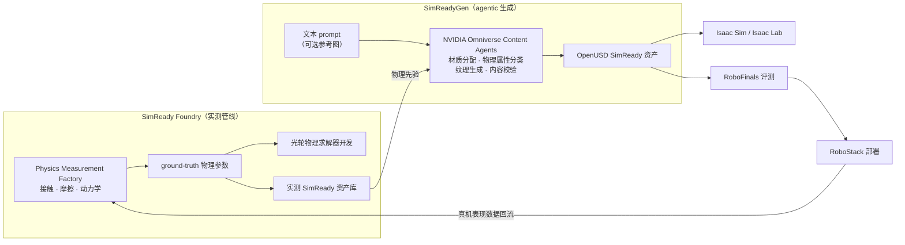
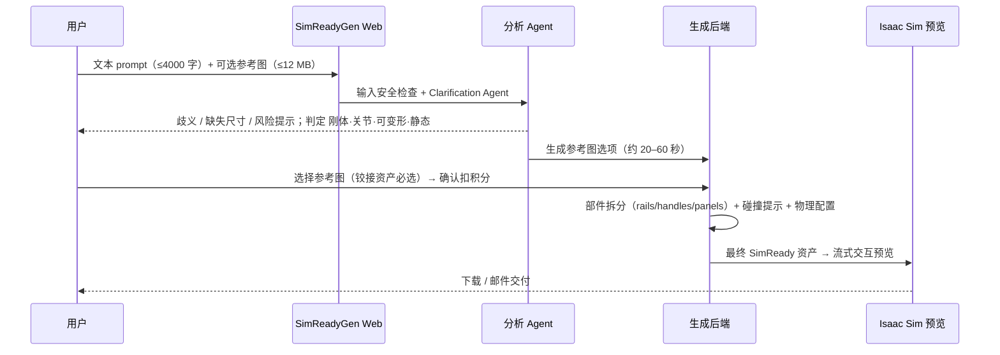

# Lightwheel SimReadyGen

**SimReadyGen**（"Agentic Simulation Generation for Physical AI"）是 [光轮智能](./lightwheel.md) 于 **2026-07-20** 发布的 **agentic 仿真资产生成引擎**：用户输入文本 prompt（可附参考图），系统经多步 agent 分析后输出 **结构化、带物理的 OpenUSD SimReady 资产**，可直接进入 [Isaac Sim](./isaac-sim.md) / [Isaac Lab](./isaac-lab.md)。它构建在 OpenUSD 与 NVIDIA Omniverse Libraries 之上，集成开源的 [NVIDIA USD Content Agents](https://github.com/nvidia-omniverse/content-agents)，物理参数据称取自光轮 [SimReady](./lightwheel-simready.md) 体系中的实测管线 **SimReady Foundry**。产品以 **积分制商业 Web 服务** 提供（[lightwheel.ai/simreadygen](https://lightwheel.ai/simreadygen/)），截至 2026-10-10 **无论文、无公开代码**。

## 一句话定义

**一句话描述一个物体，得到一个「物理参数来自实测库、关节/可变形已配好、能在 Isaac Sim 里直接交互」的 USD 资产——把 SimReady 的 Generate 环节做成 agent 服务。**

## 英文缩写速查

| 缩写 | 英文全称 | 简要说明 |
|------|----------|----------|
| SimReadyGen | SimReady Generation | 光轮文本→SimReady 资产的 agentic 生成服务 |
| SimReady | Simulation-Ready | 带几何、物理、碰撞、关节与语义、可直接仿真的资产 |
| USD / OpenUSD | (Open) Universal Scene Description | 生成产物格式；保证可进 Isaac Sim / Isaac Lab 等工作流 |
| SimReady Foundry | Lightwheel SimReady Foundry | 光轮实测物理管线（测量工厂 → 物理参数 → 求解器开发），SimReadyGen 的物理来源 |
| PBR | Physically Based Rendering | Content Agents 中 Material Agent 选择的基于物理的材质 |
| CAD | Computer-Aided Design | 前端提供 CAD 平面图上传入口（推测用于场景级生成） |
| RoboStack | Lightwheel RoboStack | 光轮端到端部署管线，闭环中位于 RoboFinals 之后 |

## 为什么重要

- **长尾资产的人工成本：** 机器人训练需要大量物体变体；手工建模 + 调物理 + 配关节是 [SimReady](./lightwheel-simready.md) 资产库扩张的主要成本，生成式管线直接攻这个瓶颈。
- **「生成」与「物理可信」的结合点：** 学术界的 sim-ready 生成（如 [PhysX-Omni](./physx-omni.md)、[EmbodiedGen V2](./paper-embodiedgen-v2-sim-ready-world-engine.md)、[DeformSmith](./paper-deformsmith.md)）多用学习或物理 harness 估计参数；SimReadyGen 的差异化叙事是 **物理来自实测库而非估计**——若成立，可降低 [物理保真度 gap](../concepts/physics-fidelity-sim2real-gap.md)。
- **NVIDIA 开源 agent 工具链的商业落地样本：** 它是 NVIDIA USD Content Agents（Geometry / Material / Texture / Physics / Joint / Validation agent）较早的公开商用集成案例之一，可借此观察这套参考实现在产品中的用法。
- **光轮闭环的起点：** 官方把它定义为 Generate → [RoboFinals](./lightwheel-robofinals.md) 评测 → RoboStack 部署 → 真机数据回流 的第一步。

## 核心原理

### 官方叙事：实测物理 + agentic 生成

- **输入**：文本描述（官方示例："A cream-white bucket hat with a rounded crown, wide brim, stitched band, and two metal eyelets."），可附一张参考图。
- **关键机制（官方）**：Content Agents 负责 USD 材质分配、**物理属性分类**、纹理生成与内容校验；物理属性据称从实测库取值——「每个资产都携带实测物理，而非估计」（**自报**；未说明新物体如何匹配到实测条目，**推测**是按材质/类别检索最近的实测参数）。
- **输出**：结构化 OpenUSD 资产，带刚体 / 关节 / 可变形配置，可交互预览、下载。
- 官方展示的示例物体：Bucket Hat（软体）、Refrigerator（铰接）、Teddy Bear（可变形）、Oven（铰接）。

### Web 应用中可见的生成流程（推测，来自前端界面文案）

- 前端进度估计常量显示刚体/可变形约 **30 分钟**、铰接约 **70 分钟** 量级（**推测**为进度条预估，不是官方 SLA）。
- 另有 **CAD 平面图**（PNG/JPG，单层、带墙/房间标签/门窗）上传与场景任务提交入口——**推测** 正在支持从平面图生成场景级环境；官方博文未提及。

## 版本与事件

| 日期 | 事件 |
|------|------|
| 2026-03-16 | 前置：[SimReady](./lightwheel-simready.md) System 提出 Measure → Solve → **Generate** 闭环 |
| **2026-07-20** | SimReadyGen 博文发布 + Web 应用上线（"Get started" / "START NOW" 试用入口） |
| 2026-10-10 | 入库核查：无 arXiv（API 检索 0 结果）、无 GitHub 仓库、无 HF 数据集；Web 应用为积分 + Stripe 计费 |

## 开源与访问（步骤 2.5）

| 项 | 状态（2026-10-10） |
|----|-------------------|
| SimReadyGen 服务 | **商业闭源**；需登录，积分钱包（Stripe 充值 / 兑换码），公开页面未列价格 |
| 论文 / 技术报告 | **无**（博文无链接；arXiv 检索 0 结果） |
| 源码 | **未开源**（无 GitHub 链接；`LightwheelAI/SimReadyGen` 不可访问） |
| 生成资产数据集 | **未公开** |
| 依赖组件 [USD Content Agents](https://github.com/nvidia-omniverse/content-agents) | **已开源**（NVIDIA，Apache 2.0；Material / Physics agent 为 Beta，Geometry / Texture / Joint / Validation 为 Research Preview） |
| 底层实测资产 | 商业 [SimReady Library](./lightwheel-simready.md)；免费子集见 [Lightwheel-simready-asset](./cn-os-lightwheel-simready-asset.md)（CC BY-NC） |

## 工程实践

| 目标 | 做法 |
|------|------|
| 补长尾物体 | prompt 写清 **尺寸、材质、可动部件**（如"两个抽屉、白色把手"）；Clarification Agent 会追问缺失尺寸，提前给出可减少返工 |
| 铰接资产 | 先在参考图里挑结构最清晰的一张（铰接必须选参考图），生成后在 Isaac Sim 预览里逐个拉动关节，核对限位与转轴 |
| 物理可信度验收 | 不要直接信任"实测物理"：抽查质量、惯量、摩擦与碰撞近似；关键接触任务做小规模 Real-to-Sim 对照，再纳入 [域随机化](../concepts/domain-randomization.md) 范围 |
| 自建替代 | 需要可审计、可本地部署的流程时，直接基于开源 [USD Content Agents](https://github.com/nvidia-omniverse/content-agents) 搭管线，或对比学术方案 [PhysX-Omni](./physx-omni.md)、[EmbodiedGen V2](./paper-embodiedgen-v2-sim-ready-world-engine.md) |
| 场景级 | 全屋/房间布局可对照 [HomeWorld](./paper-homeworld-whole-home-scene-generation.md)；SimReadyGen 的平面图入口目前缺官方说明，暂不作为主路径 |
| 评测闭环 | 生成资产若用于 [RoboFinals](./lightwheel-robofinals.md) 式评测，记录资产版本与生成参数，避免资产漂移混入策略对比 |

## 局限与风险

- **零量化证据：** 博文没有生成成功率、物理误差、耗时、规模等任何数字；"measured physics, not estimates" 是 **自报**，生成物体与实测条目如何对应未说明。
- **无论文、无代码、无基准：** 不能与 [PhysX-Omni](./physx-omni.md) 的 PhysX-Bench、EmbodiedGen V2 的可用率等公开指标横比。
- **依赖处于预览期的组件：** 其集成的 USD Content Agents 中多数 agent 仍是 Research Preview，NVIDIA 自述"接口可能变化、不宜原样部署"——生成质量与稳定性可能随上游变化。
- **前端观察 ≠ 官方功能承诺：** 本页「推测」部分（流程步骤、耗时、平面图场景生成）来自公开 JS 包的界面文案，产品可能随时调整。
- **商业锁定：** 积分计费、资产授权条款需单独确认；生成资产能否商用、能否再分发，入库日公开页面未写明。

## 关联页面

- [光轮智能（Lightwheel）](./lightwheel.md) — 公司主页
- [Lightwheel SimReady](./lightwheel-simready.md) — 上游实测资产体系（Measure → Solve → Generate）
- [Lightwheel RoboFinals](./lightwheel-robofinals.md) — 闭环中的评测平台
- [Lightwheel-simready-asset](./cn-os-lightwheel-simready-asset.md) — 免费 CC BY-NC 资产子集
- [Isaac Sim](./isaac-sim.md) / [Isaac Lab](./isaac-lab.md) — 生成资产的目标平台
- [NVIDIA Omniverse](./nvidia-omniverse.md) — Omniverse Libraries 与 Content Agents 背景
- [PhysX-Omni](./physx-omni.md) / [EmbodiedGen V2](./paper-embodiedgen-v2-sim-ready-world-engine.md) / [DeformSmith](./paper-deformsmith.md) / [HomeWorld](./paper-homeworld-whole-home-scene-generation.md) — 学术 sim-ready 资产/场景生成对照
- [Text-to-CAD](../concepts/text-to-cad.md) — 文本生成几何的相邻路线
- [物理保真度与 Sim2Real Gap](../concepts/physics-fidelity-sim2real-gap.md)

## 参考来源

- [光轮 SimReadyGen 发布博文归档](../../sources/blogs/lightwheel_simreadygen.md)（含开源/论文核查与前端观察）
- [光轮 SimReady 官方博文合集归档](../../sources/blogs/lightwheel_simready.md)
- [Introducing SimReadyGen（2026-07-20）](https://lightwheel.ai/media/simreadygen)
- [SimReadyGen Web 应用](https://lightwheel.ai/simreadygen/)

## 推荐继续阅读

- [NVIDIA USD Content Agents（GitHub）](https://github.com/nvidia-omniverse/content-agents)
- [NVIDIA 博客：用前沿 AI 模型五步创建机器人 SimReady 资产](https://developer.nvidia.com/blog/5-steps-to-create-simready-assets-for-robotics-with-frontier-ai-models/)
- [SimReady: The Physics Data Infrastructure for Physical AI](https://lightwheel.ai/media/simready)
