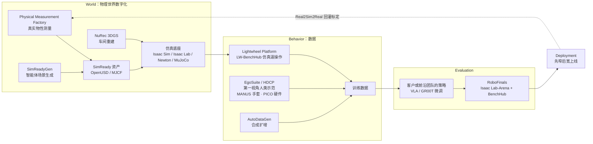

# Lightwheel（光轮智能）

## 一句话定义

**Lightwheel（光轮智能）**：2023 年成立的 **Physical AI 数据与仿真基础设施公司**，不造机器人本体，而是卖「物理准确的仿真资产 + 仿真 / 人类示范数据 + 仿真评测」这一整条 **Real2Sim2Real** 闭环；对外产品线为 **SimReady**（资产）、**SimReadyGen**（智能体式场景生成）、**Lightwheel Platform**（企业仿真与数据工厂，开源底座 LW-BenchHub）、**EgoSuite**（第一视角人类数据）与 **RoboFinals**（工业级策略评测），与 NVIDIA Isaac / Omniverse / Newton 生态深度绑定。

## 英文缩写速查

| 缩写 | 英文全称 | 简要说明 |
|------|----------|----------|
| SimReady | Simulation-Ready (Asset) | 带物理属性（质量、摩擦、关节、形变）的仿真就绪资产；Lightwheel 资产产品线名 |
| USD / OpenUSD | Universal Scene Description | Pixar 起源的场景描述格式，Isaac Sim / Omniverse 的原生资产格式 |
| MJCF | MuJoCo XML Format | MuJoCo 模型格式；Lightwheel-YCB 同时提供 USD 与 MJCF |
| Real2Sim2Real | Real-to-Sim-to-Real | 真实测量 → 仿真训练 / 评测 → 回到真实部署并回灌标定的闭环 |
| 3DGS | 3D Gaussian Splatting | 3D 高斯泼溅重建；工业博文用 NuRec 把真实车间重建为 3DGS 环境 |
| VLA | Vision-Language-Action | 视觉-语言-动作策略；RoboFinals 的主要被评对象 |
| GR00T | Generalist Robot 00 Technology | NVIDIA 人形机器人基础模型系列（N1 / N1.5 / N1.6） |
| HDCP | Human Data Capture Platform | Lightwheel 在建的标准化人类数据采集开放平台（MANUS 新闻稿） |
| TSC | Technical Steering Committee | 技术指导委员会；Lightwheel 自称为 Newton TSC 成员 |
| OEM | Original Equipment Manufacturer | 整机 / 整车厂；工业销售的主要目标客户 |
| DoF | Degrees of Freedom | 自由度；MANUS 手套每只手 25 DoF |

## 为什么重要

- **仿真数据路线的产业样本：** 在「真机遥操作 / 人类视频 / 仿真合成」几条具身数据路线中，Lightwheel 是押注 **仿真 + 物理测量资产** 并已有商业规模叙事的代表（对照 [具身数据采集五条路线](../queries/embodied-data-collection-five-routes-landscape.md)）。
- **NVIDIA 生态里的关键第三方：** Isaac Lab-Arena 被其称为与 NVIDIA **共同开发**；SimReady 资产收录于 Isaac Sim；自称 Newton TSC 成员；2025-05 NVIDIA COMPUTEX 新闻稿把它列为 GR00T N 系列早期采用者。读 [NVIDIA Physical AI 工具链](../overview/nvidia-physical-ai-toolchain-technology-map.md) 时，资产 / 评测层很多由它补位。
- **开源与商业的分界清晰可查：** LeIsaac、LW-BenchHub、AutoDataGen、Lightwheel-YCB、EgoSuite-Open100K 等可直接用；RoboFinals 完整任务集、Physical Measurement Factory、Lightwheel Platform Enterprise 为商业服务。
- **资本与订单信号：** 2026 年连续三轮融资（3 月 10 亿元 A++/A+++、5 月末蚂蚁集团领投、6 月 10 亿元战略轮，媒体报道），并自报 2026 Q1 订单约 1 亿美元，是「具身数据基础设施」赛道的重要观测点。

## 公司概况

| 项 | 内容 | 来源 |
|----|------|------|
| 名称 | 英文 Lightwheel（Lightwheel Inc.，GitHub / HF 组织 `LightwheelAI`）；中文 **光轮智能**，境内主体 光轮智能（北京）科技有限公司 | 官网版权行；投资界 2024-11-01；界面新闻 2026-03-11 |
| 成立 | **2023 年**；工商信息 2023-01-16 成立 | MANUS 新闻稿 About 段（官方）；界面新闻引天眼查 |
| 总部 | 官方英文稿：**Santa Clara, California**；中文媒体：北京中关村（境内主体在北京） | MANUS 新闻稿（2026-07）；36 氪转载铅笔道（2026-03-13） |
| 创始人 | **谢晨（Steve Xie）**，创始人兼 CEO（MANUS 稿署 Co-Founder & CEO）；**杨海波（Haibo Yang）**，联合创始人兼总裁、法定代表人 | 官方新闻稿；界面新闻；36 氪 |
| 创始人背景 | 北大物理系本科、哥伦比亚大学博士（铅笔道称数量金融方向）；先后任 NVIDIA、Cruise、蔚来 **自动驾驶仿真负责人**，2023 年离开蔚来创业 | 投资界 2024-11-01、界面新闻、盖世汽车 2026-03-11、36 氪 2026-03-13（媒体报道；官网无 About 页） |
| 关键人事 | Martin Elbs 任 VP of Global Sales（2026-04，前 IPG Automotive CCO）；Louis Lian 任 VP of Partnerships and Strategy | 官方新闻稿 |
| 定位（自述） | 「Data and Simulation Infrastructure for Physical AI」；四阶段 World → Behavior → Evaluation → Deployment | 官网 / Q1 订单新闻稿 |

### 融资时间线（媒体报道，非公司原文）

| 时间 | 轮次 / 金额 | 投资方 | 来源 |
|------|-------------|--------|------|
| 2024-11 前 | 早期轮（金额未详） | SEE Fund 无限基金、奇绩创坛、辰韬资本、经纬创投 | 投资界 2024-11-01 |
| 2024-11 | Pre-A+，数千万元人民币 | 北京市人工智能产业投资基金主导，经纬创投超额跟投 | 投资界 2024-11-01 |
| 2026-03-11 公布 | A++ 及 A+++ 轮，合计 **10 亿元人民币** | 产业方：新希望集团、鼎邦投资、奥克斯、鼎石资管；财务方：建投华科、国方创新、道禾长期投资、清新资本 | 界面新闻、盖世汽车 |
| 2026-03 | 估值「突破 10 亿美元」、「具身数据领域首家独角兽」 | — | 36 氪转载铅笔道（2026-03-13）；未见公司披露估值 |
| 2026-05 末 | 新一轮（金额未披露），**蚂蚁集团领投** | 建投投资、大湾区共同家园基金等 | 瑞财经 2026-06-23 转述（未找到当期一手报道） |
| 2026-06-23 公布 | 战略融资 **10 亿元人民币** | 中关村科学城基金、四川发展科创基金、山东发展科创投、巨人网络、宇信科技、宝通科技、中科产投、量图智策；老股东建投投资、三七互娱、森马投资跟投 | 新京报（东方财富转载）、瑞财经 |

> Pre-A+ 到 A++ 之间的轮次（A / A+ 等）未在可核实来源中逐轮列明；英文聚合站给出的累计融资额（$280M / $293M 等）口径互相矛盾，本页不采用。

## 产品地图

| 产品 | 层次 | 一句话 | 开放程度 | 本库详情 |
|------|------|--------|----------|----------|
| **SimReady**（Library / SimReady.com） | World：资产 | 物理测量驱动的 OpenUSD 仿真资产；2025-10 称 2,000+ 资产、7 大类（服装、制造、电子、医疗、食品饮料、住宅、仓储），含刚体 / 关节 / 柔性 / 液体 | 商业为主；部分开源（YCB、simready-asset） | [SimReady](./lightwheel-simready.md) |
| **SimReadyGen** | World：场景生成 | 智能体式仿真场景生成（2026-07） | 见详情页 | [SimReadyGen](./lightwheel-simreadygen.md) |
| **Lightwheel Platform Enterprise** | 仿真训练 + 数据工厂 | 「Make Simulation Successful」：LW-BenchHub Training Framework（Isaac Lab）、Isaac Sim / MuJoCo 采数、第一视角采集、数据生成与扩增 | 企业版商业；底座开源 | [LW-BenchHub](./cn-os-lw-benchhub.md)、[平台页归档](../../sources/sites/lightwheel-platform.md) |
| **AutoDataGen** | Behavior：合成扩增 | Isaac Lab 上 LLM 任务分解 → 原子技能 → cuRobo 运动规划 / 导航执行 → 轨迹数据 | 开源（Apache-2.0） | 本页开源表 |
| **EgoSuite** / HDCP | Behavior：人类数据 | 第一视角人类示范数据方案；2026-04 称覆盖 7 国 500+ 工业环境（自报）；2026-08 开放 Open100K | 数据商业 + Open100K 开放 | [EgoSuite](./lightwheel-egosuite.md)、[EgoSuite-Open100K](./egosuite-open100k.md) |
| **RoboFinals** | Evaluation | 工业级仿真评测；基于 Isaac Lab-Arena + BenchHub，并有 Newton-native benchmark | 商业（Coming soon）；底座开源 | [RoboFinals](./lightwheel-robofinals.md) |
| **LeIsaac** | 社区入口 | Isaac Lab 中用 SO-101 Leader 遥操作、采数、转 LeRobot 格式 | 开源（Apache-2.0） | [LeIsaac](./cn-os-leisaac.md) |

**命名注意：** 2025-05 GR00T 博文里的「Lightwheel Simulation Platform / Lightwheel Hybrid Sim」与 2026-07 PICO 新闻稿里的自研全栈仿真平台「SimFoundry」都是内部平台名，未单独开放；后者与 NVIDIA NVlabs 的 [SimFoundry 论文](./paper-simfoundry-real2sim-scene-generation.md) **同名但不是同一事物**（推测仅为撞名）。

### 产品如何串联

图中分层取自 2026-05 Q1 订单新闻稿的四阶段叙事与 2026-04 两篇工业博文；箭头是对官方表述的归纳，不代表其内部系统架构。

## 官方博客与新闻稿时间线

完整核查见 [官网 Blogs / Press Releases 列表归档](../../sources/sites/lightwheel-blog-index.md)（2026-10-10：Blogs 18 条 + Press Releases 5 条）。

| 日期 | 类型 | 标题（简） | 要点 | 本库入口 |
|------|------|------------|------|----------|
| 2024-10-15 | 博文（YouTube） | Steve Xie @ NI Connect 2024 keynote | 「AI 时代数据的重要性」；合成数据训练模型 | 本页（仅列出） |
| 2025-05-18 | 博文（NVIDIA 新闻稿） | NVIDIA Powers Humanoid Robot Industry… | COMPUTEX：Lightwheel 列为 GR00T N 早期采用者，用于「验证合成数据、加速工厂人形部署」 | 本页「GR00T N1 汽车工厂部署」 |
| 2025-05-19 | 博文（LinkedIn） | From Sim to Factory | GR00T N1 + Unitree H1 进吉利汽车工厂；Hybrid Sim；100:1 虚实配比 | 本页「GR00T N1 汽车工厂部署」 |
| 2025-09-29 | 博文 | One Skeleton, Three Benchmarks | YCB / LIBERO / RoboCasa 在 Isaac Lab-Arena 上重做 | [LW-BenchHub](./cn-os-lw-benchhub.md) |
| 2025-09-29 | 博文 | USD Search for asset discovery | 以 NVIDIA USD Search API 做资产检索 | [SimReady](./lightwheel-simready.md) |
| 2025-09-29 | 博文 | Lightwheel–Newton locomotion assets | 为 Newton 开发高质量 locomotion 资产 | [SimReady](./lightwheel-simready.md)、[Newton](./newton-physics.md) |
| 2025-10-23 | 博文 | SimReady special pricing | 初创公司（含 NVIDIA Inception）资产 **15% 折扣** | 本页「SimReady 初创定价」 |
| 2025-12-04 | 博文（产品页） | Lightwheel Unveils RoboFinals | 工业级仿真评测平台发布 | [RoboFinals](./lightwheel-robofinals.md) |
| 2025-12-04 | 博文（产品页） | Lightwheel Introduces EgoSuite | 第一视角人类数据方案发布 | [EgoSuite](./lightwheel-egosuite.md) |
| 2026-01-05 | 博文 | Behind RoboFinals | Isaac Lab-Arena 与 BenchHub 的关系 | [LW-BenchHub](./cn-os-lw-benchhub.md)、[RoboFinals](./lightwheel-robofinals.md) |
| 2026-02-04 | 博文 | GPU-Accelerated Parallel Evaluation | Isaac Lab-Arena 并行评测性能研究 | [LW-BenchHub](./cn-os-lw-benchhub.md) |
| 2026-03-16 | 博文 | SimReady: The Physics Data Infrastructure | SimReady System + 与 NVIDIA Newton 合作 | [SimReady](./lightwheel-simready.md) |
| 2026-03-16 | 博文 | RoboFinals Industrial Benchmark | 早期采用者如何扩展模型评测 | [RoboFinals](./lightwheel-robofinals.md) |
| 2026-04-09 | 新闻稿 | × PeritasAI | 围术期医疗；估算 $56M 计划，2026–2027 最多 200 台人形 | 本页「新闻稿要点」 |
| 2026-04-14 | 新闻稿 | Martin Elbs 任 VP Global Sales | 前 IPG Automotive CCO；主攻欧洲 OEM | 本页「新闻稿要点」 |
| 2026-04-15 | 博文 | Lightwheel Industrial AI Solution | Hannover Messe：四阶段工业方案 | 本页「工业 AI 方案」 |
| 2026-04-20 | 博文 | From Specialist to Generalist-Specialist Robot | 与 NVIDIA 的三层工业栈；线束装配 | 本页「工业 AI 方案」 |
| 2026-05-06 | 新闻稿 | $100M in Q1 Orders | Q1 订单约 1 亿美元（自报）；World→Behavior→Evaluation→Deployment | 本页「新闻稿要点」 |
| 2026-07-03 | 新闻稿 | × MANUS | 25-DoF 数据手套接入 HDCP；示范放大 100–1,000 倍（自报） | 本页「新闻稿要点」 |
| 2026-07-09 | 新闻稿 | × PICO | 联合产品团队共研人类数据采集硬件 | 本页「新闻稿要点」 |
| 2026-07-20 | 博文 | Introducing SimReadyGen | 智能体式仿真场景生成 | [SimReadyGen](./lightwheel-simreadygen.md) |
| 2026-08-18 | 博文 | The First Newton-Native Benchmark | RoboFinals 全栈跑在 Newton，首发 22 任务 | [RoboFinals](./lightwheel-robofinals.md) |
| 2026-08-21 | 博文 | EgoSuite-Open100K | 规划 10 万小时全标注开放第一视角数据 | [EgoSuite-Open100K](./egosuite-open100k.md) |

## 开源资产（GitHub `LightwheelAI` / Hugging Face `LightwheelAI`）

GitHub 组织列表页与 org API 在本环境不可读（403），下表由各仓库 raw README / LICENSE 与 Hugging Face 公开 API（2026-10-10）核对，**可能不全**。

| 项目 | 类型 | 内容 | 许可 | 本库入口 |
|------|------|------|------|----------|
| [LW-BenchHub](https://github.com/LightwheelAI/LW-BenchHub) | 评测 / 训练框架 | Isaac Lab-Arena 上的统一 benchmark hub；7 类机器人（27 变体）、100 种厨房配置、268 任务（130 LIBERO + 138 RoboCasa） | Apache-2.0 | [LW-BenchHub](./cn-os-lw-benchhub.md)、[Tour](./lw-benchhub-tour.md) |
| [LeIsaac](https://github.com/LightwheelAI/LeIsaac) | 遥操作 / 采数 | Isaac Lab + SO-101 Leader 遥操作、HDF5 → LeRobot 转换、GR00T N1.5 微调与真机部署 | Apache-2.0 | [LeIsaac](./cn-os-leisaac.md) |
| [AutoDataGen](https://github.com/LightwheelAI/AutoDataGen) | 合成数据 | LLM 任务分解 + cuRobo 规划 / 导航的 Isaac Lab 自动采数管线 | Apache-2.0 | 本页 |
| [Lightwheel-YCB](https://github.com/LightwheelAI/Lightwheel-YCB) | 资产 | 106 个 YCB 物体 → 125 个 SimReady 资产（刚体 / 关节 / 柔性），USD + MJCF | CC BY-NC 4.0 | [Lightwheel-YCB](./cn-os-lightwheel-ycb.md) |
| [Lightwheel-simready-asset](https://github.com/LightwheelAI/Lightwheel-simready-asset) | 资产 | 259 个 USD 资产（251 操作 + 8 locomotion 场景），网盘下载 | CC BY-NC 4.0 | [simready-asset](./cn-os-lightwheel-simready-asset.md) |
| [LW-Egosuite-DevKit](https://github.com/LightwheelAI/LW-Egosuite-DevKit) | 数据工具 | 第一视角 MCAP 数据转换与可视化（`pip install lw-egosuite-devkit`） | Apache-2.0 | [DevKit](./cn-os-lw-egosuite-devkit.md) |
| HF 数据集 EgoDemo / EgoStandard / EgoPro | 人类数据 | EgoSuite-Open100K 首批发布（2026-08） | 见数据卡 | [EgoSuite-Open100K](./egosuite-open100k.md) |
| HF 数据集 lightwheel_tasks、Lightwheel-Tasks-{Double-Piper, G1-WBC, G1-Controller, X7S}（2025-12） | 仿真示范 | LW-BenchHub 任务的多本体仿真数据 | 见数据卡 | [LW-BenchHub](./cn-os-lw-benchhub.md) |
| HF 数据集 leisaac-pick-orange(-mimic-v0)、so101-pick-pen、so101-place-orange；iros2026-ikea-assembly | 示范 / 竞赛 | LeIsaac 示例数据；IROS 2026 IKEA 装配数据（2026-07） | 见数据卡 | [LeIsaac](./cn-os-leisaac.md) |
| HF 模型（7 个） | 示例策略 / 环境 | smolvla-double-piper-pnp、leisaac-pick-orange-v0、pi05_pnp_orange、gr00t15_LiftCube、leisaac_env、lw_benchhub_env 等 | 见模型卡 | — |

**结论：** 开源集中在 **评测框架、遥操作 / 采数工具、少量资产与人类数据样本**；核心商业资产库（2,000+ SimReady）、Physical Measurement Factory、RoboFinals 完整任务集与 Hybrid Sim **未开源**。资产仓为 **非商用** 许可，商业项目需单独授权。

## 工业 AI 方案（2026-04 两篇博文）

归档：[lightwheel_industrial_2026-04](../../sources/blogs/lightwheel_industrial_2026-04.md)。

- **核心论点：** 工业仿真要从「验证设计」转为「让学习型机器人探索、产数据、被评测的 playground」；下一代工业机器人是 **generalist-specialist**（通用技能 + 可训练到精通特定工位），代表难题是汽车 **线束装配** 这类可变形物体操作。
- **四阶段方案（2026-04-15，Hannover Messe）：** ① 物理准确世界：Physical Measurement Factory 测弯曲 / 扭转刚度、摩擦、塑性形变，Calibrated Physics Solver 对真值迭代标定，自动管线「数小时」产出资产；② 行为数据：EgoSuite（7 国 500+ 工业环境）+ AutoDataGen + Model-Driven Labeling，坏帧 <2%；③ 评测：RoboFinals 10,000+ 场景压力测试；④ Real2Sim2Real 闭环部署。以上数字均为 **自报**。
- **与 NVIDIA 的三层栈（2026-04-20）：** NuRec 把真实车间重建成 3DGS 放进 Isaac Sim，被操作物体用 OpenUSD SimReady 资产并逐个做 Real2Sim2Real 验证；Isaac Lab 内遥操作 + EgoSuite 先验 + AutoDataGen 扩增；RoboFinals 在 Isaac Lab-Arena 上加 **100 个逐级变难的工业任务**。合作方点名 Analog Devices（触觉 / 多模态传感仿真）与 PeritasAI（医疗）。
- **读法：** 两篇都是方案叙事，没有客户案例数据；「10,000+ 场景」与「100 任务」是不同计数口径。

## GR00T N1 汽车工厂部署（2025-05）

归档：[lightwheel_gr00t_automotive_2025-05](../../sources/blogs/lightwheel_gr00t_automotive_2025-05.md)。这是公司最早、技术细节最多的一篇部署叙述（谢晨署名，发于 LinkedIn）。

- **场景（自报）：** [Isaac GR00T](./isaac-gr00t.md) N1 部署到 **Unitree H1**，进入 **吉利** 在产汽车发动机厂质检工位：零件入箱、转运上架、双臂搬重件、与人共处的情境感知运动。
- **技术栈：** Lightwheel Simulation Platform（云原生）+ **Lightwheel Hybrid Sim**（Isaac Sim 渲染 / 传感 + MuJoCo 接触物理）；Omniverse 复刻产线；Vision Pro / Quest 在仿真中遥操作；**仿真 : 真实 = 100 : 1** 共训；[DexMimicGen](./paper-notebook-dexmimicgen-automated-data-generation-for-bimanu.md) 扩增 + 光照 / 材质 / 杂乱度随机化；自动 + 人工两阶段数据 QA。
- **本体适配：** GR00T N1 原主要在 Fourier GR1 上训练；对 System 2（视觉-语言规划）用工厂提示微调，对 System 1（扩散动作生成）重配 H1 关节结构与电机模型；推理跑在 RTX 4090（未做板载部署）。
- **边界：** 作者明说尚未达到生产认证级自主，仅「监督条件下早期部署」；**无成功率 / 节拍数据**，吉利方面无独立确认。NVIDIA 2025-05-18 新闻稿只确认 Lightwheel 是 GR00T N 早期采用者、用于验证合成数据。

## SimReady 初创定价（2025-10）

- SimReady.com 对机器人初创公司（含 NVIDIA Inception 成员）所有资产 **15% 折扣**；文中称资产库 2,000+、7 大类，四类物理对象（刚体、关节体、柔性体、液体），面向仿真采数与 RL 训练，提到 Cosmos 与 GR00T N1.6 训练数据场景。
- 价格本身未公开；属营销公告，资产体系详见 [SimReady](./lightwheel-simready.md)。

## 新闻稿要点（2026-04 → 2026-07）

归档：[lightwheel_press_releases](../../sources/blogs/lightwheel_press_releases.md)。

- **Q1 订单约 1 亿美元（2026-05-06，自报）：** 来自两类客户——前沿 Physical AI 模型团队（买持续数据基础设施）与工业企业（买可训练、可验证、可迭代的部署路径）；同稿自报受邀以 core advisor 身份参与 Newton（与 NVIDIA、Google DeepMind、Disney Research、TRI 并列），以及 LeIsaac 被 Hugging Face 官方文档采纳。未披露客户名与收入确认口径。
- **PeritasAI（2026-04-09）：** 把 Lightwheel 的仿真 / 数据 / 评测栈接到 PeritasAI 的 PeriVerse 围术期编排层；估算 **$56M** 多阶段计划，目标 2026–2027 年 **最多 200 台人形** 开始部署（合同目标，非交付结果）。
- **Martin Elbs（2026-04-14）：** 前 IPG Automotive SVP / CCO，负责全球销售，重点欧洲 OEM 与汽车客户——与 Hannover Messe 工业方案同期，推测是向欧洲制造业扩张的配套。
- **MANUS（2026-07-03）：** 25-DoF 数据手套作为 **HDCP** 核心采集伙伴；Lightwheel 负责追踪、标注与 100–1,000 倍合成放大（自报）；由联合创始人兼总裁杨海波签约。
- **PICO（2026-07-09）：** 与 PICO 组建联合产品团队，共研通用人类示范采集硬件；可对照本库 [PICO 4 Ultra 第一视角采集](./pico-4-ultra-egocentric-capture.md)（该页为另一来源，不代表本合作产品）。

## 核心原理（对外可核对部分）

1. **资产的物理正确性优先于视觉正确性：** 「looks right but behaves wrong」的资产会「teach wrong」；因此用真实测量 + 求解器标定生产资产（对照 [物理保真度与 sim2real gap](../concepts/physics-fidelity-sim2real-gap.md)）。
2. **仿真是第一个部署环境：** 先重建目标工位，在仿真中训练、遥操作采数、压力测试，再上真机；真实数据回灌形成 Real2Sim2Real 闭环（对照 [Sim2Real](../concepts/sim2real.md)）。
3. **人类数据与仿真数据互补：** EgoSuite / HDCP 提供任务结构与先验，仿真合成负责规模和长尾变化；2025-05 案例的 100:1 虚实配比是这一思路的早期实例。
4. **评测作为部署闸门：** 学术 benchmark 已饱和，需在大规模、带扰动的工业场景中量化鲁棒性（对照 [仿真评测基础设施](../concepts/simulation-evaluation-infrastructure.md)）。

## 工程实践

| 场景 | 建议 |
|------|------|
| 想快速在 Isaac Lab 上做操作评测 | 直接用开源 [LW-BenchHub](./cn-os-lw-benchhub.md) + [Isaac Lab-Arena](./isaac-lab-arena.md)；RoboFinals 完整任务集需商务对接 |
| 低成本 SO-101 遥操作采数 | [LeIsaac](./cn-os-leisaac.md) → LeRobot 格式 → 微调 SmolVLA / GR00T |
| 需要带物理属性的仿真物体 | 研究用可取 [Lightwheel-YCB](./cn-os-lightwheel-ycb.md)（非商用许可）；商用需 SimReady 授权 |
| 第一视角人类数据预训练 | [EgoSuite-Open100K](./egosuite-open100k.md) + [LW-Egosuite-DevKit](./cn-os-lw-egosuite-devkit.md) |
| 写行业综述 / 选型 | 把 Lightwheel 作为「仿真 + 测量资产」路线样本，与真机数据工厂、人类视频路线并列比较；数字一律标注自报 |

## 局限与风险

- **自报信息占比高：** 订单额、环境数、坏帧率、场景数、放大倍数、工厂部署效果都来自公司稿件，缺第三方审计或复现。
- **官网缺 About 页：** 成立日期、创始人履历、总部依赖新闻稿 About 段与中文媒体；中英文资料对「总部」表述不同（Santa Clara vs 北京中关村），实际为中美双主体运营（推测）。
- **融资信息口径混乱：** 不同媒体的轮次命名与时间有出入；5 月末蚂蚁集团领投轮仅见二手转述。
- **平台页存在过期内容：** Lightwheel Platform 页仍写「Newton-IsaacLab 集成计划 2024-12 小更新、2025-03 全面集成」，与 2026 年 Newton-native benchmark 已发布的事实不一致，引用平台页时需核对时效。
- **生态依赖：** 栈高度依赖 NVIDIA Isaac / Omniverse；若用 Genesis、纯 MuJoCo 等其他栈，可迁移的主要是资产（MJCF）与数据，而非评测框架。
- **许可边界：** 开源资产为 CC BY-NC 4.0，勿在商业项目中直接使用。

## 关联页面

- [SimReady（Lightwheel 资产体系）](./lightwheel-simready.md)
- [SimReadyGen](./lightwheel-simreadygen.md)
- [Lightwheel RoboFinals](./lightwheel-robofinals.md)
- [LW-BenchHub](./cn-os-lw-benchhub.md) · [LW-BenchHub Tour](./lw-benchhub-tour.md)
- [EgoSuite](./lightwheel-egosuite.md) · [EgoSuite-Open100K](./egosuite-open100k.md) · [LW-Egosuite-DevKit](./cn-os-lw-egosuite-devkit.md)
- [Lightwheel-YCB](./cn-os-lightwheel-ycb.md) · [Lightwheel-simready-asset](./cn-os-lightwheel-simready-asset.md) · [LeIsaac](./cn-os-leisaac.md)
- [Isaac Lab-Arena](./isaac-lab-arena.md) · [Newton](./newton-physics.md) · [Isaac Sim](./isaac-sim.md) · [Isaac Lab](./isaac-lab.md)
- [Isaac GR00T](./isaac-gr00t.md) · [GR00T N1.5](./paper-gr00t-n1-5.md)
- [NVIDIA Physical AI 工具链技术地图](../overview/nvidia-physical-ai-toolchain-technology-map.md)
- [仿真评测基础设施](../concepts/simulation-evaluation-infrastructure.md)
- [具身大模型评测基准选型闭环](../queries/embodied-eval-benchmark-selection-loop.md) — RoboFinals / BenchHub 在评测选型中的位置
- [具身数据采集五条路线](../queries/embodied-data-collection-five-routes-landscape.md)

## 参考来源

- [Lightwheel 官网 Blogs / Press Releases 列表核查（2026-10-10，18 + 5 条）](../../sources/sites/lightwheel-blog-index.md)
- [工业 AI 两篇博文（2026-04，来源归档）](../../sources/blogs/lightwheel_industrial_2026-04.md)
- [GR00T N1 汽车工厂部署 + NVIDIA 新闻稿提及（2025-05，来源归档）](../../sources/blogs/lightwheel_gr00t_automotive_2025-05.md)
- [Press Releases 5 篇（来源归档）](../../sources/blogs/lightwheel_press_releases.md)
- [Lightwheel Platform 项目页归档](../../sources/sites/lightwheel-platform.md)
- 开源仓库归档：[leisaac](../../sources/repos/leisaac.md)、[lw-benchhub](../../sources/repos/lw-benchhub.md)、[lightwheel-ycb](../../sources/repos/lightwheel-ycb.md)、[lightwheel-simready-asset](../../sources/repos/lightwheel-simready-asset.md)、[lw-egosuite-devkit](../../sources/repos/lw-egosuite-devkit.md)
- SimReady 初创定价博文（2025-10-23）：<https://lightwheel.ai/media/simready-announces-special-pricing>
- 成立日期、创始人背景、A++/A+++ 轮：界面新闻《融资10亿元，新希望参投！光轮智能成为全球首个具身数据独角兽》（2026-03-11）<https://m.jiemian.com/article/14098498.html>；盖世汽车 *Seeds | Former NVIDIA Simulation Head Launches Startup, Raises 1 Billion Yuan*（2026-03-11）<https://autonews.gasgoo.com/articles/other/seeds-former-nvidia-simulation-head-launches-startup-raises-1-billion-yuan-2031722297579122688>
- 创始人履历、总部、估值：36 氪转载铅笔道《北大85后，创业仅三年，又融了10亿》（2026-03-13）<https://www.36kr.com/p/3720001947908740>
- Pre-A+ 轮与早期投资方：投资界《光轮智能获Pre-A+轮数千万融资，北京市人工智能产业投资基金主导》（2024-11-01）<https://news.pedaily.cn/202411/542338.shtml>
- 2026-06 战略轮：新京报《光轮智能获10亿元融资，投资方包括中关村科学城基金、巨人网络》（2026-06-23，东方财富转载）<https://finance.eastmoney.com/a/202606233779676296.html>；瑞财经（2026-06-23，含 5 月末蚂蚁集团领投轮转述）<https://m.rccaijing.com/news-7475022293489087978.html>
- Hugging Face 组织：<https://huggingface.co/LightwheelAI>

## 推荐继续阅读

- [From Sim to Factory（LinkedIn 原文）](https://www.linkedin.com/pulse/from-sim-factory-how-lightwheel-deployed-gr00t-n1-humanoids-ryycc) — 技术细节最完整的一篇部署叙述
- [From Specialist to Generalist-Specialist Robot](https://lightwheel.ai/media/lightwheel-nvidia-industrial-ai) — 与 NVIDIA 栈对齐的工业方案
- [$100M in Q1 Orders](https://lightwheel.ai/media/q1-orders-physical-ai) — 公司四阶段业务叙事
- [LW-BenchHub GitHub](https://github.com/LightwheelAI/LW-BenchHub) — 最容易上手的开源入口
