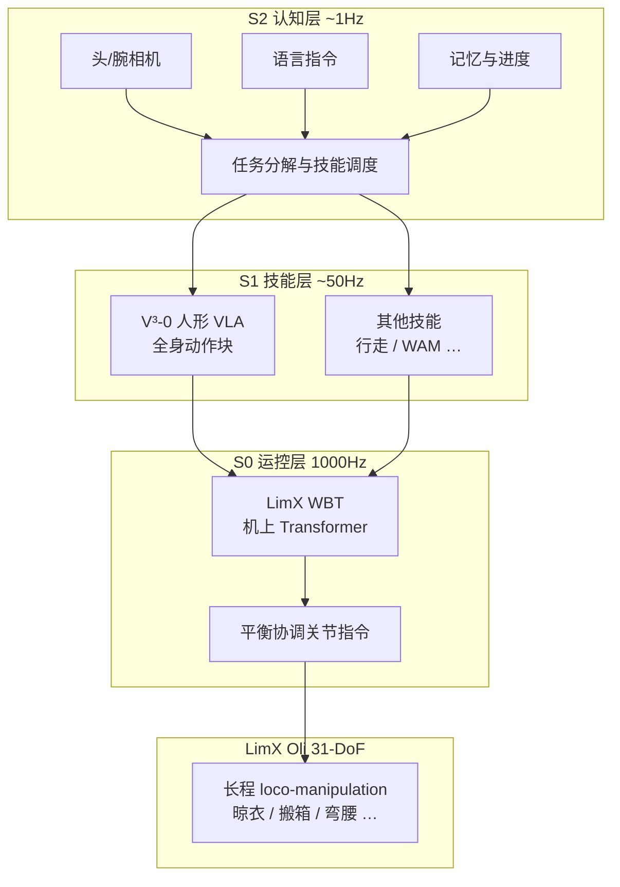

# LimX COSA（人形大脑操作系统）

**LimX COSA**（**C**ognitive **OS** of **A**gents）是 **逐际动力（LimX Dynamics）** 面向全尺寸人形的 **物理世界原生 Agent 操作系统**：把 **认知与任务调度（S2）**、**可插拔技能模型（S1，含 VLA）** 与 **全身运控基础模型（S0，LimX WBT）** 组织成可在真实身体上 **连续、长程、无遥操** 运转的整体。2026-07 发布的 **COSA 0.5** 重点升级 **人形 VLA V³-0 的全身动作生成**，并在 **31-DoF LimX Oli** 上给出 **一镜到底家庭 loco-manipulation** 实录。

## 一句话定义

**COSA 不是单个 VLA checkpoint，而是调度记忆、推理与多频率技能/运控层的 OS——让「模型当技能、系统当大脑」在 Oli 上跑通长程移动操作。**

## 英文缩写速查

| 缩写 | 英文全称 | 简要说明 |
|------|----------|----------|
| COSA | Cognitive OS of Agents | 逐际动力人形大脑操作系统 |
| VLA | Vision-Language-Action | S1 层视觉–语言–动作技能之一 |
| WBT | Whole-Body Tracking | S0 LimX WBT 的全身运动跟踪基础能力 |
| VLM | Vision-Language Model | S2 认知层多模态理解组件 |
| LLM | Large Language Model | S2 任务推理与调度组件 |
| MPJPE | Mean Per Joint Position Error | 关节位置跟踪误差，LimX 用以对标 SONIC |
| WAM | World Action Model | 可与 VLA 并列的 S1 技能类型（世界–动作生成） |

## 为什么重要

- **路线对照：** 发布材料明确反对「**更大单一模型 = 大脑**」，主张 **OS 层** 负责记忆、调度、技能组合与进度判断——与 [行为树 × VLA 编排](../concepts/behavior-tree-vla-orchestration.md) 中「编排 vs 语义技能」分层同构，但 COSA 覆盖 **全身运控频率与认知 Agent** 全栈。
- **长程 loco-manipulation 产业证据：** 无剪辑、无遥操、**连续家务**（晾衣、搬箱、深弯腰、清理等）把评估从「单技能成功率」推到 **跨任务状态保持 + 全身平衡**——对齐 [Loco-Manipulation](../tasks/loco-manipulation.md) 任务页的工程瓶颈。
- **三层频率分工：** S2 ~1 Hz / S1 ~50 Hz / S0 **1000 Hz** 给出可落地的 **慢思考–中频技能–快反射** 参考切分，便于与 Figure Helix 02、Flexion Reflect、[DeepInsight](../entities/deepinsight.md) System 2/1/0 叙事对照。
- **软硬一体：** 同公司 **Oli 本体 + COSA + LimX WBT + V³-0 VLA**，可做纯软件公司难以实现的 **跨层联合优化**；并借 [FluxVLA Engine](./fluxvla-engine.md) **开放 S1 工程底座**，与 Figure 全栈闭源形成差异。

## 核心结构

### 三层架构

| 层 | 频率 | 输入 / 输出 | 典型组件 |
|----|------|-------------|----------|
| **S2 认知** | ~1 Hz | 头/腕相机 + 语言 → 任务理解、记忆、**下一技能选择** | LLM / VLM Agent |
| **S1 技能** | ~50 Hz | 子任务意图 → **全身动作块**（非仅臂轨迹） | **V³-0 VLA**、WAM、行走/操作等 **独立可迭代技能** |
| **S0 运控** | 1000 Hz | 全身运动目标 → 平衡协调 **关节指令** | **LimX WBT**（~10M 参数 Transformer，**完全机上**） |

**设计原则（发布口径）：** S1 **按技能拆分数据与训练**（如行走偏仿真、柔性物体偏真机），避免「开车 + 剥鸡蛋」式负迁移；S0 **一次训练** 可复用于 VLA 执行、遥操作采集与零样本回放。

### 流程总览（COSA 0.5 Demo 链路）

### LimX WBT（S0）公开指标（对标 SONIC）

| 指标 | SONIC（对照） | LimX WBT | 解读 |
|------|---------------|----------|------|
| 平均关节角误差 | 3.3° | **1.5°** | 关节跟踪精度 |
| MPJPE | 13.75 mm | **12.85 mm** | 全身位置误差 |
| 平滑度（两项） | 基线 | **约 −11% / −20%** | 越低越好（官方材料） |

> 指标来自 2026-07 发布材料；学术复现应以后续论文与开源权重为准。SONIC 背景见 [SONIC 运动跟踪](../methods/sonic-motion-tracking.md)；LimX 跨机体 WBT 迁移见 [Any2Any](./paper-any2any-cross-embodiment-wbt.md)。

## 常见误区或局限

- **误区：「COSA = 一个更大的 VLA」。** VLA（V³-0）只是 **S1 技能之一**；长程任务依赖 **S2 调度 + S0 全身稳定**，不能仅用 VLA benchmark 替代系统评测。
- **误区：「FluxVLA = COSA」。** [FluxVLA Engine](./fluxvla-engine.md) 开源的是 **VLA 训练/推理工程栈**；**COSA 本体 OS（S2 调度、记忆、多技能生命周期）** 仍为商业产品层，二者是「开放技能底座 vs 大脑系统」分工。
- **局限：** 一镜到底 Demo 尚不能证明 **大规模部署成功率、异常恢复与长期磨损**；V³-0 **网络结构未在新闻稿披露**，本页不替代技术白皮书。
- **与 Flexion Reflect 的相似与差异：** 分层范式（认知 / 运动 / 控制）相近；LimX 强调 **自研 Oli + WBT + 开源 FluxVLA**，Flexion 公开 Demo 多基于 **第三方 G1**（见 [Flexion Reflect v1.0 归档](../../sources/blogs/flexion_reflect_v1_0.md)）。

## 与其他页面的关系

- [VLA 方法页](../methods/vla.md) — V³-0 在 **全身 loco-manipulation** 语境下的 S1 实例；FluxVLA 支持的 π0.5/GR00T 等训练入口。
- [Whole-Body Tracking Pipeline](../concepts/whole-body-tracking-pipeline.md) — LimX WBT 是 **产品化 S0** 锚点，与 SONIC / BeyondMimic 等 **研究预训练** 路线并列。
- [FastStair](./paper-faststair-humanoid-stair-ascent.md)、[CWI](./paper-cwi-composite-humanoid-whole-body-imitation.md) — 同 **LimX Oli** 平台的学术/工程论文线，补全 **楼梯 / VR 遥操作** 等细分能力。
- [市面知名机器人平台纵览](../overview/notable-commercial-robot-platforms.md) — LimX 商业平台索引。

## 推荐继续阅读

- [LimX COSA 0.5 官方新闻](https://www.limxdynamics.com/en/news/BK000067)
- [FluxVLA Engine 文档](https://fluxvla.limxdynamics.com/)
- [π₀.₅ 论文（OpenPI）](https://arxiv.org/abs/2504.16054) — FluxVLA 支持的 VLA 技能范例之一

## 参考来源

- [COSA 0.5 发布：人形 VLA V³-0 的全身能力升级](../../sources/blogs/limx_cosa_05_release_2026-07-15.md)
