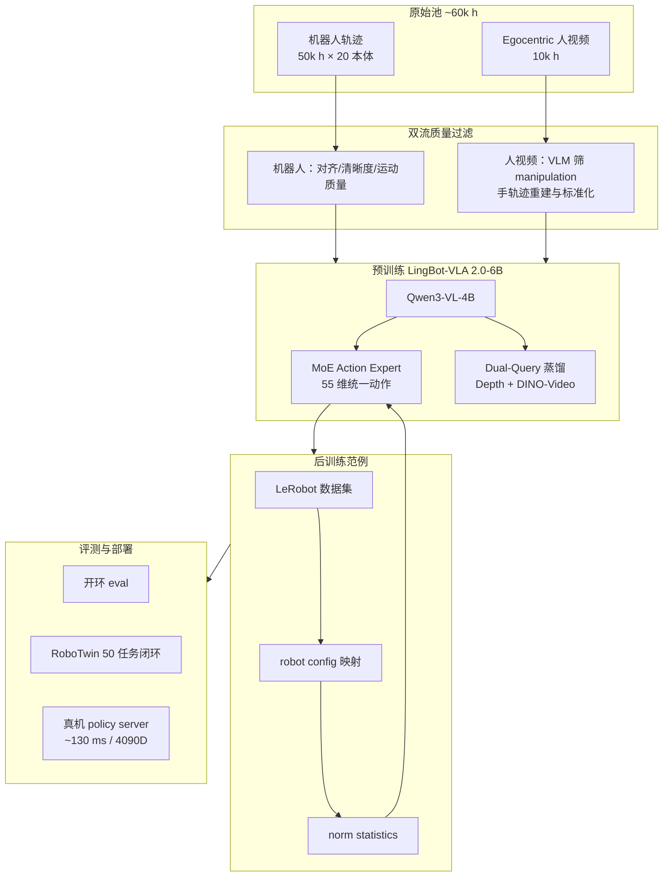

# LingBot-VLA 2.0

**LingBot-VLA 2.0**（*From Foundation to Application: Improving VLA Models in Practice*，[arXiv:2607.06403](https://arxiv.org/abs/2607.06403)，[Robbyant](https://github.com/robbyant/lingbot-vla-v2)）是面向 **真机规模化应用** 的 **Vision-Language-Action 基础模型**：在 **Qwen3-VL-4B-Instruct** 上叠加 **稀疏 MoE action expert** 与 **native depth** 蒸馏分支，用 **重设计数据管线**、**55 维统一动作空间** 与 **Dual-Query 预测性蒸馏**，把 LingBot-VLA 1.0 的「双臂操作」扩展到 **全身 DoF + 移动底盘 + 灵巧手**，并在 **GM-100** 与 **长程移动操作** 的 **generalist 联合训练** 设定下报告优于 **π₀.₅**、**GR00T N1.7** 与 **1.0** 的对照结果。

## 一句话定义

**6B 务实 VLA 基础模型：用 6 万小时过滤后的机器人+人视频预训练、55 维跨本体动作槽位与 MoE 专家，把 Qwen3-VL 语义能力接到可部署的全身操纵与移动操作闭环。**

## 英文缩写速查

| 缩写 | 英文全称 | 简要说明 |
|------|----------|----------|
| VLA | Vision-Language-Action | 视觉-语言-动作多模态基础策略方向 |
| MoE | Mixture of Experts | 混合专家：稀疏激活子网络以扩展容量 |
| EEF | End-Effector | 末端执行器位姿/状态 |
| VLM | Vision-Language Model | 视觉-语言多模态理解模型，VLA 的上游 |
| Ego | Egocentric Vision | 第一人称视角感知与控制 |
| GM-100 | General Manipulation 100 | 论文/项目使用的双臂桌面 generalist 评测套件（9 任务混合训练） |
| SFT | Supervised Fine-Tuning | 用监督数据将通用模型适配到特定任务分布 |

## 为什么重要

- **从基础到应用的完整开源链：** 除技术报告外，公开 **6B 预训练权重**（[HF](https://huggingface.co/robbyant/lingbot-vla-v2-6b) / [ModelScope](https://modelscope.cn/models/Robbyant/lingbot-vla-v2-6b)）、**LeRobot 后训练范例**（RoboTwin 2.0 50 任务）与 **`deploy.lingbot_vla_v2_policy` 真机服务**，降低「只读论文、难复现部署」的落差。
- **数据工程与模型同等重要：** 约 **60,000 h** 原始池经 **机器人 / egocentric 双流分阶段过滤**（video–state 对齐、运动质量、手轨迹重建等），强调 **质量对齐** 而非单纯堆小时——与 [HumanNet](./humannet.md) 讨论的「人视频小时能否替代早期真机预训练」形成同团队实证语境。
- **动作空间从双臂走向全身：** **55 维** 规范向量统一 **臂、EEF、夹爪、灵巧手、腰、头、移动底盘**，使 **20 种 embodiment** 可在同一 MoE 专家预算下共训——对照 [Green-VLA](./paper-greenvla-staged-vla-humanoid.md) 的 **64 维语义槽位** 与 [Qwen-VLA](./qwen-vla.md) 的 **embodiment prompt** 路线。
- **预测性蒸馏而非纯 BC：** **Dual-Query** 从 **LingBot-Depth**（几何）与 **DINO-Video**（语义时序）蒸馏 **当前+未来感知 query**，把「世界会怎么变」作为辅助表征目标，与 [Being-H0.7](../methods/being-h07.md) 类未来观测监督同族但走 **显式教师蒸馏** 路径。

## 核心结构/机制

| 模块 | 作用 |
|------|------|
| **VLM 骨干** | **Qwen3-VL-4B-Instruct**：理解多视角图像、语言指令与场景上下文。 |
| **MoE Action Expert** | 稀疏 **MoE** 层：细粒度专家 + **shared expert** 隔离通用/专精模式；后训练可用 **sequence-wise aux loss** + **router z-loss** 稳路由。 |
| **55 维统一动作** | 臂 **14** + EEF **14** + 夹爪 **2** + 手 **12** + 腰 **4** + 头 **2** + 移动 **3** + 保留 **4**；各 embodiment 经 **robot config YAML** 映射。 |
| **Dual-Query 蒸馏** | 视觉/文本 token 后接 **当前+未来 query**；教师：**LingBot-Depth**（深度/几何）、**DINO-Video**（语义视频表征）；另需 **MoGe-2** 等（见 `Training_Config.md`）。 |
| **Native depth** | 发布权重为 **native-depth** 变体；真机配置见 `configs/vla/real_robot/real_robot.yaml`。 |
| **后训练栈** | **LeRobot v2.1/v3.0** → `robot_configs/*.yaml` → `norm_stats`；优化器可选 **Muon** 或 **AdamW**。 |

## 流程总览（数据 → 预训练 → 后训练 → 部署）

## 公开结果（generalist 联合训练，README / 项目页）

> 指标为 **progress score / success rate**；数字以 [官方 README](https://github.com/robbyant/lingbot-vla-v2) 为准。

### GM-100 双臂桌面

| 平台 | GR00T N1.7 | π₀.₅ | LingBot-VLA 1.0 | LingBot-VLA 2.0 |
|------|----------:|-----:|----------------:|----------------:|
| AgileX Cobot Magic | 36.3 / 17.8 | 59.1 / 32.2 | 58.2 / 30.0 | **66.2 / 34.4** |
| Galaxea R1Pro | 16.4 / 5.6 | 27.4 / 8.9 | 32.7 / 15.6 | **34.6 / 15.6** |

### 长程移动操作

| 本体 | 任务 | 设定 | LingBot-VLA 2.0 | π₀.₅ |
|------|------|------|----------------:|-----:|
| Astribot S1 | 冰箱分拣 | In-domain | **77.1 / 60.0** | 65.3 / 46.7 |
| Astribot S1 | 冰箱分拣 | Out-of-domain | **37.0 / 13.3** | 30.3 / 6.7 |
| Cobot Magic-ARX X5 | 炉灶清洁 | In-domain | **84.3 / 66.7** | 79.9 / 60.0 |
| Cobot Magic-ARX X5 | 炉灶清洁 | Out-of-domain | **67.5 / 40.0** | 62.5 / 33.3 |

## 部署要点

- **推理延迟：** `deploy.lingbot_vla_v2_policy` 在 **RTX 4090D**、**10 步去噪**、`--use_compile` 下单次约 **130 ms**——仍需与 [action chunking](../methods/action-chunking.md) / 异步缓冲组合以满足高频控制。
- **环境：** Python **3.12**、PyTorch **2.8.0**、`flash-attn==2.8.3`；训练环境脚本 `tools/create_train_env.sh`。
- **权重下载：** `python3 scripts/download_hf_model.py --repo_id robbyant/lingbot-vla-v2-6b`。

## 常见误区或局限

- **误区：6B 权重可直接零样本上任意新机器人。** 仍需 **robot config 特征映射**、**norm statistics** 与针对目标平台的 **后训练**；预训练提供的是跨本体先验，不是免适配魔法。
- **误区：人视频与机器人数据可混用同一监督。** 管线对 **egocentric 流** 单独过滤与手轨迹标准化；与机器人流的 **video–state 对齐** 要求不同，不能当作同一 loss 的简单拼接。
- **误区：Dual-Query 等于独立世界模型 rollout。** 蒸馏目标是 **表征层几何+时序先验**，推理默认仍是 **VLA 前馈/flow 去噪**，不像 τ₀-WM 类内置仿真选优环。
- **局限：** 相对 [Qwen-VLA](./qwen-vla.md) / [Xiaomi-Robotics-0](./xiaomi-robotics-0.md)，公开叙事更偏 **Robbyant 生态真机任务**；跨机构 benchmark 复现与 MoE 路由可解释性仍待社区验证。
- **局限：** [LingBot-Map](../methods/lingbot-map.md) 同属 Robbyant 几何线，但解决 **流式 3D 重建**；与本文 **操纵 VLA** 互补，非同一模型。

## 与其他工作对比

| 对照对象 | LingBot-VLA 2.0 的差异 |
|----------|------------------------|
| **LingBot-VLA 1.0** | 数据 **6 万 h** 管线、**全身 55 维** 动作、**MoE** 与 **Dual-Query**；GM-100 / 移动操作数值全面提升 |
| **π₀.₅** | 同 **flow 去噪动作头 + Qwen 系 VLM** 族；2.0 强调 **数据过滤 + MoE 跨本体 + 深度/视频蒸馏** |
| **GR00T N1.7** | Generalist 表格上 progress/success 明显落后 2.0（Cobot Magic 行） |
| **Green-VLA** | 同为 **统一动作槽位 + 大规模预训练**；Green 走 **五阶段课程 + R2 RL**，LingBot 走 **MoE + 教师蒸馏 + LeRobot 后训练范例** |
| **HumanNet 实验设定** | HumanNet 论文用 **LingBot-VLA 架构** 做「人视频 vs 真机小时」对照；2.0 把该路线的数据规模与全身动作正式产品化 |

## 关联页面

- [VLA（Vision-Language-Action）](../methods/vla.md) — 方法总览与 2026 开源 VLA 谱系
- [Manipulation](../tasks/manipulation.md) — GM-100 / RoboTwin 双臂 generalist 语境
- [Loco-Manipulation](../tasks/loco-manipulation.md) — 冰箱分拣、炉灶清洁等长程移动操作
- [HumanNet](./humannet.md) — 人中心视频作 VLA 预训练来源的对照实验
- [Qwen-VLA](./qwen-vla.md) — 同 **Qwen3-VL + flow 动作头** 族的通才路线
- [Green-VLA](./paper-greenvla-staged-vla-humanoid.md) — 另一 **统一动作 + 分阶段训练** 人形向实例
- [LeRobot](../entities/lerobot.md) — 后训练数据格式与工具链
- [LingBot-Map](../methods/lingbot-map.md) — 同团队 **流式 3D 几何** 基础模型（问题域不同）

## 参考来源

- [LingBot-VLA 2.0 技术报告摘录](../../sources/papers/lingbot_vla_v2_tech_report.md)
- [LingBot-VLA 2.0 仓库归档](../../sources/repos/lingbot-vla-v2.md)
- [LingBot-VLA 2.0 官方项目页](../../sources/sites/lingbot-vla-v2-technology-robbant.md)
- Wu et al., *From Foundation to Application: Improving VLA Models in Practice*, [arXiv:2607.06403](https://arxiv.org/abs/2607.06403)
- [robbyant/lingbot-vla-v2（GitHub）](https://github.com/robbyant/lingbot-vla-v2)

## 推荐继续阅读

- [LingBot-VLA 2.0 项目页](https://technology.robbyant.com/lingbot-vla-v2) — 数据管线可视化与真机演示
- [robbyant/lingbot-vla-v2-6b（Hugging Face）](https://huggingface.co/robbyant/lingbot-vla-v2-6b) — 预训练权重与 depth/DINO 教师子目录
- [configs/vla/Training_Config.md](https://github.com/robbyant/lingbot-vla-v2/blob/main/configs/vla/Training_Config.md) — 批大小、蒸馏、MoE 与优化器细节
