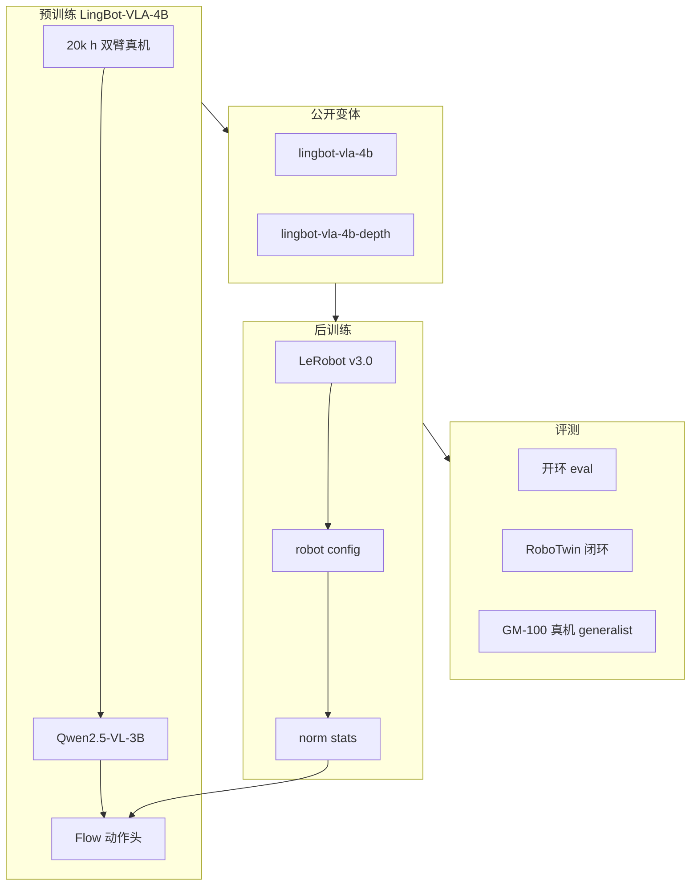

# LingBot-VLA

**LingBot-VLA**（*A Pragmatic VLA Foundation Model*，[arXiv:2601.18692](https://arxiv.org/abs/2601.18692)，[Robbyant](https://github.com/robbyant/lingbot-vla)）是蚂蚁 **Robbyant** 团队发布的 **务实 Vision-Language-Action 基础模型 1.0**：在 **Qwen2.5-VL-3B-Instruct** 上接 **flow 去噪动作头**，用 **20,000 小时**、**9 种双臂机器人** 真机数据预训练，强调 **训练效率**（相对既有 VLA 代码库约 **1.5–2.8×** 加速）与 **可部署的后训练范例**。后继 **[LingBot-VLA 2.0](./lingbot-vla-v2.md)** 将规模扩展到 **6 万小时 + 全身 55 维 + MoE**。

## 一句话定义

**4B 双臂务实 VLA 基座：2 万小时真机预训练 + 开源权重与 GM-100 评测，把 Qwen2.5-VL 语义能力接到可后训练的双臂操纵闭环。**

## 英文缩写速查

| 缩写 | 英文全称 | 简要说明 |
|------|----------|----------|
| VLA | Vision-Language-Action | 视觉-语言-动作多模态策略 |
| VLM | Vision-Language Model | 视觉-语言模型，VLA 的上游骨干 |
| BC | Behavior Cloning | 行为克隆；后训练常用监督范式 |
| GM-100 | General Manipulation 100 | 双臂桌面 generalist 评测与数据集套件 |
| SFT | Supervised Fine-Tuning | 监督微调，将基础模型适配目标任务 |

## 为什么重要

- **1.0 是 2.0 与 HumanNet 对照的公开基线：** [HumanNet](./humannet.md) 与 2.0 技术报告中的实验均以 **LingBot-VLA 架构** 为受控平台；理解 1.0 的数据规模（**2 万 h 双臂** vs 2.0 **6 万 h 全身**）是读通 Robbyant 产品线的钥匙。
- **完整开源链（1.0 代）：** **4B 预训练 + depth 变体**、**RoboTwin 后训练 checkpoint**、[GM-100 数据集](https://huggingface.co/datasets/robbyant/gm100)、**开环/闭环评测** 与 **LeRobot v3.0** 数据指南。
- **工程导向：** README 明确 **VeOmni / LeRobot** 栈优化与 **Torch Compile 推理**；降低社区复现「只读论文」成本。
- **161 篇 loco-manip 地图锚点：** 公众号综述第 152 篇原始链接指向 **本仓库**（非 2.0）；此前 wiki 误链至 2.0 页，现已纠正。

## 核心结构/机制

| 模块 | 作用 |
|------|------|
| **VLM 骨干** | **Qwen2.5-VL-3B-Instruct**：多视角图像 + 语言指令理解 |
| **动作头** | **Flow matching / 去噪** 式动作预测（与 π 系同族工程范式） |
| **Depth 变体** | 从 **[LingBot-Depth](https://huggingface.co/robbyant/lingbot-depth-pretrain-vitl-14)** 蒸馏几何线索；需 **MoGe-2** 等依赖 |
| **预训练数据** | **20,000 h** 真机，**9** 类主流双臂构型 |
| **后训练** | LeRobot v3.0 数据集 → `robot_configs/*.yaml` → `norm_stats`；RoboTwin 2.0 五任务范例 |

## 流程总览（预训练 → 后训练 → 评测）

## 公开结果（README，节选）

### RoboTwin 仿真（平均 SR）

| 模型 | Clean | Randomized |
|------|------:|-----------:|
| π₀.₅ | 82.74% | 76.76% |
| LingBot-VLA w/o depth | 86.50% | 85.34% |
| LingBot-VLA w/ depth | **88.56%** | **86.68%** |

### 与 2.0 的关系

[2.0](./lingbot-vla-v2.md) 技术报告在 **GM-100** 与长程移动操作表中将 **1.0** 作为直接对照行（如 AgileX Cobot Magic progress/success **58.2 / 30.0** vs 2.0 **66.2 / 34.4**）。

## 部署要点

- **环境：** Python **3.12**、PyTorch **2.8.0**、CUDA **12.8**；`bash install.sh`。
- **权重：** `python3 scripts/download_hf_model.py --repo_id robbyant/lingbot-vla-4b`。
- **LeRobot 迁移注意：** 2026/05/01 前下载的 checkpoint 可能与 **LeRobot v3.0** `config.json` 字段不兼容，需重下或手动迁移字段（见 README 折叠说明）。

## 常见误区或局限

- **误区：lingbot-vla 与 lingbot-vla-v2 是同一仓库。** **1.0** → `github.com/robbyant/lingbot-vla`（**4B**）；**2.0** → `lingbot-vla-v2`（**6B**、MoE、全身动作）。
- **误区：2 万小时可直接零样本上新双臂。** 仍需 **robot config 映射** 与 **norm statistics** 后训练。
- **局限：** 1.0 公开叙事聚焦 **双臂桌面**；全身移动操作与 **55 维统一空间** 见 2.0。
- **局限：** 与 [LingBot-Map](../methods/lingbot-map.md) 同属 Robbyant，但解决 **流式 3D 重建**，非操纵 VLA。

## 与其他工作对比

| 对照 | LingBot-VLA 1.0 |
|------|-----------------|
| **[LingBot-VLA 2.0](./lingbot-vla-v2.md)** | 6 万 h、Qwen3-VL-4B、MoE、全身 55 维、Dual-Query 蒸馏 |
| **π₀.₅** | 同 flow 动作头族；1.0 在 RoboTwin 报告更高平均 SR |
| **[OpenLET](./openlet.md) 数据** | LET 为 **Kuavo 真机 IL 数据**；接入 1.0 需 LeRobot 格式 + robot config，非即插即用 |

## 关联页面

- [VLA](../methods/vla.md) — 方法总览
- [LingBot-VLA 2.0](./lingbot-vla-v2.md) — 后继产品与对照基线
- [HumanNet](./humannet.md) — 同架构受控预训练实验
- [LeRobot](./lerobot.md) — 后训练格式
- [Manipulation](../tasks/manipulation.md) — GM-100 / RoboTwin 语境
- [Harness VLA](./paper-harness-vla.md) — RoboTwin C2R 上将后训练 LingBot-VLA 作冻结 `vla_act` 后端

## 推荐继续阅读

- 论文 PDF：<https://github.com/robbyant/lingbot-vla/blob/main/assets/LingBot-VLA.pdf>
- 项目页：<https://technology.robbyant.com/lingbot-vla>
- GM-100 数据：<https://huggingface.co/datasets/robbyant/gm100>

## 参考来源

- [lingbot_vla_arxiv_2601_18692.md](../../sources/papers/lingbot_vla_arxiv_2601_18692.md) — 论文策展与 wiki 映射
- [lingbot-vla.md](../../sources/repos/lingbot-vla.md) — 官方仓库与权重索引
- [lingbot-vla-technology-robbant.md](../../sources/sites/lingbot-vla-technology-robbant.md) — 项目页导航锚点
