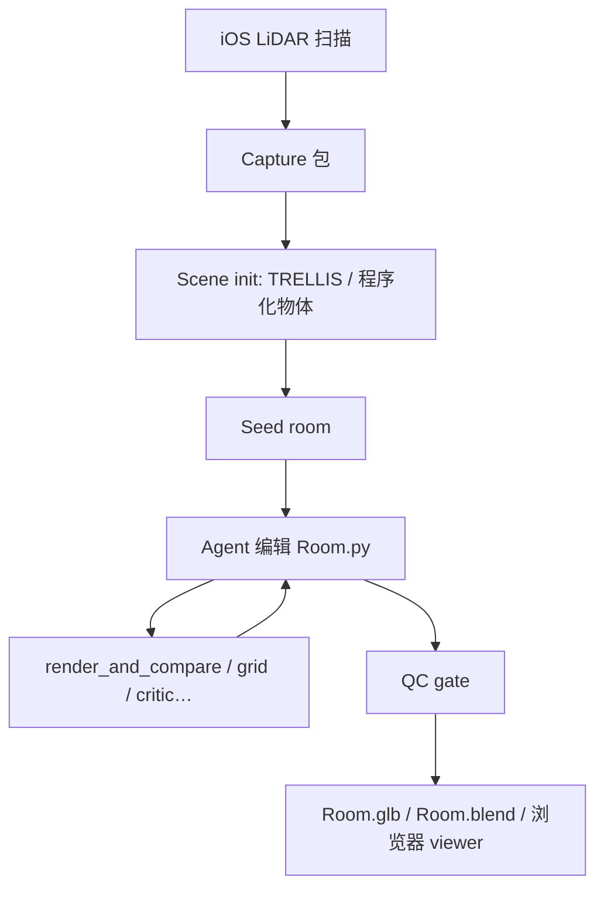
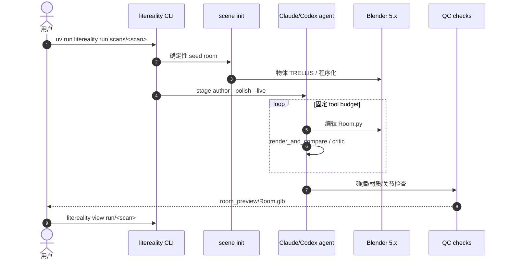

# LiteReality-Agent

**LiteReality-Agent**（[项目页](https://litereality.github.io/Litereality-agent-site/)，[Blog/PDF](https://litereality.github.io/Litereality-agent-site/litereality-agent-post/)，[GitHub](https://github.com/LiteReality/LiteReality-Agent)）由 **Huang, Zhening** 等（含 **剑桥大学** Joan Lasenby、Shangzhe Wu）发布：把 **iOS LiDAR 房间扫描** 变成 **可编辑、可articulate、graphics-ready** 的室内 3D 场景。相对 2025 手工拼接的 [LiteReality（arXiv:2507.02861）](https://arxiv.org/abs/2507.02861)，本版用 **coding agent** 接管 realism authoring：几何与材质集中在 **单一 `Room.py`（Blender Python）** 中迭代，而非检索固定资产库。

## 一句话定义

**Scan → seed room（确定性）→ agent 对照真实照片改 `Room.py`（agentic）→ QC 门 → 可漫游可编辑的交互室内场景。**

## 英文缩写速查

| 缩写 | 英文全称 | 简要说明 |
|------|----------|----------|
| LiteReality-Agent | — | 本文 agentic 室内重建系统 |
| RGB-D | Red Green Blue - Depth | 彩色图 + 深度扫描 |
| USDZ | Universal Scene Description (zip) | RoomPlan 导出的布局格式 |
| PBR | Physically Based Rendering | 物理材质渲染 |
| QC | Quality Control | 导出前确定性 + model 检查 |
| TRELLIS | Structured 3D Latents… | 视觉复杂物体的 image-to-3D 分支 |
| Sim2Real | Simulation to Real | 扫描→仿真环境是本文远期动机之一 |

## 为什么重要

- **端到端开源工具链：** [LiteReality Scanner（App Store）](https://apps.apple.com/gb/app/litereality/id6774158260) + **Agent 仓库** + [example-scans](https://github.com/LiteReality/example-scans)，填补「扫房间→可交互 3D」的公开全栈空白。
- **Agent + 受限工作区：** 与 [Articraft](./articraft.md) 同谱——**单文件 `Room.py` + 任务专用工具 + harness/QC**；物体 init 阶段直接 **改编 Articraft + Blender Python**。
- **机器人 / sim 动机：** 博客明确讨论 **scan→interactive→（工程后）sim-ready** 以适配长期驻留环境；当前 **整房间仍非 simulator-ready**，但 procedural 物体分支继承 Articraft 的 **articulation + QC** 进展。
- **Intrinsics 副产品：**  authored 场景可 **精确渲染** segmentation / depth / normal / albedo（非估计）。

## 核心结构

| 阶段 | 方法要点 |
|------|----------|
| **Capture（App）** | ARKit RGB-D + RoomPlan USDZ；导出帧、深度、相机、点云、布局 |
| **Scene init（确定性）** | 按 RoomPlan 位姿组装；每物体 **TRELLIS** 或 **程序化（Articraft 改编）** 分支 |
| **Authoring（agentic）** | Claude/Codex 驱动；编辑 `Room.py`；工具：`select_view`、`render_and_compare`、`grid`、`critic`、`fetch_materials` |
| **QC gate** | 碰撞、几何、材质、关节等 **确定性检查** + 固定 checklist model pass |
| **输出** | `room_preview/Room.glb`、`Room.blend`；浏览器 `litereality view` |
| **算力** | Modal 托管 TRELLIS/GroundingDINO（推荐）或本地 ≥24GB GPU |
| **开源** | **已开源** CLI + Modal 脚本；TR PDF 已挂页，README 仍标 coming soon |

### 流程总览

## 源码运行时序图

## 工程实践

| 项 | 建议 |
|----|------|
| 环境 | `uv sync --extra modal`；`.env` 填 OpenAI/Modal/Blender 路径 |
| 一次性 | `uv run litereality setup` 部署 TRELLIS/DINO |
| 冒烟 | `SANITY_DEEP=1 uv run python sanity.py` |
| 无扫描 | `git clone LiteReality/example-scans` |
| 分阶段 | `--through seed` 仅 init；`stage author` 仅 authoring |
| 误用 | 不要把 GLB 直接当 **MuJoCo/Isaac sim-ready**；需额外物理字段与布局验证 |

## 常见误区或局限

- **误区：** 「可交互 = 可仿真」——作者明确 **整房间 simulation-ready 仍需大量工程**。
- **误区：** 与 [Articraft](./articraft.md) 重复——Articraft 是 **单物体 agent 资产**；LiteReality-Agent 是 **房间级 scan→scene** 管线，init 阶段 **调用改编 Articraft**。
- **局限：** 当前验证以 **≤50 m² 单房间** 为主；多房间/大尺度未充分 stress-test。
- **局限：** 依赖 **外部 agent CLI + 图像 API + GPU 服务**；成本与稳定性需自行核算。

## 与其他工作对比

| 对照 | 差异读法 |
|------|----------|
| [Articraft](./articraft.md) | **单物体** 可关节程序化 agent；LiteReality 将其嵌入 **房间 init** |
| [Agentic Real2Sim](./paper-agentic-real2sim.md) | **交互 episode → MuJoCo 孪生**；LiteReality 偏 **graphics-ready 室内重建** |
| 原版 LiteReality (2507.02861) | **手工管线 + 资产检索**；Agent 版 **全生成 + agent authoring** |
| [3D Gen Studio](./3dgenstudio.md) | ComfyUI **静态 mesh** 生产；非 scan-grounded 交互房间 |
| [mjswan](./mjswan.md) | 浏览器 **MuJoCo 策略 demo**；与 LiteReality 输出格式/目标不同 |

## 关联页面

- [Articraft](./articraft.md)
- [Agentic Real2Sim](./paper-agentic-real2sim.md)
- [Sim2Real](../concepts/sim2real.md)
- [文字生成 CAD](../concepts/text-to-cad.md)
- [mjswan](./mjswan.md) — 另一类 **浏览器传播仿真** 工具，可对照 sim 动机

## 推荐继续阅读

- [LiteReality-Agent 项目页](https://litereality.github.io/Litereality-agent-site/)
- [官方 Blog / PDF](https://litereality.github.io/Litereality-agent-site/litereality-agent-post/)
- [LiteReality/LiteReality-Agent](https://github.com/LiteReality/LiteReality-Agent)
- [LiteReality（arXiv:2507.02861）](https://arxiv.org/abs/2507.02861) — 前代手工管线

## 参考来源

- [LiteReality-Agent 官方博客（2026）](../../sources/blogs/litereality_agent_post_2026.md)
- [LiteReality-Agent 项目页](../../sources/sites/litereality-agent-github-io.md)
- [LiteReality/LiteReality-Agent](../../sources/repos/litereality-litereality-agent.md)
