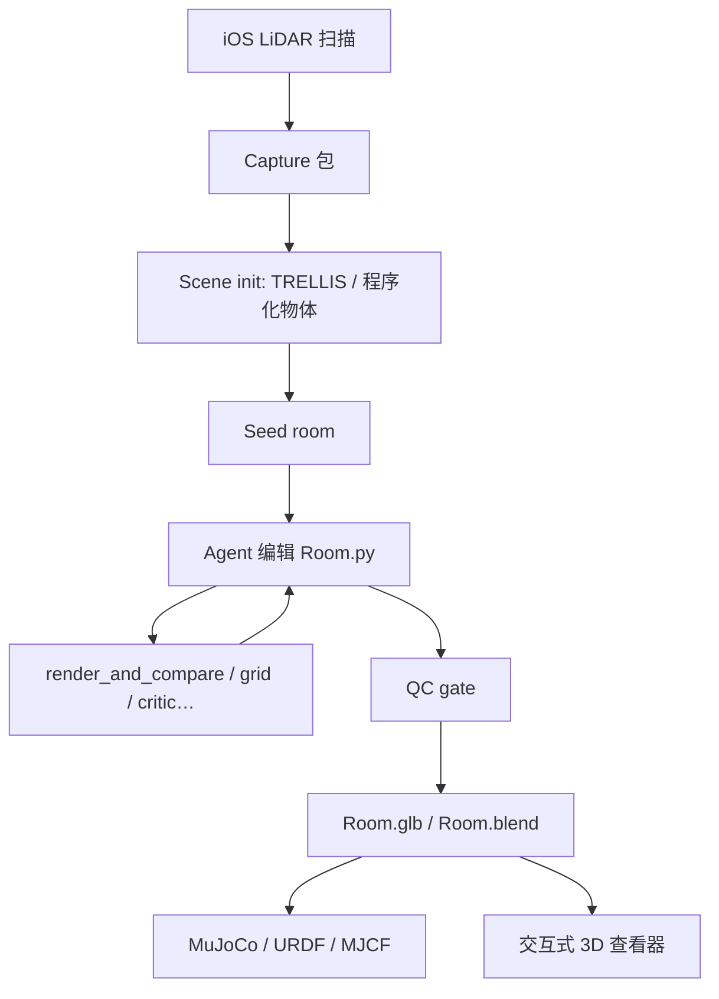
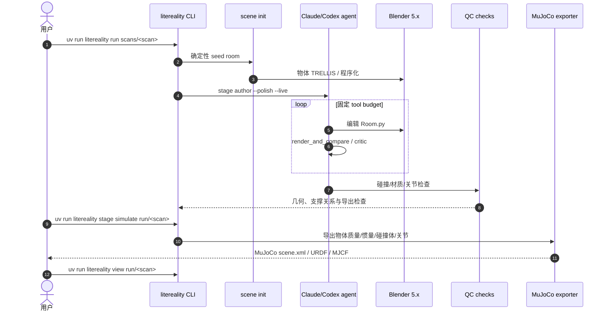

# LiteReality-Agent

**LiteReality-Agent**（[项目页](https://litereality.github.io/agent/)，[论文 arXiv:2610.01863](https://arxiv.org/abs/2610.01863)，[GitHub](https://github.com/LiteReality/LiteReality-Agent)）由剑桥大学、帝国理工学院及独立研究者共同完成。它把 iOS RGB-D 房间扫描变成可编辑的室内场景：coding agent 在 `Room.py` 中迭代几何与材质，并通过几何、支撑关系和物理属性检查后导出 MuJoCo 等仿真格式。相较原版 LiteReality（arXiv:2507.02861）的确定性检索与组装流程，Agent 版增加了可调用工具的 observe-edit-verify 编排。

## 一句话定义

**RGB-D scan → layout repair 与物体重建 → agent 对照扫描证据编辑 `Room.py` → 几何/支撑 QC → 可交互场景与 MuJoCo、URDF、MJCF 导出。**

## 英文缩写速查

| 缩写 | 英文全称 | 简要说明 |
|------|----------|----------|
| LiteReality-Agent | — | 本文 agentic 室内重建系统 |
| RGB-D | Red Green Blue - Depth | 彩色图 + 深度扫描 |
| USDZ | Universal Scene Description (zip) | RoomPlan 导出的布局格式 |
| PBR | Physically Based Rendering | 物理材质渲染 |
| QC | Quality Control | 导出前确定性 + model 检查 |
| TRELLIS | Structured 3D Latents… | 视觉复杂物体的 image-to-3D 分支 |
| Sim2Real | Simulation to Real | 扫描→仿真环境是本文远期动机之一 |

## 为什么重要

- **端到端开源工具链：** [LiteReality Scanner（App Store，免费）](https://apps.apple.com/gb/app/litereality/id6774158260) + [Agent 仓库（Apache-2.0）](https://github.com/LiteReality/LiteReality-Agent) + [example-scans](https://github.com/LiteReality/example-scans)，覆盖采集、重建和仿真导出。
- **Agent + 受限工作区：** 与 [Articraft](./articraft.md) 同谱——**单文件 `Room.py` + 任务专用工具 + harness/QC**；物体 init 阶段直接 **改编 Articraft + Blender Python**。
- **面向机器人仿真：** 论文展示 MuJoCo 场景导出、摇晃测试与 Franka 抓取示例；每个物体带质量、惯量、碰撞几何和关节。但论文也指出这些检查不能替代真实物理参数的 ground-truth 验证。
- **Intrinsics 副产品：**  authored 场景可 **精确渲染** segmentation / depth / normal / albedo（非估计）。

## 核心结构

| 阶段 | 方法要点 |
|------|----------|
| **Capture（App）** | ARKit RGB-D + RoomPlan USDZ；导出帧、深度、相机、点云、布局 |
| **Scene init（确定性）** | 按 RoomPlan 位姿组装；每物体 **TRELLIS** 或 **程序化（Articraft 改编）** 分支 |
| **Authoring（agentic）** | Claude/Codex 驱动；编辑 `Room.py`；工具：`select_view`、`render_and_compare`、`grid`、`critic`、`fetch_materials` |
| **QC gate** | 碰撞、几何、材质、关节等 **确定性检查** + 固定 checklist model pass |
| **输出** | `Room.glb` / `Room.blend`；MuJoCo 场景及 URDF / MJCF；浏览器交互查看器 |
| **算力** | 官方 README 推荐 Modal 托管 TRELLIS / GroundingDINO，或 Linux 本地 ≥24GB GPU |
| **开源** | **已开源** CLI 与部署代码（Apache-2.0）；LiteReality Scanner 在 App Store 免费提供 |

### 流程总览

```mermaid
flowchart TB
  scan[iOS LiDAR 扫描] --> cap[Capture 包]
  cap --> init[Scene init: TRELLIS / 程序化物体]
  init --> seed[Seed room]
  seed --> loop[Agent 编辑 Room.py]
  loop --> tools[render_and_compare / grid / critic…]
  tools --> loop
  loop --> qc[QC gate]
  qc --> out[Room.glb / Room.blend]
  out --> sim[MuJoCo / URDF / MJCF]
  out --> viewer[交互式 3D 查看器]
```

## 论文与评测

论文将室内重建表述为 coding task：coding agent 收集扫描证据，调用专用工具并迭代编辑可执行的 Room.py。系统先修正布局，再按对象复杂度选择程序化生成或 TRELLIS.2 重建，最后以 render-and-compare、尺寸测量、碰撞与支撑检查验证结果。

- 在 **10 个室内场景、620 个采集视角**上测试；LiteReality-Agent 的 SSIM、PSNR、RMSE、LPIPS 均优于论文比较方法。其深度 MAE 为 **10.50 cm**，家具底部近接触 **86/86**，检测到的家具表面相交对为 **0**。
- 人工感知评分中，布局 / 物体相似度 / 整体相似度均值分别为 **4.60 / 4.58 / 4.54（满分 5）**；人工样本为 13 份提交、65 次场景评价。
- 作者说明几何指标只覆盖特定物理合理性维度，并不证明完整物理有效性；物理属性缺少 ground-truth 验证。视觉指标基于采集视角，不是 held-out novel-view 测试，感知评价样本也较小。

## 源码运行时序图

```mermaid
sequenceDiagram
    autonumber
    actor User as 用户
    participant CLI as litereality CLI
    participant Init as scene init
    participant Agent as Claude/Codex agent
    participant Blender as Blender 5.x
    participant QC as QC checks
    participant Sim as MuJoCo exporter
    User->>CLI: uv run litereality run scans/<scan>
    CLI->>Init: 确定性 seed room
    Init->>Blender: 物体 TRELLIS / 程序化
    CLI->>Agent: stage author --polish --live
    loop 固定 tool budget
        Agent->>Blender: 编辑 Room.py
        Agent->>Agent: render_and_compare / critic
    end
    Agent->>QC: 碰撞/材质/关节检查
    QC-->>CLI: 几何、支撑关系与导出检查
    User->>CLI: uv run litereality stage simulate run/<scan>
    CLI->>Sim: 导出物体质量/惯量/碰撞体/关节
    Sim-->>User: MuJoCo scene.xml / URDF / MJCF
    User->>CLI: uv run litereality view run/<scan>
```

## 工程实践

| 项 | 建议 |
|----|------|
| 环境 | `uv sync --extra modal`；`.env` 填 OpenAI/Modal/Blender 路径 |
| 一次性 | `uv run litereality setup` 部署 TRELLIS/DINO |
| 冒烟 | `SANITY_DEEP=1 uv run python sanity.py` |
| 无扫描 | `git clone LiteReality/example-scans` |
| 分阶段 | `uv run litereality run scans/<scan> --through seed` 仅 init；`uv run litereality stage author run/<scan> --force --polish --live` 执行 authoring |
| 仿真导出 | `uv run litereality stage simulate run/<scan>` 导出 MuJoCo 场景；README 说明还可导出 URDF / MJCF |
| 误用 | 仿真可导入不等于真实物理已验证；物理属性估计与几何 QC 不能替代 ground-truth 动力学验证 |

## 常见误区或局限

- **误区：** 将“simulation-ready”理解成已验证真实动力学。当前版本可导出 MuJoCo、URDF、MJCF，但论文没有对所有物理属性进行 ground-truth 验证。
- **误区：** 与 [Articraft](./articraft.md) 重复——Articraft 是 **单物体 agent 资产**；LiteReality-Agent 是 **房间级 scan→scene** 管线，init 阶段 **调用改编 Articraft**。
- **局限：** 评测覆盖 10 个室内场景和 620 个采集视角；论文没有报告 held-out novel-view 泛化。人工评价样本较小，不能据此断言所有户型和物体类别都稳定。
- **局限：** 依赖 **外部 agent CLI + 图像 API + GPU 服务**；成本与稳定性需自行核算。

## 与其他工作对比

| 对照 | 差异读法 |
|------|----------|
| [Articraft](./articraft.md) | **单物体** 可关节程序化 agent；LiteReality 将其嵌入 **房间 init** |
| [Agentic Real2Sim](./paper-agentic-real2sim.md) | **交互 episode → MuJoCo 孪生**；LiteReality 偏 **graphics-ready 室内重建** |
| 原版 LiteReality (2507.02861) | **手工管线 + 资产检索**；Agent 版 **全生成 + agent authoring** |
| [3D Gen Studio](./3dgenstudio.md) | ComfyUI **静态 mesh** 生产；非 scan-grounded 交互房间 |
| [mjswan](./mjswan.md) | 浏览器 **MuJoCo 策略 demo**；与 LiteReality 输出格式/目标不同 |

## 关联页面

- [Articraft](./articraft.md)
- [Agentic Real2Sim](./paper-agentic-real2sim.md)
- [Sim2Real](../concepts/sim2real.md)
- [文字生成 CAD](../concepts/text-to-cad.md)
- [mjswan](./mjswan.md) — 另一类 **浏览器传播仿真** 工具，可对照 sim 动机

## 推荐继续阅读

- [论文：LiteReality-Agent（arXiv:2610.01863）](https://arxiv.org/abs/2610.01863)
- [交互式 3D 查看器](https://litereality.github.io/agent/vr/index.html)
- [项目主页与演示](https://litereality.github.io/agent/)
- [LiteReality/LiteReality-Agent](https://github.com/LiteReality/LiteReality-Agent)
- [LiteReality（arXiv:2507.02861）](https://arxiv.org/abs/2507.02861) — 前代手工管线

## 参考来源

- [LiteReality-Agent 论文（arXiv:2610.01863）](../../sources/papers/litereality_agent_2610_01863.md)
- [LiteReality-Agent 官方博客（2026）](../../sources/blogs/litereality_agent_post_2026.md)
- [LiteReality-Agent 项目页](../../sources/sites/litereality-agent-github-io.md)
- [LiteReality/LiteReality-Agent](../../sources/repos/litereality-litereality-agent.md)
