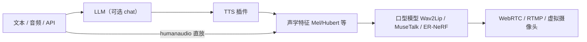
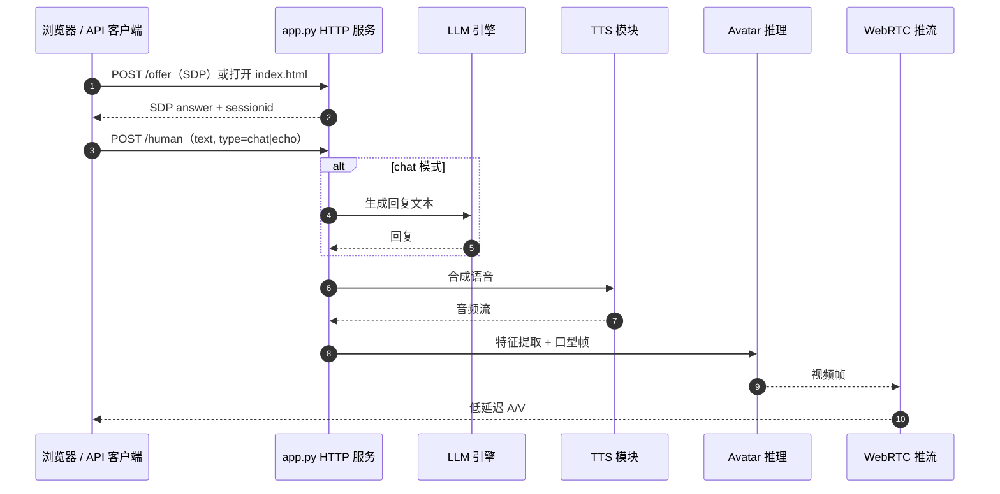

# LiveTalking（实时流式交互数字人）

**LiveTalking**（[GitHub](https://github.com/lipku/LiveTalking)，[项目页](https://www.livetalking.ai)，[文档](https://doc.livetalking.ai)）是面向 **低延迟音视频对话** 的开源 **流式数字人引擎**：用户文本或语音经可选 **LLM** 生成回复，**TTS** 合成音频，**Wav2Lip / MuseTalk / ER-NeRF** 等模型做 **口型同步渲染**，再通过 **WebRTC、RTMP 或虚拟摄像头** 输出。在机器人知识库中，它属于 **遥呈现 / 人机界面 / 数字孪生演示** 的 **2D 视频化身栈**，与 [MetaHuman](./metahuman.md) 的 **3D 引擎资产路线** 互补，**不输出** 关节轨迹或 WBT 指令。

## 一句话定义

**把「对话 → 语音 → 口型视频 → 低延迟推流」收成一条可 API 驱动的 GPU 服务**，并支持 **打断、多 session 并发** 与 **插件化 TTS/Avatar**。

## 英文缩写速查

| 缩写 | 英文全称 | 简要说明 |
|------|----------|----------|
| TTS | Text-to-Speech | 文本转语音；支持 EdgeTTS、GPT-SoVITS、CosyVoice 等插件 |
| LLM | Large Language Model | `/human` 的 chat 模式对接 Qwen 等；可经 OpenAI 兼容网关 |
| WebRTC | Web Real-Time Communication | 浏览器低延迟拉流；`/offer` 或 WHEP `/whep` |
| RTMP | Real-Time Messaging Protocol | 推流到 B 站 / YouTube 等直播平台 |
| ER-NeRF | Efficient Radiance Fields for Talking Head | 可选 talking-head 渲染后端之一 |

## 为什么对机器人栈重要

1. **遥操作与讲解 UI：** [Teleoperation](../tasks/teleoperation.md) 与展厅讲解常需要 **可见、可对话的人类化身**；LiveTalking 提供 **HTTP/WebRTC 接口**，适合大屏、客服机器人「脸」层，而非替代 [Motion Retargeting](../concepts/motion-retargeting.md) 或 MuJoCo 控制环。
2. **与 3D 数字人路线对照：** [MetaHuman](./metahuman.md) 强调 **UE 内高保真 3D rig + MoCap**；LiveTalking 强调 **2D 视频 avatar + 实时口型**，部署门槛更低、GPU 推理路径清晰，但 **几何与物理不一致**。
3. **全双工交互工程样本：** **可打断**、session 级 `sessionid`、动作编排（idle 视频）对设计 **语音助手 / 共语手势**（参见 [DiffSHEG](./paper-diffsheg.md) 的数字人语境）有参考价值。
4. **开源边界清晰：** 社区版 **Apache-2.0 代码已开放**；权重与 avatar **网盘分发**；商业版能力（透明背景、唤醒词全语音等）**不在主仓**——选型时需按 [character-animation-vs-robotics](../concepts/character-animation-vs-robotics.md) 区分 **视觉层** 与 **控制层**。

## 核心信息

| 项 | 内容 |
|----|------|
| **机构** | 独立维护者（Independent Maintainer）；[lipku](https://github.com/lipku) 社区主导 |
| **维护者** | [lipku](https://github.com/lipku)（社区驱动；项目页称 100+ 企业落地） |
| **代码** | [lipku/LiveTalking](https://github.com/lipku/LiveTalking) |
| **开源** | **已开源**（推理与服务代码；权重 **部分**，见局限） |
| **许可** | Apache-2.0 |
| **推荐环境** | Ubuntu 22.04、Python 3.12、PyTorch 2.9 + CUDA 12.8（README 实测口径） |

## 流程总览

## 源码运行时序图

典型 **WebRTC + 文本驱动** 路径（对齐 `app.py` 与 [docs/api.md](https://github.com/lipku/LiveTalking/blob/main/docs/api.md)）：

**复现入口：** 下载网盘模型 → `python app.py --transport webrtc --model wav2lip --avatar_id <id>` → `http://<host>:8010/index.html` 或调用 `/human`。

## 架构分层（README 口径）

| 层 | 要点 |
|----|------|
| **API** | `/human`（echo/chat）、`/humanaudio`；每连接 `sessionid` |
| **逻辑** | LLM、模块化 TTS、Mel/Hubert 等特征 |
| **渲染** | 深度学习口型 + 贴回高清视频 |
| **推流** | WebRTC、RTMP、虚拟摄像头 |
| **插件** | `registry.py` 注册 TTS / Avatar / Output |

## 工程实践

| 检查项 | 建议 |
|--------|------|
| **模型资产** | 从 README 夸克 / Google Drive 拉 `wav2lip.pth` 与 avatar 包；商用升级版不在社区仓 |
| **实时性** | 日志 `inferfps` 与 `finalfps` 均 ≥25 才视为实时；并发受 **CPU（压缩）+ GPU（推理）** 双瓶颈 |
| **网络** | 开放 TCP 8010；WebRTC 需 UDP 大段端口 |
| **LLM** | 可 `--llm_provider orcarouter` 等 OpenAI 兼容网关 |
| **扩展** | [livestream](https://github.com/lipku/livestream) 直播带货；Docker 见 README AutoDL/UCloud 镜像 |

### 性能参考（README 表，策展）

| 模型 | GPU | 报告 FPS |
|------|-----|----------|
| wav2lip256 | RTX 3060 | 60 |
| wav2lip256 | RTX 3080Ti | 120 |
| musetalk | RTX 4090 | 72 |

## 局限与风险

- **非机器人运动输出：** 产物是 **像素流**，不能直接进入 WBT/IL 策略；与 [MetaHuman](./metahuman.md) 一样需 mentally 分层。
- **权重分发依赖网盘：** 复现链路与合规审计比 Hugging Face 托管更 fragile；离线环境需自建镜像。
- **商业版功能闭源：** 项目页列出的透明背景、唤醒词全语音等多在商业线，勿假设主仓具备。
- **2D 贴回画质 vs 身份一致：** Wav2Lip 类方法在高分辨率全身场景可能出现边界伪影；MuseTalk/NeRF 更重 GPU。

## 与其他页面的关系

- [MetaHuman（Epic 数字人）](./metahuman.md) — **3D UE 资产 + MoCap**；LiveTalking — **2D 流式口型 + API 服务**。
- [DiffSHEG（语音驱动 3D 表情手势）](./paper-diffsheg.md) — 研究向 **3D blendshape/轴角** 共语生成；LiveTalking — **工程向实时推流**。
- [Teleoperation](../tasks/teleoperation.md) — 数字人可作为 **operator/visitor 界面** 层，与控制栈解耦。
- [Character Animation vs Robotics](../concepts/character-animation-vs-robotics.md) — 界定视觉表演与控制可行性的边界。

## 参考来源

- [LiveTalking 仓库归档](../../sources/repos/livetalking.md)
- [LiveTalking.ai 项目页归档](../../sources/sites/livetalking-ai.md)
- GitHub：<https://github.com/lipku/LiveTalking>
- 文档：<https://doc.livetalking.ai>

## 推荐继续阅读

- [LiveTalking API 文档](https://github.com/lipku/LiveTalking/blob/main/docs/api.md) — `/offer`、`/human`、录制与编排
- [项目 FAQ](https://doc.livetalking.ai/docs/faq/) — 安装与 CUDA 常见问题
- [MetaHuman](./metahuman.md) — 高保真 3D 数字人资产对照
- [Wav2Lip 原论文](https://arxiv.org/abs/2008.10010) — 口型同步 baseline 背景
