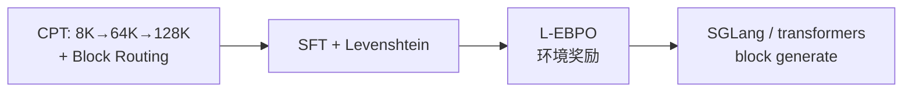
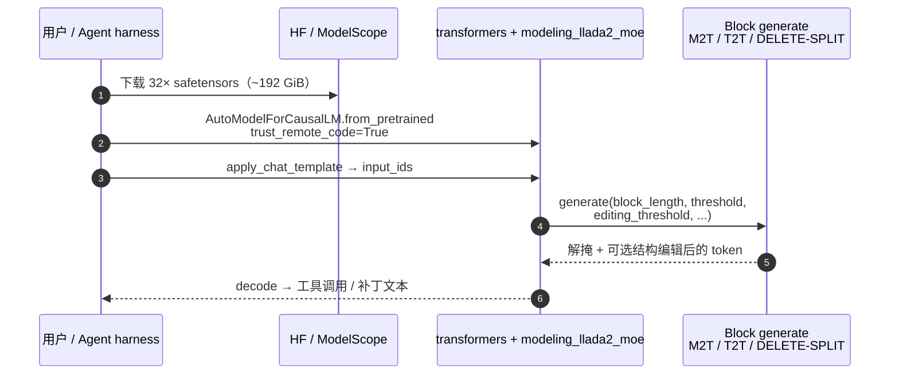

# LLaDA2.2-flash

**LLaDA2.2-flash** 是 [Inclusion AI](https://github.com/inclusionAI)（蚂蚁集团）LLaDA2 系列的 **agent-oriented** 扩散语言模型（dLLM）：在 **100B** MoE block-diffusion 骨干上引入 **Levenshtein Editing**，并把原生上下文扩到 **128K**。系列入口仓为 [inclusionAI/LLaDA2.X](https://github.com/inclusionAI/LLaDA2.X)；对本知识库读者，其价值主要在 **高吞吐 coding / tool-use agent 后端**（SWE、MCP、多轮工具环）与 **离散文本扩散** 方法交叉，而非直接输出机器人关节指令。

| 字段 | 内容 |
|------|------|
| 机构 | 包容智能（Inclusion AI）· 蚂蚁集团（Ant Group）· 浙江大学（ZJU）· 西湖大学（Westlake University） |
| 权重 | [HF `inclusionAI/LLaDA2.2-flash`](https://huggingface.co/inclusionAI/LLaDA2.2-flash) · [ModelScope](https://modelscope.cn/models/inclusionAI/LLaDA2.2-flash) |
| License | Apache-2.0 |

## 一句话定义

以 **block-diffusion MoE + Levenshtein 编辑（DELETE/INSERT）+ L-EBPO** 支撑 **128K** 长程 agent 交互的 **100B 开放权重 dLLM**；相对同档 AR 基线换吞吐与可编辑并行解码，而非全面碾压通用分数。

## 英文缩写速查

| 缩写 | 英文全称 | 简要说明 |
|------|----------|----------|
| dLLM | Diffusion Language Model | 离散掩码/块扩散语言模型，非自回归逐 token 生成 |
| MoE | Mixture of Experts | 稀疏专家路由；本模型 256 routed experts、每 token top-8 |
| LCS | Longest Common Subsequence | 草稿与真值对齐以派生编辑标签 |
| L-EBPO | Levenshtein Editing ELBO-based Block-level Policy Optimization | 把编辑决策纳入 agentic RL 的块级策略优化 |
| T2T | Token-to-Token editing | LLaDA2.1 固定长度替换；2.2 扩展为可增删 |
| M2T | Mask-to-Token | 置信度超过阈值后将 `[MASK]` 解为具体 token |
| TPS | Tokens Per Second | 解码吞吐指标 |

## 为什么重要

- **dLLM 进入 agent 场景：** 报告直面块并行在多轮工具环中的 **结构僵硬** 与 **误差累积**；用可增删编辑 + 环境奖励 RL 做第一刀，而不是只刷单轮通用榜。
- **吞吐优势可读：** 相对 Ling-2.6-flash（MTP×4），BF16 平均约 **1.64×** TPS；对 [autoresearch harness](../queries/real-robot-policy-autoresearch-harness.md) 这类 **token 预算敏感** 的 coding agent 环有选型意义。
- **开放权重 + Apache-2.0：** 相对带营收门槛的专有 License，自托管与二次分发更清晰；硬件门槛仍高（约 **192 GiB** BF16）。
- **与机器人扩散栈正交交叉：** 本库大量 [Diffusion Model](../concepts/diffusion-model.md) / Diffusion Policy 是 **连续动作/图像** 扩散；LLaDA2.2 是 **离散文本 block diffusion**——共享「多步降噪」直觉，部署与失败模式不同。

## 核心原理

### 系列位置

| 版本 | 要点 |
|------|------|
| **LLaDA2.0** | 首次把 dLLM MoE 推到 **100B** 量级（arXiv:2512.15745） |
| **LLaDA2.1** | **Token editing（T2T）** 加速与质量折中（arXiv:2602.08676） |
| **LLaDA2.2** | **Levenshtein Editing** + **L-EBPO** + **128K** + **Block Routing**（本页） |

### 规格（LLaDA2.2-flash）

| 项 | 值 |
|----|-----|
| 类型 | MoE Diffusion LM + Levenshtein Editing |
| 非嵌入参数 | **100B** |
| 层数 / 注意力头 | 32 / 32（GQA：`num_key_value_heads=4`） |
| MoE | 256 experts，每 token **8**；shared **1**；block 准入容量 **48** |
| 上下文 | **128K**（`max_position_embeddings=131072`） |
| 词表 | 157,184 |
| 位置编码 | RoPE（`rope_theta=3e6`） |
| 权重体积 | ~**192 GiB**（32× safetensors，BF16） |

### Levenshtein Editing

块内四元操作：**KEEP / SUBSTITUTE / DELETE / INSERT**。训练用 LCS 对齐草稿与目标得到标签；推理时 DELETE 删除当前位置，INSERT（实现中为 **SPLIT** token）在当前位置前插入新 `[MASK]`，再 pad/truncate 保持块长固定。同 SWE 轨迹消融：开启编辑后 SWE-bench Verified **35.8 → 44.4**。

HF `generate` 同时做 **M2T**（按 `threshold` 解掩）、**T2T**（按 `editing_threshold` 改写）与 DELETE/SPLIT 消费。

### Block Routing

块扩散一步处理整块（常 32 token）。若每 token 独立 top-k，一块激活专家集是并集，通信与 HBM 抖动大。Block routing 先用 token racing（按专家取块内 max score）准入 top-**C=48**，再在池内做 token-wise top-k，把专家工作集上界钉在 \(O(C)\)。

### 训练与 RL（报告）

CPT 数据：300B@64K + 200B@128K（末段含 agent / 仓库级代码 / 浏览轨迹）。L-EBPO 动作空间 \(A=V\cup\{\mathrm{DELETE},\mathrm{INSERT}\}\)；奖励来自工具正确性、格式与任务完成。

## 推理部署时序（开放权重）

入口仓 **无训练脚本**；最小可运行路径是 HF custom `generate`（或后续官方 SGLang / [dInfer](https://github.com/inclusionAI/dInfer)）。

关键复现路径：接受 **Apache-2.0** → 拉 HF 或 ModelScope 权重 → `trust_remote_code` 加载 → 评测默认 `block_length=32`、`threshold=0.5`、`editing_threshold=0.0`；生产长上下文先确认 **SGLang 2.2 支持进度**，或评估 [dInfer](https://github.com/inclusionAI/dInfer)。微调入口见 [dFactory](https://github.com/inclusionAI/dFactory)（文档主写 2.0；2.2 接入以仓内配置为准）。

## 工程实践

| 场景 | 建议 |
|------|------|
| **冒烟推理** | 官方卡示例：`temperature=0.0`，`gen_length=512`，`eos_early_stop=True` |
| **Agent 评测对齐** | 报告设置：`temperature=1.0`，128K，五次均值；SWE 用 **Claude Code** scaffold（与 Ling 部分 OpenHands 分数不可直接横比） |
| **速度–质量** | 降 `threshold` 可加速但易重复 / 不稳；调 `editing_threshold`、`max_post_steps` |
| **长上下文 tool-use** | 优先等待 / 验证 SGLang；确认 128K 与 MoE block-diffusion 服务配置 |
| **Autoresearch backend** | 吞吐友好；对 **严格 JSON / 多参 function call** 预期弱于强 AR（见局限） |
| **对照 AR 旗舰** | 同为开放权重 coding 后端时对照 [Kimi K3](./kimi-k3.md)（1M 上下文、专有 License、超大权重） |

### 评测速览（对 Ling-2.6-flash）

| 集合 | LLaDA2.2-flash | Ling-2.6-flash |
|------|----------------|----------------|
| Agentic 7 项均分 | **53.83** | 55.74 |
| General 10 项均分 | 56.81 | **65.90** |
| τ²-Bench | **80.33** | 76.36 |
| MCP-Atlas | **46.21** | 41.12 |
| SWE-bench Verified | 49.28 | 61.20† |
| BF16 相对吞吐 | 约 **1.64×** | 1.0（MTP×4） |

† SWE Verified 脚手架不一致（Claude Code vs OpenHands）。

## 局限与风险

| 局限 | 说明 |
|------|------|
| **开放权重 ≠ 完整训练开源** | 权重 + 报告 + HF custom 推理代码已公开；**CPT/SFT/RL 全栈与数据未随 LLaDA2.X 发布** |
| **结构化局部一致性** | 块内并行弱于 AR 前缀约束；嵌套 JSON / SQL / 多参工具调用仍易错，编辑是事后修补 |
| **INSERT 难于 DELETE** | 漏内容修复与长程目标漂移仍在；局部编辑不能消灭误差累积 |
| **通用榜落后** | IFBench / GPQA / LiveCodeBench / AIME 等与 Ling 差距明显；勿当「全面替代 AR」 |
| **服务栈未齐** | 模型卡写明 **SGLang coming soon**；生产前需自证 dInfer / transformers 路径 |
| **硬件门槛** | ~192 GiB BF16 + MoE EP；小实验室通常难以全量自托管 |
| **非具身动作模型** | 不输出关节 / 航点；物理任务需接 VLA / 控制栈 |

## 开源状态

| 项目 | 状态（2026-07-28） |
|------|-------------------|
| **模型权重** | **已开源** — [HF](https://huggingface.co/inclusionAI/LLaDA2.2-flash) + [ModelScope](https://modelscope.cn/models/inclusionAI/LLaDA2.2-flash) |
| **技术报告** | **已发布** — [`LLaDA2_2_tech_report.pdf`](https://github.com/inclusionAI/LLaDA2.X/blob/main/LLaDA2_2_tech_report.pdf)（11 页；无独立 arXiv） |
| **GitHub 入口仓** | [inclusionAI/LLaDA2.X](https://github.com/inclusionAI/LLaDA2.X)（README / License / PDF；无训练脚本） |
| **HF custom 推理** | **已开源** — `modeling_llada2_moe.py` 等 |
| **dInfer / dFactory** | 系列推理 / 微调生态仓（Apache-2.0）；2.2 服务化以官方更新为准 |
| **SGLang 正式部署** | **待发布**（模型卡 coming soon） |
| **训练代码 / 数据** | **未开源** |
| **License** | **Apache-2.0** |

## 参考来源

- [LLaDA2.2 技术报告归档](../../sources/papers/llada2_2_tech_report.md)
- [GitHub inclusionAI/LLaDA2.X 归档](../../sources/repos/llada2-x.md)
- [HF inclusionAI/LLaDA2.2-flash 归档](../../sources/sites/huggingface-inclusionai-llada2-2-flash.md)
- [ModelScope inclusionAI/LLaDA2.2-flash 归档](../../sources/sites/modelscope-inclusionai-llada2-2-flash.md)
- [技术报告 PDF](https://github.com/inclusionAI/LLaDA2.X/blob/main/LLaDA2_2_tech_report.pdf)
- [HF 权重](https://huggingface.co/inclusionAI/LLaDA2.2-flash)

## 关联页面

- [Diffusion Model](../concepts/diffusion-model.md) — 扩散生成底座；本页为离散文本 dLLM 实例
- [Kimi K3](./kimi-k3.md) — 开放权重 AR 旗舰 coding/agent 后端对照
- [真机策略 autoresearch 闭环搭建指南](../queries/real-robot-policy-autoresearch-harness.md) — coding agent 选型与 harness 前提
- [ENPIRE](../methods/enpire.md) — AutoEnvBench 与 coding agent 评测语境
- [Hermes Agent](./hermes-agent.md) — 常驻 agent 运行时（可接不同 LLM 后端）
- [AI Auto-Research](../concepts/ai-auto-research.md) — 研究自动化阶段论

## 推荐继续阅读

- [inclusionAI/LLaDA2.X](https://github.com/inclusionAI/LLaDA2.X)
- [dInfer：dLLM 推理框架](https://github.com/inclusionAI/dInfer)
- [dFactory：dLLM 微调](https://github.com/inclusionAI/dFactory)
- [LLaDA2.1 arXiv:2602.08676](https://arxiv.org/abs/2602.08676)
- [LLaDA2.0 arXiv:2512.15745](https://arxiv.org/abs/2512.15745)
- LMSYS / SGLang：*Power Up Diffusion LLMs*（LLaDA2.0 Day-0 支持叙事）— <https://lmsys.org/blog/2025-12-19-diffusion-llm>
