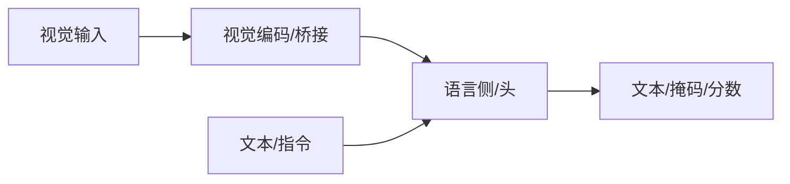

# LLaVA

## 一句话定义

LLaVA 用简单线性/MLP 投影连接冻结视觉编码器与 LLM，并在视觉指令数据上微调，成为开源视觉对话与具身 VLM 的高影响力基线。

## 英文缩写速查

| 缩写 | 英文全称 | 简要说明 |
|------|----------|----------|
| LLaVA | Large Language and Vision Assistant | 视觉指令助理 |
| MLP | Projection MLP | 视觉→语言投影 |
| SFT | Supervised Fine-Tuning | 指令微调 |
| Vicuna | Vicuna LLM | 常用语言底座 |
| VQA | Visual Question Answering | 评测任务 |

## 为什么重要

- 课程第 5–6 章多模态主线节点；与机器人 VLM/VLA 选型直接相关。
- 理解其输入输出接口，才能正确接到检测、分割或策略模块。

## 核心原理

视觉特征经投影层注入 LLM 词嵌入空间，用图文指令对话数据做端到端或分阶段微调。

## 工程实践

| 项 | 建议 |
|----|------|
| 权重 | 优先官方或 Hugging Face 发布 |
| 微调 | 指令数据质量优先；可用 LoRA |
| 机器人 | 明确延迟预算；重模型可云端核验 |

## 局限与风险

幻觉、错误 grounding、许可与安全过滤必须单独评估；开源状态以项目页为准，部署前核查权重协议。

## 关联页面

- [多模态基础](../concepts/multimodality-basics.md)
- [多模态 LLM 路线](../overview/multimodal-llm-development.md)
- [BLIP-2](./paper-blip2.md)
- [Transformer CV 课程策展](../entities/transformer-cv-curriculum.md)

## 参考来源

- [Transformer 视觉应用课程大纲](../../sources/courses/transformer_cv_applications_syllabus.md)

## 推荐继续阅读

- [论文 / 项目](https://arxiv.org/abs/2304.08485)
