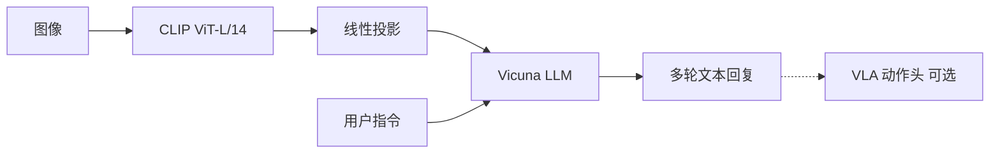

# LLaVA

## 一句话定义

LLaVA 用 GPT-4 生成视觉指令数据，经线性投影连接 CLIP 与 Vicuna 并两阶段微调，是开源视觉对话与 VLA 上游 VLM 的高影响力基线。

## 英文缩写速查

| 缩写 | 英文全称 | 简要说明 |
|------|----------|----------|
| LLaVA | Large Language and Vision Assistant | 视觉指令助理 |
| LMM | Large Multimodal Model | 多模态大模型 |
| SFT | Supervised Fine-Tuning | 指令微调 |
| VLM | Vision-Language Model | VLA 常见上游 |
| VLA | Vision-Language-Action | 具身动作策略 |

## 为什么重要

- [CLIP](./clip.md) 之后的多模态主线节点：把 **对比对齐** 推进到 **多轮视觉指令跟随**。
- 架构极简（冻结 CLIP + 投影 + LLM），[FluxVLA LlavaVLA](./fluxvla-engine.md)、NaVILA、RoboInter-VLM 等 VLA 变体直接复用训练栈。
- 理解其 **Stage1/Stage2** 与 JSON 指令格式，才能正确接到动作头或 LoRA 微调。

## 核心原理

**Stage1**：在 CC3M 上只更新投影矩阵，对齐 CLIP patch 特征与 LLM 词嵌入。**Stage2**：在 LLaVA-Instruct-150K 上端到端微调 LLM（视觉塔通常冻结）。推理时图像经 CLIP → 投影 → 与文本 token 拼接送入 Vicuna 自回归解码。

## 工程实践

| 项 | 建议 |
|----|------|
| 权重 | 官方 [haotian-liu/LLaVA](https://github.com/haotian-liu/LLaVA) 或 Hugging Face 镜像 |
| 数据 | [LLaVA-Instruct-150K](https://huggingface.co/datasets/liuhaotian/LLaVA-Instruct-150K)；课程作业可用子集 LoRA |
| 微调 | Stage1 可跳过若用已对齐 checkpoint；机器人任务常 **冻结视觉塔 + LoRA LLM** |
| VLA 接法 | 保留 VLM 骨干，替换输出为动作 token / flow head；见 [VLA](../methods/vla.md) |
| 机器人 | 明确延迟：7B 级 VLM 常需云端规划 + 边缘低层控制 |

## 局限与风险

- **非策略模型**：默认输出文本；操作成功率取决于下游动作头与真机数据。
- **CLIP 几何弱**：细粒度空间/接触任务建议对照 [DINOv2](./paper-dinov2.md) 或 [OpenVLA](./paper-openvla.md) 双塔方案。
- **GPT-4 数据噪声**：自动生成指令需过滤；开源状态以 [项目页](https://llava-vl.github.io/) 为准。

## 关联页面

- [LLaVA 论文实体](./paper-llava.md)
- [CLIP 论文实体](./paper-clip.md)
- [VLA 方法](../methods/vla.md)
- [多模态 LLM 发展路线](../overview/multimodal-llm-development.md)
- [多模态基础](../concepts/multimodality-basics.md)
- [FluxVLA Engine](./fluxvla-engine.md)

## 参考来源

- [llava_arxiv_2304_08485](../../sources/papers/llava_arxiv_2304_08485.md)
- [llava-vl 项目页](../../sources/sites/llava-vl.md)
- [haotian-liu-llava](../../sources/repos/haotian-liu-llava.md)
- [Transformer 视觉应用课程大纲](../../sources/courses/transformer_cv_applications_syllabus.md)

## 推荐继续阅读

- [arXiv:2304.08485](https://arxiv.org/abs/2304.08485)
- [LLaVA 项目页](https://llava-vl.github.io/)
