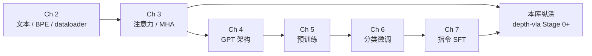

# Build a Large Language Model (From Scratch)（Raschka / LLMs-from-scratch）

**《Build a Large Language Model (From Scratch)》** 是 Sebastian Raschka 的 Manning 2024 教材，官方代码在 [rasbt/LLMs-from-scratch](https://github.com/rasbt/LLMs-from-scratch)（社区 ~99k stars），配套免费 [YouTube 七章播放列表](https://www.youtube.com/playlist?list=PLTKMiZHVd_2IIEsoJrWACkIxLRdfMlw11) 与可选 Manning 长视频课。对本知识库而言，它是 **LLM 序列建模与微调阶段的结构化入门底座**，适合接 [`roadmap/depth-vla.md`](../../roadmap/depth-vla.md) Stage 0 的 Transformer/LLM 前置，再进入 VLA 论文与工程栈。

## 英文缩写速查

| 缩写 | 英文全称 | 简要说明 |
|------|----------|----------|
| LLM | Large Language Model | 大语言模型；本书以小 GPT 复现其训练与微调全链路 |
| GPT | Generative Pre-trained Transformer | 自回归解码器语言模型；Ch 4–5 从零实现 |
| MHA | Multi-Head Attention | 多头注意力；Ch 3 纯 PyTorch 实现 |
| SFT | Supervised Fine-Tuning | 监督微调；Ch 6–7 覆盖分类头与指令微调 |
| LoRA | Low-Rank Adaptation | 低秩适配；附录 E 参数高效微调 |
| BPE | Byte Pair Encoding | 字节对编码分词；Ch 2 与 bonus 深入 |
| VLA | Vision-Language-Action | 视觉–语言–动作模型；本书提供其语言侧骨干直觉 |

## 为什么重要

1. **不依赖高层 LLM 框架**：主线不用 HuggingFace Transformers 等黑盒，读者亲手实现 tokenizer、dataloader、GPT block、训练环 —— 与 [Transformer](../concepts/transformer.md) 概念页和 [动作分词](../formalizations/vla-tokenization.md) 的「离散 token 接口」同构。
2. **全链路而非单点 demo**：预训练（Ch 5）→ 任务微调（Ch 6）→ 指令对齐（Ch 7） mirrors 工业基础模型管线，也对应 VLA 侧 **预训练 VLM + 机器人数据微调** 的常见阶段划分。
3. **三种学习形态互补**：书（系统阅读）+ Jupyter notebook（改代码）+ YouTube（跟讲节奏）；与 [Andrej Karpathy](./andrej-karpathy.md) *Zero to Hero*（micrograd / makemore / nanoGPT）形成 **结构化教材 vs 视频短课** 双轨，可按习惯二选一或交叉。

## 学习路径总览

## 章节地图（与本知识库的对应）

| 教材部分 | 核心技能 | 本库相关页面 |
|---------|---------|-------------|
| Ch 2 文本数据 | BPE、embedding、batch 序列 | [动作分词](../formalizations/vla-tokenization.md)、[深度学习基础](../concepts/deep-learning-foundations.md) |
| Ch 3 注意力 | 缩放点积、MHA、因果 mask | [Transformer](../concepts/transformer.md) |
| Ch 4 GPT | Transformer block、生成解码 | [Transformer](../concepts/transformer.md)、[人形策略网络架构](../concepts/humanoid-policy-network-architecture.md) |
| Ch 5 预训练 | 语言建模损失、训练环、采样 | [Deep Learning Foundations](../concepts/deep-learning-foundations.md) |
| Ch 6 分类微调 | 任务头、迁移学习 | [Behavior Cloning](../methods/behavior-cloning.md)（监督微调类比） |
| Ch 7 指令微调 | 指令数据、对话格式、评估 | [VLA](../methods/vla.md)（语言条件策略） |
| 附录 E LoRA | 参数高效微调 | VLA/策略 **小数据适配** 常见手段 |
| Bonus DPO | 偏好对齐 | 与 RLHF/DPO 对齐文献衔接 |

## 三种学习形态

| 形态 | 入口 | 适用场景 |
|------|------|----------|
| 书 + notebook | [GitHub 仓库](https://github.com/rasbt/LLMs-from-scratch) | 系统学习、离线改代码、跑 exercise |
| YouTube 七章 | [播放列表](https://www.youtube.com/playlist?list=PLTKMiZHVd_2IIEsoJrWACkIxLRdfMlw11) | 需要讲解节奏；约 12.5 h |
| Manning 长视频 | [Manning LiveVideo](https://www.manning.com/livevideo/master-and-build-large-language-models) | 需要附录与 bonus 完整讲解（付费） |

**环境提示：** 仓库 `setup/` 提供 Python/uv/Docker 指南；主章节可在普通笔记本 GPU 上完成。PyTorch 新手可先读附录 A 或作者 [*PyTorch in One Hour*](https://sebastianraschka.com/teaching/pytorch-1h/)。

## 与 Karpathy Zero to Hero 的对照

| 维度 | LLMs-from-scratch（本书） | Zero to Hero（Karpathy） |
|------|---------------------------|--------------------------|
| 载体 | 书 + 长 notebook + 可选视频 | YouTube 短课 + 小仓库 |
| 深度 | 七章 + 大量 bonus（Llama/Qwen/DPO…） | micrograd → makemore → nanoGPT 渐进 |
| 依赖 | 纯 PyTorch 主线 | 同样偏手写、极简依赖 |
| 机器人读者 | 更适合作 **VLA 前置系统课** | 更适合作 **快速建立 NN/LLM 直觉** |

二者可并行：Zero to Hero 建立「张量→反向传播→小 GPT」速度感，本书补齐 **分词、预训练环、微调与对齐** 的工程完整度。

**视频三角（VLA Stage 0 可选）**：若更偏好 **先听再写**，可在本书之前或并行观看 [Karpathy Intro + Deep Dive LLMs](../../sources/courses/karpathy_intro_llms_youtube.md)（[`andrej-karpathy`](./andrej-karpathy.md)）— 前者 ~1 h 全景与安全，后者 ~3.5 h 训练栈；本书/配套 YouTube 则负责 **动手实现**。

## 局限（相对机器人研究）

- **不涉及** 视觉编码、机器人动作空间或 sim 环境 —— 读完应接 [depth-vla](../../roadmap/depth-vla.md) 与 [LeRobot](./lerobot.md) 等具身栈。
- **不覆盖** 扩散策略、ACT、WBC 等本库运动控制主线。
- Bonus 中的 Llama/Qwen from-scratch 用于 **架构直觉**，不等价于能在真机上部署 VLA。

## 推荐使用方式

1. **VLA 路线 Stage 0 前置**：读完 Ch 3–4 再打开 [Transformer](../concepts/transformer.md) 与 [VLM/VLA 分类学](../comparisons/vlm-vln-vla-vlx-world-model-taxonomy.md)。
2. **动作分词补课**：Ch 2 文本 token 与 [动作分词](../formalizations/vla-tokenization.md) 对照阅读，理解「连续量 → 离散符号序列」接口。
3. **与蘑菇书对称**：RL 用 [动手学强化学习](./hands-on-rl-book.md)，LLM 骨干用本书 —— 再进入人形/操作学习纵深。

## 关联页面

- [Transformer](../concepts/transformer.md)
- [深度学习基础](../concepts/deep-learning-foundations.md)
- [动作分词（Action Tokenization）](../formalizations/vla-tokenization.md)
- [VLA（方法）](../methods/vla.md)
- [Andrej Karpathy](./andrej-karpathy.md)
- [PyTorch](./pytorch.md)
- [VLA 纵深路线](../../roadmap/depth-vla.md)

## 参考来源

- [rasbt/LLMs-from-scratch 仓库归档](../../sources/repos/rasbt_llms_from_scratch.md)
- [YouTube 配套课归档](../../sources/courses/rasbt_llms_from_scratch_youtube.md)

## 推荐继续阅读

- [rasbt/LLMs-from-scratch（GitHub）](https://github.com/rasbt/LLMs-from-scratch)
- [Build a Large Language Model (From Scratch) — Manning](http://mng.bz/orYv)
- [reasoning-from-scratch 续作仓库](https://github.com/rasbt/reasoning-from-scratch) — 推理时 scaling、GRPO 等
- [Karpathy Intro to LLMs（YouTube）](https://www.youtube.com/watch?v=zjkBMFhNj_g)
- [Karpathy Deep Dive into LLMs（YouTube）](https://www.youtube.com/watch?v=7xTGNNLPyMI)
