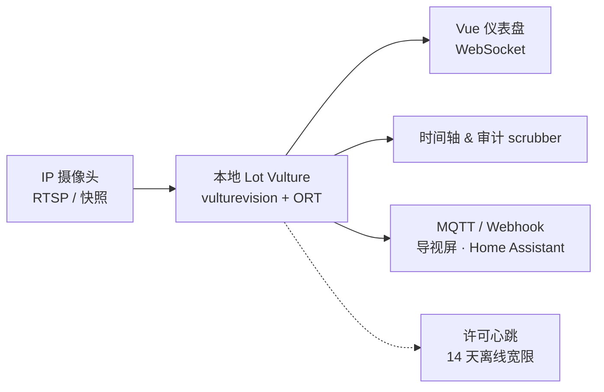

# Lot Vulture

**Lot Vulture**（[lotvulture/lotvulture](https://github.com/lotvulture/lotvulture)，[lotvulture.com](https://www.lotvulture.com/)）是面向 **停车场运营** 的 **边缘计算机视觉** 产品：不依赖地磁或专用 overhead 硬件，在 **本地网络** 内对摄像头画面做 **逐车位占用** 推断，并输出实时地图、审计级历史时间轴与自动化告警。与机器人 SLAM 里的 occupancy grid **不同**，此处 occupancy 指 **离散停车位是否被车辆占据**。

## 一句话定义

**把标准监控 RTSP/快照流映射为多边形车位 ROI，在物业本地用 ONNX 模型做 hysteresis 稳定的状态机，经 WebSocket 推送到 Vue 运营台，并可经 MQTT 驱动导视屏或 IoT 自动化。**

## 英文缩写速查

| 缩写 | 英文全称 | 简要说明 |
|------|----------|----------|
| RTSP | Real Time Streaming Protocol | IP 摄像头常用实时视频拉流协议 |
| ONNX | Open Neural Network Exchange | `vulturevision` 使用的模型容器格式 |
| ORT | ONNX Runtime | Lot Vulture C++ 推理后端（Community CPU / Commercial GPU EP） |
| MQTT | Message Queuing Telemetry Transport | 内置告警通道，可接 Home Assistant 等 |
| ROI | Region of Interest | 每个车位在图像上的多边形区域 |
| GPU | Graphics Processing Unit | Commercial 版 CUDA / DirectML 加速 |
| API | Application Programming Interface | 可选 Developer Cloud 按图检测 REST |

## 为什么重要

- **设施智能化样板：** 典型 **「已有传感器（摄像头）+ 边缘 AI + 本地优先隐私」** 闭环，与机器人栈里 **机载 ORT 策略** 同属 **部署侧 CV/ML**，但场景是 **静态俯视/斜视停车场面**。
- **零路面改造：** 对 **已装 CCTV 的园区、商场、校园** 可软件配置车位多边形，对比地磁方案降低 Capex（项目页给出 200 位规模硬件对比叙事）。
- **运维可审计：** **Visual scrubbing timeline** 用视觉证据处理超时停车纠纷，比纯二进制地感日志更可复核。
- **IoT 友好：** **MQTT / Webhook** 与 [MQTT 协议](../concepts/mqtt-protocol.md)、[Mosquitto](./mosquitto.md) 生态对齐，便于和导视 LED、楼宇自动化联动。

## 核心结构

| 模块 | 作用 |
|------|------|
| **Cameras** | 登记 RTSP 或 snapshot URL；支持斜视角、远距离单相机覆盖多车位 |
| **Space Editor** | Vue-Konva 多边形绘制车位边界 |
| **vulturevision** | C++ **ONNX Runtime** 引擎；Community 绑 Standard 模型；Commercial 高精度权重 + GPU |
| **Hysteresis** | 双阈值（如占用 >90%、空闲 <15%）抑制雨雪/车灯闪烁导致的抖动 |
| **Dashboard & Timeline** | 实时占用着色（绿/红）；按秒 scrub 历史帧 |
| **Alerting** | Webhook、MQTT、邮件；容量阈值、单格状态变化、相机健康 |
| **RBAC** | 多角色（操作员 / 经理 / 只读分析） |
| **Improve AI** | UI 内人工纠错，反馈训练管线（Commercial 云再训练） |

## 流程总览

## 工程实践

| 检查项 | 建议 |
|--------|------|
| **开源边界** | 主仓 **Lot Vulture Source License 1.0**（PolyForm Shield 衍生）：可自改、可商用监控服务，但 **不得** 分发竞争产品/绕过许可的魔改引擎；高精度权重 **单独 Commercial** |
| **部署** | 小场 **Docker** `ghcr.io/lotvulture/lotvulture:latest`；Windows 用 Releases **Setup.exe**；大场 Commercial + `--gpus all` |
| **相机** | 任意 RTSP/ONVIF/快照厂商（Hikvision、Dahua、Axis 等）；需 **清晰俯视或斜视** 覆盖 |
| **网络** | 推理与存储 **离线本地**；仅许可校验需间歇外网 |
| **与 ORT 选型** | Community 走 CPU EP；若已有 NVIDIA 边缘盒，Commercial GPU 路径与 [ONNX Runtime vs MNN vs TensorRT](../comparisons/onnxruntime-vs-mnn-vs-tensorrt.md) 中 **ORT + CUDA** 同一类集成问题 |
| **Cloud API** | 无本地 infra 时可接 [Developer API](https://www.lotvulture.com/developer.html)（按图 ROI 检测），与自托管栈 **并行产品** |

## 局限与风险

- **场景专用：** 为人形/移动机器人 **导航 occupancy** 或 **语义 SLAM** 提供的是 **设施运营** 经验，**不能** 直接替代 [Navigation2](./navigation2.md) 或 3D occupancy 预测模型。
- **许可非 Apache/MIT：** 集成方需法律审阅 **PolyForm Shield 衍生** 与非竞争条款；**不能** 假设可 fork 权重随意再分发。
- **精度分层：** Community **Standard** 与 Commercial **High-Accuracy** 差异大；生产 SLA 应走 Commercial 或自测标定。
- **隐私合规：** 虽宣称不读车牌/人脸，仍属 **视频监控处理**；需按当地法规做告知与留存策略。

## 关联页面

- [ONNX Runtime](./onnxruntime.md) — 同款 ORT 栈在机器人 onboard 策略与本文 **vulturevision** 推理中的共性。
- [ONNX](./onnx.md) — 模型交换格式。
- [Mosquitto](./mosquitto.md)、[MQTT 协议](../concepts/mqtt-protocol.md) — 告警与 IoT 集成。
- [PlotJuggler](./plotjuggler.md) — 同为 **MQTT 实时流** 消费方，调试时可对照 topic  payload。
- [导航·SLAM·自动驾驶栈总览](../overview/navigation-slam-autonomy-stack.md) — 移动机器人导航与 **固定设施 CV** 的分工边界。

## 参考来源

- [sources/repos/lotvulture.md](../../sources/repos/lotvulture.md)
- [sources/sites/lotvulture-com.md](../../sources/sites/lotvulture-com.md)
- [lotvulture/lotvulture（GitHub）](https://github.com/lotvulture/lotvulture)

## 推荐继续阅读

- [Lot Vulture 官网](https://www.lotvulture.com/)
- [Developer Cloud API](https://www.lotvulture.com/developer.html)
- [GitHub Releases（Windows 安装包）](https://github.com/lotvulture/lotvulture/releases)
- [DEVELOPMENT.md（架构与本地构建）](https://github.com/lotvulture/lotvulture/blob/main/docs/DEVELOPMENT.md)
