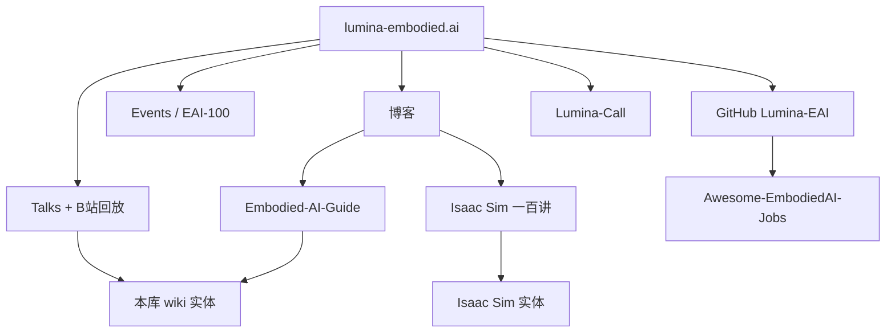

# Lumina 具身智能社区

**Lumina**（官网 <https://lumina-embodied.ai/>，GitHub Org <https://github.com/Lumina-EAI>）是由十余位具身智能方向研究者维护的**中文社区门户**：聚合 Talks 回放、研讨会与社交活动、入门百科与 Isaac Sim 教程博客、以及面向岗位对接的 Lumina Call。本页只把它当作**具身社区导航锚点**；方法机制、开源核查与复现仍以本库对应实体为准。

## 一句话定义

**专耕具身智能的中文社区官网：用 Talks / 教程发现线索，用 Embodied-AI-Guide 建地图，再用本库实体做深读与选型——不要把社区页当成算法仓库首页。**

## 英文缩写速查

| 缩写 | 英文全称 | 简要说明 |
|------|----------|----------|
| EAI | Embodied Artificial Intelligence | 具身智能；社区与 EAI-100 榜单语境 |
| VLA | Vision-Language-Action | Talks 高频主题；策略层多模态范式 |
| USD | Universal Scene Description | Isaac Sim 一百讲中的场景描述核心 |
| Org | Organization | GitHub `Lumina-EAI` 官方组织账号 |
| MMLab | Multimedia Laboratory | 港大 MMLab；多名创始/协创成员所在实验室 |

## 为什么重要

1. **具身向的中文稳定入口**：相对 [WaytoAGI](./waytoagi.md)（大众 AI +「AI硬件」雷达），Lumina **主线就是 Embodied AI**——Talks、教程、招聘与活动都围绕机器人学习。
2. **与本库已有节点强耦合**：社区百科 [Embodied-AI-Guide](../../sources/repos/embodied-ai-guide.md) 已映射到 [RoboTwin](./robotwin.md) / [SAPIEN](./sapien.md) / [ALOHA](./aloha.md) / [VLA](../methods/vla.md)；官网是持续更新的前端。
3. **Talks 可当「待 ingest 雷达」**：标题覆盖 GuidedVLA、WholeBodyVLA、RoboTwin 2.0、RLinf、PointWorld 等，适合扫一遍再决定是否升格，而不是把回放当教材。

## 核心结构

| 层级 | 入口 | 对本库的用法 |
|------|------|----------------|
| **门户** | 首页 / 关于我们 | 定位、团队、合作伙伴、社群二维码 |
| **雷达** | [Talks](https://lumina-embodied.ai/talks) | 扫标题 → 映射已有实体或列入待 ingest |
| **地图** | [Embodied AI Guide](https://lumina-embodied.ai/blog/eai-guide) | 能力栈鸟瞰；深读回本库 methods/entities |
| **上手** | [Isaac Sim 一百讲](https://lumina-embodied.ai/blog) | Prim / USD / 变换 / 刚体碰撞入门；底座见 [Isaac Sim](./isaac-sim.md) |
| **岗位** | [Lumina-Call](https://lumina-embodied.ai/lumina-call) + Org 招贤榜 | 实习/博后/内推线索；非技术选型依据 |
| **策展** | [EAI-100](https://lumina-embodied.ai/news/eai100) | 年度人物/开源/数据集等分类叙事；勿当 SOTA 排名 |

### Talks → 本库映射（抓取日标题级，示例）

| Lumina Talk 标题线索 | 本库节点（若已有） |
|----------------------|-------------------|
| RoboTwin 2.0 | [RoboTwin](./robotwin.md) |
| WholeBodyVLA / GuidedVLA / UniVLA / InstructVLA 等 | [VLA](../methods/vla.md) · [VLA 开源复现地图](../overview/vla-open-source-repro-landscape-2025.md) |
| Isaac Sim 教程系列 | [Isaac Sim](./isaac-sim.md) |
| 双臂 / 操作数据生成叙事 | [ALOHA](./aloha.md) · [SAPIEN](./sapien.md) |

未建实体的 Talk（如某场专场 Lab）只作雷达，不在本页展开深读。

## 工程实践

| 场景 | 建议 |
|------|------|
| **发现中文具身新题** | 打开 Talks / Events，记录标题与回放链接，再决定是否 ingest |
| **新人建能力栈地图** | 先读官网 Embodied AI Guide 或 [embodied-ai-guide](../../sources/repos/embodied-ai-guide.md)，再跳本库 VLA / RoboTwin / 仿真实体 |
| **学 Isaac Sim Python API** | 跟一百讲（conda/`pip install isaacsim` 路线），正式选型与产品边界以 [Isaac Sim](./isaac-sim.md) 为准 |
| **找实习/博后线索** | Lumina-Call + [Awesome-EmbodiedAI-Jobs](https://github.com/Lumina-EAI/Awesome-EmbodiedAI-Jobs)；投递前核实原始招聘方 |
| **对比其他中文社区** | 文档策展看 [WaytoAGI](./waytoagi.md)；真机数据集看 [OpenLET](./openlet.md) |

## 局限与风险

- **误区：把 Lumina 官网当成开源代码首页。** Org 当前公开仓主要是招贤榜；训推复现仍跟各论文项目页与 `sources/repos/`。
- **误区：Talks 回放 = 可复现实验报告。** 讲座是传播层；开源状态、权重与评测以本库实体步骤 2.5 核查为准。
- **误区：EAI-100 / 岗位数字可直接当客观排名。** 榜单与「100+ 研究者对接」为社区自述与评议产物，未在本库独立核验。
- **局限：** 社群主互动仍在微信/飞书；官网是导航层，不是完整讨论存档。

## 关联页面

- [WaytoAGI](./waytoagi.md) — 另一中文社区：飞书知识库 +「AI硬件」雷达（偏大众 AI）
- [OpenLET](./openlet.md) — 真机数据集社区枢纽（与文档/Talks 策展互补）
- [RoboTwin](./robotwin.md) / [SAPIEN](./sapien.md) / [ALOHA](./aloha.md) — Guide 推荐的数据与仿真实践链
- [Isaac Sim](./isaac-sim.md) — 一百讲对应的仿真底座
- [VLA](../methods/vla.md) / [VLA 开源复现地图（2025）](../overview/vla-open-source-repro-landscape-2025.md)

## 参考来源

- [lumina-embodied-ai.md](../../sources/sites/lumina-embodied-ai.md) — 官网门户归档与开源/访问状态
- [lumina-eai.md](../../sources/repos/lumina-eai.md) — GitHub Org 与招贤榜
- [embodied-ai-guide.md](../../sources/repos/embodied-ai-guide.md) — 社区百科全书仓

## 推荐继续阅读

- 官网：<https://lumina-embodied.ai/>
- Talks：<https://lumina-embodied.ai/talks>
- Embodied AI Guide（博客镜像）：<https://lumina-embodied.ai/blog/eai-guide>
- GitHub Org：<https://github.com/Lumina-EAI>
- Embodied-AI-Guide 仓库：<https://github.com/tianxingchen/Embodied-AI-Guide>
