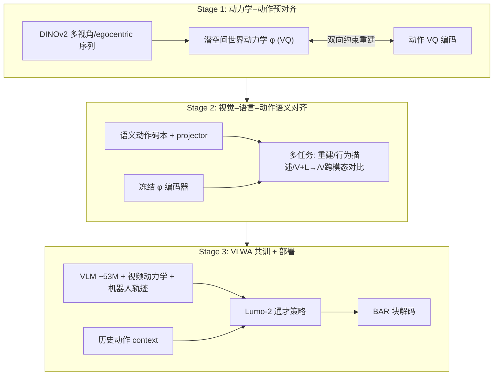

# Lumo-2（Latent World-Action Model）

**Lumo-2**（*Towards Predictive, Aligned, and Scalable Robot Learning*，[arXiv:2607.11270](https://arxiv.org/abs/2607.11270)，[项目页](https://www.astribot.com/research/Lumo2)）是 Astribot 发布的 **下一代通才机器人基础模型**：在 **Qwen3.5-4B** 上构建 **latent world-action model**，用 **物理接地的潜空间世界动力学** \(\phi\) 替代 Lumo-1 的 **显式文本结构化推理**，并通过 **三阶段渐进模态预对齐** 把动作 token 从「高保真重建」提升到「语义结构化、可预测、可扩展」的表征几何。

## 一句话定义

**先在世界动力学隐空间里推理未来，再生成动作 chunk 的 4B 级 latent WAM**——用对齐后的 \(\phi\) 作轻量「内部世界模型」，在真机长程、灵巧与物理推理任务上系统性超过 **π₀.₅** 与 **Fast-WAM**。

## 英文缩写速查

| 缩写 | 英文全称 | 简要说明 |
|------|----------|----------|
| WAM | World Action Model | 联合世界演化预测与动作生成的具身策略 |
| VLA | Vision-Language-Action | 常见「当前观测→动作」反应式基线对照 |
| VLM | Vision-Language Model | 视觉–语言理解骨干（本文 Qwen3.5-4B） |
| VLWA | Vision-Language-World-Action | 显式启用潜动力学 \(\phi\) 的训练/微调范式 |
| BAR | Block-wise Autoregression | 按语义动作块并行解码离散 token，加速推理 |
| VQ | Vector Quantization | Stage 1/2 动作与世界动力学离散化码本 |
| OOD | Out-of-Distribution | 分布外泛化（未见指令/物体等设定） |

## 为什么重要

- **从显式 CoT 到 latent 推理：** Lumo-1 证明结构化文本规划有效，但 **延迟、灵活性、scaling** 受限；Lumo-2 把「推理」搬进 **紧凑、动作相关的 \(\phi\)**，避免像素级视频 rollout 开销，仍保留 **预测式控制** 收益。
- **动作模态对齐是瓶颈：** 论文核心假设——**控制质量由潜空间几何决定**；纯重建目标会让 action token **重建好但不好控**；三阶段课程把动作逐级锚到 **动力学 → 视觉语言语义 → 因果 VLWA**。
- **可部署的效率：** **BAR** 在 RTX 5090 + vLLM 上端到端 **93.53 ms**（标准 AR **253.66 ms**，**2.71×**），配合历史动作 **短程记忆** 缓解多阶段 **感知别名**（如透明液体倾倒前后视觉相似）。
- **异构数据与人–机迁移：** 原生共训 **VLM 语料、野外视频、多本体机器人 + egocentric 人视频**；VisionPro 与无动作标注多视角人视频可在 **无专用迁移算法** 下提升机器人 **unseen object** pick-place。

## 核心结构/机制

| 模块 | 作用 |
|------|------|
| **潜空间世界动力学 \(\phi\)** | 由相邻帧 DINOv2 特征经因果时空 Transformer + VQ 学得；编码 **动作可诱导的未来物理变化**，抑制光照/背景等冗余 |
| **动作 tokenizer** | 躯干/双臂分组 → 平移/旋转/夹爪子空间 → 时序压缩至与视觉对齐；Stage2 升维为 **语义动作码本** |
| **统一 Transformer** | 联合 \(p(\phi \mid o,\ell,\omega)\) 与 \(p(a \mid \phi)\)；VQA 与机器人 VLWA 共训 |
| **Context buffer \(\omega\)** | 历史动作经统一编码器注入，近似部分可观测下的阶段判别 |
| **BAR 解码** | 利用动作维度弱耦合，块内并行预测多个 token |

### 三阶段训练（流程总览）

## 工程实践

| 项目 | 要点 |
|------|------|
| **平台** | 评测与数据采集主力：**Astribot S1** 全身双臂移动操作；训练数据另含 AGIBot Genie-1、Galaxea R1 Pro、RealSource、ARX/AgileX/YAM 等 |
| **Stage 1** | 30k steps，64×H100，per-GPU batch 24；AdamW 1e-4，VQ 码本 LR×50 |
| **Stage 3** | 120k steps，160×H100；序列 packing 8192；历史动作 dropout 0.5 |
| **微调范式** | 静态几何任务：**VLA**（仅动作监督）；时序/物理预测任务：**VLWA**（主动 \(\phi\) 投影）；长程任务叠加 **动作记忆** 或 **末端轨迹投影到主视角** |
| **推理** | vLLM + FlashAttention-2；bfloat16；BAR 为主力部署解码 |
| **上游消费** | [Philia](./philia.md) 将 Lumo 系策略作为 **gateway capability** 即插即用 |

## 真机评测：22 项任务套件

每任务 **10 布局 ×2 次** 盲评，**归一化子任务得分**（多步子任务按 meta-subtask 计分）。下表摘自技术报告 Tab. 5；**项目页视频** 按能力维度聚合（见下节对照）。

| ID | 任务 | 主挑战 |
|----|------|--------|
| 1 | Cap the Matching Pens | 灵巧 |
| 2 | Unpack the Package | 灵巧 |
| 3 | Pack the School Bag with Clothes* | 灵巧 |
| 4 | Pack the School Bag with Toys | 灵巧 |
| 5 | Lift the Garbage Bag | 灵巧 |
| 6 | Pack the Suitcase* | 灵巧 |
| 7 | Iron and Hang Clothes* | 灵巧 |
| 8 | Make Coffee* | 长程 |
| 9 | Make a Cocktail | 长程 |
| 10 | Organize Items in the Suitcase | 物理理解 |
| 11 | Scoop Millet to a Target Weight | 物理理解 |
| 12 | Flip an Egg | 物理理解 |
| 13 | Drive Nails with a Hammer | 物理理解 |
| 14 | Collect Eggs from the Conveyor Belt | 动态场景 |
| 15 | Catch the Ball | 动态场景 |
| 16 | Hang Cups on a Rotating Rack | 运动推理 |
| 17 | Catch Fishes | 运动推理 |
| 18 | Place Cubes on the Rotating Rack | 运动推理 |
| 19 | Stack Cubes on the Rotating Rack | 运动推理 |
| 20 | Erase the Whiteboard | 记忆 |
| 21 | Pour Water | 记忆 |
| 22 | Prepare the Egg | 记忆 |

\* 子任务级评测。报告结论：Lumo-2 在 **六大子类**（动态场景 / 运动推理 / 记忆 / 物理理解 / 长程 / 灵巧）**全面领先** π₀.₅ 与 Fast-WAM；VLWA 微调在传送带捡蛋、旋转架放方块等 **时序推理** 任务上相对纯 VLA 微调增益明显。

### 项目页演示视频（全量 32+1）

**CDN 根路径：** `https://astribot-website-shenzhen.oss-cn-shenzhen.aliyuncs.com/media/lumo2/`

| 项目页分类 | 片段数 | 与论文维度对照 |
|------------|--------|----------------|
| [hero.mp4](https://astribot-website-shenzhen.oss-cn-shenzhen.aliyuncs.com/media/lumo2/hero.mp4) | 1 | 总览 |
| [collaboration/](https://astribot-website-shenzhen.oss-cn-shenzhen.aliyuncs.com/media/lumo2/collaboration/01.mp4) | 2 | 协作/人机协同展示 |
| [physical-understanding/](https://astribot-website-shenzhen.oss-cn-shenzhen.aliyuncs.com/media/lumo2/physical-understanding/01.mp4) | 4 | 任务 10–13 类 |
| [temporal-reasoning/](https://astribot-website-shenzhen.oss-cn-shenzhen.aliyuncs.com/media/lumo2/temporal-reasoning/01.mp4) | 9 | 任务 14–22 类 |
| [long-horizon-task/](https://astribot-website-shenzhen.oss-cn-shenzhen.aliyuncs.com/media/lumo2/long-horizon-task/01.mp4) | 3 | 任务 8–9 类 |
| [dexterous-manipulation/](https://astribot-website-shenzhen.oss-cn-shenzhen.aliyuncs.com/media/lumo2/dexterous-manipulation/01.mp4) | 14 | 任务 1–7 类 |

完整 URL 清单见 [sources 归档](../../sources/sites/astribot-lumo2-project-page.md)。

## 局限与风险

- **权重与代码：** 截至 2026-07 技术报告 **未声明公开权重/训练代码**；复现依赖后续发布与 Astribot 生态接入。
- **评测绑定平台：** 22 项任务与 BAR 延迟均在 **Astribot S1 + 特定相机/预处理** 上报告；跨平台迁移需重新验证动作空间与视觉分布。
- **重建–控制张力未消失：** Stage2 夹爪通道重建误差略升；极端精密夹持仍可能受 tokenizer 几何限制。
- **与像素 WAM 的权衡：** \(\phi\) 轻量但 **不可直接可视化** 未来帧；调试需依赖 probe 任务与 PCA 可视化（论文 Fig. 9–10）。

## 关联页面

- [Philia](./philia.md) — 将 Lumo 系策略作为 capability 的长期助手运行时
- [World Action Models](../concepts/world-action-models.md) — Joint 族 latent WAM 坐标
- [VLA](../methods/vla.md) — π₀.₅ / Fast-WAM 同赛道索引
- [Manipulation](../tasks/manipulation.md) — 灵巧与长程真机任务语境
- [LingBot-VLA 2.0](./lingbot-vla-v2.md) — 另一条 Qwen3-VL 4B 务实 VLA 开源链对照

## 参考来源

- [Lumo-2 技术报告摘录](../../sources/papers/lumo2_arxiv_2607_11270.md)
- [Astribot Lumo-2 项目页归档](../../sources/sites/astribot-lumo2-project-page.md)

## 推荐继续阅读

- [arXiv:2607.11270](https://arxiv.org/abs/2607.11270) — 完整方法、Tab. 5 子任务分解与 scaling 实验
- [Astribot Lumo-2 项目页](https://www.astribot.com/research/Lumo2) — 交互式能力 Tab 与演示视频
- [Philia 技术报告](https://arxiv.org/abs/2607.11377) — Lumo 策略在 agent 栈中的部署语境
