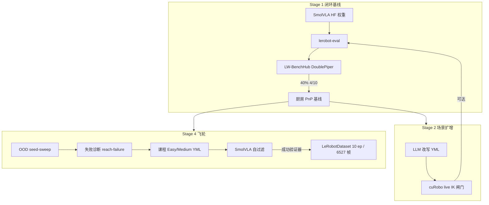
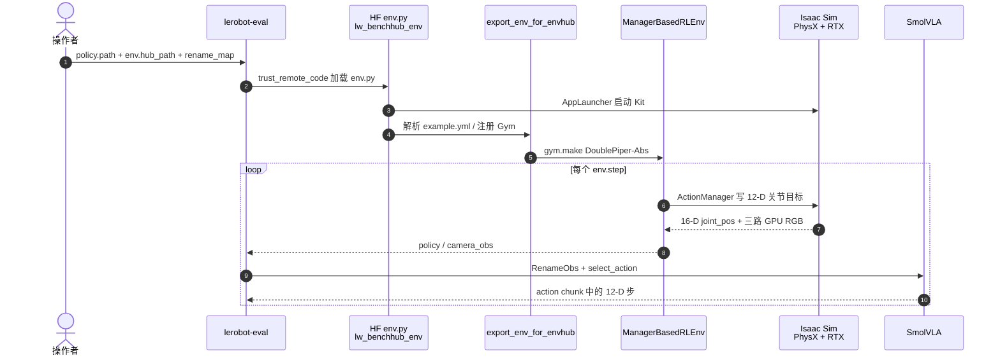

# LW BENCHHUB TOUR

**LW BENCHHUB TOUR**（[GimpelZhang/lw_benchhub_tour](https://github.com/GimpelZhang/lw_benchhub_tour)）是一条 **可复现的工程探索**：在光轮 [LW-BenchHub](https://github.com/LightwheelAI/LW-BenchHub) 厨房任务上，用 NVIDIA **Isaac Lab-Arena EnvHub** 把 Hugging Face [LeRobot](./lerobot.md) 的 **SmolVLA** 接到 **DoublePiper-Abs** 双臂，跑通 headless 闭环评测、LLM 场景扩增与自过滤示范飞轮。

## 一句话定义

把「Isaac Sim → Isaac Lab → Arena EnvHub → LW-BenchHub 任务 → `lerobot-eval`」五层栈焊成双臂厨房 PnP 闭环，并证明：**可达性闸门能滤场景，但 scripted 规划器不等于任务成功；能微调的数据来自策略自过滤，而不是 cuRobo 技能序列自称跑完。**

## 英文缩写速查

| 缩写 | 英文全称 | 简要说明 |
|------|----------|----------|
| VLA | Vision-Language-Action | 本仓评测的 SmolVLA 策略族 |
| EnvHub | Environment Hub | Arena 用 HF `env.py` 把 Lab 环境接到 LeRobot，策略仓不直接 `import` 任务仓 |
| PnP | Pick and Place | 任务 `L90K1PutTheBlackBowlOnThePlate`：黑碗放到盘子 |
| IK | Inverse Kinematics | Stage 2/4 用 cuRobo 做工作空间可达性闸门 |
| OOD | Out-of-Distribution | 飞轮刻意把碗放到抓取临界边缘的困难场景 |
| DoF | Degrees of Freedom | DoublePiper 动作 12 维：左右臂各 5 关节 + 两夹爪，跳过 `joint4` |

## 核心信息

| 字段 | 内容 |
|------|------|
| 机构 | 探索仓为个人；物理底座为 **光轮科技（Lightwheel）**；仿真/Arena 为 **英伟达（NVIDIA）**；策略与评测 CLI 为 **拥抱脸（Hugging Face）** |
| 许可 | Tour 与官方 LW-BenchHub 均为 Apache-2.0 |
| 开源 | **已开源、可运行**（脚本 + GitHub Wiki）；依赖 Isaac Sim 5.1 与大显存 GPU |
| 策略 | `LightwheelAI/smolvla-double-piper-pnp`（~0.5B） |
| 基线 | Stage 1：10 episode **40%**（4/10），A800-40GB headless |

## 为什么重要

- **补上「EnvHub 怎么接到真实任务」的缺口：** [LeRobot](./lerobot.md) 文档讲 CLI，[Isaac Lab](./isaac-lab.md) 讲 manager env；本仓把 Arena 的 HF `env.py` 桥、观测改名、12-D 动作拆臂写清楚。
- **可达性闸门是场景生成的物理过滤器：** LLM 改 YML 很容易写出「看起来难、其实手臂够不着」的布局；[cuRobo](./curobo.md) live IK 把不可达场景挡在评测之前。
- **数据飞轮的诚实反例：** scripted cuRobo PnP 6/6 技能跑完仍可能 **推碗失败**；真正能进微调的是 SmolVLA 闭环 + `_check_task_success()` 过滤出的 10 条黄金 episode（6527 帧）。

与 NVIDIA [SO-101 Sim2Real 课](./nvidia-so101-sim2real-lab-workflow.md) 对照：那边是 **真机 + GR00T + 四种 gap 策略**；这边是 **纯仿真双臂 Piper + 轻量 SmolVLA + 场景/数据工厂**。

## 核心原理：五层栈

| 层 | 组件 | 闭环职责 |
|----|------|----------|
| L0 | [Isaac Sim](./isaac-sim.md) 5.1 | PhysX + RTX 离屏三相机 |
| L1 | [Isaac Lab](./isaac-lab.md) 2.3.2 | `ManagerBasedRLEnv`、Action/Observation Manager、PD 关节位置 |
| L2 | IsaacLab-Arena `0.1.1` | `IsaacLabEnvWrapper` → LeRobot `VectorEnv` |
| L3 | LW-BenchHub | DoublePiper-Abs、RoboCasa/LIBERO 厨房、`export_env_for_envhub` |
| L4 | LeRobot 0.5.1 | `lerobot-eval`、SmolVLA、`RenameObservationsProcessorStep` |

**解耦点：** `lerobot` **不**直接 `import lw_benchhub`。`--env.hub_path=LightwheelAI/lw_benchhub_env` 下载的 `env.py` 才去调 `export_env_for_envhub`。这是 NVIDIA 推的 EnvHub 模式。

观测：Isaac Lab 把相机放在 `observations.policy`；LW-BenchHub 改组成 `policy`（关节）+ `camera_obs`（三路 RGB），再经 `--rename_map` 变成 SmolVLA 的 `observation.images.{left_hand,right_hand,first_person}`。动作：模型输出 12-D chunk（`chunk_size=50`），Lab 拆成左右臂 5-DoF 绝对关节角 + 二值夹爪。

### 流程总览



Stage 3 被作者丢弃，图中不画。

## 源码运行时序图

节点对齐 Tour Wiki「LW_Benchhub_Interface」与 `lerobot-eval` 入口。官方有可运行评测路径。



关键复现路径：`cd lw_benchhub` 再跑 `lerobot-eval`（`config_path` 是相对路径）；`numpy==1.26.0` 锁定；`unset CUDA_VISIBLE_DEVICES`。逐步命令见仓库 Wiki [Complete_Stage_1](https://github.com/GimpelZhang/lw_benchhub_tour/wiki/Complete_Stage_1)。

## 工程实践

### Stage 1：先把闭环跑绿

```text
lerobot-eval \
  --policy.path=LightwheelAI/smolvla-double-piper-pnp \
  --env.type=isaaclab_arena \
  --env.hub_path=LightwheelAI/lw_benchhub_env \
  --env.kwargs='{"config_path": "configs/envhub/example.yml"}' \
  --env.state_dim=16 --env.action_dim=12 --env.headless=true
```

`--rename_map` 必须把 `*_camera_rgb` 接到模型的 `left_hand` / `right_hand` / `first_person`。评测渲染 **224×224**，训练帧 **480×640**；SmolVLA 前向会 resize，OOD 主要来自任务分布而不是分辨率。

作者为适配 Isaac Lab 2.3.x 打过补丁：`DEVICE_MAP`/`RETARGETER_MAP` 已删除、`XformPrimView` 严格 xform 顺序、Pinocchio 缺 Casadi 时 lazy-stub。这些补丁在 Tour 仓的 `lw_benchhub` 工作副本里，**不要假设上游官方仓已合入**。

### Stage 2：live reach gate 才算过关

v1–v5 分别栽在「没闸门 / 工作空间采样与场景无关 / AST 硬编码偏移 / warp ABI」。v6 能跑，是因为：

1. `warp-lang==1.8.1` 对齐 Isaac Sim 5.1 自带 `omni.warp.core 1.8.x`（pip 默认 1.14 删了 `warp.types.array`）。
2. 给 cuRobo `__init__` 打补丁，让 `SETUPTOOLS_SCM_PRETEND_VERSION_FOR_NVIDIA_CUROBO` 在 Isaac Sim 预装 `setuptools_scm` 之前生效。

闸门过 = **纯位置 IK 可达**，不等于后续 trajopt / 抓取会成功。

### Stage 4：用任务成功条件，而不是技能计数

| 路径 | 结果 |
|------|------|
| scripted cuRobo 6 技能 PnP | 技能序列跑完，但 reach 接近路径在 PhysX 里把碗推开 ~0.1 m；夹爪碰撞模型空 → **TASK_SUCCESS=False** |
| SmolVLA 闭环 + `_check_task_success()` | 过滤出 **10** 条 100% 成功 episode，**6527** 帧，schema 对齐 `Lightwheel-Tasks-Double-Piper` |

作者结论：自蒸馏扩不了策略成功率为 **0%** 的 OOD 边界；量产仍要外部规划器或遥操作。T1 FrankaCubeLift smoke 因 Isaac Lab 2.3 vs AutoDataGen 依赖冲突 **BLOCKED**，未升级 Lab（会破坏 Stage 1/2 补丁）。

### 两条铁律

1. 任何 `pip install` 之后立刻 `pip install --no-deps numpy==1.26.0`（Isaac Sim 5.1 C 扩展硬绑）。
2. 必须 `unset CUDA_VISIBLE_DEVICES`，否则相机渲染 Segfault。

## 局限与风险

- **不是官方产品仓：** 企业功能清单在 [Lightwheel Platform](https://lightwheel.ai/lightwheel-platform)；Tour 只覆盖 DoublePiper 厨房 PnP 一条线。
- **版本钉死：** Lab 2.3.2 / Sim 5.1 / Arena 0.1.1；官方 LW-BenchHub README 徽章已写 Lab 5.0.0，混装会炸。
- **闸门 ≠ 可执行：** IK 可达、技能 `success=True`、任务 `bowl_in_plate & gripper_obj_far` 是三件不同的事。
- **无真机：** 本页不替代 [VLA 真机部署指南](../queries/vla-deployment-guide.md)；chunk 异步与 TensorRT 不在本仓范围内。
- **LLM 与密钥：** Stage 2/4 依赖外部 API；文档要求模型回读防降级（例如不要静默落到 `deepseek-chat`）。

## 关联页面

- [LeRobot](./lerobot.md) — `lerobot-eval`、RenameObs、LeRobotDataset 导出
- [Isaac Lab](./isaac-lab.md) — `ManagerBasedRLEnv` 与 Isaac Sim 底座
- [Isaac Sim](./isaac-sim.md) — PhysX / RTX / headless 渲染
- [cuRobo](./curobo.md) — GPU IK 与运动生成；本仓用作可达性闸门而非可靠抓取专家
- [VLA](../methods/vla.md) — SmolVLA 所属方法族
- [Bimanual Manipulation](../tasks/bimanual-manipulation.md) — 双臂 PnP 任务面
- [Manipulation](../tasks/manipulation.md)
- [VLA 真机部署指南](../queries/vla-deployment-guide.md) — 真机延迟/chunk；本仓是仿真对照
- [NVIDIA SO-101 Sim2Real workflow](./nvidia-so101-sim2real-lab-workflow.md) — 同为 Lab + LeRobot，但是真机 GR00T 课
- [VLA 开源复现景观](../overview/vla-open-source-repro-landscape-2025.md) — 轻量 VLA 复现地图
- [ROS2SmolVLA](./paper-ros2smolvla.md) — 同底座 SmolVLA，但是 UR10e 真机 + ROS 2 Docker

## 参考来源

- [LW BENCHHUB TOUR 仓库归档](../../sources/repos/lw_benchhub_tour.md)
- [LW-BenchHub 官方仓归档](../../sources/repos/lw-benchhub.md)
- [Lightwheel Platform 项目页归档](../../sources/sites/lightwheel-platform.md)
- [Tour GitHub Wiki：Stage 1](https://github.com/GimpelZhang/lw_benchhub_tour/wiki/Complete_Stage_1)
- [Tour GitHub Wiki：闭环接口](https://github.com/GimpelZhang/lw_benchhub_tour/wiki/LW_Benchhub_Interface)
- [Tour GitHub Wiki：Stage 4 飞轮](https://github.com/GimpelZhang/lw_benchhub_tour/wiki/Complete_Stage_4)

## 推荐继续阅读

- [LW-BenchHub 官方文档](https://docs.lightwheel.net/lw_benchhub)
- [Hugging Face：smolvla-double-piper-pnp](https://huggingface.co/LightwheelAI/smolvla-double-piper-pnp)
- [Isaac Lab-Arena / EnvHub](https://github.com/isaac-sim/IsaacLab-Arena)

## 一句话记忆

> EnvHub 把 VLA 和厨房任务焊在同一进程里；cuRobo 只能当可达性过滤器；能微调的数据必须用环境成功条件从策略轨迹里筛，不能信规划器的技能计数。
