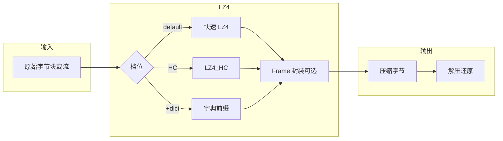

# LZ4

## 一句话定义

**LZ4** 是 Yann Collet 维护的 **无损压缩库**（[lz4/lz4](https://github.com/lz4/lz4)，**BSD 2-Clause**），设计目标是 **单核压缩 >500 MB/s、解压数 GB/s**，在 **压缩比 ↔ 速度** 谱上占据 **极致低延迟** 一端；长流用 **LZ4 Frame**，块级见 **LZ4 Block format**。

## 英文缩写速查

| 缩写 | 英文全称 | 简要说明 |
|------|----------|----------|
| LZ4 | Lempel-Ziv 4 | 本页极快 LZ 变体实现 |
| LZ4_HC | LZ4 High Compression | 高压缩档，解压速度与默认档相同 |
| HC | High Compression | 用 CPU 时间换更高压缩比 |
| Frame | LZ4 Frame format | 流/文件多块封装，互操作须遵守 |
| API | Application Programming Interface | `liblz4` 与 CLI 入口 |
| IPC | Inter-Process Communication | 进程间大数据常外层加 LZ4 降带宽 |

## 为什么重要

- **运控环外** 的日志、rosbag 片段、仿真 checkpoint、**joblib pickle 运动包**（见 [关键帧编辑工具](./robot-motion-keyframe-editors.md)）需要 **毫秒级解压**；LZ4 常比 zlib/zstd 默认档 **更快解压**。
- 与 [Zstandard](./zstandard.md) 同属 Collet 生态：**字典压缩** API/CLI 可与 Zstd 训练的 dictionary  interoperable，小文件场景可组合。
- 选型勿与 [Protobuf](./protocol-buffers.md) 混淆：Protobuf 管 **结构化 schema**；LZ4 管 **字节流压缩**，常叠在外层。

## 核心原理

| 组件 | 作用 |
|------|------|
| **LZ4_compress_* / LZ4_decompress_*** | 块级压缩/解压（速度优先） |
| **LZ4_HC** | 更高压缩比，解压路径不变 |
| **lz4frame** | 任意长流：多 block → frame（`doc/lz4_Frame_format.md`） |
| **acceleration** | 数值越大 → 越快、压缩比越低 |
| **Dictionary** | CLI/API 可加载字典；有效窗口含 **末 64KB** |

### 与 Zstd 基准对照（一手 README，Silesia Corpus）

同机 lzbench 表中，**LZ4 1.10.0** 约 **2.10×** 体积、**675 MB/s** 压、**3850 MB/s** 解；**zstd -1** 约 **2.90×**、510 / 1550 MB/s（详见 [选型对比](../comparisons/lz4-vs-zstandard.md) 与 [sources/repos/lz4.md](../../sources/repos/lz4.md)）。

## 工程实践

### 开源状态（2026-09-24）

- **已开源**：[lz4/lz4](https://github.com/lz4/lz4) BSD 2-Clause；各发行版普遍打包 `liblz4` + `lz4` CLI。
- **格式**：Block/Frame 文档在仓库 `doc/`；**非 IETF RFC**，互操作以官方格式文为准。

### 快速落地

1. **库**：系统包 / vcpkg `lz4`；C API 头文件 `lz4.h`、`lz4frame.h`。
2. **CLI**：`lz4 file` / `lz4 -d file.lz4`；训练字典可配合 Zstd 工具链（README 交叉链接）。
3. **Python**：`pip install lz4` 或 joblib `compress=('lz4', level)` 存运动/数组。
4. **机器人场景**：**热路径旁路**（落盘 rosbag、仿真轨迹、跨进程共享内存块）优先 LZ4；**归档/带宽受限冷数据** 改 [Zstandard](./zstandard.md) 高档或字典。

## 局限与风险

- **压缩比**：默认档约 **~2.1×**（Silesia），弱于 **zstd -1 (~2.9×)** 与 gzip 高档。
- **无内置 checksum 标准块**：Frame 层能力见格式文；端到端完整性需外层 hash 或带校验容器。
- **非结构化**：压缩前后均为 opaque bytes，需自管版本与 schema（常与 pickle/自定义二进制叠用 → **安全与可移植风险**）。
- **标准地位**：工业事实标准但 **无 RFC**；需 formal standard 的场景选 [RFC 8878 zstd](../../sources/sites/rfc-8878-zstandard.md) 或 gzip。

## 关联页面

- [Zstandard（zstd）](./zstandard.md)
- [LZ4 vs Zstandard](../comparisons/lz4-vs-zstandard.md)
- [Protocol Buffers](./protocol-buffers.md)
- [机器人关键帧与运动编辑工具](./robot-motion-keyframe-editors.md)
- [系统工程知识链](../overview/hub-systems-engineering.md)

## 参考来源

- [sources/repos/lz4.md](../../sources/repos/lz4.md)

## 推荐继续阅读

- [LZ4 官方 README（GitHub）](https://github.com/lz4/lz4/blob/dev/README.md)
- [LZ4 Frame format](https://github.com/lz4/lz4/blob/dev/doc/lz4_Frame_format.md)
