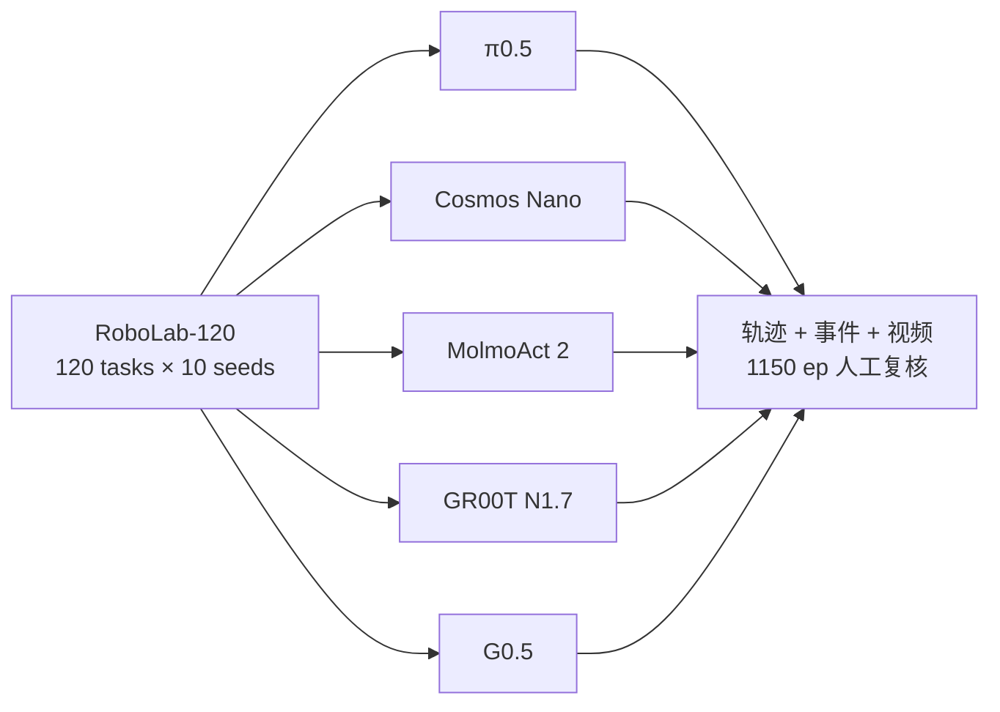

# Manda Robotics — 开源通用策略横评（State of Robot Policies 2026）

**Understanding the Limits of Open-Source General Robotics Policies**（[Manda Robotics](https://mandarobotics.com/)，2026-09-17，[报告页](https://mandarobotics.com/blog/state-of-robot-policies/index.html)）在 [RoboLab-120](./robolab.md) 上对 **π0.5、Cosmos 3 Nano Policy、MolmoAct 2、GR00T N1.7、G0.5** 五个 **DROID checkpoint** 做 **6,000 episode** 零样本 head-to-head，并辅以 **1,150 episode 人工视频复核** 与轨迹事件分析。

## 一句话定义

**在 RoboLab 最佳-case 仿真（DROID、固定基座、matched seeds）下，开源通用策略已有可泛化智能但远未可靠——Cosmos aggregate 最强（35.1% SR），π0.5 延迟最低且 counting 等切片可反超，五策略 success union 重叠低，SR 对 10-seed 估计极不稳定。**

## 英文缩写速查

| 缩写 | 英文全称 | 简要说明 |
|------|----------|----------|
| SR | Success Rate | 任务终态完全成功比例 |
| DROID | Distributed Robot Interaction Dataset | 真机数据集与标准单臂 embodiment |
| WAM | World Action Model | Cosmos 3 Nano Policy 所属范式 |
| VLA | Vision-Language-Action | π0.5 / GR00T / G0.5 等策略族 |
| SPARC | Spectral Arc Length | 末端速度谱弧长；平滑度代理指标 |
| IK | Inverse Kinematics | 逆运动学；文内讨论 foundation model + IK 边界 |

## 核心信息

| 项 | 内容 |
|----|------|
| **机构** | Manda Robotics（第三方评测，非 RoboLab 官方） |
| **日期** | 2026-09-17 |
| **规模** | 5 × 120 × 10 = **6,000** episodes |
| **仿真** | Isaac Sim **6** + Isaac Lab **3**（[ymetz/RoboLab](https://github.com/ymetz/RoboLab) fork） |
| **本体** | RoboLab 内置 **DROID** 单臂平行夹爪 |
| **开源** | 报告公开；**fork 已开源**；策略权重各厂商分发 |

## 为什么重要

- **反 demo 偏差：** 社交视频高估能力；本文用 **同 seed、同任务、五策略并排** 暴露 **64.9% 失败率**（最强策略）与 **30 任务全灭**。
- **行为级失败地图：** 不止 SR——wrong-object、rim collision、test-grip loop、coherence collapse 等 **可指导 targeted training**。
- **评测方法学警示：** π0.5 **同 seed 双跑** SR 相关性弱；SPARC 与视觉抖动矛盾 — **需多 run + 阶段指标 + 视频**。
- **排名 contingent：** RoboDojo vs RoboLab **G0.5 vs π0.5 顺序反转** — 三角测量多 suite。
- **与 [RoboLab](./robolab.md) 官方榜互补：** aggregate 复现 π0.5/Cosmos 接近官方；额外提供 **跨策略行为审计** 与 Isaac Sim 6 移植路径。

## 核心原理

### 实验设计

- **Native adapter：** 各策略保留官方预处理与 action 语义，**非** 统一控制器 wrapper。
- **推理隔离：** policy 推理 wall-clock **暂停仿真步进** — SR 不含实时 deadline 压力；延迟单独报告。

### Aggregate 结果（canonical run）

| 策略 | SR | Score | 延迟/step |
|------|-----|-------|-----------|
| Cosmos 3 Nano Policy | **35.1%** | 50.7 | 829 ms |
| π0.5-DROID | 27.5% | 42.8 | **128 ms** |
| MolmoAct 2 | 13.8% | — | — |
| GR00T N1.7 | 10.2% | — | — |
| G0.5 | 10.5% | — | — |

- **Episode oracle：** 49.4%（仍 <50%）
- **Unique solves：** 除 Cosmos 外，其余四策略合计 **131** episodes 独有成功

### 能力切片（六维）

| 维度 | 读法 |
|------|------|
| Target selection | π0.5 识别准但易 **多抓**；GR00T 抓 **画面中心** |
| Getting a grip | Cosmos + π0.5 **57%** acquire rate |
| Approach angle | MolmoAct **腕角僵化** |
| Transport & release | π0.5 **rim 碰撞**；G0.5 **随机 release** |
| Search | GR00T **从不 survey 桌面** |
| Endurance | GR00T 末段 activity **0.68×** 前段 |

### 策略失败签名（定性 + 定量）

| 策略 | 签名 |
|------|------|
| π0.5 | 抓稳但 **carry 不避障**；失败时 lift height 与成功无差 |
| Cosmos | **高 jitter**；物体靠容器即 **deprioritize 最后 1 cm** |
| MolmoAct 2 | **单 approach angle**；drop 后 clutter 难 recovery |
| GR00T N1.7 | **错物体 + 末段 stare/grip air** |
| G0.5 | **test grip loop**；仅 54% episode 真正闭合夹爪 |

## 评测与指标

- **主指标：** SR + Score（子任务 partial credit）+ wrong-object rate + EE speed/SPARC
- **与官方榜对齐：** π0.5 27.5% vs **28.0%**；Cosmos 35.1% vs **36.8%**（RoboLab leaderboard）
- **稳定性：** π0.5 双跑同 outcome **64%**；**28/120** 任务 SR 波动 ≥20 pp
- **跨 benchmark：** RoboDojo sim 榜 G0.5 **14.88%** > π0.5 **6.91%** — 与 RoboLab 排序 **相反**

## 与其他工作对比

| 对照 | 读法 |
|------|------|
| [RoboLab 官方榜](./robolab.md) | 同一 RoboLab-120 aggregate；Manda 加 **五策略并排行为审计** |
| [GPT 6 Astra 评测](./paper-gpt-6-astra-embodied-policy.md) | 另一独立 **小任务子集** 横评；本文 **全 120 任务** |
| [RoboDojo](./robodojo.md) | 排名 **benchmark-contingent**；需联合读 |
| [具身评测 hub](../overview/hub-embodied-eval-benchmark.md) | ③ 层策略成功率 + **过程/失败模式** 深读范例 |

## 结论

**开源通用操纵策略在 RoboLab 最佳-case 下已展现泛化智能，但 aggregate SR≤35%、oracle<50%、30 任务全灭——不能 drop-in 部署；选型应看任务切片、延迟与失败签名，而非单一 SR。**

- **能力 leader ≠ 全能：** Cosmos aggregate 最强但 counting 等切片 π0.5 反超；success union 重叠仅 ~38%。
- **π0.5 工程默认：** 128 ms/step + 27.5% SR 适合 **latency-sensitive** 原型；rim collision 是首要 transport 训练信号。
- **Cosmos 代价：** 829 ms/step + 可见抖动 — 部署需 **latency budget** 与 **release 阶段** 专项改进。
- **G0.5 / GR00T：** RoboDojo 与 RoboLab **排名反转** — 勿用单榜定优劣。
- **评测必做：** ≥2 independent suites、重复 run、阶段指标（acquire/transport/release/recovery）、视频 audit。
- **Benchmark 治理：** 开发期用过 reference policy 的 suite 可能存在 **兼容偏置** — 读榜时标注 model–benchmark pairing。

## 工程实践

| 项 | 建议 |
|----|------|
| **读报告** | [State of Robot Policies 2026](https://mandarobotics.com/blog/state-of-robot-policies/index.html) |
| **复现栈** | Clone [ymetz/RoboLab](https://github.com/ymetz/RoboLab)；读 `docs/isaac_sim_6.md` |
| **官方对照** | [RoboLab leaderboard](https://research.nvidia.com/labs/srl/projects/robolab/leaderboard.html) |
| **Checkpoint** | 文内 References 链各 HF/GCS DROID 权重 |
| **三角测量** | 同策略再跑 [RoboDojo](./robodojo.md) 或真机 [Robocurve](./robocurve.md) 子集 |

## 源码运行时序图

**不适用** — 本文为 **第三方评测报告**，不含单一可运行训练栈；复现路径为 **RoboLab + 各策略官方 server + ymetz Isaac Sim 6 fork**（见 [RoboLab 实体](./robolab.md) 时序图）。

## 局限与风险

- **仿真 best-case：** 固定基座 DROID、无 inference deadline — **高估/低估** 真机与硬实时场景。
- **10-seed 粗估计：** 单任务 SR 为 **10 点估计**，波动大（π0.5 双跑已证）。
- **非官方评测：** 与 RoboLab 作者无背书；adapter 差异可能影响个别策略。
- **Isaac Sim 6 port：** 与官方 5.x 栈 **非逐 episode 等价**。
- **时效：** 策略 checkpoint 迭代快；数字以 **2026-09-17** 报告为准。

## 关联页面

- [RoboLab](./robolab.md)
- [RoboDojo](./robodojo.md)
- [π0.5](./paper-pi05-open-world-vla.md)
- [G0.5 / Galaxea](./paper-galaxea-g05.md)
- [具身评测选型 hub](../overview/hub-embodied-eval-benchmark.md)
- [Sim vs Real 评测 gap](../concepts/sim-vs-real-eval-gap.md)

## 参考来源

- [`mandarobotics_state_of_robot_policies_2026-09-17.md`](../../sources/blogs/mandarobotics_state_of_robot_policies_2026-09-17.md)
- [`manda-robotics-state-of-policies.md`](../../sources/sites/manda-robotics-state-of-policies.md)
- [`manda-robotics.md`](../../sources/sites/manda-robotics.md)
- [`robolab-ymetz-isaac-sim6.md`](../../sources/repos/robolab-ymetz-isaac-sim6.md)
- 报告：<https://mandarobotics.com/blog/state-of-robot-policies/index.html>

## 推荐继续阅读

- [Manda Robotics 报告（交互版）](https://mandarobotics.com/blog/state-of-robot-policies/index.html)
- [ymetz/RoboLab Isaac Sim 6 fork](https://github.com/ymetz/RoboLab)
- [RoboLab Leaderboard](https://research.nvidia.com/labs/srl/projects/robolab/leaderboard.html)
- [RoboDojo Leaderboard](https://robodojo.ai/) — 跨 suite 排名对照
