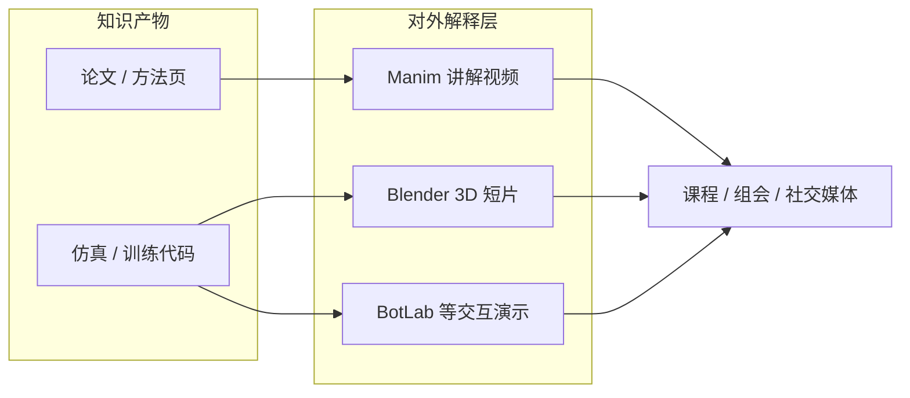

---

type: entity
tags: [software, animation, python, visualization, education, open-source, math, mit]
status: complete
updated: 2026-06-12
related:
  - ./blender.md
  - ./botlab-motioncanvas.md
  - ../concepts/character-animation-vs-robotics.md
  - ../methods/deepmimic.md
sources:
  - ../../sources/sites/manim-community.md
  - ../../sources/repos/manim-community.md
  - ../../sources/repos/manim-3b1b.md
summary: "Manim 是用 Python 程序化生成数学/技术讲解动画的开源引擎（MIT）：社区版 ManimCE 为默认推荐安装，原版 ManimGL 为 3Blue1Brown 一手代码基线；在机器人栈中服务论文 supplementary、课程与组会等对外解释层，与 Blender（3D DCC）和交互式仿真可视化互补。"
---

# Manim（程序化数学动画引擎）

**Manim** 是一套用 **Python 代码精确描述动画时间线** 的开源引擎，最初由 **Grant Sanderson（3Blue1Brown）** 为教育数学视频而编写。当前存在两个 **互不兼容** 的活跃分支：**Manim Community Edition（ManimCE）** 与 **ManimGL（3b1b/manim）**。在机器人研究与工程中，Manim 几乎从不参与训练或仿真闭环，却常出现在 **算法讲解、论文配套短片、课程与公开演讲** 的「对外沟通层」——与 [Blender](./blender.md) 的 3D 资产管线、[BotLab / MotionCanvas](./botlab-motioncanvas.md) 的浏览器交互仿真形成互补。

## 英文缩写速查

| 缩写 | 英文全称 | 简要说明 |
|------|----------|----------|
| ManimCE | Manim Community Edition | 社区维护分叉；`pip install manim`，CLI `manim` |
| ManimGL | Manim OpenGL | Grant 原版引擎；`pip install manimgl`，CLI `manimgl` |
| Scene | Scene | 动画场景类；子类实现 `construct()` 编排 `self.play()` |
| Mobject | Mathematical Object | 可组合的视觉对象基类（图形、公式、坐标系等） |
| LaTeX | Lamport TeX | 排版系统；`MathTex` / `Tex` 渲染公式与符号 |
| FFmpeg | Fast Forward MPEG | 视频编码工具链；Manim 渲染输出的常见后端 |
| MIT | Massachusetts Institute of Technology License | Manim 两版均采用的开源许可 |

## 为什么对机器人栈重要

1. **理论可视化成本低**：强化学习回报塑形、李群姿态、轨迹优化、图搜索等概念用 `MathTex`、`NumberPlane`、`Graph` 可 **版本控制、可复现** 地动画化——适合论文 supplementary、开源项目 README 视频与研究生课程，而不必每次手工 Keyframe。
2. **与 3D 工具分工明确**：[Blender](./blender.md) 解决 **网格、骨骼、BVH、USD**；Manim 解决 **2D/轻 3D 数学示意**——讲解 [DeepMimic](../methods/deepmimic.md) 类方法时，常见「仿真短片（图形学）+ 公式推导片（Manim）」组合。
3. **教学与演示跳板**：[BotLab / MotionCanvas](./botlab-motioncanvas.md) 提供 **在线调 obs/策略**；Manim 产出 **离线、可嵌入幻灯片的讲解片段**——二者都服务教育，但交互形态不同。
4. **许可与分发友好**：MIT 许可；官方文档说明生成视频可自由分享。注意 **3Blue1Brown 的 Pi creature 等角色资产受版权保护**，机器人演示中应避免直接挪用。

## 两版本选型（必读）

| 维度 | **ManimCE**（推荐新用户） | **ManimGL**（3b1b 原版） |
|------|---------------------------|---------------------------|
| 仓库 | [ManimCommunity/manim](https://github.com/ManimCommunity/manim) | [3b1b/manim](https://github.com/3b1b/manim) |
| 安装 | `pip install manim` | `pip install manimgl` |
| 文档 | [docs.manim.community](https://docs.manim.community/en/stable/) | [3b1b.github.io/manim](https://3b1b.github.io/manim/) |
| 维护 | 社区 issue/PR、插件、多语言文档 | Grant 维护；视频场景代码在 [3b1b/videos](https://github.com/3b1b/videos) |
| 预览 | 多渲染后端（见配置文档） | **OpenGL** 实时预览见长 |

> **切勿混装**：两版 PyPI 包名、CLI 与部分 API 不同；须先选定版本再按对应 README 安装。详见 [安装 FAQ](https://docs.manim.community/en/stable/faq/installation.html)。

## 核心编程模型（ManimCE）

```python
from manim import *

class SquareToCircle(Scene):
    def construct(self):
        square = Square()
        circle = Circle()
        self.play(Create(square))
        self.play(Transform(square, circle))
        self.play(FadeOut(square))
```

```sh
manim -p -ql example.py SquareToCircle
```

| 构件 | 机器人讲解中的典型用法 |
|------|------------------------|
| `MathTex` / `Tex` | 损失函数、动力学方程、贝尔曼方程 |
| `NumberPlane` / `Axes` | 状态空间、代价地形、学习曲线 |
| `Graph` / `Arrow` | 模块数据流、因子图、pipeline 示意 |
| `ThreeDScene` | 轻量 3D 姿态/向量场（非高保真机器人渲染） |
| `Transform` / `Write` | 推导步骤、算法阶段切换 |
| Plugins | 扩展图表、主题或导出格式 |

## 在知识库生态中的位置



## 常见误区或局限

- **不是仿真器或 DCC**：不能替代 [MuJoCo](./mujoco.md) / [Isaac Lab](./isaac-gym-isaac-lab.md) / Blender 做 **物理一致** 的机器人场景；宜限 **示意精度**。
- **两版本 API 不互通**：从 ManimGL 教程迁移到 ManimCE（或反之）需逐例对照文档，不可假设 `import` 路径一致。
- **LaTeX 依赖**：复杂公式排版需本地 TeX 栈；CI/无头环境要单独配置（Docker 镜像可缓解）。
- **与角色动画无关**：[Character Animation vs Robotics](../concepts/character-animation-vs-robotics.md) 中的表演可信度问题，Manim 不负责——它解决的是 **符号与几何的可视化**，不是关节力矩或 costume 包络。

## 关联页面

- [Blender（3D 创作与资产管线）](./blender.md)
- [BotLab / MotionCanvas（浏览器策略–仿真编排）](./botlab-motioncanvas.md)
- [Character Animation vs Robotics](../concepts/character-animation-vs-robotics.md)
- [DeepMimic（图形学起源的模仿学习）](../methods/deepmimic.md)

## 参考来源

- [Manim Community 官网与文档归档](../../sources/sites/manim-community.md)
- [ManimCE 仓库归档](../../sources/repos/manim-community.md)
- [ManimGL / 3b1b 原版仓库归档](../../sources/repos/manim-3b1b.md)
- [ManimCE 稳定版文档](https://docs.manim.community/en/stable/)
- [3b1b Manim 文档](https://3b1b.github.io/manim/)

## 推荐继续阅读

- [Manim 官网 — 示例画廊](https://www.manim.community/)
- [在线 Jupyter 试用](https://try.manim.community/)
- [两版本区别 FAQ](https://docs.manim.community/en/stable/faq/installation.html)
- [3Blue1Brown 官网](https://www.3blue1brown.com/) — 理解 Manim 的设计初衷
