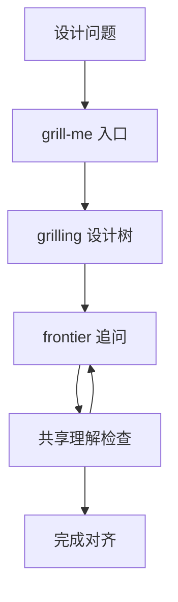

# grill-me（Matt Pocock Skill）

**grill-me**（[skills.sh](https://skills.sh/mattpocock/skills/grill-me)）是 [mattpocock/skills](https://github.com/mattpocock/skills) 的 **轻量对齐 slash 技能**：`SKILL.md` 仅触发 **`grilling`** 子技能，用 **设计树 + frontier 轮次** 压榨计划/方案，直到用户确认 **shared understanding** 再动手。

## 一句话定义

在写代码前用 **编号多选题式 grilling** 清空前缀假设；事实由代理 sub-agent 查，**决策** 留给用户。

## 英文缩写速查

| 缩写 | 英文全称 | 简要说明 |
|------|----------|----------|
| ADR | Architecture Decision Record | grill-me **不**默认写 ADR（见 grill-with-docs） |
| LLM | Large Language Model | 执行 grilling 的 coding agent |
| PRD | Product Requirements Document | 对齐后可接 to-prd / to-issues 技能 |

## 为什么重要（对本知识库读者）

- **对抗 vibe coding：** 与 [Agentic Coding 软件工程基础](../concepts/agentic-coding-software-fundamentals.md) 同向 — 先 **选对问题** 再让 agent 写码。
- **ingest 场景：** 新论文/仓库入库前用 grill 澄清「要沉淀概念还是实体页、开源边界」可减少 wiki 返工。
- **与 grill-with-docs：** 本技能 **不写 GLOSSARY/ADR**；需要 **共建领域语言** 时用 [grill-with-docs](mattpocock-grill-with-docs-skill.md)。

## 流程总览

以下按本页已归纳的机制与资料绘制，表示模块或阅读路径关系。

## 核心机制

| 组件 | 作用 |
|------|------|
| `grill-me/SKILL.md` | slash 入口，`disable-model-invocation: true` |
| `productivity/grilling` | 设计树、frontier 轮、推荐答案格式（❓/➡️） |
| 完成条件 | frontier 空 + 用户确认理解 |

## 常见误区或局限

- **误区：等于 code review。** grilling 在 **实现前**；不是 diff 评审。
- **局限：** 英文技能；机器人栈术语需在 grill-with-docs 或自建 `GLOSSARY.md` 中补。

## 关联页面

- [Skills For Real Engineers（总览）](mattpocock-skills.md)
- [grill-with-docs](mattpocock-grill-with-docs-skill.md) — grilling + domain-modeling
- [triage](mattpocock-triage-skill.md) — issue 澄清时可选 grilling
- [Superpowers（obra）](superpowers-obra.md) — 重流程 brainstorm 对照

## 参考来源

- [mattpocock/skills 归档](../../sources/repos/mattpocock-skills.md)
- [skills.sh grill-me 核查](../../sources/sites/skills-sh-mattpocock-selected-skills.md)
- [grilling SKILL.md](https://github.com/mattpocock/skills/tree/main/skills/productivity/grilling)

## 推荐继续阅读

- [skills.sh grill-me](https://skills.sh/mattpocock/skills/grill-me)
