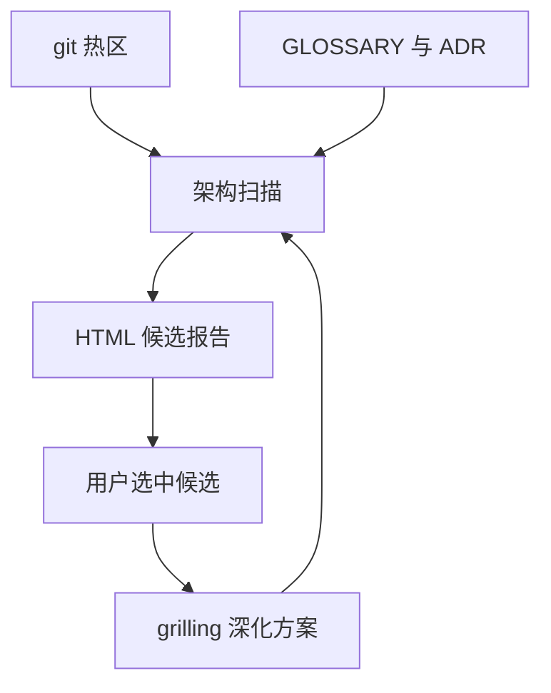

# improve-codebase-architecture（Matt Pocock Skill）

**improve-codebase-architecture**（[skills.sh](https://skills.sh/mattpocock/skills/improve-codebase-architecture)）面向 **架构卫生**：用 **git 热区 + 领域 glossary** 聚焦扫描，生成 **OS 临时目录** 下的 HTML 报告（Tailwind + Mermaid），列出 **deepening** 候选；用户选中后进入 **grilling** 与 **domain-modeling** 循环。

## 一句话定义

把「泥球/shallow module」变成 **可浏览的 before/after 架构卡片**，再用 grilling 定 deepening 方案 — 术语强制用 **module/seam/depth**，禁止泛称 service/API。

## 英文缩写速查

| 缩写 | 英文全称 | 简要说明 |
|------|----------|----------|
| ADR | Architecture Decision Record | 冲突候选需标注是否违背既有 ADR |
| YAGNI | You Aren't Gonna Need It | 优先最近改动热区，避免全库空转 |
| HTML | HyperText Markup Language | 报告格式，**不落库** repo |

## 为什么重要（对本知识库读者）

- **scripts/ 与 exports 链路：** 派生 JSON 不入库但 **生成脚本** 入库；长期 ingest 易堆 **浅工具函数** — 本技能适合 periodic **human+agent 架构 review**（非替代 `make lint`）。
- **与 agentic SE 概念页：** [软件工程基础](../concepts/agentic-coding-software-fundamentals.md) 讲 **按阶段换架构**；本 skill 是 **操作化扫描**。

## 流程总览

以下按本页已归纳的机制与资料绘制，表示模块或阅读路径关系。

## 核心流程

1. **Explore** — `git log` 热区 + 读 GLOSSARY/ADR；sub-agent 有机发现 friction  
2. **HTML 报告** — 候选卡片（Problem/Solution/Benefits/强度徽章）  
3. **Grilling loop** — 用户选候选 → grilling +  inline domain-modeling  

## 常见误区或局限

- **误区：自动改代码。** 先报告与 grilling，**不**在步骤 2 提案 interface。
- **局限：** HTML 依赖 CDN；离线环境需改流程。

## 关联页面

- [mattpocock/skills 总览](mattpocock-skills.md)
- [tdd](mattpocock-tdd-skill.md)
- [grill-me](mattpocock-grill-me-skill.md)

## 参考来源

- [SKILL.md（GitHub）](https://github.com/mattpocock/skills/tree/main/skills/engineering/improve-codebase-architecture)
- [mattpocock/skills 归档](../../sources/repos/mattpocock-skills.md)

## 推荐继续阅读

- [skills.sh improve-codebase-architecture](https://skills.sh/mattpocock/skills/improve-codebase-architecture)
