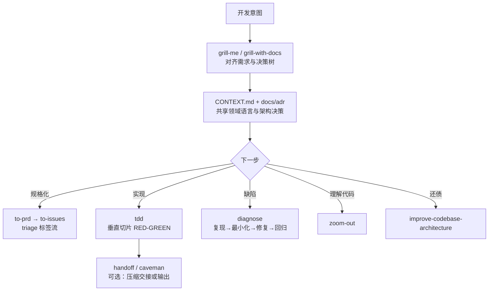

# Skills For Real Engineers（mattpocock）

**Skills For Real Engineers** 是 [mattpocock/skills](https://github.com/mattpocock/skills) 仓库及其 [skills.sh](https://skills.sh/mattpocock/skills) 分发入口的总称：把作者在长期 TypeScript / 课程 / 产品工程实践中验证的 **代理技能**（`skills/**/SKILL.md`）公开为 **小步、可改编、可组合** 的规约，并通过 `npx skills@latest add mattpocock/skills` 安装到 Claude Code、Cursor 等 harness。

## 一句话定义

用 **按需安装的技能片 + 每仓库一次性 setup**，把 **对齐（grill）→ 共享领域语言 → 细粒度 TDD/诊断反馈 → 架构与 issue 卫生** 固化为日常编码代理的默认习惯，而不是依赖「包办全流程」的重方法论框架。

## 为什么重要（对本知识库读者）

- **与 LLM Wiki 维护同构：** [Karpathy LLM Wiki](../references/llm-wiki-karpathy.md) 把 **知识编译进 `wiki/`**；本技能库把 **工程习惯编译进 `SKILL.md` + `CONTEXT.md` + ADR**。两者都服务 **人类策展 + 代理执行**，但对象分别是 **机器人知识** 与 **通用应用代码**。
- **与 Superpowers 的分工：** [Superpowers（obra）](superpowers-obra.md) 强调 **brainstorm → worktree → 子代理评审 → 强制 TDD 管线**；mattpocock/skills 更强调 **保留开发者控制权**、反对 GSD/BMAD/Spec-Kit 式「流程包办」，技能可 **自选组合**（README 自述 *Hack around with them*）。
- **对本仓库 agent 的直接价值：** 维护 Robotics_Notebooks 时大量 **ingest、派生文件同步、长 markdown 交叉引用**；`/grill-with-docs` 与 `CONTEXT.md` 可降低 **术语不一致导致的冗长解释**；`/tdd` 与 `/diagnose` 可迁移到 **脚本与 CI 工具链** 的修改场景（与 `make ci-preflight` 文化一致）。
- **命名注意：** 本库含 `productivity/caveman` 技能，与 [Caveman（JuliusBrussee）](caveman.md) **不同上游、不同实现**；二者都追求更短输出，宜对照选用而非混为同一插件。

## 核心结构

| 层次 | 内容 |
|------|------|
| **分发** | GitHub 主仓 + [skills.sh/b/mattpocock/skills](https://skills.sh/mattpocock/skills)；安装器 `npx skills@latest add mattpocock/skills`。 |
| **每仓库 bootstrap** | `setup-matt-pocock-skills`：绑定 issue tracker（GitHub / Linear / 本地）、triage 标签词表、`CONTEXT.md` 与 `docs/adr/` 布局。 |
| **对齐层** | `grill-me`（通用）、`grill-with-docs`（工程向：挑战方案、更新 `CONTEXT.md` 与 ADR）。 |
| **反馈层** | `tdd`（RED-GREEN-REFACTOR 垂直切片）、`diagnose`（系统化调试环）、`prototype`（可抛原型验证设计）。 |
| **规划与卫生** | `to-prd`、`to-issues`、`triage`、`zoom-out`、`improve-codebase-architecture`。 |
| **效率层** | `caveman`（极简沟通）、`handoff`（会话交接）、`write-a-skill`（元技能）。 |
| **护栏** | `git-guardrails-claude-code`、`setup-pre-commit` 等 misc 技能。 |

### 流程总览（日常工程环）

## 常见误区或局限

- **误区：stars 高 = 适合机器人仿真栈开箱即用。** 技能正文面向 **通用应用工程**（TypeScript 生态、issue/PRD 流）；迁移到 **Isaac / MuJoCo / ROS** 时需重写 `CONTEXT.md` 词汇与反馈环（仿真步进、真机安全等不在上游默认范围）。
- **误区：与 [Caveman](caveman.md) 重复。** JuliusBrussee/caveman 是 **独立插件 + hook + MCP 压缩**；本库 `productivity/caveman` 是 **Matt Pocock 版极简沟通技能**，安装路径与能力集不同。
- **误区：可替代本仓库 `schema/ingest-workflow.md`。** ingest/query/lint 与 `make ci-preflight` 派生同步 **无等价 skill**；最多借鉴 grill/TDD 习惯，不能省略 wiki 健康检查。
- **局限：** 技能集合随作者迭代（含 `deprecated/`、`in-progress/` 目录）；跨 harness 行为以 skills.sh 安装结果为准；英文为主，领域示例偏前端/TS 课程工程。

## 关联页面

- [Superpowers（obra）](superpowers-obra.md) — **重流程、可强制** 的编码交付技能库（worktree、子代理评审）
- [Caveman](caveman.md) — **独立上游** 的输出/上下文压缩插件（与本库同名 skill 对照）
- [Hermes Agent](hermes-agent.md) — 常驻代理运行时与 agentskills.io 互操作
- [Agent Reach](agent-reach.md) — 外网读搜工具链脚手架
- [LLM Wiki（Karpathy 模式）](../references/llm-wiki-karpathy.md) — 持久 wiki 知识编译范式
- [Ingest Workflow](../../schema/ingest-workflow.md) — 本仓库 ingest / query / lint 规范

## 参考来源

- [mattpocock/skills 仓库源归档（本站）](../../sources/repos/mattpocock-skills.md)
- [mattpocock/skills（GitHub）](https://github.com/mattpocock/skills)
- [skills.sh 安装页](https://skills.sh/mattpocock/skills)

## 推荐继续阅读

- [Skills  Newsletter（aihero.dev）](https://www.aihero.dev/s/skills-newsletter) — 技能更新订阅（README 入口）
- [course-video-manager CONTEXT.md 示例](https://github.com/mattpocock/course-video-manager/blob/076a5a7a182db0fe1e62971dd7a68bcadf010f1c/CONTEXT.md) — README 引用的共享语言文档样例
- [obra/superpowers](https://github.com/obra/superpowers) — 对照「流程包办型」技能方法论
