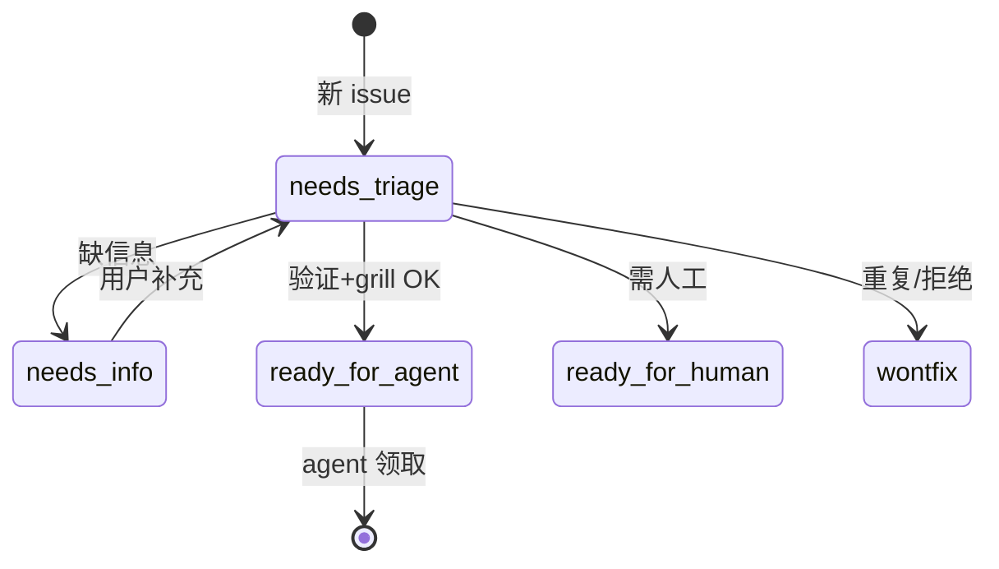

# triage（Matt Pocock Skill）

**triage**（[skills.sh](https://skills.sh/mattpocock/skills/triage)）把 issue tracker（与可选 **外部 PR**）纳入 **小状态机**：`bug|enhancement` × `needs-triage|needs-info|ready-for-agent|ready-for-human|wontfix`；每条 tracker 评论带 **AI triage 免责声明**；就绪项输出 **agent brief**（见仓内 `AGENT-BRIEF.md`）。

## 一句话定义

**维护者 inbox 卫生** — 查重、复现、grill 澄清、写 brief，把 issue 变成 **AFK agent 可执行** 的 `ready-for-agent`。

## 英文缩写速查

| 缩写 | 英文全称 | 简要说明 |
|------|----------|----------|
| PR | Pull Request | 可视为带 diff 的 issue |
| AFK | Away From Keyboard | ready-for-agent 目标态 |
| ADR | Architecture Decision Record | triage 探索时尊重已有 ADR |

## 为什么重要（对本知识库读者）

- **开源机器人栈 issue 洪水：** 仿真/硬件 issue 常缺复现；triage 的 **verify** 步（跑测试、查 `.out-of-scope/`）与 **redundancy** 检查可减少 duplicate feature request。
- **与 OCR：** [Open Code Review](open-code-review.md) 做 **diff 评论**；triage 做 **入口分拣 + brief** — 可串联。

## 核心流程（摘要）

1. **Attention buckets** — unlabeled / needs-triage / needs-info 有更新  
2. **单 issue** — 读上下文 → 推荐 category+state → **verify** → 可选 grilling+domain-modeling → 贴 brief / wontfix  
3. **标签** — 依赖 [setup](mattpocock-setup-skills-skill.md) 的 `docs/agents/triage-labels.md`  

### 流程总览

## 常见误区或局限

- **误区：自动 merge PR。** triage **不写** 代码；只改标签与 brief。
- **局限：** 无 setup 标签映射时会提示先跑 setup。

## 关联页面

- [mattpocock/skills 总览](mattpocock-skills.md)
- [setup-matt-pocock-skills](mattpocock-setup-skills-skill.md)
- [grill-me / grilling](mattpocock-grill-me-skill.md)
- [HumanLayer Skills](humanlayer-skills.md)

## 参考来源

- [triage SKILL.md](https://github.com/mattpocock/skills/tree/main/skills/engineering/triage)
- [mattpocock/skills 归档](../../sources/repos/mattpocock-skills.md)

## 推荐继续阅读

- [skills.sh triage](https://skills.sh/mattpocock/skills/triage)
