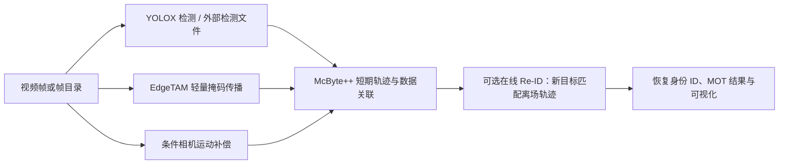
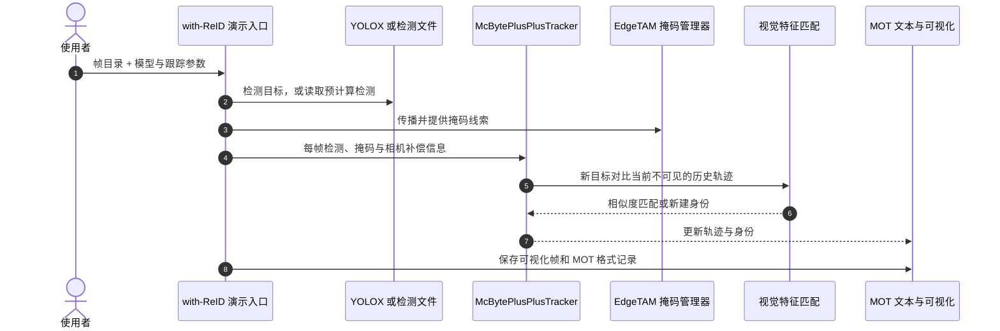

# McByte++：无训练的长时体育多目标跟踪

**McByte++** 是 Inria STARS 开发的体育视频多目标跟踪系统：它在 McByte 的检测跟踪框架上整合轻量掩码传播、条件相机运动补偿和在线行人再识别（Re-ID），以便球员被遮挡或离开画面后重新出现时继续沿用原 ID。

## 英文缩写速查

| 缩写 | 英文全称 | 简要说明 |
|------|----------|----------|
| MOT | Multi-Object Tracking | 在连续视频帧中同时跟踪多个目标并维护 ID |
| Re-ID | Re-identification | 将重新出现的目标与历史轨迹身份重新匹配 |
| CMC | Camera Motion Compensation | 补偿相机运动，减少背景运动对目标关联的干扰 |
| HOTA | Higher Order Tracking Accuracy | 综合衡量检测与关联质量的跟踪指标 |
| IDF1 | Identification F1 Score | 衡量跨帧身份识别准确度的 F1 指标 |
| FPS | Frames Per Second | 每秒处理帧数；此处官方数字不含检测耗时 |

## 为什么重要

体育画面里的快速运动、遮挡、镜头平移与球员反复出入画面，会让逐帧检测结果难以维持长期身份。McByte++ 的重点不是重新训练一个检测器，而是改进关联管线：短期跟踪负责连续帧内的轨迹，在线 Re-ID 则将当前新出现的目标与暂时离场的旧轨迹比较，从而恢复旧 ID。代码提供启用和禁用 Re-ID 两种入口，便于按任务需求取舍算力与身份恢复能力。

项目由 Inria STARS 团队开发；代码仓库和论文均已公开。它是 McByte 的后续版本，不应与前作的 CVPR 2025 Workshop 论文或仓库合并成同一份源码归档；此节点将前作视为方法谱系背景。

## 核心信息

| 项 | 内容 |
|----|------|
| 机构 | 法国国家信息与自动化研究所（INRIA），STARS 团队 |
| 论文 | [Training-Free Long-Term Multi-Object Tracking for Sports Video Analytics](https://arxiv.org/abs/2608.15688)，2026-08-16 提交 |
| 官方代码 | [tstanczyk95/McBytePlusPlus](https://github.com/tstanczyk95/McBytePlusPlus) |
| 开源状态 | **已开源**；仓库声明 Apache-2.0，模型权重及第三方依赖需分别核对 |
| 输入 / 输出 | 视频帧目录或检测文件 → 帧级目标轨迹、可视化结果与 MOT 格式文本 |
| 主要评测 | SoccerNet-tracking、SportsMOT、DanceTrack |
| 免训练含义 | 无需在目标视频上重新训练 detector 或按数据集调参；运行仍需预训练检测器、掩码与（可选）Re-ID 模型 |

## 核心原理

### 关联管线

McByte++ 是 tracking-by-detection 系统：检测框为逐帧跟踪提供候选目标，再结合相机运动补偿、掩码线索与轨迹状态做关联。在线 Re-ID 专门处理暂时不在画面中的 tracklet：新目标的视觉特征与已离场轨迹的特征比较，余弦相似度达到阈值时复用旧 ID；官方 README 给出的体育模型默认阈值为 0.8。

上述图概括模块关系，不表示代码可流式逐帧处理。项目 README 特别说明，当前 EdgeTAM 掩码传播实现会一次性载入所有帧；Re-ID 在线执行不等于整条掩码管线支持实时流输入。

### 运行时序

官方演示入口为 `tools/demo_track__with_reid.py`，跟踪器实现位于 `yolox/tracker/mcbyteplusplus_tracker__with_reid.py`。检测可由默认 YOLOX 检测器生成，也可通过 `--det_path` 输入预先计算的检测结果；启用 Re-ID 时还需加载对应特征提取模型。

### 评测结果与读取方式

官方 README 在单张 NVIDIA H100 上报告跟踪 FPS，且明确**排除目标检测耗时**；检测先单独提取，再输入跟踪器。因此 FPS 不能直接当作端到端摄像头实时速度。下表对比原始 McByte 与启用在线 Re-ID 的 McByte++：

| 测试集 | McByte HOTA / IDF1 / FPS | McByte++ 在线 Re-ID HOTA / IDF1 / FPS |
|--------|--------------------------|--------------------------------------|
| SoccerNet-tracking 2022 test | 85.0 / 79.9 / 1.04 | **87.5 / 84.5 / 8.69** |
| SportsMOT test | 76.9 / 77.5 / 3.60 | **79.9 / 83.6 / 14.57** |
| SoccerNet-tracking 2023 challenge | 64.1 / 76.5 / 1.46 | **64.3 / 78.6 / 11.13** |
| DanceTrack test | 67.1 / 68.1 / 2.00 | 64.5 / 67.8 / **20.23** |

结果显示，McByte++ 的速度提升与 Re-ID 的身份收益要分开看：SportsMOT 和 SoccerNet 上在线 Re-ID 改善 HOTA/IDF1；DanceTrack 上 Re-ID 收益有限，HOTA 与 IDF1 均低于 McByte，而速度大幅提高。额外的 GTA-link 离线全局关联结果是后处理对照，不是在线版本的运行依赖。

## 工程实践

- **安装环境：** 安装文档以 Linux、CUDA 12.8、GCC 10.5 和 Python 3.10 为测试环境；依赖 PyTorch、YOLOX 与 EdgeTAM。复现时应先按仓库安装顺序固定依赖版本。
- **准备模型：** 默认体育检测器、EdgeTAM 掩码模型与体育 Re-ID 权重需要从上游仓库分别下载；使用 `--det_path` 可绕过内置检测器路径。模型权重不应误认为都随代码仓库自带。
- **选 Re-ID 模式：** `tools/demo_track__with_reid.py` 启用在线身份恢复；`tools/demo_track__no_reid.py` 更快但不做离场后的身份重连。
- **调阈值：** `--reid_sim_thresh` 默认值为 0.8。换运动项目、视角或 Re-ID 权重后，需要在验证视频上检查误合并与身份断裂，再调整阈值。
- **复现实验：** 报告速度需标注 H100、是否排除 detector、数据集 split、是否在线 Re-ID，以及是否应用离线 GTA-link 后处理。

## 局限与风险

- 当前仓库的 EdgeTAM 掩码传播实现要求一次加载全部帧；长视频可能带来内存占用，README 将逐帧处理列为后续改进方向。
- 官方 FPS 指标只计跟踪部分、不含检测；不能据此推断完整视觉系统在目标硬件上的端到端帧率。
- 默认 Re-ID 权重主要针对足球、篮球、排球等体育场景。README 指出其在人员长时间留在画面的 DanceTrack 上收益不明显；跨域部署须重新评估特征质量与匹配阈值。
- “免训练”不是“无需模型”：运行依赖预训练检测器与 EdgeTAM 权重，Re-ID 版本还需特征模型；不同模型与依赖的许可条件应分别核验。
- 仓库基于并整合 YOLOX、ByteTrack、Cutie、EdgeTAM、BoT-SORT、torchreid 与 GTA-link 的相关组件；仓库 Apache-2.0 声明不应被当作所有依赖、检查点和训练数据的统一许可。

## 与其他工作对比

| 维度 | McByte++ | McByte（前作） | Roboflow Sports |
|------|----------|----------------|-----------------|
| 主要目标 | 体育视频长时多目标跟踪与离场身份恢复 | 掩码线索辅助的逐帧目标关联 | 体育 CV 工具、检测与广播视角分析示例 |
| 在线身份恢复 | 提供可选在线 Re-ID | 不以离场后的身份恢复为核心 | 不是其主仓库的核心交付 |
| 公开材料 | arXiv:2608.15688 + McBytePlusPlus 仓库 | CVPR 2025 Workshop + 独立仓库 | 代码仓库与示例 |

McByte++ 在前作基础上扩展，不等于重新实现通用体育视觉平台；[Roboflow Sports](./roboflow-sports.md) 是相关的体育检测、可视化工具节点，而不是 McByte++ 的依赖或组成模块。

## 关联页面

- [Roboflow Sports](./roboflow-sports.md) — 体育检测与分析工具，可对照其场景化 CV 工作流
- [TrackerLab](./trackerlab.md) — 多目标跟踪方法与评测入口
- [目标检测](../methods/object-detection.md) — tracking-by-detection 的前置检测环节

## 参考来源

- [Training-Free Long-Term Multi-Object Tracking for Sports Video Analytics（arXiv:2608.15688）](../../sources/papers/mcbyte-plus-plus_arxiv_2608_15688.md)
- [McByte++ 官方仓库归档](../../sources/repos/mcbyte-plus-plus.md)
- [McByte++ arXiv 页面](https://arxiv.org/abs/2608.15688)
- [McByte++ 官方代码](https://github.com/tstanczyk95/McBytePlusPlus)

## 推荐继续阅读

- [McByte++ 官方 README](https://github.com/tstanczyk95/McBytePlusPlus#readme) — 命令行入口、模型与分数据集对比
- [McByte++ 安装说明](https://github.com/tstanczyk95/McBytePlusPlus/blob/main/INSTALLATION.md) — CUDA、依赖和预训练权重配置
- [McByte（CVPR 2025 Workshop）](https://github.com/tstanczyk95/McByte) — 前作独立代码仓库与论文背景
