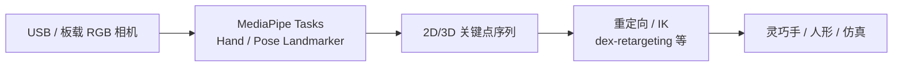

# MediaPipe

**MediaPipe** 是 Google 维护的 **端侧机器学习** 开源项目：既有可即插即用的 **Solutions / Tasks**（视觉、文本、音频），也有底层的 **Framework** 图计算运行时，目标是在手机、浏览器、桌面与边缘设备上 **低延迟、可定制** 地跑感知模型。在机器人研究与工程中，它最常出现在 **单目摄像头遥操作、人手轨迹采集与重定向 warm-start** 链路里，而不是作为整机控制或仿真框架。

## 英文缩写速查

| 缩写 | 英文全称 | 简要说明 |
|------|----------|----------|
| ML | Machine Learning | 机器学习 |
| API | Application Programming Interface | 跨平台任务调用接口（MediaPipe Tasks） |
| IK | Inverse Kinematics | 由末端/关键点约束反解关节角 |
| RGB | Red-Green-Blue | 常见单目/彩色相机输入 |
| IoT | Internet of Things | 边缘与嵌入式部署场景 |

## 为什么重要

- **低成本人手感知：** 普通 USB 摄像头即可获得 **21 点手部关键点** 或 **33 点全身姿态**，降低灵巧操作数据采集门槛（见 [灵巧操作数据采集指南](../queries/dexterous-data-collection-guide.md)）。
- **端侧实时：** 图流水线针对移动与边缘优化，适合 **本地闭环遥操作**，无需把原始视频流全部上传云端。
- **生态成熟、示例多：** 官方提供 Android / Web / Python 等多平台 **Tasks** 与 **Model Maker** 微调路径；社区大量 teleop / retargeting 项目默认对接 MediaPipe 输出格式。
- **与专用动捕正交：** 相比光学动捕或 MANUS 手套，MediaPipe 精度与遮挡鲁棒性有限，但 **硬件成本与部署复杂度** 显著更低，常作原型与开源栈默认选项（如 [MIDAS Hand](./midas-hand.md) 的 `midas_hand_teleop`）。

## 核心结构

MediaPipe 现分两层理解（2023 年后文档以 [developers.google.com/mediapipe](https://developers.google.com/mediapipe) 为主）：

| 层级 | 作用 | 机器人相关示例 |
|------|------|----------------|
| **MediaPipe Tasks** | 跨平台高层 API + 预训练模型 | Hand Landmarker、Pose Landmarker、Face Landmarker |
| **MediaPipe Framework** | 自定义 Calculator 图（Packets / Graphs） | 自研多相机融合、滤波或与 ROS 桥接 |
| **Model Maker / Studio** | 微调与浏览器评测 | 针对特定手套/背景/domain 轻量适配 |

### 机器人常用输出

| Task | 典型输出 | 下游 |
|------|----------|------|
| **Hand Landmarker** | 21 关键点（含深度估计） | 灵巧手 IK / [TopoRetarget](../methods/toporetarget-interaction-preserving-dexterous-retargeting.md) 骨方向初始化 |
| **Pose Landmarker** | 33 点骨架 | 全身遥操作、动作模仿上游 |
| **Face Landmarker** | 面部网格 | 表情驱动、社交机器人 |

## 工程实践

1. **选 API 代际：** 新项目优先 **MediaPipe Tasks**（Python / Web / Android）；维护旧仓库时核对 [Legacy Solutions](https://developers.google.com/mediapipe/solutions/guide#legacy) 是否仍受支持。
2. **安装：** 按官方 [Python setup](https://developers.google.com/mediapipe/solutions/setup_python) 安装 `mediapipe` 包；自研图则从 [GitHub](https://github.com/google/mediapipe) 构建 Framework。
3. **遥操作链路：** 摄像头 → Hand Landmarker → 指尖/关节重定向 → 仿真或真机（参考 [MIDAS Hand](./midas-hand.md) 四仓分工：`midas_hand_teleop` 即 MediaPipe 输入）。
4. **质量与标定：** 固定相机外参、做中性手势标定、在遮挡严重时降级或融合第二模态（手套、深度相机）。

## 局限与风险

- **精度与遮挡：** 快速运动、自遮挡、弱光下关键点抖动明显；不宜单独作为 **高精度工业装配** 的唯一感知源。
- **尺度与深度：** 单目深度为估计值，绝对米制与双手协调需标定或融合外部位姿（对比 [SAM 3D Body](./sam-3d-body.md) 等 HMR 基础模型）。
- **Legacy 分叉：** 2023 年前教程可能引用已停止维护的 Solution 名；集成前查官方 Legacy 列表，避免依赖无人维护的预编译图。
- **许可与隐私：** Apache 2.0 源码；使用 Google 托管 Tasks 时注意其 [Privacy Notice](https://github.com/google/mediapipe) 对输入数据的说明。

## 关联页面

- [灵巧操作数据采集指南](../queries/dexterous-data-collection-guide.md) — MediaPipe 作为视觉手套替代方案
- [MIDAS Hand](./midas-hand.md) — 官方 MediaPipe 遥操作仓
- [TopoRetarget](../methods/toporetarget-interaction-preserving-dexterous-retargeting.md) — 以 MediaPipe 21 点为输入的交互保留重定向
- [Motion Retargeting Pipeline](../concepts/motion-retargeting-pipeline.md) — 感知上游在管线中的位置

## 参考来源

- [MediaPipe 仓库归档](../../sources/repos/mediapipe.md)
- [MediaPipe 开发者文档站归档](../../sources/sites/mediapipe-developers-google.md)
- [MediaPipe GitHub](https://github.com/google/mediapipe)
- [MediaPipe on Google Developers](https://developers.google.com/mediapipe)

## 推荐继续阅读

- [MediaPipe Hand Landmarker 指南](https://developers.google.com/mediapipe/solutions/vision/hand_landmarker) — 官方任务 API 与模型说明
