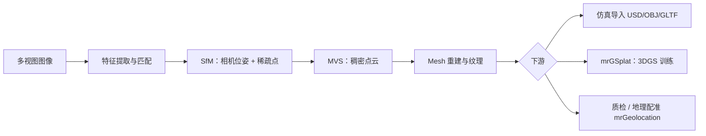

# Meshroom

**Meshroom**（[alicevision/Meshroom](https://github.com/alicevision/Meshroom)，MPL-2.0）是 **AliceVision** 社区维护的 **开源节点式视觉编程框架**：用 **Graph（节点图）** 编排摄影测量、相机跟踪、HDR 全景、纹理与插件化 ML 步骤。对机器人知识库而言，它主要扮演 **Real2Sim / 数字孪生资产链的上游**——把多视图照片或视频帧变成 **相机位姿、稠密点云、带纹理 mesh**，并可经 [MrGSplat](https://github.com/meshroomHub/mrGSplat) 等插件继续产出 **3D Gaussian Splatting** 资产，再对接 [GS-Playground](./gs-playground.md)、[Spark](./spark-3dgs-renderer.md) 或仿真导入工具。

## 一句话定义

用 **可缓存的节点图 + AliceVision 摄影测量后端**，把 **多视图图像** 转成 **可仿真的三维几何与相机标定**，并可通过插件延伸到 **3DGS / 分割 / 深度 / 地理配准** 等下游任务。

## 英文缩写速查

| 缩写 | 英文全称 | 简要说明 |
|------|----------|----------|
| SfM | Structure from Motion | 从多视图图像估计相机位姿与稀疏结构 |
| MVS | Multi-View Stereo | 多视图立体匹配生成稠密点云 / mesh |
| HDR | High Dynamic Range | 多曝光合成高动态范围图像 |
| 3DGS | 3D Gaussian Splatting | 用各向异性高斯表示场景外观的显式 3D 表征 |
| MPL | Mozilla Public License | Meshroom 采用的 MPL-2.0 开源许可 |
| CV | Computer Vision | 计算机视觉；Meshroom 默认插件覆盖的主流 3D CV 任务 |

## 核心信息

| 字段 | 值 |
|------|-----|
| 机构 | 爱丽丝视觉开源社区（AliceVision） |
| 许可 | MPL-2.0 |
| 仓库 | [alicevision/Meshroom](https://github.com/alicevision/Meshroom) |
| 项目页 | [meshroom.org](http://meshroom.org) |

## 为什么重要

1. **Real2Sim 的几何层常从摄影测量起步。** [Sim2Real](../concepts/sim2real.md) 讨论里，仿真侧需要可信的 **场景尺度、相机外参、碰撞 mesh**；多视图照片经 Meshroom 的 AliceVision 管线是工业界与开源社区最成熟的 **「照片 → 三维」** 路径之一，与 [CRISP](../methods/crisp-real2sim.md) 等 **单目视频 + 平面原语** 路线互补（后者偏接触动力学，前者偏度量几何与纹理）。
2. **节点图降低长管线维护成本。** 修改某一节点参数时，仅 **失效下游**、复用上游缓存；支持 **本地 + render farm** 分布式——适合实验室批量重建训练场景或采集质检。
3. **与 3DGS 机器人栈直接相邻。** MeshroomHub 的 **mrGSplat** 把摄影测量输出接到 **3DGS 训练**；下游可接 [GS-Playground](./gs-playground.md) 的 **物理 + 批量 splat 渲染**、[Spark](./spark-3dgs-renderer.md) / [Aholo Viewer](./aholo-viewer.md) 的 **Web 浏览**，或 [Genesis World 1.0](./genesis-world-10.md) 类叙事中的 **photogrammetry → mesh + 3DGS** 资产管线。
4. **≠ 机器人仿真器。** Meshroom 不提供接触动力学、策略训练或真机 IO；价值在 **资产生产与 CV 预处理**，需与 Isaac / MuJoCo / 自研仿真器衔接。

## 核心原理

| 层次 | 内容 |
|------|------|
| **Graph / Node** | 节点 = 运算单元；边 = 数据流；Template = 插件提供的现成管线 |
| **Attribute & 缓存** | 改参数触发下游失效，保留已算中间结果 |
| **AliceVision 插件（默认）** | SfM → MVS → mesh / 纹理；另含相机跟踪、HDR、全景、光度立体等 |
| **执行** | 本地 GUI / CLI；render farm 并行；Log / Statistics / 2D·3D Viewer |
| **扩展** | Python 自定义节点或封装外部 CLI；[MeshroomHub](https://github.com/meshroomHub) 插件生态 |

### 摄影测量主干（AliceVision，归纳）

## 工程实践

| 步骤 | 建议 |
|------|------|
| **安装** | 优先 [官方预编译 release](https://github.com/alicevision/meshroom/releases)；自编译见仓内 `INSTALL.md` |
| **输入** | 重叠度足够的多视图照片或视频抽帧；注意曝光、对焦与运动模糊 |
| **模板** | 从 AliceVision **Photogrammetry** 模板起步，按场景调 SfM/MVS 节点 |
| **导出** | mesh + 纹理 + 相机参数；考古等场景可关注 GLTF/GLB 导出（官方新闻） |
| **3DGS 延伸** | 安装 [mrGSplat](https://github.com/meshroomHub/mrGSplat)，在摄影测量结果上训练 splat，再对接训练/浏览栈 |
| **分布式** | 大场景可配置 render farm；关注节点锁与日志中的失败帧 |
| **与机器人衔接** | 尺度对齐、碰撞体简化、可动关节分离——摄影测量 mesh 通常需 **后处理** 再进仿真 |

## 局限与风险

- **输入质量敏感：** 弱纹理、重复结构、镜面反射会导致 SfM 漂移或空洞 mesh，直接影响后续接触仿真。
- **不是实时 SLAM：** 偏 **离线/准离线重建**；在线机器人感知需另选 VIO / SLAM 栈。
- **插件成熟度不一：** MicMac 桥接等标注为探索性；ML 插件依赖各自模型与 GPU 环境。
- **许可与分发：** MPL-2.0 对闭源衍生有文件级 copyleft 约束，商用集成需法务评估。

## 关联页面

- [GS-Playground](./gs-playground.md) — 仿真侧批量 3DGS 渲染与视觉 RL
- [Spark](./spark-3dgs-renderer.md) / [Aholo Viewer](./aholo-viewer.md) — Web 大场景 splat 浏览
- [CRISP](../methods/crisp-real2sim.md) — 单目视频 Real2Sim（平面原语 + 接触）
- [Sim2Real](../concepts/sim2real.md) — Real2Sim 总览
- [生成式世界模型](../methods/generative-world-models.md) — 3D 世界生成与 splat 产业上下文
- [Genesis World 1.0](./genesis-world-10.md) — 产业样本中的 photogrammetry 资产叙事

## 参考来源

- [Meshroom 仓库归档](../../sources/repos/meshroom.md)
- [meshroom.org 项目页归档](../../sources/sites/meshroom-org.md)

## 推荐继续阅读

- [Meshroom 手册](https://meshroom-manual.readthedocs.io)
- [AliceVision 摄影测量管线概览](http://alicevision.github.io/#photogrammetry)
- [MrGSplat 插件](https://github.com/meshroomHub/mrGSplat)
- [Meshroom 预编译发布](https://github.com/alicevision/meshroom/releases)
