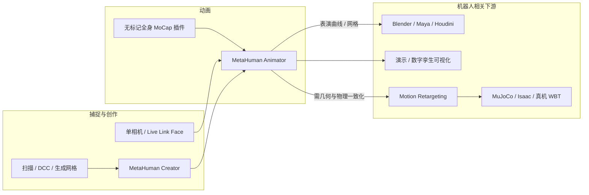

# MetaHuman（Epic 数字人平台）

**MetaHuman** 是 **Epic Games** 在 **Unreal Engine** 生态内提供的 **高保真数字人（digital human）** 创作与动画平台：通过 **MetaHuman Creator** 在数分钟内生成带毛发、服装且已绑定的写实角色，并用 **MetaHuman Animator** 从摄像头或离线素材驱动面部乃至全身表演。在机器人研究与工程中，它更常出现在 **人类参考运动可视化、遥操作化身、数字孪生演示与 DCC→引擎资产链** 上，而非替代 [MuJoCo](./mujoco.md) / [Isaac Lab](./isaac-gym-isaac-lab.md) 等控制级仿真后端。

## 英文缩写速查

| 缩写 | 英文全称 | 简要说明 |
|------|----------|----------|
| UE | Unreal Engine | Epic 实时 3D 引擎，MetaHuman Creator/Animator 的运行宿主 |
| DCC | Digital Content Creation | 数字内容创作软件（Maya、Houdini、Blender 等） |
| MoCap | Motion Capture | 动作捕捉；Animator 5.8 起支持单相机无标记全身捕捉（Experimental） |
| DNA | Digital Neutral Animation | MetaHuman 角色 rig 与变形数据的序列化格式（5.8 起核心库 MIT 开源） |
| ISKM | Instanced Skinned Mesh | 实例化蒙皮网格，Crowds 远景 LOD 用 |
| Retargeting | Motion Retargeting | 将人体表演映射到目标骨架；机器人栈中 MetaHuman 多作视觉/表演源而非直接关节轨迹 |

## 为什么对机器人栈重要

1. **人类运动与表演的低成本入口**：**MetaHuman Animator** 可用 **单离机位相机**（官网称 webcam 即可）离线求解 **面部 + 全身** 表演（5.8 Experimental，集成 Meshcapade 无标记动捕），为「视频/表演 → 人体轨迹 → [Motion Retargeting](../concepts/motion-retargeting.md)」提供 **产业级数字人拓扑** 上的参考，但仍需与机器人关节空间、接触物理分开处理。
2. **资产与可视化层**：遥操作、人机协作演示、具身 AI 宣传片中常见 **写实人类化身**；MetaHuman 提供 **毛发、服装、表情** 一体化方案，优于仅用 stick figure 或低模占位。
3. **跨工具链出口**：官方提供 **Maya / Houdini / Marvelous Designer** 插件，并随 **OpenRigLogic（MIT）** 向第三方开放 **RigLogic + DNA**，便于在非 UE 管线中保持角色兼容——与 [Blender](./blender.md)、[Mixamo](./mixamo.md) 等 DCC/在线库形成对照。
4. **与 UE 仿真栈的邻接关系**：[AirSim](./airsim.md) 等基于 UE 的机器人视觉仿真可与 MetaHuman 场景共存；[SPEAR](./spear-sim.md) 官方示例演示 **MetaHumans 多视角同步渲染** 与 Python 脚本化相机/GT 采集。MetaHuman 本身 **不以刚体控制环或 RL 环境 API** 为设计中心。

## 核心模块（2026-06 官网 + 5.8 发布）

| 模块 | 能力 | 机器人相关注记 |
|------|------|----------------|
| **MetaHuman Creator** | 数据库组装角色；**Mesh to MetaHuman** 将扫描/DCC/生成网格转为 MetaHuman 拓扑与 rig（5.8 支持 **全身**） | 人类外形与 rig 标准化，利于与动捕、视频姿态估计输出对齐 |
| **MetaHuman Animator** | 实时/离线面部；5.8 **全身** 单相机无标记（Experimental）；音频驱动表情与眨眼 | 可作 **表演捕捉** 上游，输出需经重定向才能喂给真机 WBT/IL |
| **MetaHuman Crowds**（Experimental） | Collections + Mass + 近远景 LOD，移动端数百、高端数千角色 | 多智能体/人群仿真 **视觉层**；非多机器人动力学仿真 |
| **MetaHuman Devkit / OpenRigLogic** | RigLogic、DNA 等 **MIT** 开源 | 第三方引擎或自定义可视化中嵌入 MetaHuman 兼容角色 |
| **Live Link Face** | iOS/Android 面部捕捉与 **实时视频** 回传 UE | 片场监督与表演复审；与机器人 teleop 的 **低延迟人机界面** 可类比但目标域不同 |

## 官方文档索引（Epic Developer Community）

[官方文档](https://dev.epicgames.com/documentation/metahuman/metahuman-documentation)将 MetaHuman 定义为 **UE5 驱动的完整框架**：创建、动画与使用 **fully rigged** 写实数字人。与 [官网归档](../../sources/sites/metahuman-com.md) 对照，[文档归档](../../sources/sites/metahuman-epic-docs.md) 侧重 **插件、管线与 API**：

| 文档模块 | 工程要点 |
|----------|----------|
| [Creator Overview](https://dev.epicgames.com/documentation/metahuman/metahuman-creator-overview) | 硬件要求、**Plugins Overview**、命名约定、术语表、数据使用政策 |
| [Creator](https://dev.epicgames.com/documentation/metahuman/metahuman-creator) | 面部/身体/发型/服装/材质组装 → **game-ready** 可动画资产 |
| [Animator](https://dev.epicgames.com/documentation/metahuman/metahuman-animator) | **实时**（webcam / Live Link Face / 音频）、**离线深度**（TrueDepth/HMC）、**离线单目**（含无标记视频与音频驱动）；含 **Performance Capture Guidelines**（身体+面部）、**Python API** |
| [Capture](https://dev.epicgames.com/documentation/metahuman/metahuman-capture) | Live Link Face 移动端安装与配置 |
| [MetaHumans in UE](https://dev.epicgames.com/documentation/metahuman/metahumans-in-unreal-engine) | **UE Cine** / **UE Optimized** 装配管线 → 关卡 Blueprint |
| [Crowds](https://dev.epicgames.com/documentation/metahuman/metahuman-crowds-in-unreal-engine) | **UE 5.8 Experimental** Collections 人群系统 |
| [Devkit](https://dev.epicgames.com/documentation/metahuman/metahuman-devkit-in-unreal-engine) | 含 **OpenRigLogic** 文档入口 |
| [Maya / Houdini](https://dev.epicgames.com/documentation/metahuman/metahuman-for-maya) | DCC 编辑与 Groom 工作流 |
| [Facial Description Standard](https://dev.epicgames.com/documentation/metahuman/mh-standards-docs) | Animator 驱动的 **Control Curves** 规范（烘焙 AnimSequence 的基础表示） |

**Animator 实时快速路径（文档）**：启用 MetaHuman Live Link 插件 → Live Link 窗口添加 **MetaHuman Video Source** → 关卡放置已装配角色 → Details 绑定 Live Link Subject → 面部表演驱动角色。

## 流程总览（表演 → 下游）

## 常见误区或局限

- **不是机器人运动学标准**：MetaHuman 拓扑与 **URDF/MJCF** 人形模型不等价；接入 [Whole-Body Tracking](../concepts/whole-body-tracking-pipeline.md) 前必须显式 **重定向与接触修正**。
- **表演优化 ≠ 物理可行**：与 [Mixamo](./mixamo.md) 类似，Animator 输出服务 **视觉可信度**；不宜直接当作辨识级 MoCap 或力矩级参考。
- **许可与分发**：角色资产、Fab 内容与 **OpenRigLogic 代码许可** 分离；开源数据集或商业产品集成前需核对 Epic **MetaHuman 许可** 与 UE EULA。
- **平台与功能差异**：Animator 在 **Linux/macOS** 上已可用，但各功能跨平台支持不一（以官方 Release Notes 为准）。

## 关联页面

- [Mixamo（Adobe 在线角色与动画）](./mixamo.md)
- [Blender（开源 DCC 枢纽）](./blender.md)
- [Motion Retargeting](../concepts/motion-retargeting.md)
- [Character Animation vs Robotics](../concepts/character-animation-vs-robotics.md)
- [动作重定向专题汇总](../overview/topic-motion-retargeting.md)
- [AirSim（UE 无人机/自驾视觉仿真）](./airsim.md)
- [MotionCode（产业侧运动数据）](./motioncode.md)

## 参考来源

- [MetaHuman 官网归档](../../sources/sites/metahuman-com.md)
- [MetaHuman 官方文档归档](../../sources/sites/metahuman-epic-docs.md)
- MetaHuman 官网：<https://www.metahuman.com/>
- MetaHuman 官方文档：<https://dev.epicgames.com/documentation/metahuman/metahuman-documentation>
- MetaHuman 5.8 发布说明：<https://www.metahuman.com/news/metahuman-5-8-is-now-available>

## 推荐继续阅读

- [MetaHuman Animator 文档](https://dev.epicgames.com/documentation/metahuman/metahuman-animator) — 实时/离线/音频驱动与无标记视频流程
- [MetaHuman Facial Description Standard](https://dev.epicgames.com/documentation/metahuman/mh-standards-docs) — Control Curves 规范
- [Epic OpenRigLogic](https://github.com/EpicGames/OpenRigLogic) — MetaHuman Devkit 开源入口
- [Mixamo](./mixamo.md) 与 [人形参考运动数据集选型](../comparisons/humanoid-reference-motion-datasets.md) — 区分商业数字人资产与科研 MoCap 档案
