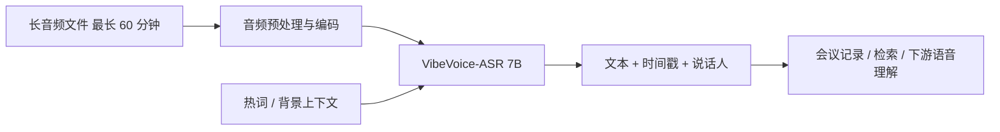
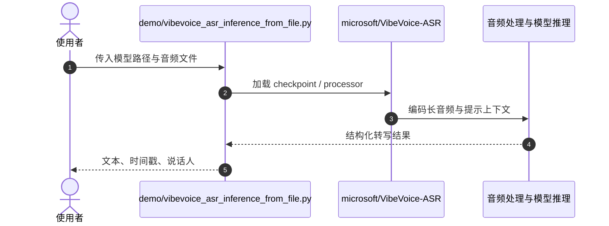

# Microsoft VibeVoice

**VibeVoice** 是 Microsoft 的开放语音模型系列；其中截图对应的 **VibeVoice-ASR** 将长音频的文字、说话人及时间戳共同解码，支持自定义热词和多语言，面向会议级录音转写。上游另有独立的 streaming ASR 与 TTS/量化模型路线。

## 英文缩写速查

| 缩写 | 英文全称 | 简要说明 |
|------|----------|----------|
| ASR | Automatic Speech Recognition | 自动语音识别；本页 ASR 模型主任务 |
| TTS | Text-to-Speech | 文本转语音；VibeVoice 家族其他模型方向 |
| LLM | Large Language Model | 长序列语义解码器架构类别 |
| CUDA | Compute Unified Device Architecture | NVIDIA GPU 并行计算平台，官方环境安装建议包含 CUDA |
| MIT | Massachusetts Institute of Technology License | 代码与 ASR 模型卡标注的宽松许可证 |

## 为什么重要

- **会议尺度上下文：** 官方文档宣称单次推理接收最长 60 分钟音频（64K token 限制），目标是缓解按短块切分导致的跨段上下文与说话人连贯性问题。
- **联合结构化输出：** 不只是纯文本 ASR；结果可表示谁在何时说了什么，使它能作为会议检索、对话分析或机器人语音理解前端。
- **有离线与流式两条部署路线：** ASR checkpoint 用于完整录音；ASR-Streaming checkpoint 逐块产出，不能把二者的延迟、上下文长度和语言支持合并成一个规格。
- **可私有化与可扩展：** 代码和 VibeVoice-ASR 模型卡标注 MIT；仓库还提供 vLLM/Transformers、微调与 CPU 量化链接，便于按算力预算选择。

## 架构与输入输出

VibeVoice-ASR 对音频进行统一编码与解码，按结构标记输出文本、时间戳和说话人。上游强调长音频单次处理、用户上下文/热词提示及语言自动适配；工程上可从 Gradio demo 或文件推理脚本开始。

### 本地推理时序

关键复现路径为安装上游包与音频依赖，再运行文件推理脚本；官方文档推荐匹配其 NVIDIA CUDA 容器环境。部署前应复核 GPU 显存、推理时延及 64K token 长音频的实际吞吐。

## 工程实践与开放状态

| 项目 | 核查结果（2026-10-09） |
|------|------------------------|
| 官方源码 | 已开源：[microsoft/VibeVoice](../../sources/repos/microsoft-vibevoice.md)，MIT，快照 commit `16fb2cb` |
| ASR 权重 | [Hugging Face checkpoint](https://huggingface.co/microsoft/VibeVoice-ASR)，模型卡标注 MIT；页面列 51 种语言 |
| 长音频入口 | `demo/vibevoice_asr_inference_from_file.py`；Gradio demo 可选 `--share`，公开共享时需注意音频隐私 |
| 流式入口 | 单独的 ASR-Streaming 模型与 FastAPI/WebSocket demo；上游公告为 10 种语言，见[官方文档](https://github.com/microsoft/VibeVoice/blob/main/docs/vibevoice-asr-streaming.md) |
| 环境 | 上游推荐 NVIDIA Deep Learning Container / CUDA；本机显存与 FlashAttention 依赖可能决定能否运行 |
| 许可证 | 主仓 MIT、VibeVoice-ASR model card MIT；不同 checkpoint 仍需逐一核查其模型卡 |

## 局限与使用边界

- **能力数值属于上游规格，不等于任意录音质量保证。** 60 分钟单次、51 种语言与热词提示均需在目标语言、口音、混响和重叠语音条件下验证。
- **长上下文不等于低延迟。** 非流式模型需等待录音并运行较大模型；需要边说边出字时应使用独立 streaming 模型。
- **说话人标签与时间戳需抽检。** 重叠、远场、多声道和相似音色可能造成归因/分段错误，关键会议记录应保留人工校对。
- **部署成本不可忽视。** 7B checkpoint 与 CUDA 环境不等同于轻量 CPU 工具；量化版本为独立实现，需重新评测精度和速度。
- **项目范围有历史变动。** README 表示 2025-09-05 移除了 VibeVoice-TTS 源码；不要据旧公告误以为所有曾发布的 TTS 实现仍在当前仓库可用。

## 与 MOSS Transcribe Diarize 的关系

[MOSS Transcribe Diarize](paper-moss-transcribe-diarize.md) 也是面向长音频的联合转写与说话人归因路线。两者可作为相邻候选比较：本页优先看 Microsoft 提供的 7B checkpoint、官方推理与 streaming 分支；MOSS 0.9B 的重点是其单 pass SATS 结构和相应评测。最终选型应在目标录音上比较字错率、说话人错分、时间戳误差、显存与时延，而不要只按“支持分钟数”排序。

## 关联页面

- [MOSS Transcribe Diarize](paper-moss-transcribe-diarize.md) — 开源长会议 SATS 模型
- [人形智能语音交互](../methods/humanoid-voice-interaction.md) — ASR 输出进入机器人 NLU/对话栈
- [Daily-Omni](paper-daily-omni.md) — 音频多模态模型与时序评测

## 参考来源

- [Microsoft VibeVoice 仓库归档](../../sources/repos/microsoft-vibevoice.md)
- [VibeVoice-ASR 项目页与模型卡归档](../../sources/sites/vibevoice-asr-huggingface.md)
- [VibeVoice-ASR 技术报告 arXiv:2601.18184](https://arxiv.org/abs/2601.18184)
- [VibeVoice-ASR-Streaming 技术报告 arXiv:2609.02812](https://arxiv.org/abs/2609.02812)

## 推荐继续阅读

- [VibeVoice-ASR 官方使用指南](https://github.com/microsoft/VibeVoice/blob/16fb2cb1217c9934a886e1948ffb06120caa2df5/docs/vibevoice-asr.md) — 环境、推理与热词配置
- [VibeVoice-ASR 模型卡](https://huggingface.co/microsoft/VibeVoice-ASR) — 当前权重版本和模型许可
- [流式 ASR 官方指南](https://github.com/microsoft/VibeVoice/blob/16fb2cb1217c9934a886e1948ffb06120caa2df5/docs/vibevoice-asr-streaming.md) — chunk 流式接口
