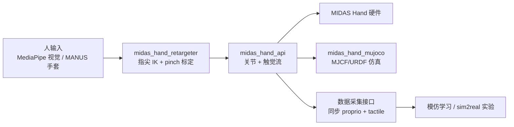

# MIDAS Hand

## 一句话定义

**MIDAS Hand**（Modular low-Impedance Direct-drive Anthropomorphic Sensing Hand）是加州大学洛杉矶分校 **Dennis Hong** 组发布的 **全栈开源仿人触觉灵巧手**：**16 总 DoF / 13 主动 DoF**、**283** 个三轴触觉 taxel、约 **700 g**、材料 **<3,000 USD**、3D 打印 **<3 h** 装配；官方入口为 [midas-hand.com](https://midas-hand.com) 与 GitHub 组织 [midas-hand-org](https://github.com/midas-hand-org)。

## 英文缩写速查

| 缩写 | 英文全称 | 简要说明 |
|------|----------|----------|
| DOF | Degrees of Freedom | 独立运动轴数量；MIDAS 为 16 总 / 13 主动 |
| DTA | Dynamic Tactile Array | 动态触觉阵列；MIDAS 集成 Paxini 三轴 taxel |
| DIP / PIP | Distal / Proximal Interphalangeal Joint | 远侧 / 近侧指间关节；DIP 经四连杆与 PIP 欠驱动耦合 |
| MCP | Metacarpophalangeal Joint | 掌指关节，含屈伸与外展/内收 |
| MJCF | MuJoCo XML Format | MuJoCo 仿真模型描述格式 |
| URDF | Unified Robot Description Format | 统一机器人描述格式，用于仿真与运动学 |

## 为什么重要

- **触觉 + 直驱 + 低成本同时成立：** 相对 [LEAP Hand](https://github.com/leap-hand/LEAP_Hand)（无触觉、约 30% 大于人手）与腱驱动开源手（[RUKA-v2](./ruka-v2-hand.md)、[ORCA](./orca-hand.md)），MIDAS 以 **直驱 Dynamixel + Paxini DTA** 在 **<3K USD** 量级提供 **人形尺度 + 283 taxel**。
- **低背驱力矩利于接触丰富交互：** 论文测得各主动关节背驱力矩约 **0.02 N·m**，约为同协议下 Sharpa Wave 的 **1/3–1/30**；关节在外力下更易顺从，利于碰撞鲁棒与柔顺抓取。
- **模块化可维护：** 食/中/无名指为 **相同可拆模块**；整手 **<3 h** 装配、单指更换 **<15 min**，适合长期实验与零件替换。
- **学习数据采集栈已发布：** Python 控制/触觉 API、MuJoCo、dex-retargeting 封装与 **MediaPipe 摄像头遥操作** 分仓开源；支持 **MANUS 手套** 与可选触觉力反馈，便于 human-to-robot 示范收集。

## 硬件要点

| 维度 | 规格（论文/项目页） |
|------|---------------------|
| 驱动 | **直驱（Direct）**；13× Dynamixel **XM335-T323-T** |
| 总 / 主动 DoF | **16 / 13**（四指 + 对掌拇指；DIP 被动耦合 PIP） |
| 尺寸 | **205×120×55 mm**（接近成人手） |
| 重量 | **~700 g** |
| 触觉 | **283** 三轴 taxel（3×52 指尖 + 127 拇指 Paxini GEN3） |
| 结构 | **3D 打印** 主体；掌部定制配电板 |
| 成本 | BOM **<3,000 USD** |
| 装配 | **<3 h**（项目页） |

**实验摘要：** GRASP taxonomy **32/33**；整手载荷 **~9.5 kg**；2 h **5,143** 次抓握热稳态约 **49 °C**；100 次闭合重复性 **σ=0.016 mm**。

## 软件与数据采集管线

- **四仓库分工：** `midas_hand_api`（真机）、`midas_hand_mujoco`（仿真）、`midas_hand_retargeter`（人→机关节）、`midas_hand_teleop`（摄像头直播遥操作）；详见 [sources/repos/midas-hand-org.md](../../sources/repos/midas-hand-org.md)。
- **CAD/BOM/装配：** 在 [midas-hand.com](https://midas-hand.com) 的 Parts / CAD / Assembly 分区；Onshape 源 + STEP/3MF 下载。

## 与相近平台对照（论文 Table I 归纳）

| 平台 | 驱动 | 触觉 | 尺度 | 重量 | 成本量级 |
|------|------|------|------|------|----------|
| LEAP Hand | 直驱 | 无 | ~大 30% | ~1,000 g | ~2K USD |
| RUKA-v2 | 腱 | 无 | 人形 | N.A. | ~1.5K USD |
| ORCA | 腱 | BTF | 人形 | ~1,200 g | ~2.5K USD |
| Allegro v5+ | 直驱 | 气动 | ~大 30% | 1,240 g | ~11K USD |
| Wuji Hand | 直驱 | 无 | 人形 | <600 g | ~16K USD |
| Sharpa Wave | 直驱 | DTA | 人形 | ~1,300 g | ~50K USD |
| **MIDAS Hand** | **直驱** | **DTA** | **人形** | **~700 g** | **<3K USD** |

## 开源状态（项目页核查，2026-07-20）

- **已开源：** 控制/仿真/重定向/遥操作 **四个 Python 仓库**、通信板 PCB 文档、静态站源码；CAD/BOM/装配文档与下载在 **midas-hand.com**。
- **边界：** 完整可编辑 CAD 在 **Onshape**（非 Git monorepo）；触觉模组与 Dynamixel 为 **商业现货**；论文明确触觉 **尚未用于闭环控制**，当前为传感与演示级集成。

## 局限与风险

- **无小指：** 四指设计使 GRASP taxonomy 中 **1/33** 类失败，尺侧支撑与部分 in-hand 动作受限。
- **载荷与热：** 指尖 **1.2 kg** 可持续载荷受电机过热限制；长时间高频抓握需关注 **~49 °C** 热稳态与占空比。
- **被动 DIP：** 欠驱动 DIP 简化控制与成本，但牺牲独立远端关节控制与部分人手工作空间（食指矢状面约 **80.1%** 人手面积）。
- **任务级验证不足：** 论文侧重硬件表征（背驱、可靠性、触觉读数、遥操作演示），**非** 端到端自主操作策略 benchmark。

## 关联页面

- [Manipulation](../tasks/manipulation.md) — 灵巧操作与开源手选型
- [Teleoperation](../tasks/teleoperation.md) — 视觉/MANUS 遥操作采集
- [Tactile Sensing](../concepts/tactile-sensing.md) — 触觉模态与 visuotactile 学习语境
- [灵巧操作数据采集指南](../queries/dexterous-data-collection-guide.md) — 开源手 + 重定向管线对照
- [RUKA-v2 Hand](./ruka-v2-hand.md) — 更低成本腱驱动开源对照
- [Orca Hand](./orca-hand.md) — 另一类开源仿手
- [Allegro Hand](./allegro-hand.md) — 商业科研直驱平台对照

## 推荐继续阅读

- 项目页与演示：<https://midas-hand.com>
- 论文 PDF：<https://arxiv.org/pdf/2607.14487>
- 代码组织：<https://github.com/midas-hand-org>
- 软件安装索引：<https://midas-hand.com/software>

## 参考来源

- [midas_hand_arxiv_2607_14487.md](../../sources/papers/midas_hand_arxiv_2607_14487.md)
- [midas-hand-org.md](../../sources/repos/midas-hand-org.md)
- [midas-hand-com.md](../../sources/sites/midas-hand-com.md)
