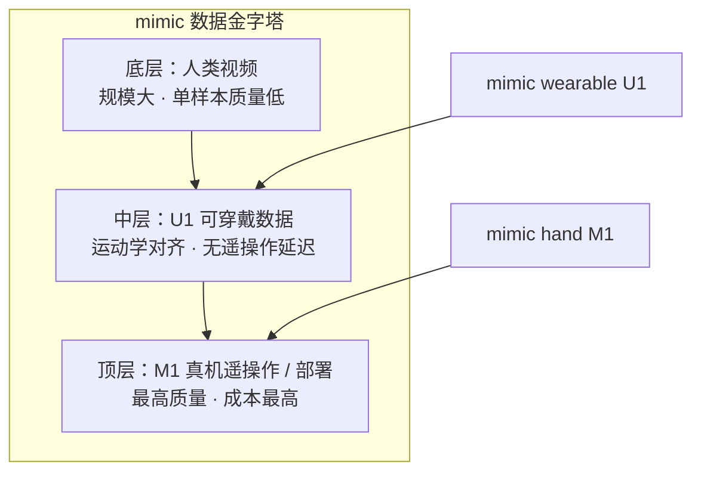

# mimic hand M1

| 字段 | 内容 |
|------|------|
| **机构** | 迷可机器人 Mimic Robotics（瑞士） |
| **类型** | 产业自研腱驱动灵巧手（2026-07 博客发布） |
| **配对采集** | [mimic wearable U1](./mimic-wearable-u1.md)（umimic，运动学/传感 1:1） |

**mimic hand M1** 是 **mimic robotics** 为 **通用人形尺度灵巧操作** 自研制造的 **高度后驱、腱驱动** 工业手：以 **1:1 人形功能 DoF**（含外展与对向拇指）服务数据迁移，用 **前臂滑轮腱路由** 同时覆盖 **精细力感知** 与 **>25 kg 稳态抓握**。

## 一句话定义

**瑞士自研、AI-first 的 15-DoF 腱驱动灵巧手：滑轮导向腱传动 + 双编码器力估计 + 指尖触觉，为固定人手形态的全栈 Video-Action 学习与工厂班次级鲁棒接触而设计。**

## 英文缩写速查

| 缩写 | 英文全称 | 简要说明 |
|------|----------|----------|
| DoF | Degrees of Freedom | 独立可控运动轴；M1 为 15 主动 + 6 耦合 |
| MCP / PIP / DIP | Metacarpophalangeal / Proximal·Distal Interphalangeal | 掌指 / 近·远指间关节 |
| CMC | Carpometacarpal Joint | 腕掌关节，拇指对掌关键自由度 |
| VAM | Video-Action Model | mimic 视频潜计划 + 动作解码器路线 |
| IPC | Inter-Process Communication | 进程间通信；mimic 自研 mimic-ipc 中间件 |
| AI-first | AI-first Hardware Design | 按学习任务与数据可迁移性裁剪机构，而非纯解剖复制 |

## 为什么重要

- **全谱人类能力单系统：** 博客主张掌内电机手在 **后驱性 vs 载荷** 上不可兼得；M1 用 **前臂腱驱动 + 工业现货执行器** 同时瞄准 **50 g 级力感知** 与 **25 kg 级稳态抓握**。
- **固定形态消除跨形态鸿沟：** 与 [mimic-video](../methods/mimic-video.md) 一致，mimic 赌注是 **人视频预训练 → 同形态手后训练**，避免二指夹爪带来的示范步骤不对齐。
- **可观测性即传感器：** 反驱 **<0.05 Nm**、关节背隙 **<0.3°**、指尖 **±0.18 mm** 闭环精度，配合触觉切向力，把手定位为 **「inform intelligence」的力觉前端**，而非纯执行器。
- **工业可维护性：** 线性腱路（轴承/滑轮，非 Bowden）、**45°** 过伸裕度、主动气冷（**0.7 m³/min**），面向 **重复碰撞与多年班次** 而非实验室单次 demo。

## 硬件要点

| 维度 | 规格（官方博客，2026-07-16） |
|------|------------------------------|
| 驱动 | 双向、**滑轮导向腱驱动**（前臂电机） |
| DoF | **15 主动 + 6 耦合 = 21** |
| 反驱扭矩 | **< 0.05 Nm** |
| 力估计灵敏度 | **< 0.1 N**（双编码器） |
| 指尖稳态力 | **25 N**（手指伸直） |
| 稳态载荷 | **> 25 kg**（圆柱 power grasp） |
| 指尖定位 | **± 0.18 mm**（闭环关节编码器） |
| 触觉 | 法向、切向剪切、多点接触位置 |
| 相机 | 全局快门、同步（腕装） |
| 制造 | 瑞士自研自产 |

**设计取舍：** 指尖区保人形接触几何；腕部 **刻意加宽** 以容纳线性腱架构——位于腕相机后方，对策略观测影响小。

## 数据金字塔中的位置

## 软件栈（同公司，博客摘要）

- **mimic-ipc：** 零拷贝硬实时 IPC（相对 ROS2 FastDDS 作者自报数量级加速）。
- **重定向：** [Smooth Operator（SBR）](https://mimicrobotics.github.io/smooth-operator/) 采样式低抖动重定向；代码 [mimicrobotics/mimic_retargeter_lab](https://github.com/mimicrobotics/mimic_retargeter_lab)。
- **AI：** 延续 [mimic-video](../methods/mimic-video.md) **Video-Action Model** 路线。

## 局限与风险

- **硬件未开源：** 截至 2026-07-17 官网无 M1 CAD/固件仓库，复现与第三方集成依赖商业合作。
- **mimic-ipc / 机队栈闭源：** 性能数据来自厂商博客，需独立基准验证。
- **与科研平台成本对比：** 相对 [Allegro Hand](./allegro-hand.md)、[RUKA-v2](./ruka-v2-hand.md) 等可复刻开源手，M1 定位 **工业部署 + 全栈数据闭环**，非学术低价平台。

## 关联页面

- [mimic wearable U1](./mimic-wearable-u1.md) — 1:1 运动学/传感示范采集
- [mimic-video（VAM）](../methods/mimic-video.md) — 同公司视频-动作模型
- [Manipulation 任务](../tasks/manipulation.md)
- [Teleoperation](../tasks/teleoperation.md)
- [Motion Retargeting](../concepts/motion-retargeting.md)
- [Tactile Sensing](../concepts/tactile-sensing.md)
- [Kyber Labs](./kyber-labs.md) — 另一条背驱动产业灵巧手叙事

## 推荐继续阅读

- 官方发布博客：<https://www.mimicrobotics.com/blog/solving-dexterity-a-full-stack-approach>
- mimic 形态哲学（2025）：<https://www.mimicrobotics.com/blog/form-follows-data>
- [mimic-video 项目页](https://mimic-video.github.io/)

## 参考来源

- [Solving Dexterity 博客摘录](../../sources/blogs/mimicrobotics_m1_u1_full_stack.md)
- [mimicrobotics.com 项目页核查](../../sources/sites/mimicrobotics.md)
