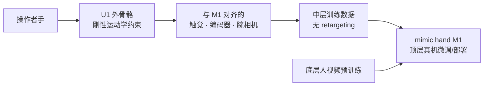

# mimic wearable U1（umimic）

| 字段 | 内容 |
|------|------|
| **机构** | 迷可机器人 Mimic Robotics（瑞士） |
| **类型** | 被动外骨骼示范采集器（2026-07 与 M1 同期发布） |
| **别名** | umimic |
| **目标硬件** | [mimic hand M1](./mimic-hand-m1.md) |

**mimic wearable U1** 是 mimic 的 **固定运动学外骨骼**：操作者用自己的手指驱动机构，但 **被刚性连杆约束在 M1 可达空间内**，并复制 M1 的 **触觉、编码器与腕相机位姿**，从而在无真机、无 retargeting 延迟的情况下采集 **与机器人观测对齐** 的灵巧示范。

## 一句话定义

**与 mimic hand M1 运动学/传感/视觉 1:1 对应的被动外骨骼（umimic），用机械耦合替代软件重定向，在数据金字塔中层规模化采集高保真灵巧操作示范。**

## 英文缩写速查

| 缩写 | 英文全称 | 简要说明 |
|------|----------|----------|
| UMI | Universal Manipulation Interface | Stanford 无机器人夹爪示范范式；U1 将其扩展到多指灵巧 |
| DoF | Degrees of Freedom | U1 跟踪 **14 + 6 耦合 = 20** |
| Teleop | Teleoperation | 真机遥操作；U1 旨在减少对其规模化的依赖 |
| IL | Imitation Learning | 模仿学习；示范质量上限决定策略上限 |
| Egocentric | Egocentric Vision | 腕/第一视角视觉；U1 腕相机与 M1 对齐 |

## 为什么重要

- **扩展 UMI 到灵巧手：** [UMI](https://umi-gripper.github.io/) 证明 **只操作末端执行器、不占用机器人** 也能采示范；U1 把同一思想从 **二指夹爪** 推到 **全指灵巧**，且 **传感模态与目标手一致**。
- **中层数据定位：** mimic **数据金字塔** 中，U1 介于 **海量人视频** 与 **昂贵真机遥操作** 之间——比任意 egocentric 视频 **对齐更好**，比工厂内部署机器人 **更易扩展**。
- **显式设计取舍：** 放弃「适配一切手寸」的通用可穿戴，选择 **固定几何 + 有限手寸范围**，换取 **零 retargeting 延迟** 与 **近人类原生速度**，直接缓解遥操作疲劳与抖动上限问题。
- **与 M1 共设计：** 拇指 CMC 对位、四指置于机器人指耦合后方等细节，说明 U1 不是后装数据采集配件，而是 **全栈 co-design** 的一环。

## 机制要点

| 维度 | 说明 |
|------|------|
| 驱动 | **被动外骨骼**，用户施力 |
| DoF | **14 跟踪 + 6 耦合 = 20**（M1 匹配） |
| 运动学 | 刚性连杆 **机械强制** 1:1 映射 |
| 触觉 | 与 M1 相同：法向、切向、多点接触 |
| 视觉 | 全局快门腕相机，**机器人等效视点** |
| 指尖精度 | **± 0.18 mm**（关节编码器） |
| 手套 | 工作手套，可按应用定制 |

**拇指工程：** 对掌与 CMC 运动最难；用户拇指置于机器人拇指 **上方**，四指位于机器人指耦合 **后方**，在人体工学与严格运动学对应之间折中。

## 流程总览

## 局限与风险

- **手寸与人体工学：** 固定几何仅适合 **特定手寸范围**；不适合作为通用公众采集设备。
- **硬件未开源：** 与 M1 相同，截至 2026-07-17 **无公开 CAD/固件**。
- **仍非真机接触动力学：** 操作者通过 **自己的手指** 感受接触，机器人端惯性/摩擦/温控仍须顶层真机数据补齐。
- **与视觉 teleop 对照：** 无遮挡问题，但设备成本与穿戴流程高于 [纯视觉方案](../comparisons/data-gloves-vs-vision-teleop.md)。

## 关联页面

- [mimic hand M1](./mimic-hand-m1.md) — 目标机器人手
- [mimic-video（VAM）](../methods/mimic-video.md) — 消费数据的模型路线
- [Teleoperation](../tasks/teleoperation.md)
- [灵巧操作数据采集指南](../queries/dexterous-data-collection-guide.md)
- [数据手套 vs 视觉遥操作](../comparisons/data-gloves-vs-vision-teleop.md)

## 推荐继续阅读

- 官方发布：<https://www.mimicrobotics.com/blog/solving-dexterity-a-full-stack-approach>
- UMI 原始工作：<https://umi-gripper.github.io/>

## 参考来源

- [Solving Dexterity 博客摘录](../../sources/blogs/mimicrobotics_m1_u1_full_stack.md)
- [mimicrobotics.com 项目页核查](../../sources/sites/mimicrobotics.md)
