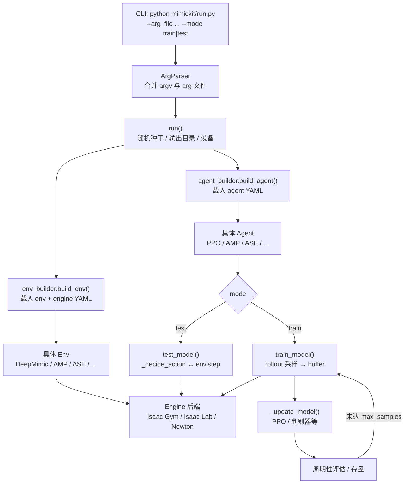
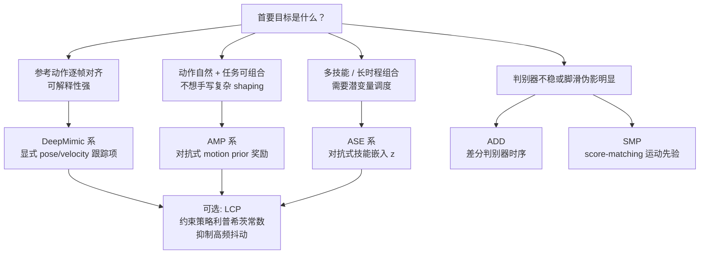

# MimicKit: 运动模仿与控制研究套件

**MimicKit** 是 [Xue Bin Peng（彭学斌）](./xue-bin-peng.md) 团队（Stanford / UC Berkeley / NVIDIA 等合作脉络）维护的 **物理角色运动模仿与控制** 研究代码库：把多篇代表性工作里的训练细节收敛到同一套环境、网络与 RL 循环上，便于对照实验与二次开发。

## 为什么重要？

- **算法族谱集中**：DeepMimic（显式跟踪）、AMP / ADD（对抗式风格先验）、ASE（技能潜空间）、AWR（离线倾向加权）、LCP（利普希茨约束平滑）、SMP（生成式运动先验）等可在同一仓库内切换，减少「换论文就要换代码栈」的摩擦。
- **工程边界清晰**：入口脚本、`env_builder` / `agent_builder`、并行仿真 **Engine** 分层，YAML 配置驱动，适合作为 **motion imitation** 方向的默认实验床。
- **数据与角色管线**：提供面向 MoCap / SMPL 系数据的工具链思路（重定向、指数映射姿态表示等），与「只训一个孤立 policy」相比，更贴近论文级完整复现路径。

## 运行时主流程

从命令行到一次训练迭代，逻辑上可以概括为：**解析参数 → 构建并行环境 → 构建 Agent → 在 train/test 分支里驱动仿真循环**。

上图对应仓库里「`run.py`  orchestrates、`BaseAgent` 持有训练循环、`BaseEnv` 对接引擎」的心智模型；具体类名与文件路径以实现为准。

## 算法与先验选型（简版决策）

下列问题用于 **粗粒度** 选型；真实项目往往还要叠加任务奖励（速度跟踪、地形、操控物体等）与算力约束。

- **AWR**：更偏「稳定、样本效率友好」的策略更新形式，可与上述先验/任务奖励组合使用时阅读 [AWR](../methods/awr.md)。

## 核心架构（概念分层）

MimicKit 采用高度解耦设计：更换仿真后端、替换环境模板或换 RL / 对抗模块时，尽量 **不牵动全局胶水代码**。

| 层级 | 职责 | 备注 |
|------|------|------|
| **配置** | `arg` 文本 + YAML：环境、引擎、智能体超参 | 指数映射姿态、并行环境数、可视化开关等 |
| **Engine** | 并行物理步进、张量化观测与奖励 | 多后端抽象；以实际 release 支持矩阵为准 |
| **Env** | 任务定义、奖励拼装、终止条件 | `DeepMimic` / `AMP` / `ASE` 等环境族 |
| **Agent** | 采样、优化器、网络与（若有）判别器 | `PPOAgent`、`AMPAgent` 等 |
| **Anim / Tools** | 动作表示、重定向与数据转换 | 与 MoCap、SMPL 系资产对接 |

### 关联方法与技术路线

| 技术 | 核心页面 | 应用场景 |
|------|---------|----------|
| **DeepMimic** | [DeepMimic](../methods/deepmimic.md) | 显式轨迹跟踪，复现参考动作 |
| **AMP** | [AMP Reward](../methods/amp-reward.md) | 判别器奖励学习自然运动风格 |
| **AWR** | [AWR](../methods/awr.md) | 优势加权回归，稳定策略更新 |
| **ASE** | [ASE](../methods/ase.md) | 层次化控制与长程任务组合 |
| **LCP** | [LCP](../methods/lcp.md) | 抑制高频振荡，提升策略平滑性 |
| **ADD** | [ADD](../methods/add.md) | 差分判别器减轻脚滑与伪影 |
| **SMP** | [SMP](../methods/smp.md) | 生成式运动先验替代纯在线对抗判别 |

## 典型工作流

1. **数据准备**：MoCap / AMASS(SMPL) 等 → 重定向到目标骨架 → MimicKit 可读动作格式。
2. **算法选择**：见上文流程图；从 `view_motion` / `dof_test` 类配置起步熟悉观测与动作维度。
3. **训练与回放**：`train` 模式堆样本至 `max_samples`；`test` 模式加载 `model_file` 做策略检验与可视化。

## 局限与注意

- **仿真后端生命周期**：Isaac Gym 已进入维护尾声的行业共识；新工作优先确认 **Isaac Lab / Newton** 分支在本地的可用性与版本 pin。
- **不是「开箱即真机」栈**：默认强项在 **并行仿真里的角色控制研究**；上真机仍需估计、安全层与部署管线。
- **论文复现≠默认超参即最优**：不同角色质量、接触刚性与奖励权重对 AMP / 判别器类方法极敏感，需要留预算做消融。

## 关联页面

- [protomotions](protomotions.md) — NVIDIA 侧大规模运动学习框架，可与本仓库对照「数据与并行训练哲学」。
- [robot-lab](robot-lab.md) — Isaac Lab 生态中的机器人实验框架入口。
- [imitation-learning](../methods/imitation-learning.md) — MimicKit 所属研究领域总览。

## 参考来源

- 仓库与说明：[sources/repos/mimickit.md](../../sources/repos/mimickit.md)（含 GitHub、Stanford 项目页与 arXiv 索引）
- 组内学习笔记（流程与代码导读，非官方文档）：[resources/train/MimicKit/MimicKit.md](../../resources/train/MimicKit/MimicKit.md)、[resources/train/MimicKit/MimicKit 02 关键流程 UML 图.md](../../resources/train/MimicKit/MimicKit 02 关键流程 UML 图.md)
