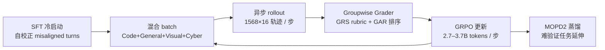
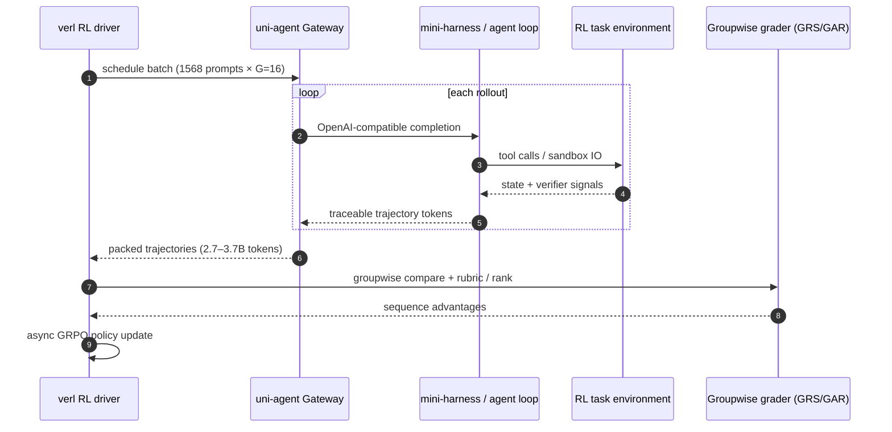

# MiMo-V2.6（Scaling RL Toward Self-Improvement）

**MiMo-V2.6**（[发布说明](https://mimo.mi.com/docs/zh-CN/news/latest/v2-6) · [技术报告 PDF](https://huggingface.co/XiaomiMiMo/MiMo-V2.6-Pro-RL/blob/main/MiMo_V2_6_technical_report.pdf) · [HF 集合](https://huggingface.co/collections/XiaomiMiMo/mimo-v26)）是 **Xiaomi MiMo Team（LLM-Core）** 2026 年 9 月发布的 **原生全模态 MoE** 系列：**Pro** 与 **Flash** 两个 RL 旗舰 checkpoint，外加社区复现用的 **MiMo-V2.6-Distill-Qwen-9B**。核心主张是把 **强化学习算力** 在 **训练 batch、任务环境 diversity、Grader 算力** 三个维度同时放大，沿 **RSI（递归自我改进）** 路径让模型在可验证任务上持续探索—反馈—改进。

| 机构 | 小米 MiMo（LLM-Core Xiaomi） |
|------|------------------------------|
| 官网 | <https://mimo.mi.com/> |
| API | <https://platform.xiaomimimo.com>（模型名全小写：`mimo-v2.6-pro` / `flash`） |
| 开源 | **已开源** — 权重 MIT + RL 框架 + ~7k 环境（见下方「局限与风险」边界） |

> **与小米机器人 VLA 消歧：** [Xiaomi-Robotics-1](./xiaomi-robotics-1.md) 等属 **Xiaomi Robotics 实验室** 的 **VLA 动作策略** 线；MiMo-V2.6 是 **通用 Agent / 全模态基座**，发布说明中的 **Franka 具身 demo** 属于 **Vibe World / CUA** 能力展示，**不是** XR-1 权重或训练栈的延续。

## 一句话定义

MiMo-V2.6 用 **一次混合域 RL（You Only RL Once）** 在 Code / General / Visual / Cyber 四域 **~7k 可验证任务** 上同步扩展 GRPO 训练与 **Groupwise Agentic Grading（GRS+GAR）**，把 Pro 推到 **DeepSWE v1.1 72.6 / OSWorld-Verified 82.0** 量级，并开源 **Distill-9B + verl + uni-agent** 供社区复现大规模 Agentic RL。

## 英文缩写速查

| 缩写 | 英文全称 | 简要说明 |
|------|----------|----------|
| RL | Reinforcement Learning | 后训练核心范式；本系列强调算力三维扩展 |
| RSI | Recursive Self-Improvement | 递归自我改进；MiMo-V2.6 公开叙事的主线 |
| GRPO | Group Relative Policy Optimization | 组相对策略优化；异步大 batch RL 目标 |
| GRS | Groupwise Reward Synthesis | 离线对比 rollout 合成 rubric 奖励 |
| GAR | Groupwise Advantage Redistribution | 在线组内排序并重分配正 advantage |
| MoE | Mixture of Experts | 稀疏专家；Pro 384 routed / 8 activated |
| SWA | Sliding Window Attention | 局部窗口注意力；与 GA 交替 |
| GA | Global Attention | 全局注意力层 |
| MTP | Multi-Token Prediction | 5 层投机解码 drafter |
| CUA | Computer Use Agent | 图形界面理解与操作 Agent 能力 |

## 为什么重要

- **把「Agent RL 能否 scale」做成可审计公开实验：** Live RL **~6 天 / 30 步 / ~75 万轨迹**，报告给出 **$2.6M（Pro）/$0.9M（Flash）** 量级成本与 **DeepSWE** 随成本单调曲线——对 [仿真评测基础设施](../concepts/simulation-evaluation-infrastructure.md) 与 Agent 训练基建选型有直接参考。
- **Grader 即算力维度：** 二元 pass/fail 不足以排序同组成功轨迹；**GRS+GAR** 把奖励信号本身 scale 化，并配合 reward hacking 防线（冻结 router、对抗筛查、轨迹审计）。
- **Multi-Harness 泛化：** 解耦 **mini-harnesses**（prompt / tools / context）与 **Multi-Harness Training**，缓解「只在单一生产 harness 上过拟合策略」——对 [RoboDojo](./robodojo.md) / [XPolicyLab](./xpolicylab.md) 等多 harness 评测生态有方法论对照价值。
- **开源栈完整度罕见：** 除 **1T 级权重** 外，释放 **7k 环境 + verl + uni-agent + Distill-9B GRPO 复现实验**，降低 Agentic RL 复现门槛。

## 核心结构

### 模型变体

| 变体 | 规模 | 角色 |
|------|------|------|
| **MiMo-V2.6-Pro-RL** | **1.02T total / 42B activated** MoE | 旗舰；1M 上下文；五模态 |
| **MiMo-V2.6-Flash-RL** | **~311B total** MoE | 效率档；全面超越 MiMo-V2.5-Pro（官方表） |
| **MiMo-V2.6-Distill-Qwen-9B** | ~9.4B dense | 社区 RL 起点；11 项评测 RL 后均优于 SFT |

### 流程总览（混合域 RL）

### 代表性评测（Pro-RL README，与闭源对照）

| 域 | Benchmark | MiMo-V2.6 Pro | 参照 |
|----|-----------|---------------|------|
| Code Agent | DeepSWE v1.1 | **71.9** | Claude Opus 5 **74.0** |
| General Agent | OSWorld-Verified | **82.0** | GPT-5.6 Sol **83.0** |
| General Agent | Terminal Bench 2.1 | **89.9** | Claude Opus 5 **89.1** |
| Cyber | MiMo Cyber Bench | **80.2** | MiMo-V2.5 Pro **0.0** |
| Visual Agent | MiMo VisualCoding | **72.3** | GPT-5.6 Sol **73.4** |

AA Intelligence Index **46**（发布说明：开源 SOTA 叙事；仍落后部分闭源）。

## 工程实践

| 场景 | 建议 |
|------|------|
| **复现 Distill-9B RL** | 从 [MiMo-V2.6-Distill-Qwen-9B](https://huggingface.co/XiaomiMiMo/MiMo-V2.6-Distill-Qwen-9B) SFT 出发，用开源 **~7k 环境** 分域 GRPO（Table 6：SWE-bench Verified **61.1→66.2** 等） |
| **接入自定义 harness** | [uni-agent](https://github.com/XiaomiMiMo/uni-agent) Gateway：OpenAI/Anthropic 兼容 endpoint → 训练 token；参考 `examples/` recipes |
| **训练后端** | [XiaomiMiMo/verl](https://github.com/XiaomiMiMo/verl) fork；注意控制面/数据面解耦与训练—推理一致性 |
| **部署 Pro/Flash** | SGLang 多节点 TP/EP 或 vLLM MiMo recipe；采样 `temperature=1.0, top_p=0.95` |
| **具身相关 demo** | 发布说明：**多视角相机 → Franka Panda 闭环**（仿真）；若需 **操纵策略 benchmark**，对照 [RoboDojo](./robodojo.md) 与 [MiMo-Embodied](https://github.com/XiaomiMiMo/MiMo-Embodied)（**评测仓**，非 V2.6 权重） |
| **与 RoboBench 关系** | [RoboBench](./robo-bench.md) 覆盖 **MiMo-Embodied** 等 MLLM；**勿**把 V2.6 Agent 分数与具身 VLA 成功率混读 |

## 源码运行时序图

关键复现路径：报告 §7 + [uni-agent recipes](https://github.com/XiaomiMiMo/uni-agent/tree/main/examples) + 开源环境清单；**Pro/Flash 全量 RL** 需集群级算力，社区默认从 **Distill-9B** 入手。

## 局限与风险

- **Pro/Flash 部署门槛极高：** 1T MoE 需多节点 **TP+EP**（README 示例 16+ GPU 级）；UltraSpeed/API 为闭源加速路径。
- **具身能力边界：** 发布说明 Franka demo 为 **产品叙事**，**无** 与 [Xiaomi-Robotics-1](./xiaomi-robotics-1.md) 共享的 VLA 权重或 UMI 数据管线；[MiMo-Embodied](https://github.com/XiaomiMiMo/MiMo-Embodied) 是 **独立 7B 级 VLM 评测** 线。
- **Benchmark 口径：** 部分为 **MiMo 内部 mini bench**（Cyber / Visual Coding）；与 [RoboDojo](./robodojo.md) verified 榜 **不同协议**。
- **成本数字：** 报告 **$2.6M/$0.9M** 与发布说明 **$262万/$85万** 为同一量级不同表述；引用时注明来源。
- **Reward hacking：** 虽有多层防线，长程 Agent RL 仍可能存在未审计捷径；报告强调离线轨迹审计与 grader fallback。

## 关联页面

- [Xiaomi-Robotics-1](./xiaomi-robotics-1.md) — 小米 **机器人 VLA** 谱系（不同团队）
- [RoboDojo](./robodojo.md) — 通用操纵 sim-and-real 评测（与 Sipai/Agent 叙事对照）
- [RoboBench](./robo-bench.md) — 含 **MiMo-Embodied** 的 MLLM 认知评测
- [VLA](../methods/vla.md) — 机器人动作策略方法总览

## 推荐继续阅读

- [MiMo-V2.6 发布说明（中文）](https://mimo.mi.com/docs/zh-CN/news/latest/v2-6)
- [技术报告 PDF](https://huggingface.co/XiaomiMiMo/MiMo-V2.6-Pro-RL/blob/main/MiMo_V2_6_technical_report.pdf)
- [HF 集合 mimo-v26](https://huggingface.co/collections/XiaomiMiMo/mimo-v26)

## 参考来源

- [技术报告归档](../../sources/papers/mimo_v2_6_technical_report_2026.md)
- [发布说明归档](../../sources/blogs/mimo_v2_6_release_2026-09-22.md)
- [开源资源索引](../../sources/repos/mimo-v2-6.md)
