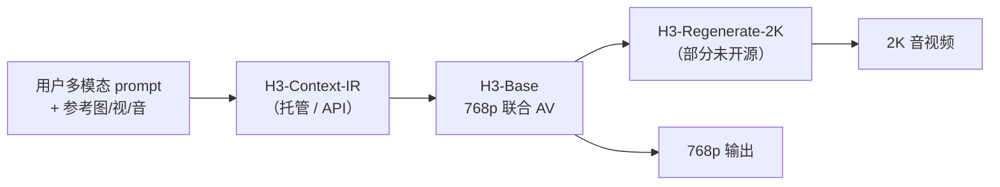
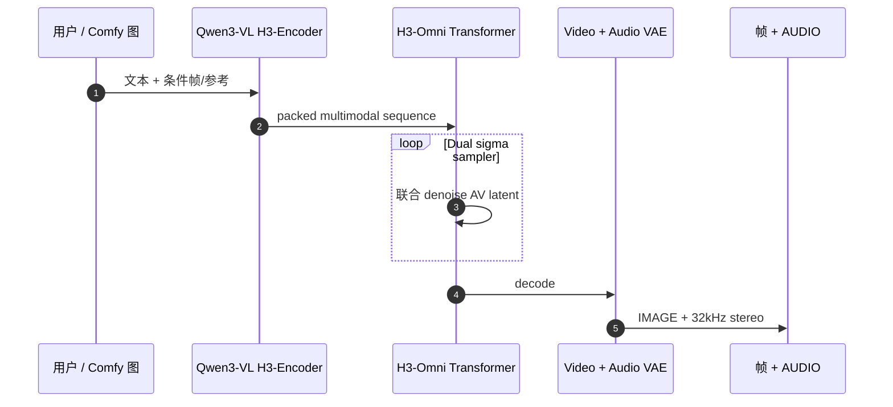

# MiniMax H3

**MiniMax H3**（[官方博客](https://www.minimax.io/blog/minimax-h3)，[GitHub](https://github.com/MiniMax-AI/MiniMax-H3)，[Hugging Face](https://huggingface.co/MiniMaxAI/MiniMax-H3)）是 MiniMax 的 **任务泛化型全模态生成系统**：在 **文本、图像、视频、音频** 组成的上下文中统一理解与生成，输出 **4–15 s、24 FPS、32 kHz 立体声** 的联合音视频（短边默认 **768p**，**2K** 经 Regenerate / In-Context 路径）。在机器人知识库中，它主要作为 **世界模型 / 仿真视频 / 合成数据** 栈的高性能 **Prompt I2V** 候选，而非控制策略训练环。

## 一句话定义

**用一套 H3-Omni Transformer 同时 denoise 视频与音频 latent，把「T2V、I2V、参考编辑、配音」从分立专家收成自然语言驱动的全模态生成——开源侧以 H3-Base 768p 为主，高质量 2K 与 Context-IR 仍依赖官方 API 或未发布模块。**

## 英文缩写速查

| 缩写 | 英文全称 | 简要说明 |
|------|----------|----------|
| H3 | MiniMax H3 系列 | 第三代 Hailuo 全模态生成系统 |
| T2VA | Text to Video and Audio | 纯文本生成联合音视频 |
| FL2VA | First/Last frame to Video and Audio | 首帧/尾帧/首尾帧驱动（含 I2V） |
| Ref2VA | Reference to Video and Audio | 有序多模态参考（图/视/音） |
| V2A | Video to Audio | 固定画面重生成音频（配音/改声） |
| VAE | Variational Autoencoder | H3-VisualVAE + H3-AudioVAE 编解码 latent |
| IR | Intermediate Representation | **H3-Context-IR**：复杂指令预处理（**未开源**） |

## 核心信息

| 字段 | 内容 |
|------|------|
| **发布** | 博客 2026-07-31；权重与代码已公开 |
| **许可** | MiniMax H3 **Community License**（非 Apache；商用/再分发须读 `LICENSE`） |
| **开源** | **部分开源** — H3-Base 推理 + HF 权重 + Diffusers；**Context-IR、稀疏注意力、Regenerate-2K 模块** 文档标注 **未发布或 API-only** |
| **骨干** | Qwen3-VL-32B（H3-Encoder 第 50 层 hidden → Omni Transformer）；联合预测音视频 latent |
| **评测** | [HarnessEval-W](./paper-harnesseval-w.md) Prompt I2V Overall **74.3**（#4，低于 Seedance 2.0 / Wan 2.7 / Kling 3.0 等闭源） |
| **工程** | [RunningHub RH Enhanced Camp](../../sources/sites/runninghub-rh-enhanced-h3-camp.md)（workflowId `2103108085243867138`）；[ComfyUI-RH 插件](../../sources/repos/comfyui-rh-minimax-h3.md) |

## 为什么重要

- **音视频同扩散：** 非「先无声视频再贴 BGM」——利于 **口型、环境声、动作声** 一致，适合广告/叙事短片；对机器人 **sim 视频 / 演示合成** 是高质量素材源（仍须 Sim2Real 判别）。
- **任务泛化：** Ref2VA 支持多图/多 clip 参考（如运镜 + 人物 + 音频），与 **V2V 动作迁移、品牌字渲染** 等同栈，减少为每个子任务维护独立模型。
- **开源可本地：** 官方仓 + HF 权重 + RunningHub **INT8 ConvRot** 包，可在 **24GB** 级 GPU 上通过 Comfy 节点跑 T2VA/FL2VA/Ref2VA（见插件 README）。
- **开放边界要读清：** 官方 2K 与复杂 prompt **强依赖 Context-IR**；仅克隆 GitHub **不等于** 复现官网 2K 成片。

## 系统结构

### 三模块流水线（官方）

### 开源推理路径（本地 Comfy / 脚本）

## 工程实践

| 路径 | 适用 | 注意 |
|------|------|------|
| **官方 HF + GitHub 脚本** | 研究/对齐论文 | 读 **Full 2K Workflow**；Context-IR 调 API |
| **ComfyUI-RH 插件** | 本地 24GB INT8 | 权重 `Gluttony10/MiniMax-H3-INT8-CONVROT` ~95GiB |
| **RunningHub Camp** | 免本地 GPU | [RH Enhanced 项目页](../../sources/sites/runninghub-rh-enhanced-h3-camp.md)；API 需 `workflowId` + Key |
| **Hailuo / platform.minimax.io** | 产品/API | 与开源权重并行，非同一 SLA |

**RunningHub RH Enhanced（Camp）：** URL `https://rhtv.runninghub.cn/projects/camp/view/2103108085243867138`。入库日 SPA **无法无 token 抓取正文**；同生态公开 **All-In-One** 工作流说明提到 **合并 T2V/I2V/参考**、**两段式 latent 放大 (~1080p)**、缓解 turbo LoRA 塑料感与高运动糊——可作为 Camp **能力策展参照**（是否同一 JSON 需登录 UI 核对）。

## 局限与风险

- **许可：** Community License **不是** MIT/Apache；产品化前须 legal 阅读 `LICENSE`。
- **2K / Context-IR：** 开源仓 **不完整**；复现官网质量需 **开放平台 API** 或等待后续开源。
- **Physical AI：** HarnessEval-W 上强 **Intentional/Physical** 仍落后于 Wan 2.7 等；**不能**默认替代 Cosmos/Isaac 物理仿真。
- **机器人闭环：** 生成视频用于 **数据增广 / 预览** 时，须另做 **物理一致性、动作标签、标定** 管线。

## 关联页面

- [ComfyUI](./comfyui.md) — 节点图运行时；H3 为 Partner 卡片之一
- [HarnessEval-W](./paper-harnesseval-w.md) — 330 例 Prompt I2V 主榜
- [Cosmos 3](./cosmos-3.md) — Physical AI 全模态 WM 对照
- [Video as Simulation](../concepts/video-as-simulation.md) — 生成视频当仿真素材的判据
- [生成式数据增广](../methods/generative-data-augmentation.md) — 合成视觉数据入口
- [世界模型训练环分类](../overview/robot-world-models-training-loop-taxonomy.md)

## 参考来源

- [MiniMax H3 官方博客归档](../../sources/sites/minimax-h3-blog.md)
- [MiniMax-H3 仓库归档](../../sources/repos/minimax-h3.md)
- [ComfyUI-RH-MiniMax-H3 插件归档](../../sources/repos/comfyui-rh-minimax-h3.md)
- [RunningHub RH Enhanced Camp 归档](../../sources/sites/runninghub-rh-enhanced-h3-camp.md)

## 推荐继续阅读

- [MiniMax H3 GitHub README](https://github.com/MiniMax-AI/MiniMax-H3)
- [Hugging Face MiniMaxAI/MiniMax-H3](https://huggingface.co/MiniMaxAI/MiniMax-H3)
- [RunningHub ComfyUI-RH-MiniMax-H3](https://github.com/RH-RunningHub/ComfyUI-RH-MiniMax-H3)
- [HarnessEval-W 论文实体](./paper-harnesseval-w.md)
