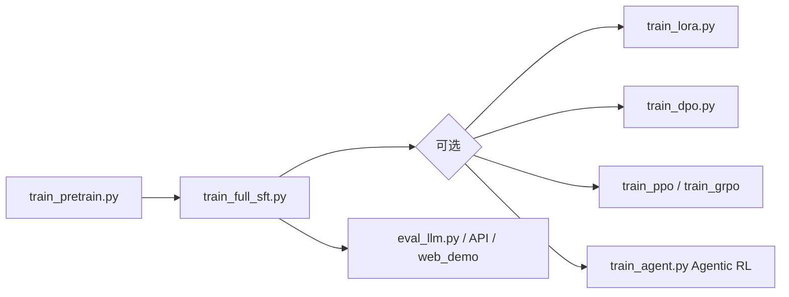
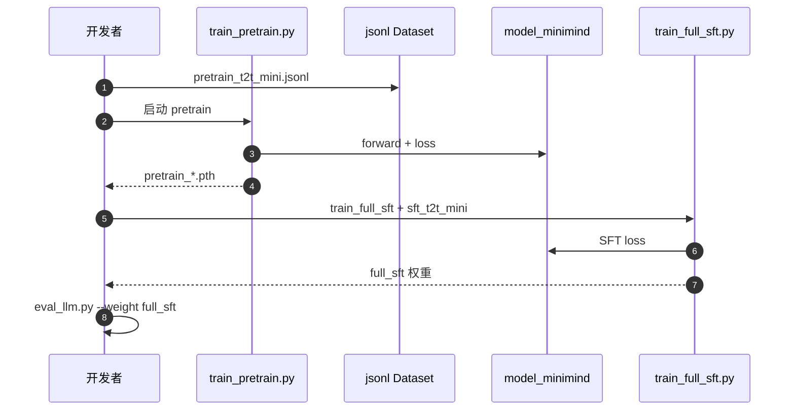

# MiniMind

**MiniMind**（[GitHub: jingyaogong/minimind](https://github.com/jingyaogong/minimind)，[项目页](https://jingyaogong.github.io/minimind/)）是中文社区高 star 的 **小语言模型从 0 训练** 开源项目：在 **单卡消费级 GPU** 上复现 **预训练 → 监督微调 →（可选）对齐与 Agentic RL** 全链路，核心训练逻辑 **不用 transformers/trl 封装糊弄过去**，而是用 **PyTorch 原生** 写清 Pretrain、SFT、LoRA、DPO、PPO/GRPO/CISPO、Tool Use 与 **Agentic RL**（`train_agent.py`）。

## 一句话定义

**用极参数量（主线约 64M Dense / 198M-A64M MoE）把「读懂 LLM 每一行训练代码」做成可复现实验，而不是只调用大模型 API 做 LoRA 微调。**

## 英文缩写速查

| 缩写 | 英文全称 | 简要说明 |
|------|----------|----------|
| LLM | Large Language Model | 本仓训练对象 |
| SFT | Supervised Fine-Tuning | 指令/对话微调阶段 |
| RLHF | Reinforcement Learning from Human Feedback | 含 DPO 等偏好优化 |
| GRPO | Group Relative Policy Optimization | 仓内原生 RLAIF 算法之一 |
| MoE | Mixture of Experts | minimind-3-moe 等变体 |
| API | Application Programming Interface | `serve_openai_api.py` 兼容 OpenAI 协议 |

## 为什么重要（对本知识库读者）

- **与机器人栈的关系：** 不训练 VLA/运动策略，但提供 **LLM 预训练—对齐—Tool/Agent RL** 的 **白盒参照**；读 [GRPO 方法页](../methods/grpo.md) 或 [RL 总览](../methods/reinforcement-learning.md) 时，可用本仓 **GRPO/CISPO 实现** 对照论文里的公式。
- **算力友好：** 相对 GPT-3 级体量刻意做小；适合在 **个人 GPU** 上理解 **数据 jsonl 管线、checkpoint、RoPE/YaRN、MoE 负载均衡** 等，再迁移到更大模型或 [PyTorch](../entities/pytorch.md) 机器人学习栈。
- **生态扩展：** 视觉 [MiniMind-V](https://github.com/jingyaogong/minimind-v)、Omni [MiniMind-O](https://github.com/jingyaogong/minimind-o) 等为 **独立仓库**；本页以 **文本主线 minimind** 为 canonical。

## 核心结构

### 模型与数据（minimind-3 主线）

| 组件 | 说明 |
|------|------|
| 结构 | Dense ~64M；MoE ~198M-A64M；对齐 **Qwen3 / Qwen3-MoE** 叙事 |
| Tokenizer | BPE + ByteLevel；`<tool_call>` / `<think>` 等模板 |
| 快速数据 | `pretrain_t2t_mini.jsonl` + `sft_t2t_mini.jsonl` |
| 权重 | [Hugging Face Collection](https://huggingface.co/collections/jingyaogong/minimind-66caf8d999f5c7fa64f399e5) |

### 训练阶段流程

## 工程实践

| 场景 | 入口 |
|------|------|
| **最快 Zero 复现** | 下载 mini 数据集 → `trainer/train_pretrain.py` → `train_full_sft.py` |
| **断点续训** | `--from_resume 1`；支持 DDP / DeepSpeed |
| **评测** | C-Eval、C-MMLU、OpenBookQA 等（README 表格） |
| **部署** | OpenAI 兼容 `serve_openai_api.py`；导出兼容 llama.cpp / vllm / ollama |
| **可视化** | wandb / swanlab；`scripts/web_demo.py` Streamlit |

### 源码运行时序图（Pretrain → SFT 主干）

## 局限与风险

- **「2 小时 / 3 块钱」** 指特定硬件与 **mini 数据 + 1 epoch SFT** 量级；完整 `pretrain_t2t.jsonl` 与 MoE/RL 阶段 **远更耗时**。
- **教学优先于 SOTA：** 小模型指标不能替代工业级基座；但 **代码可读性** 是项目首要目标。
- **版本迭代快：** minimind-3 与旧版 v1 权重 **不直接兼容**；复现须对齐 README 版本表与 `load_from` 参数。
- **与具身 VLA 正交：** 不提供机器人 action head；若做 **语言层 planner**，仍需接 ROS/VLA/Gateway。

## 关联页面

- [PyTorch](../entities/pytorch.md)
- [深度学习基础](../concepts/deep-learning-foundations.md)
- [Transformer](../concepts/transformer.md)
- [GRPO（方法）](../methods/grpo.md)
- [强化学习](../methods/reinforcement-learning.md)

## 参考来源

- [`sources/repos/minimind.md`](../../sources/repos/minimind.md) — 主仓结构与训练脚本索引
- [`sources/sites/minimind-github-io.md`](../../sources/sites/minimind-github-io.md) — GitHub Pages 项目页

## 推荐继续阅读

- [GitHub 仓库](https://github.com/jingyaogong/minimind)
- [项目页](https://jingyaogong.github.io/minimind/)
- [Hugging Face 模型集合](https://huggingface.co/collections/jingyaogong/minimind-66caf8d999f5c7fa64f399e5)
- [ModelScope 在线体验](https://www.modelscope.cn/studios/gongjy/MiniMind)
