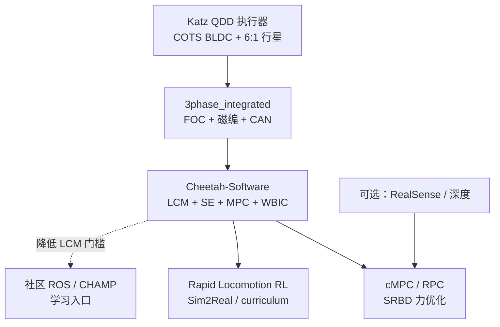

# MIT Mini Cheetah（学习栈与开源边界）

## 一句话定义

**MIT Mini Cheetah**（Sangbae Kim 实验室；执行器由 [Benjamin Katz](./benjamin-katz.md) 主导）是约 **0.3 m / 9 kg**、模块化 **QDD** 四足实验平台：官方以 **论文 + `Cheetah-Software` + 部分驱动硬件 + 学位论文** 形式公开，**不是**可一键复刻整机的 100% 开源项目；却成为 2018–2022 腿足控制的「公共试车场」，并覆盖从执行器、FOC、Convex MPC/WBIC 到 RL Sim2Real 的完整教材链。

## 英文缩写速查

| 缩写 | 英文全称 | 简要说明 |
|------|----------|----------|
| QDD | Quasi-Direct Drive | 低减速、高背驱动的力矩执行范式 |
| cMPC | Convex Model-Predictive Control | SRBD + 凸力优化的实时 loco 控制 |
| WBIC | Whole-Body Impulse Control | 冲量/反力一致的全身控制层 |
| WBC | Whole-Body Control | 下层 QP，将足力映射为关节力矩 |
| RPC | Regularized Predictive Control | Bledt 线正则化预测控制 |
| FOC | Field-Oriented Control | 驱动板电流环实现关节力矩 |
| LCM | Lightweight Communications and Marshalling | 官方软件总线（非 ROS） |
| RL | Reinforcement Learning | Rapid Locomotion 等端到端策略线 |
| Sim2Real | Simulation to Real | 仿真策略迁移真机 |

## 为什么重要

- **算法友好硬件：** 单人可搬、撞击鲁棒、力控带宽足够 → 可快速试后空翻、高速 trot、视觉跳跃与 RL 狂奔（详见 [Katz thesis](./paper-low-cost-modular-actuator-katz.md)）。
- **控制祖师爷栈：** Di Carlo / Kim 等 **Convex MPC + WBIC** 成为后世大量四足 MPC 的工程模板；官方 [`Cheetah-Software`](https://github.com/mit-biomimetics/Cheetah-Software) 把 MPC、状态估计、WBC、仿真与硬件接口放在同一仓库。
- **论文生态：** [Robot Daycare 清单](../../sources/blogs/robot_daycare_mini_cheetah_2019.md) 覆盖平台、WBIC+MPC、视觉探索、RPC、HS-DDP/MHPC、导航、并发估计 RL、像素跳跃与高速 RL——本库为清单内论文建独立节点。
- **RL 高速前驱：** [Rapid Locomotion](./paper-rapid-locomotion-rl.md)（约 **3.9 m/s**）连接 [RMA](./paper-rma-rapid-motor-adaptation.md)、[Walk These Ways](./paper-walk-these-ways-quadruped-mob.md)、[Extreme Parkour](./extreme-parkour.md) 等。
- **对人形力矩电机：** 若目标是执行器/PCB/FOC 而非复刻整机，**thesis + `3phase_integrated` + 控制框架** 优先级高于「找一份完整 STEP」。

## 核心信息

| 项 | 内容 |
|----|------|
| **机构** | 麻省理工（MIT）Biomimetic Robotics Lab |
| **主设计** | [Benjamin Katz](./benjamin-katz.md) 等 |
| **尺度** | 高约 0.3 m，质量约 9 kg，12 DoF |
| **平台论文** | ICRA 2019；cMPC 步态至约 **2.45 m/s**；360° 后空翻 |
| **控制软件** | **已开源** [Cheetah-Software](../../sources/repos/cheetah-software.md) |
| **驱动/电气** | **部分开源** [bgkatz](../../sources/repos/bgkatz.md) / [`3phase_integrated`](../../sources/repos/bgkatz_3phase_integrated.md) |

## 开源状态（步骤 2.5 核查）

| 模块 | 状态 | 入口 |
|------|------|------|
| 控制软件（MPC / SE / WBC / LCM / 仿真） | **已开源** | [`mit-biomimetics/Cheetah-Software`](../../sources/repos/cheetah-software.md) |
| 电机驱动 PCB / BOM | **已开源** | [`bgkatz/3phase_integrated`](../../sources/repos/bgkatz_3phase_integrated.md) |
| 电机固件 / SPIne | **已开源**（分仓） | [motorcontrol](../../sources/repos/bgkatz_motorcontrol.md)、[SPIne](../../sources/repos/bgkatz_spine.md) |
| Katz 执行器 thesis | **已公开**（学位论文） | [论文实体页](./paper-low-cost-modular-actuator-katz.md) |
| 整机 SolidWorks / Fusion / STEP / 装配图 | **未公开** | — |
| 电机绕线数据 / 完整电磁设计 / 加工图纸 | **未公开** | — |

**总判：部分开源。** 可跟软件与驱动；勿默认「官方给了整机 CAD」。

## 流程总览（技术栈分层）

## 核心原理

### 1）平台形态

- 约 **0.3 m** 高、约 **9 kg**；单人可搬运；模块化关节利于损坏更换（[ICRA 2019 平台](./paper-mini-cheetah-platform.md)）。
- 执行器范式：高扭矩密度外转子 + **低减速透明传动** + 电流估计力矩（与 [Wensing 本体感受执行器](./paper-notebook-proprioceptive-actuator-design-in-the-mit-cheeta.md) 一脉）。

### 2）模型控制主线：Convex MPC + WBIC

- **SRBD** 近似机身；固定接触时序下凸化摩擦与动力学 → **QP 可实时求足力**。
- 下层 **WBIC / WBC** 把期望足力落到关节力矩（见 [WBIC+MPC](./paper-wbic-mpc-mini-cheetah.md)、[SRBD + 凸 MPC + WBC](../concepts/srbd-convex-mpc-wbc.md)）。
- 官方软件用 **LCM** 而非 ROS；真机步骤见 [running_mini_cheetah.md](https://github.com/mit-biomimetics/Cheetah-Software/blob/master/documentation/running_mini_cheetah.md)。

### 3）高动态、落地与感知扩展

- **后空翻**：离线非线性轨迹优化 → 关节力矩 + PD 回放。
- **落地 / 空中姿态**：*Falling Cat*、*Landing Control*（见 [论文集合](../../sources/papers/mit_mini_cheetah_control_papers.md)）。
- **外感知：** Vision / Mini-Cheetah Vision 导航把 RealSense 与 RPC+WBIC 集成。

### 4）强化学习线

- [Rapid Locomotion](./paper-rapid-locomotion-rl.md)（arXiv:2205.02824）：端到端策略、高速、curriculum 与在线系统辨识；与经典 cMPC 形成「模型派 vs 学习派」对照（见 [MPC vs RL](../comparisons/mpc-vs-rl.md)）。

## 工程实践

### 面向人形力矩电机 / 驱动的优先序

| 优先级 | 资料 | 目标 |
|--------|------|------|
| 1 | [Katz MSc thesis](./paper-low-cost-modular-actuator-katz.md) | 执行器机械、电气、热、表征 |
| 2 | [`3phase_integrated`](../../sources/repos/bgkatz_3phase_integrated.md) | FOC PCB、CAN、BOM |
| 3 | [`Cheetah-Software`](../../sources/repos/cheetah-software.md) | 整机控制与仿真模块边界 |
| 4 | Di Carlo Convex MPC / [WBIC+MPC](./paper-wbic-mpc-mini-cheetah.md) | 足力优化与全身冲量层 |
| 5 | [Rapid Locomotion](./paper-rapid-locomotion-rl.md) | RL + Sim2Real 上限样本 |
| 6 | [quadruped_ctrl](../../sources/repos/derek_th_wang_quadruped_ctrl.md) / [mini_cheetah_ROS](../../sources/repos/gleboss1_mini_cheetah_ros.md) | ROS/PyBullet 入门 |
| 7 | [CHAMP](../../sources/repos/chvmp_champ.md) | 快速建立四足控制骨架直觉 |

### 读代码时的入口

1. 仿真：`sim/sim` + `user/...` 控制器（README：`3`=Cheetah 3，`m`=Mini；`s`=sim，`r`=robot）。
2. 真机：`cmake -DMINI_CHEETAH_BUILD=TRUE` → `send_to_mini_cheetah.sh` → 机上 LCM 网络配置。
3. 驱动：先单板电流阶跃，再挂行星与测功；勿跳过 [源码运行时序图](./paper-low-cost-modular-actuator-katz.md#源码运行时序图)。

### 论文阅读时序（建议）

平台 → WBIC+MPC → RPC/启发式 → 视觉导航 → RL。博文清单 12 篇见下节；补充时序见 [论文集合](../../sources/papers/mit_mini_cheetah_control_papers.md)。

## 相关论文节点（Robot Daycare 博文清单）

1. [Platform ICRA 2019](./paper-mini-cheetah-platform.md)
2. [WBIC + MPC](./paper-wbic-mpc-mini-cheetah.md)
3. [Vision-aided exploration](./paper-vision-aided-dynamic-exploration-mini-cheetah.md)
4. [HS-DDP](./paper-hs-ddp-legged.md)
5. [MHPC](./paper-mhpc.md)
6. [Bledt RPC 论文](./paper-bledt-rpc-thesis.md)
7. [Extracting heuristics with RPC](./paper-extracting-legged-locomotion-heuristics-rpc.md)
8. [Variational underactuated balancing](./paper-variational-underactuated-balancing-quadruped.md)
9. [Robust autonomous navigation](./paper-robust-autonomous-navigation-mini-cheetah-vision.md)
10. [Concurrent policy + estimator](./paper-concurrent-policy-estimator-locomotion.md)
11. [Learning to Jump from Pixels](./paper-learning-to-jump-from-pixels.md)
12. [Rapid Locomotion RL](./paper-rapid-locomotion-rl.md)

## 局限与风险

- **整机 CAD 缺失**：DIY「一比一复刻」需自研结构或社区件；不要把 thesis 附录电子开源误读为全栈开源。
- **电磁设计未开**：绕线数据与完整电磁模型不在公开集；学电磁应转 [开源力矩电机电磁完整度对比](../comparisons/open-source-torque-motor-em-design.md) 与 [力矩电机纵深](../../roadmap/depth-torque-motor-design.md)。
- **LCM 学习成本**：官方栈对现代 ROS 用户不友好；可用社区 ROS/PyBullet 作脚手架，但算法权威仍以官方仓与论文为准。
- **社区仓质量参差**：`mini_cheetah_ROS` 星标极低，仅作入门线索；生产勿绑死。
- **小尺度限制**：传感安装、越障净空与绝对速度上限（视觉论文反复强调）；外借机有限，仿制机需重标定动力学。
- **与 ODRI 等勿混**：Solo/ODRI 是更完整的开源关节+整机叙事；Mini Cheetah 的价值在 **动态能力与控制范式**，不在「可购买的完整开源 BOM」。

## 关联页面

- [Benjamin Katz](./benjamin-katz.md)
- [Katz 低成本模块化执行器](./paper-low-cost-modular-actuator-katz.md)
- [本体感受执行器（MIT Cheetah）](./paper-notebook-proprioceptive-actuator-design-in-the-mit-cheeta.md)
- [Platform ICRA 2019](./paper-mini-cheetah-platform.md) · [WBIC+MPC](./paper-wbic-mpc-mini-cheetah.md) · [Rapid Locomotion](./paper-rapid-locomotion-rl.md)
- [SRBD + 凸 MPC + WBC](../concepts/srbd-convex-mpc-wbc.md)
- [MPC 与 WBC 集成](../concepts/mpc-wbc-integration.md)
- [开源 QDD 执行器项目对比](../comparisons/open-source-qdd-actuator-projects.md)
- [四足机器人](./quadruped-robot.md)
- [四足控制学习策展](./quadruped-control-curriculum.md)
- [Locomotion](../tasks/locomotion.md)
- [RMA](./paper-rma-rapid-motor-adaptation.md) · [Walk These Ways](./paper-walk-these-ways-quadruped-mob.md) · [Extreme Parkour](./extreme-parkour.md)

## 参考来源

- [MIT Mini Cheetah 学习资料栈（策展）](../../sources/personal/mit_mini_cheetah_learning_stack_curator.md)
- [The Mini Cheetah Robot 博文](../../sources/blogs/robot_daycare_mini_cheetah_2019.md)
- [Mini Cheetah / Cheetah 系控制论文集合](../../sources/papers/mit_mini_cheetah_control_papers.md)
- [平台论文归档](../../sources/papers/mini_cheetah_platform_icra_2019.md)
- [Katz 执行器 thesis 归档](../../sources/papers/low_cost_modular_actuator_katz_mit_2018.md)
- [Cheetah-Software](../../sources/repos/cheetah-software.md)
- [bgkatz](../../sources/repos/bgkatz.md) · [3phase_integrated](../../sources/repos/bgkatz_3phase_integrated.md)
- [Robot Daycare 站点](../../sources/sites/robot-daycare.md) · [Hello There, Mini Cheetah 叙事](../../sources/sites/robot_daycare_mini_cheetah.md)
- [quadruped_ctrl](../../sources/repos/derek_th_wang_quadruped_ctrl.md) · [CHAMP](../../sources/repos/chvmp_champ.md) · [mini_cheetah_ROS](../../sources/repos/gleboss1_mini_cheetah_ros.md)

## 推荐继续阅读

- 官方软件：<https://github.com/mit-biomimetics/Cheetah-Software>
- 真机文档：<https://github.com/mit-biomimetics/Cheetah-Software/blob/master/documentation/running_mini_cheetah.md>
- Robot Daycare 综述：<https://robot-daycare.com/posts/2019-03-04-hello-there-mini-cheetah/>（及博文清单内链）
- Di Carlo et al., *Dynamic Locomotion in the MIT Cheetah 3 Through Convex Model-Predictive Control* (IROS 2018)
- Margolis et al., *Rapid Locomotion via Reinforcement Learning* — <https://arxiv.org/abs/2205.02824>
