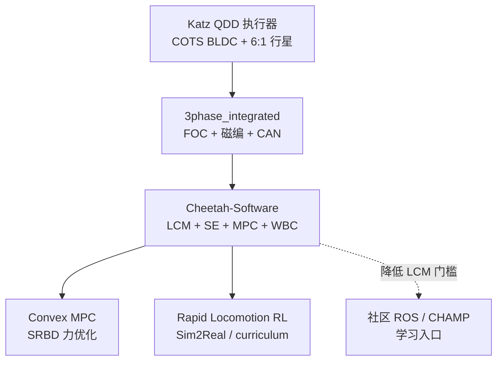

# MIT Mini Cheetah（学习栈与开源边界）

## 一句话定义

**MIT Mini Cheetah**（Sangbae Kim 实验室；执行器由 **Ben Katz** 主导）是约 **9 kg**、模块化 **QDD** 四足平台：官方以 **论文 + `Cheetah-Software` + 部分驱动硬件 + 学位论文** 形式公开，**不是**可一键复刻整机的 100% 开源项目；却覆盖从执行器、FOC 驱动、Convex MPC 到 RL Sim2Real 的完整教材链。

## 英文缩写速查

| 缩写 | 英文全称 | 简要说明 |
|------|----------|----------|
| QDD | Quasi-Direct Drive | 低减速、高背驱动的力矩执行范式 |
| MPC | Model Predictive Control | 滚动时域优化；本栈以凸 MPC 著称 |
| cMPC | Convex Model-Predictive Control | SRBD + 凸力优化的实时 loco 控制 |
| WBC | Whole-Body Control | 下层 QP，将足力映射为关节力矩 |
| FOC | Field-Oriented Control | 驱动板电流环实现关节力矩 |
| LCM | Lightweight Communications and Marshalling | 官方软件总线（非 ROS） |
| RL | Reinforcement Learning | Rapid Locomotion 等端到端策略线 |
| Sim2Real | Simulation to Real | 仿真策略迁移真机 |

## 为什么重要

- **四足「平民化」平台**：相对 Cheetah 2/3 定制电机叙事，Mini Cheetah 用 COTS 外转子 + 6:1 行星把空翻级动态做到可搬运、可维修的尺度（详见 [Katz thesis](./paper-low-cost-modular-actuator-katz.md)）。
- **控制祖师爷栈**：Di Carlo 等 **Convex MPC** 成为后世大量四足 MPC 的工程模板；官方 [`Cheetah-Software`](https://github.com/mit-biomimetics/Cheetah-Software) 把 MPC、状态估计、WBC、仿真与硬件接口放在同一仓库。
- **RL 高速前驱**：Margolis 等 *Rapid Locomotion*（约 **3.9 m/s**）把 Mini Cheetah 推到端到端 RL + curriculum + 在线辨识；影响叙事上连接 [RMA](./paper-rma-rapid-motor-adaptation.md)、[Walk These Ways](./paper-walk-these-ways-quadruped-mob.md)、[Extreme Parkour](./extreme-parkour.md) 等。
- **对人形力矩电机**：若目标是执行器/PCB/FOC 而非复刻整机，本栈的 **thesis + `3phase_integrated` + 控制框架** 优先级高于「找一份完整 STEP」。

## 开源状态（步骤 2.5 核查）

| 模块 | 状态 | 入口 |
|------|------|------|
| 控制软件（MPC / SE / WBC / LCM / 仿真） | **已开源** | [`mit-biomimetics/Cheetah-Software`](../../sources/repos/mit_biomimetics_cheetah_software.md) |
| 电机驱动 PCB / BOM | **已开源** | [`bgkatz/3phase_integrated`](../../sources/repos/bgkatz_3phase_integrated.md) |
| 电机固件 / SPIne | **已开源**（分仓） | [motorcontrol](../../sources/repos/bgkatz_motorcontrol.md)、[SPIne](../../sources/repos/bgkatz_spine.md) |
| Katz 执行器 thesis | **已公开**（学位论文） | [论文实体页](./paper-low-cost-modular-actuator-katz.md) |
| 整机 SolidWorks / Fusion / STEP / 装配图 | **未公开** | — |
| 电机绕线数据 / 完整电磁设计 / 加工图纸 | **未公开** | — |

**总判：部分开源。** 可跟软件与驱动；勿默认「官方给了整机 CAD」。

## 流程总览（技术栈分层）

## 核心原理

### 1）平台形态

- 约 **0.3 m** 高、约 **9 kg**；单人可搬运；模块化关节利于损坏更换（ICRA 2019 平台叙事）。
- 执行器范式：高扭矩密度外转子 + **低减速透明传动** + 电流估计力矩（与 [Wensing 本体感受执行器](./paper-notebook-proprioceptive-actuator-design-in-the-mit-cheeta.md) 一脉，成本显著下降）。

### 2）模型控制主线：Convex MPC + WBC

- **SRBD** 近似机身；固定接触时序下凸化摩擦与动力学 → **QP 可实时求足力**。
- 下层 **WBC/QP** 把期望足力落到关节力矩，避免仅用静力雅可比削弱 MPC（见 [SRBD + 凸 MPC + WBC](../concepts/srbd-convex-mpc-wbc.md)、[MPC–WBC 集成](../concepts/mpc-wbc-integration.md)）。
- 官方软件用 **LCM** 而非 ROS；真机步骤见 [running_mini_cheetah.md](https://github.com/mit-biomimetics/Cheetah-Software/blob/master/documentation/running_mini_cheetah.md)。

### 3）高动态与落地

- **后空翻**：离线非线性轨迹优化 → 关节力矩 + PD 回放（ICRA 2019 / Katz thesis）。
- **落地 / 空中姿态**：*Falling Cat*、*Real-time Optimal Landing Control* 把接触优化与 MPC/学习接到同一机体。

### 4）强化学习线

- *Rapid Locomotion via Reinforcement Learning*（arXiv:2205.02824）：端到端策略、高速、curriculum 与在线系统辨识；与经典 cMPC 形成「模型派 vs 学习派」对照样本（见 [MPC vs RL](../comparisons/mpc-vs-rl.md)）。

## 工程实践

### 面向人形力矩电机 / 驱动的优先序

| 优先级 | 资料 | 目标 |
|--------|------|------|
| 1 | [Katz MSc thesis](./paper-low-cost-modular-actuator-katz.md) | 执行器机械、电气、热、表征 |
| 2 | [`3phase_integrated`](../../sources/repos/bgkatz_3phase_integrated.md) | FOC PCB、CAN、BOM |
| 3 | [`Cheetah-Software`](../../sources/repos/mit_biomimetics_cheetah_software.md) | 整机控制与仿真模块边界 |
| 4 | Di Carlo Convex MPC | 足力优化与步态规划祖师爷 |
| 5 | Rapid Locomotion | RL + Sim2Real 上限样本 |
| 6 | [quadruped_ctrl](../../sources/repos/derek_th_wang_quadruped_ctrl.md) / [mini_cheetah_ROS](../../sources/repos/gleboss1_mini_cheetah_ros.md) | ROS/PyBullet 入门 |
| 7 | [CHAMP](../../sources/repos/chvmp_champ.md) | 快速建立四足控制骨架直觉 |

### 读代码时的入口

1. 仿真：`sim/sim` + `user/...` 控制器（README：`3`=Cheetah 3，`m`=Mini；`s`=sim，`r`=robot）。
2. 真机：`cmake -DMINI_CHEETAH_BUILD=TRUE` → `send_to_mini_cheetah.sh` → 机上 LCM 网络配置。
3. 驱动：先单板电流阶跃，再挂行星与测功；勿跳过 [源码运行时序图](./paper-low-cost-modular-actuator-katz.md#源码运行时序图)。

### 论文阅读时序（建议）

1. Super Mini Cheetah（2015）→ 2. Cheetah 3 设计 + Convex MPC（2018）→ 3. Mini Cheetah 平台 / 空翻（2019）→ 4. Falling Cat / Landing（2021）→ 5. Rapid Locomotion（2022）。索引见 [论文集合](../../sources/papers/mit_mini_cheetah_control_papers.md)。

## 局限与风险

- **整机 CAD 缺失**：DIY「一比一复刻」需自研结构或社区件；不要把 thesis 附录电子开源误读为全栈开源。
- **电磁设计未开**：绕线数据与完整电磁模型不在公开集；学电磁应转 [开源力矩电机电磁完整度对比](../comparisons/open-source-torque-motor-em-design.md) 与 [力矩电机纵深](../../roadmap/depth-torque-motor-design.md)。
- **LCM 学习成本**：官方栈对现代 ROS 用户不友好；可用社区 ROS/PyBullet 作脚手架，但算法权威仍以官方仓与论文为准。
- **社区仓质量参差**：`mini_cheetah_ROS` 星标极低，仅作入门线索；生产勿绑死。
- **与 ODRI 等勿混**：Solo/ODRI 是更完整的开源关节+整机叙事；Mini Cheetah 的价值在 **动态能力与控制范式**，不在「可购买的完整开源 BOM」。

## 关联页面

- [Katz 低成本模块化执行器](./paper-low-cost-modular-actuator-katz.md)
- [本体感受执行器（MIT Cheetah）](./paper-notebook-proprioceptive-actuator-design-in-the-mit-cheeta.md)
- [SRBD + 凸 MPC + WBC](../concepts/srbd-convex-mpc-wbc.md)
- [MPC 与 WBC 集成](../concepts/mpc-wbc-integration.md)
- [开源 QDD 执行器项目对比](../comparisons/open-source-qdd-actuator-projects.md)
- [四足机器人](./quadruped-robot.md)
- [四足控制学习策展](./quadruped-control-curriculum.md)
- [RMA](./paper-rma-rapid-motor-adaptation.md) · [Walk These Ways](./paper-walk-these-ways-quadruped-mob.md) · [Extreme Parkour](./extreme-parkour.md)

## 参考来源

- [MIT Mini Cheetah 学习资料栈（策展）](../../sources/personal/mit_mini_cheetah_learning_stack_curator.md)
- [Mini Cheetah / Cheetah 系控制论文集合](../../sources/papers/mit_mini_cheetah_control_papers.md)
- [Katz 执行器 thesis 归档](../../sources/papers/low_cost_modular_actuator_katz_mit_2018.md)
- [Cheetah-Software](../../sources/repos/mit_biomimetics_cheetah_software.md)
- [3phase_integrated](../../sources/repos/bgkatz_3phase_integrated.md)
- [Robot Daycare · Mini Cheetah 叙事](../../sources/sites/robot_daycare_mini_cheetah.md)
- [quadruped_ctrl](../../sources/repos/derek_th_wang_quadruped_ctrl.md) · [CHAMP](../../sources/repos/chvmp_champ.md) · [mini_cheetah_ROS](../../sources/repos/gleboss1_mini_cheetah_ros.md)

## 推荐继续阅读

- 官方软件：<https://github.com/mit-biomimetics/Cheetah-Software>
- 真机文档：<https://github.com/mit-biomimetics/Cheetah-Software/blob/master/documentation/running_mini_cheetah.md>
- Di Carlo et al., *Dynamic Locomotion in the MIT Cheetah 3 Through Convex Model-Predictive Control* (IROS 2018)
- Margolis et al., *Rapid Locomotion via Reinforcement Learning* — <https://arxiv.org/abs/2205.02824>
