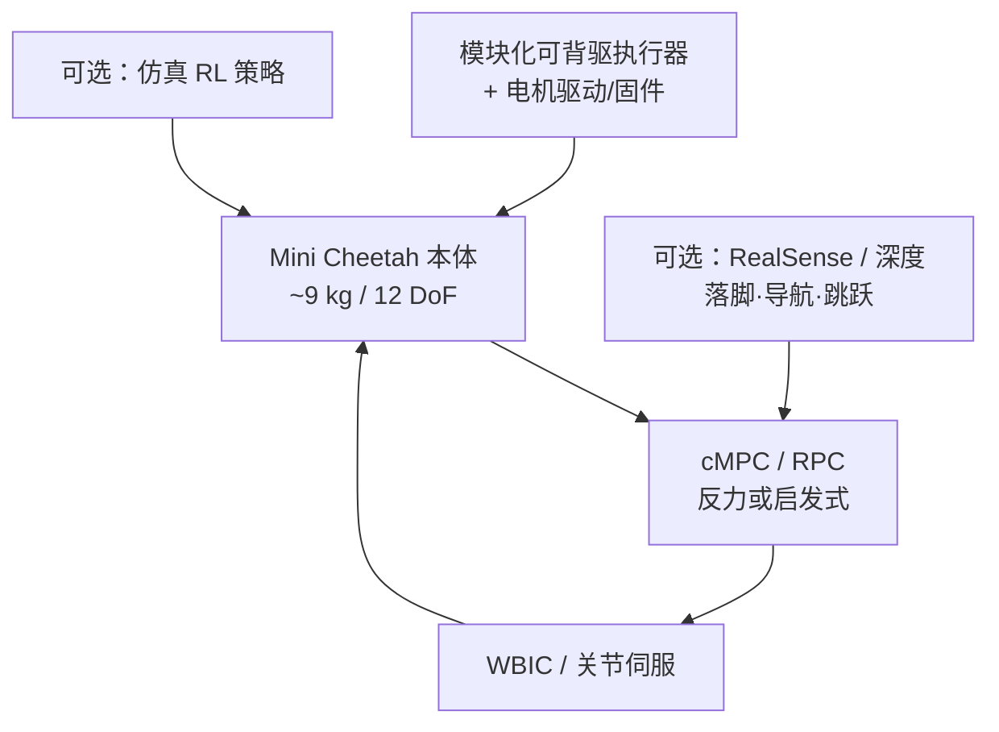

# MIT Mini Cheetah

## 一句话定义

**MIT Mini Cheetah** 是 Biomimetic Robotics Lab 推出的小型高动态四足实验平台（约 **0.3 m / 9 kg**）：以可背驱模块化执行器支撑高带宽力控与抗冲击，并借 **Convex MPC / WBIC** 与后续视觉、RL 工作成为 2018–2022 年腿足控制的「公共试车场」。

## 英文缩写速查

| 缩写 | 英文全称 | 简要说明 |
|------|----------|----------|
| cMPC | Convex Model Predictive Control | 平台论文中的凸 MPC 步态控制 |
| WBIC | Whole-Body Impulse Control | 冲量/反力一致的全身控制层 |
| RPC | Regularized Predictive Control | Bledt 线正则化预测控制 |
| SRBD | Single Rigid Body Dynamics | 常用简化动力学模型 |
| QDD | Quasi-Direct Drive | 低减速比可背驱执行器范式 |

## 为什么重要

- **算法友好硬件：** 单人可搬、撞击鲁棒、力控带宽足够 → 控制组能快速试后空翻、高速 trot、视觉跳跃与 RL 狂奔。
- **开源控制栈：** [Cheetah-Software](../../sources/repos/cheetah-software.md) 让 SRBD-MPC + WBIC 成为可复现基线（见 [mpc-wbc-integration](../concepts/mpc-wbc-integration.md)）。
- **论文生态：** Robot Daycare 清单覆盖平台、WBIC+MPC、视觉探索、RPC、HS-DDP/MHPC、导航、并发估计 RL、像素跳跃与高速 RL——本库为每篇建独立节点。

## 核心信息

| 项 | 内容 |
|----|------|
| **机构** | 麻省理工（MIT）Biomimetic Robotics Lab |
| **主设计** | [Benjamin Katz](./benjamin-katz.md) 等 |
| **尺度** | 高约 0.3 m，质量约 9 kg |
| **平台论文** | ICRA 2019；cMPC 步态至 **2.45 m/s**；360° 后空翻 |
| **控制软件** | **已开源** [mit-biomimetics/Cheetah-Software](https://github.com/mit-biomimetics/Cheetah-Software) |
| **驱动/电气** | 部分开源于 [bgkatz](https://github.com/bgkatz) |

## 流程总览

## 核心原理

1. **执行器：** 定制可背驱模块 → 高力密度 + 冲击容忍，使空翻与高速接触可行。
2. **模型基栈：** 简化模型预测反力，全身层跟踪冲量/力矩（[WBIC+MPC](./paper-wbic-mpc-mini-cheetah.md)）。
3. **外感知扩展：** Vision / Mini-Cheetah Vision 导航把 RealSense 与 RPC+WBIC 集成。
4. **学习扩展：** 像素跳跃与 Rapid Locomotion RL 把策略层接到同一硬件。

## 工程实践

| 项 | 建议 |
|----|------|
| 复现控制 | 先跑通 Cheetah-Software 仿真，再谈真机 |
| 读论文顺序 | 平台 → WBIC+MPC → RPC/启发式 → 视觉导航 → RL |
| 硬件仿制 | 对照 Katz 博客/硕士论文与 bgkatz 驱动，勿假设完整 BOM 开源 |
| 与开源四足对照 | [ODRI Solo](./odri-solo-and-bolt.md)、[Doggo](./stanford-doggo-and-pupper.md) |

## 相关论文节点（博文清单）

1. [Platform ICRA 2019](./paper-mini-cheetah-platform.md)
2. [WBIC + MPC](./paper-wbic-mpc-mini-cheetah.md)
3. [Vision-aided exploration](./paper-vision-aided-dynamic-exploration-mini-cheetah.md)
4. [HS-DDP](./paper-hs-ddp-legged.md)
5. [MHPC](./paper-mhpc.md)
6. [Bledt RPC 论文](./paper-bledt-rpc-thesis.md)
7. [Extracting heuristics with RPC](./paper-extracting-legged-locomotion-heuristics-rpc.md)
8. [Variational underactuated balancing](./paper-variational-underactuated-balancing-quadruped.md)
9. [Robust autonomous navigation](./paper-robust-autonomous-navigation-mini-cheetah-vision.md)
10. [Concurrent policy + estimator](./paper-concurrent-policy-estimator-locomotion.md)
11. [Learning to Jump from Pixels](./paper-learning-to-jump-from-pixels.md)
12. [Rapid Locomotion RL](./paper-rapid-locomotion-rl.md)

## 局限与风险

- 小尺度限制传感安装、越障净空与绝对速度上限（视觉论文反复强调）。
- 「开源」主要指**软件控制栈与部分电气**；整机机械量产文件与校准流程不完整公开。
- 外借机数量有限，社区复现常依赖自建仿制机，动力学参数需重标定。

## 关联页面

- [Benjamin Katz](./benjamin-katz.md)
- [MPC–WBC 集成](../concepts/mpc-wbc-integration.md)
- [SRBD Convex MPC](../concepts/srbd-convex-mpc-wbc.md)
- [Locomotion](../tasks/locomotion.md)
- [四足机器人](./quadruped-robot.md)

## 参考来源

- [The Mini Cheetah Robot 博文](../../sources/blogs/robot_daycare_mini_cheetah_2019.md)
- [平台论文归档](../../sources/papers/mini_cheetah_platform_icra_2019.md)
- [Cheetah-Software](../../sources/repos/cheetah-software.md)
- [bgkatz](../../sources/repos/bgkatz.md)
- [Robot Daycare](../../sources/sites/robot-daycare.md)

## 推荐继续阅读

- 博文：<https://robot-daycare.com/posts/2019-12-16-the-mini-cheetah-robot/>
- Cheetah-Software：<https://github.com/mit-biomimetics/Cheetah-Software>
- Katz 硕士论文：<https://dspace.mit.edu/handle/1721.1/118671>
