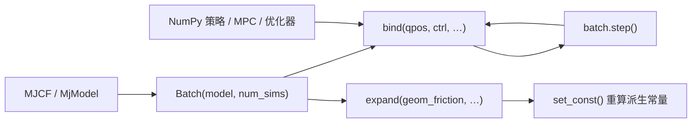

# mjbatch（MuJoCo CPU 批量并行）

**mjbatch**（[`kevinzakka/mjbatch`](https://github.com/kevinzakka/mjbatch)，PyPI：`mjbatch`）是在 **官方 `mujoco` Python 包** 之上实现的 **CPU 批量仿真库**：一份 `MjModel` 驱动 `num_sims` 份并行 `MjData`，C++ 线程池在 `step()` 时释放 GIL，策略侧用 NumPy 一次性读写整批 `qpos`、`ctrl` 等字段。

## 英文缩写速查

| 缩写 | 英文全称 | 简要说明 |
|------|----------|----------|
| MuJoCo | Multi-Joint dynamics with Contact | 接触丰富的刚体物理仿真引擎 |
| RL | Reinforcement Learning | 示例含 Go1 PPO 摇杆行走 |
| MPC | Model Predictive Control | 示例含 cart-pole predictive sampling |
| SysID | System Identification | 示例含 Rizon 臂惯量拟合 |
| CEM | Cross-Entropy Method | 示例含抛掷臂机构–控制协同优化 |
| iLQR | iterative Linear Quadratic Regulator | 示例含双杆 cart iLQR 与 G1 后空翻跟踪 |
| GIL | Global Interpreter Lock | Python 多线程瓶颈；mjbatch 步进时释放 |

## 为什么重要

- **补齐 MuJoCo 并行栈的 CPU/NumPy 一角**：[MuJoCo MJX](./mujoco-mjx.md) 走 JAX/GPU 可微批量；[MuJoCo Warp](./mujoco-warp.md) 走 NVIDIA GPU 高吞吐；原生 `mujoco` 单实例循环难以榨干多核。mjbatch 让 **沿用 MJCF + NumPy 控制器** 的研究者也能在笔记本 CPU 上开 **数千并行环境**（README 示例：4096 路 cart-pole）。
- **与 Mink 同作者的工程哲学**：作者 Kevin Zakka 的 [Mink](./mink-ik.md) 强调「不离开 MuJoCo 模型」做微分 IK；mjbatch 同样 **不引入第二套资产格式**，批量层只包装 `MjModel`/`MjData` 语义。
- **示例覆盖完整控制闭环**：仓库自带 RL（Go1 PPO）、MPC、iLQR、CEM 机构设计、Gauss–Newton 系统辨识等 **自包含脚本**，便于对照选型与教学。

## 核心原理

### 在技术路线中的位置

| 字段 | 内容 |
|------|------|
| 物理后端 | 官方 CPU `mujoco`（当前钉 `mujoco==3.11.0`） |
| 并行模型 | C++ 线程池 + 每线程一份 `MjData` |
| 策略接口 | NumPy 数组视图（`bind` / `expand`） |
| 开源状态 | **已开源**（Apache-2.0；GitHub + PyPI） |
| 官方入口 | <https://github.com/kevinzakka/mjbatch> |

### 流程总览

典型循环：`ctrl[:] = policy(qpos)` → `batch.step()` → `qpos` 原地更新，无需 Python 层 for 循环逐步进。

### 与相关后端对比（选型速查）

| 维度 | mjbatch | MuJoCo MJX | MuJoCo Warp | 原生 `mujoco` 循环 |
|------|---------|------------|-------------|-------------------|
| 算力 | CPU 多线程 | JAX GPU/TPU | NVIDIA GPU | 单实例为主 |
| 控制器生态 | NumPy / SciPy | JAX | PyTorch（经 mjlab 等） | 任意，但难批量 |
| 可微 rollout | 否 | 是 | AD 未通 | 有限差分 |
| 资产 | 同一 MJCF | 同一 MJCF | 同一 MJCF（有缺口） | 同一 MJCF |
| 典型用途 | CPU 大规模采样、MPC、SysID | RL 训练、可微仿真 | GPU RL（[mjlab](./mjlab.md)） | 调试、可视化、单智能体 |

## 工程实践

1. **安装：** `pip install mjbatch`（依赖 `mujoco==3.11.0`）；开发克隆后 `uv sync`，示例 `uv run examples/<file>.py`。
2. **批量规模：** `num_sims` 与逻辑 CPU 数对齐通常较稳；`Batch` 默认线程数 = 逻辑 CPU 数。
3. **域随机化：** 用 `expand("geom_friction")` 等写入每实例模型参数，必要时 `set_const()` 刷新派生量，再 `step()`。
4. **对照示例选入口：**
   - RL / 腿足：`go1_joystick.py`
   - 人形轨迹跟踪：`g1_flip.py`
   - MPC / 采样：`cartpole_mpc.py`、`cartpole_swingup.py`
   - 机构协同设计 / SysID：`arm_throw.py`、`rizon_inertia.py`
5. **显示与 CI：** 带窗口示例支持 `--headless`；无显示器环境只跑求解部分。

| 检查项 | 建议 |
|--------|------|
| MuJoCo 版本 | 与 PyPI 钉版本一致，避免 ABI 漂移 |
| 线程与 batch 大小 | 过大 `num_sims` 可能内存吃紧（每份完整 `MjData`） |
| GPU 训练需求 | 若目标是百万级 GPU 环境，评估 [MJX](./mujoco-mjx.md) / [mjlab](./mjlab.md) |

## 局限与风险

- **仅 CPU 路径**：不替代 MJX/MJWarp 的 GPU 吞吐；适合 **笔记本/无 GPU 集群上的大规模 CPU 采样** 或 **与 NumPy 科学计算栈紧耦合** 的算法。
- **版本钉死 `mujoco==3.11.0`**：升级主版本需等待 mjbatch 发布对齐，与其他依赖 MuJoCo 的工具混用时注意环境隔离。
- **非 RL 环境框架**：不提供 Gymnasium 注册表或 manager-based API；需在自有训练循环中调用 `Batch`（与 [mjlab](./mjlab.md) 分层不同）。
- **项目较新**（2026-09 首发）：API 与性能特性可能随版本迭代；以官方 README / Issues 为准。

## 关联页面

- [MuJoCo](./mujoco.md) — 物理内核与 MJCF 语义
- [MuJoCo MJX](./mujoco-mjx.md) — JAX 批量与可微路径
- [MuJoCo Warp](./mujoco-warp.md) — GPU 高吞吐兄弟后端
- [Mink](./mink-ik.md) — 同作者 MuJoCo 微分 IK
- [mjlab](./mjlab.md) — GPU + Isaac Lab API 的 RL 框架（不同并行层）
- [强化学习](../methods/reinforcement-learning.md)
- [Sim2Real](../concepts/sim2real.md)

## 参考来源

- [mjbatch 仓库归档](../../sources/repos/mjbatch.md)
- [官方 GitHub 仓库](https://github.com/kevinzakka/mjbatch)
- [PyPI：mjbatch](https://pypi.org/project/mjbatch/)

## 推荐继续阅读

- [mjbatch README 与 examples/](https://github.com/kevinzakka/mjbatch/tree/main/examples)
- [MuJoCo Python 文档](https://mujoco.readthedocs.io/en/stable/python.html)
- [Mink 官方仓库](https://github.com/kevinzakka/mink) — 同作者 MuJoCo 控制工具链
