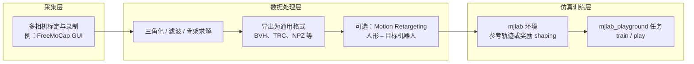
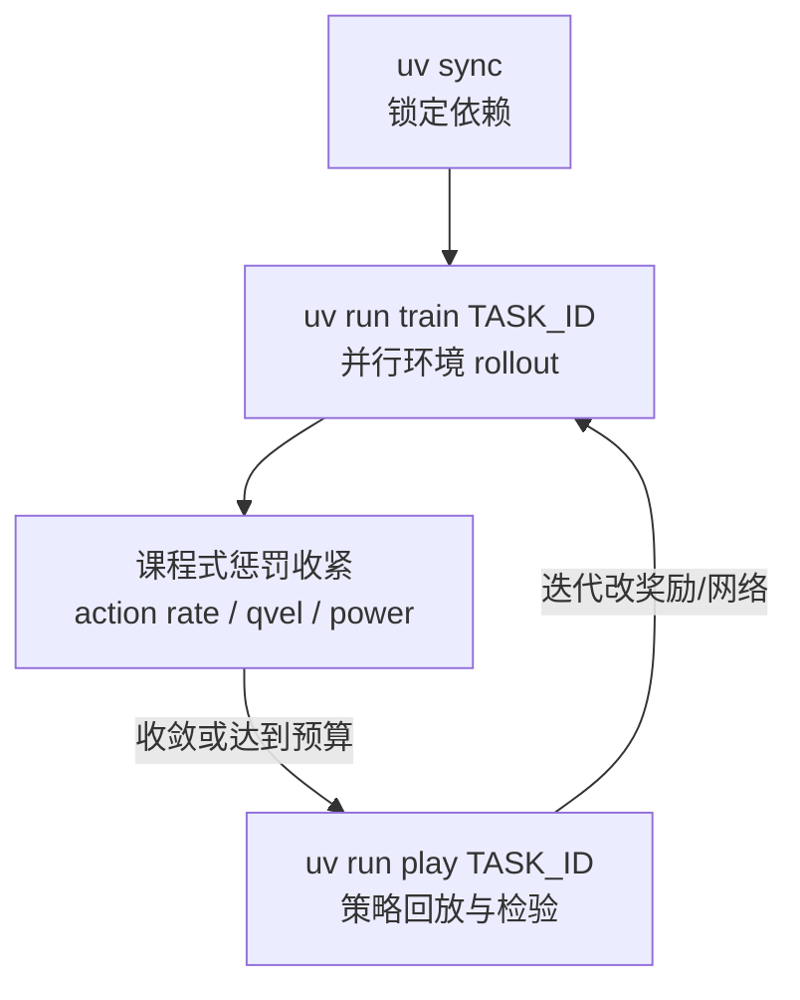

# mjlab_playground（mjlab 任务集合）

**mjlab_playground** 是 [mjlab](./mjlab.md) 之上的 **示例任务仓库**：把 [MuJoCo Playground](https://playground.mujoco.org/) 中的部分任务端口到 mjlab 的 manager-based RL 管线，便于在 **MuJoCo Warp GPU 仿真** 上快速复现「训练 → 回放」闭环。

## 为什么重要？

- **任务与框架解耦**：底层仍是 mjlab；本仓聚焦 **task id、奖励与课程式设计**，适合作为「在 mjlab 里新增一类技能」的模板。
- **与 Playground 对齐**：明确以 Playground 为上游参照，降低在 MuJoCo 生态内迁移任务的心智成本。
- **可脚本化入口**：`uv run train` / `uv run play` 与大批次并行环境（README 示例 `--num_envs 4096`）符合当前足式 RL 工程习惯。

## 流程总览

### 从动捕数据到 mjlab 系训练（概念管线）

下列流程表示 **常见研究组合**：动捕软件产出人体或环境坐标系下的运动估计，经几何/动力学处理后再进入仿真里的模仿学习或 RL；**mjlab_playground 仓库本身不内置 FreeMoCap 导入器**，图中虚线为工程上常接的模块。

### 本仓库内的训练与回放闭环

## 公开任务摘记

| Task ID | 机器人 | 技能 |
|---------|--------|------|
| `Mjlab-Getup-Flat-Unitree-Go1` | Unitree Go1 | 平地摔倒恢复 |
| `Mjlab-Getup-Flat-Booster-T1` | Booster T1 | 平地摔倒恢复 |

README 给出了在 **NVIDIA 5090** 上的粗量级收敛时间（Go1 getup 约 2 分钟、T1 约 8 分钟）并强调 **继续训练** 时收紧动作变化率与功率相关惩罚以换更平滑策略；具体耗时随 GPU、环境数与随机种子变化，只宜作数量级参考。

## 关联页面

- [mjlab](./mjlab.md) — 底层框架（Isaac Lab 风格 API + MuJoCo Warp）
- [MuJoCo](./mujoco.md) — 物理内核与 Playground 上游
- [unitree-rl-mjlab](./unitree-rl-mjlab.md) — Unitree 官方 mjlab 训练栈（与 playground 任务互补）
- [AMP_mjlab](./amp-mjlab.md) — G1 等机型上的 AMP 统一策略参考实现
- [Motion Retargeting](../concepts/motion-retargeting.md) — 动捕轨迹进入机器人任务前常见映射步骤
- [FreeMoCap](./freemocap.md) — 低成本开源动捕平台，可与本管线在数据侧衔接
- [模仿学习](../methods/imitation-learning.md) — 参考轨迹与 RL/BC 结合范式

## 推荐继续阅读

- [MuJoCo Playground 站点](https://playground.mujoco.org/) — 任务设计与交互参考
- [mjlab 论文（arXiv:2601.22074）](https://arxiv.org/abs/2601.22074) — 框架动机与基准

## 参考来源

- [sources/repos/mjlab_playground.md](../../sources/repos/mjlab_playground.md)
- [mujocolab/mjlab_playground](https://github.com/mujocolab/mjlab_playground)
