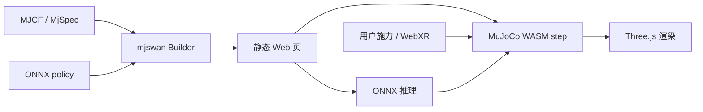

# mjswan

**mjswan**（[GitHub](https://github.com/ttktjmt/mjswan)，[在线 Demo](https://ttktjmt.github.io/mjswan/)）是在 [MuJoCo WASM](./mujoco-wasm.md) 之上封装 **实时策略控制 + 用户交互施力** 的框架：基于官方 [mujoco wasm](https://github.com/google-deepmind/mujoco/tree/main/wasm)、[ONNX Runtime Web](./onnxruntime.md) 与 Three.js，把 **obs → policy → ctrl → mj_step** 闭环跑在浏览器里，可 **零后端** 静态托管（GitHub Pages / Cloudflare Pages）。2026-04 起列入 [MuJoCo README 官方绑定列表](https://github.com/google-deepmind/mujoco#first-party-bindings)；2026-08 起 **mjlab-native**，可低成本导出 [mjlab](https://github.com/mujocolab/mjlab) 任务 Web demo。

## 一句话定义

**把 MuJoCo WASM 从「能步进」升级到「能跑 ONNX 策略、能施力、能当论文页一键分享」的 RL 演示栈。**

## 英文缩写速查

| 缩写 | 英文全称 | 简要说明 |
|------|----------|----------|
| mjswan | MuJoCo Simulation on WebAssembly with Neural networks | 本项目名 |
| WASM | WebAssembly | 浏览器内原生级字节码运行时 |
| ONNX | Open Neural Network Exchange | 跨框架策略权重交换格式 |
| RL | Reinforcement Learning | 强化学习策略演示主场景 |
| WebXR | Web Extended Reality | 浏览器 VR/AR 与手部追踪 |
| mjlab | — | MuJoCo 生态 RL 任务框架，mjswan 可原生导出 |

## 为什么重要

- **传播 RL / Sim2Sim 结果**：GentleHumanoid、MuscleMimic 等已用 mjswan 托管 **可交互 live demo**，降低「只看视频」的复现门槛。
- **客户端-only**：仿真与推理均在浏览器完成，适合课程、招聘页、项目页嵌入。
- **跨端 + WebXR**：桌面与移动端均可；支持 **VR/AR 手部与物体交互**。
- **与官方 WASM 对齐**：PyPI/npm 同步发布；文档 [mjswan.readthedocs.io](https://mjswan.readthedocs.io) 覆盖 Builder API 与 demo 列表。

## 核心结构

| 模块 | 说明 |
|------|------|
| **Python `mjswan.Builder`** | 从 `MjSpec`/场景注册项目 → `build()` → `launch()` 本地或导出静态站 |
| **npm `mjswan`** | 前端集成与打包 |
| **`mjswan` CLI** | `mjswan demo` / `--list` 浏览 bundled demos（需 `mjswan[examples]`） |
| **ONNX 策略桥** | 浏览器内加载策略权重，逐步写入 `ctrl` |
| **交互层** | 施力、reset；WebXR 手部碰撞 |
| **mjlab 导出** | 覆盖 mjlab 多数任务，快速生成 Web demo |
| **开源** | **已开源** Apache-2.0；PyPI + npm 公开发布 |

### 典型闭环

## 工程实践

| 项 | 建议 |
|----|------|
| 安装 | `pip install mjswan[examples]` 或 `npm install mjswan` |
| 冒烟 | 最小脚本：`mjswan.Builder().add_project(...).add_scene(...).build().launch()` |
| 托管 | GitHub Pages / Cloudflare Pages；保留 Apache-2.0 归因 |
| 选型 | **演示 / 轻量 Sim2Sim** 优先 mjswan；**大规模训练** 仍用原生 MuJoCo / MJX |
| 资产许可 | demo 含 robot_descriptions / playground / MyoSuite 等第三方模型，须遵守各自 LICENSE |

## 常见误区或局限

- **误区：** 把浏览器 demo 当训练环境；吞吐远低于原生 CPU/GPU MuJoCo。
- **误区：** 与 `@mujoco/mujoco` 官方包重复——mjswan 是 **策略 + 交互 + 静态站生成** 的上层，不是 WASM 绑定本身。
- **局限：** 复杂场景仍受 WASM 单线程与内存限制；多线程 WASM 需 COOP/COEP（见 [MuJoCo WASM](./mujoco-wasm.md)）。

## 与其他工作对比

| 对照 | 差异读法 |
|------|----------|
| [MuJoCo WASM](./mujoco-wasm.md) | 官方/社区 **绑定与渲染**；mjswan 加 **策略闭环 + demo 工程化** |
| [Robot Viewer](./robot-viewer.md) | URDF/MJCF **查看 + 轻仿真**；mjswan 偏 **RL 策略回放与 ONNX** |
| [BotLab MotionCanvas](./botlab-motioncanvas.md) | 另一类浏览器编排 demo；可并列作 Sim2Sim 传播工具 |
| zalo/mujoco_wasm | 早期 WASM 示例栈；mjswan 明确 **mjlab + ONNX + 静态站 CLI** |

## 关联页面

- [MuJoCo WASM](./mujoco-wasm.md)
- [MuJoCo](./mujoco.md)
- [ONNX Runtime](./onnxruntime.md)
- [Sim2Real](../concepts/sim2real.md)
- [仿真评估基础设施](../concepts/simulation-evaluation-infrastructure.md)

## 推荐继续阅读

- [mjswan GitHub](https://github.com/ttktjmt/mjswan)
- [在线 Demo](https://ttktjmt.github.io/mjswan/)
- [mjswan 文档](https://mjswan.readthedocs.io)
- [mjswan_playground](https://github.com/ttktjmt/mjswan_playground) — 官方 demo 合集

## 参考来源

- [ttktjmt/mjswan](../../sources/repos/ttktjmt-mjswan.md)
- [mujoco_wasm 社区仓](../../sources/repos/mujoco_wasm.md)
