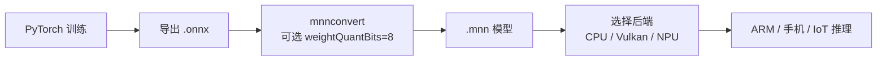

# MNN

**MNN**（**Mobile Neural Network**）是由 **阿里巴巴** 开源并长期维护的 **高效轻量深度学习推理引擎**。它在阿里系 30+ 应用、70+ 场景中承担 on-device 推理，并扩展至 **IoT 嵌入式**、**本地 LLM（MNN-LLM）** 与 **扩散模型（MNN Diffusion）**。对机器人研究与工程，MNN 代表 **「训练仍用 PyTorch → 导出 ONNX → mnnconvert 量化 → ARM/手机/NPU 上跑策略或感知」** 的边端路径，与 [ONNX Runtime](./onnxruntime.md)、TensorRT 形成互补选型。

## 一句话定义

面向 **移动端与嵌入式** 的 **高性能推理引擎 + 转换压缩工具链**：把主流训练产物压成 **`.mnn`** 并在 CPU/GPU/NPU 多后端执行。

## 英文缩写速查

| 缩写 | 英文全称 | 简要说明 |
|------|----------|----------|
| MNN | Mobile Neural Network | 阿里开源轻量推理引擎 |
| ONNX | Open Neural Network Exchange | 常见上游交换格式 |
| ORT | ONNX Runtime | 另一主流 ONNX 兼容 runtime |
| NPU | Neural Processing Unit | 专用 AI 加速单元，MNN 文档专章支持 |
| LLM | Large Language Model | MNN-LLM 子项目覆盖端侧大模型 |
| INT8 | 8-bit Integer Quantization | 权重量化，显著缩小模型体积 |
| ARM | Advanced RISC Machine | 机器人机载与移动端常见 CPU 架构 |

## 为什么重要？

- **边端算力友好**：通过 **8bit 权重量化、离线量化、FP16** 等把策略/感知模型压到手机、平板、低成本 ARM 板卡可承受的范围。
- **转换入口广**：`mnnconvert` 支持 **ONNX、TensorFlow、PyTorch、Caffe** 等；与 [ONNX](./onnx.md) 生态自然衔接。
- **生产验证充分**：官方强调在电商、视频、搜索等 **高 QPS 真实业务** 中打磨，而非仅实验室 benchmark。
- **LLM / 多模态扩展**：MNN-LLM 与 Diffusion 子项目表明同一引擎在 **端侧 VLA 原型** 中具备探索价值（成熟度因任务而异）。

## 核心结构（文档与 README 归纳）

1. **模型格式 `.mnn`**：内部图与权重表示，针对移动端加载与执行优化。
2. **mnnconvert**：CLI 转换；示例：`mnnconvert -f ONNX --modelFile model.onnx --MNNModel model.mnn --weightQuantBits 8`。
3. **推理 API**：
   - **Module API**（推荐）：`MNN.nn.load_module_from_file`
   - **Expr API**：表达式级构图与数值计算
   - Session API 已 **deprecated**
4. **后端**：CPU、Metal、CUDA、OpenCL、Vulkan；文档另述 **NPU 后端** 配置。
5. **Python 生态**：`pip install MNN`；`cv` / `numpy` 子模块便于前后处理；**MNNTools** 封装 `mnnquant` 等。
6. **Workbench**：[mnn.zone](http://www.mnn.zone) 提供可视化训练与一键下发（与机器人流水线集成度需自行评估）。

## 与机器人研究与工程的关系

- **与 ORT 的分工**：本库人形 **C++ 高频控制**（G1 WBC、AMP 部署）更常见 [ONNX Runtime](./onnxruntime.md) + TensorRT；MNN 更适合 **ARM 手机级算力、国产 NPU、极端体积约束** 的感知或轻量策略。
- **转换链**：PyTorch → ONNX（[PyTorch](./pytorch.md)）→ MNN → 机载；每步都可能引入数值误差，须做 **固定观测向量对齐测试**。
- **量化风险**：INT8 可能改变策略边界行为；locomotion 等闭环任务须在 **仿真或吊架** 上回归后再落地。
- **LLM 机器人**：MNN-LLM 可作为 **端侧语言模型** 实验栈，与云端 VLA 分工不同（延迟、内存、能力权衡）。

## 常见误区或局限

- **「MNN 等于 ONNX」**：MNN 是 **runtime + 转换器**；仍需理解 `.mnn` 与 `.onnx` 的差异及二次转换损失。
- **桌面 GPU 首选未必是 MNN**：NVIDIA Jetson 上 **TensorRT / ORT** 生态更厚；MNN 优势在移动与特定 NPU。
- **训练能力实验性**：文档含训练章节，但机器人主流仍是 **PyTorch 训练 + MNN 推理**。
- **pip 轮子的平台覆盖**：文档提示部分 Python/OS 组合需 **源码编译 PyMNN**。

## 流程总览（ONNX → MNN → 边端）

## 关联页面

- [ONNX](./onnx.md)
- [ONNX Runtime](./onnxruntime.md)
- [PyTorch](./pytorch.md)
- [TensorFlow](./tensorflow.md)
- [Sim2Real](../concepts/sim2real.md)
- [Open Duck Mini Runtime](./open-duck-mini-runtime.md)
- [ONNX Runtime vs MNN vs TensorRT](../comparisons/onnxruntime-vs-mnn-vs-tensorrt.md)

## 参考来源

- [MNN 官方文档与仓库索引](../../sources/repos/mnn-official.md)

## 推荐继续阅读

- [MNN 文档](https://mnn-docs.readthedocs.io/en/latest/)
- [Python 快速开始（5 分钟）](https://mnn-docs.readthedocs.io/en/latest/start/quickstart_python.html)
- [模型压缩指南](https://mnn-docs.readthedocs.io/en/latest/tools/compress.html)
- [MNN-LLM 用户指南](https://mnn-docs.readthedocs.io/en/latest/transformers/llm.html)
- [alibaba/MNN（GitHub）](https://github.com/alibaba/MNN)
