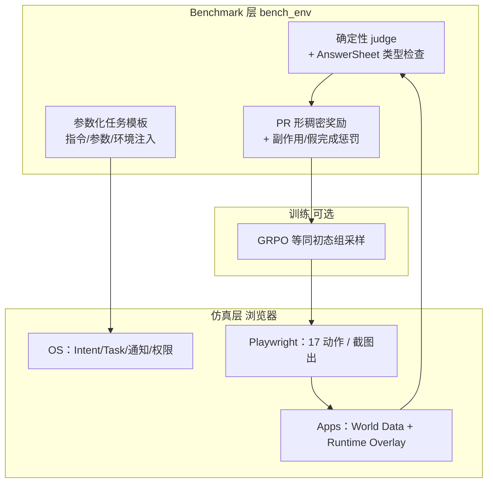

# MobileGym（移动 GUI Agent 可验证仿真与基准）

**MobileGym**（arXiv:2605.26114，[官网](https://mobilegym.dev)，[代码](https://github.com/Purewhiter/mobilegym)，[论文页](https://mobilegym.github.io/)）是面向 **移动 GUI Agent** 的 **浏览器托管、轻量、全可控** 仿真平台：用 **结构化 JSON** 表示 App 数据、系统设置与设备上下文，在 **不复制微信/支付宝等专有后端** 的前提下追求 **交互保真**（截图 + 触控/输入/导航/跨 App），从而同时解决两类此前难以在日常 App 上规模化的需求：**可验证评测信号**（确定性状态裁判 + 全环境副作用检测）与 **可扩展在线 RL**（低成本同初态并行 rollout）。

## 一句话定义

> GUI Agent 只看见截图并发出离散动作；研究者则在后台拥有 **可读、可写、可分叉、无真实后果** 的全环境状态——把日常 App 从真机管线的「不可读、难重置、不可逆」盲区，拉进可编程实验台。

## 为什么重要

- **填补日常 App 评测空白：** AndroidWorld / AndroidLab 等多限于系统工具与开源 App；MobileBench-OL 等真机基准覆盖真实日常 App，但难并行、难重置、XPath/VLM 判分脆弱。MobileGym 用 **仿真替身** 覆盖微信、支付宝、小红书、B 站、12306 等 **12 个日常 + 16 个系统** App。
- **确定性裁判 vs VLM 判分：** 发布校验中程序化 judge **无假接受/拒绝**；同一批真机轨迹若改由 VLM 评分，人工审计约 **10.2%** 误判——对 RL 奖励与排行榜可信度是硬约束。
- **在线 RL 的资源账：** 单实例约 **400 MB RAM**、**~3 s** 冷启动，相对 Docker AndroidWorld（~4.5 GB、~78 s）约 **11×** 省内存、**26×** 快启动；论文报告单机 **256** 并行实例跑完 256 题评测约 **6 分钟**。
- **Sim-to-Real 存在性验证：** Qwen3-VL-4B 经 **10 步 GRPO**（96 并行浏览器）在仿真 test 集 **+12.8 pt SR**；59 个真机可跑「信号桶」上仿真 **+42.8 pt** 对应真机 **+40.7 pt**（**95.1%** 保留），说明增益不完全是记忆固定 UI 布局。

## 相对既有移动 Agent 环境（论文 Table 1 摘要）

| 维度 | AndroidWorld | AndroidLab | MobileBench-OL | **MobileGym** |
|------|--------------|------------|----------------|---------------|
| 运行时 | 模拟器 | 模拟器 | 真机 | **浏览器** |
| 日常 App | ✗ | ✗ | ✓ 真实 | ✓ **仿真** |
| 任务规模 | 20 App / 116 模板 | 9 / 138 实例 | 80 / 1080 实例 | **28 / 416 模板** |
| 验证 | adb 程序化 | UI 树 + LLM | XPath | **状态 JSON 程序化** |
| 全环境状态 diff | ✗ | ✗ | ✗ | **✓** |
| 快照/恢复 | App 数据快照 | AVD | ✗ | **JSON（毫秒级）** |
| 在线 RL 友好 | 受限 | 受限 | ✗ | **✓** |
| 单实例内存 | ~4.5 GB | ~6 GB | N/A | **~400 MB** |

## 流程总览（评测与 RL 闭环）

**分层状态（读 wiki 时抓住一点即可）：** 大体积 **World Data** 只读；Agent 写入 **Runtime Overlay**；视图 = 叠加渲染。配置、reset、快照、分叉与 judge **只触及 runtime**，快照小且稳定。

## MobileGym-Bench 要点

| 项目 | 数值/说明 |
|------|-----------|
| 模板数 | **416**（**256 test + 160 train**，严格不相交） |
| 覆盖 App | **28**（12 日常 + 16 系统） |
| 实例多样性 | 指令变体 + 参数采样 + 环境注入 → 有限域 **>27k** 实例 |
| Taxonomy | **Scope**（单/双/多 App）、**Objective**（操作/查询/混合）、**Composition**（原子/顺序/跨 App/深钻）、**Difficulty** L1–L4（八模型后验标定） |
| 主指标 | **SR**；诊断 **PR、FC（假完成）、USE（意外副作用）、OT（逾期终止）** |
| 查询任务 | **AnswerSheet** GUI 表单 + 类型化 matcher，避免自由文本启发式 |

**Leaderboard 快照（256 test）：** 专有模型最高 **Gemini 3.1 Pro 58.8% SR**；开源 GUI 专模约 **13–20%**；Qwen3-VL-4B 基线 **9.4%**，同设置 GRPO 后 **22.2%**。L4（最难 80 题）全体仍低，头部 Gemini 仅 **21.9%**，说明基准未顶穿天花板。

## 工程复现要点

- **栈：** Node ≥ 22 构建前端；Python ≥ 3.11 + Playwright 跑 `bench_env`；可选 **~1.4 GB** `mobilegym-data`（CC BY-NC 4.0）。
- **并行规模：** 轻量评测可用 `npm run preview`（约 ≤8 并行）；大规模用 **nginx gateway**（`https://localhost:4180`）。
- **Agent：** 内置 autoglm、uitars、venus、gui_owl、generic、human 等；新适配器约百行。
- **扩展：** 新 App 走 `apps/` manifest 自动发现；新任务见 `TASK_AUTHORING_GUIDE.md`。**Online RL 训练代码** README 标明尚未发布。

## 常见误区或局限

- **不是真机替身：** 仿真 App 为独立实现的研究 surrogate，**不连接**真实账号、支付与后端；Sim-to-Real 实验也明确环境/实体与真机不同。
- **不是具身机器人栈：** 与 [ESI-Bench](./esi-bench.md)（OmniGibson 空间推理）正交；本库机器人主线读者应把它当作 **「手机上的 VLA/GUI Agent 基础设施」**，而非 loco-manipulation 仿真器。
- **数据许可：** 合成内容与 `mobilegym-data` 为 **CC BY-NC 4.0**；商用复现需单独核对 `DISCLAIMER.md`。
- **像素保真非目标：** 不追求与真机像素级一致；论文主张 **交互保真 + 状态可编程** 足以支撑 Agent 研究与可验证 RL。

## 关联页面

- [Online RL vs Offline RL](../comparisons/online-vs-offline-rl.md) — MobileGym 主打 **在线组采样 RL**（GRPO）的可扩展环境侧
- [VLA](../methods/vla.md) — 多模态「视觉 + 语言 → 动作」范式；移动 GUI Agent 可视为不同 embodiment 上的同类问题
- [Reinforcement Learning](../methods/reinforcement-learning.md) — PPO/GRPO 与稠密 shaping 奖励语境
- [Sim2Real](../concepts/sim2real.md) — 仿真训练、真机保留增益的对照框架
- [ESI-Bench](./esi-bench.md) — 另一路线的 **可验证、可并行** 具身评测（3D 空间 QA vs 移动 GUI）

## 参考来源

- [MobileGym 论文摘录](../../sources/papers/mobilegym_arxiv_2605_26114.md)
- [Purewhiter/mobilegym 仓库归档](../../sources/repos/purewhiter_mobilegym.md)
- [mobilegym.dev 官网归档](../../sources/sites/mobilegym-dev.md)

## 推荐继续阅读

- [arXiv:2605.26114](https://arxiv.org/abs/2605.26114) 全文与附录（奖励设计、真机协议、VLM judge 审计）
- [mobilegym.dev](https://mobilegym.dev) Live Demo 与 Leaderboard
- [bench_env/README](https://github.com/Purewhiter/mobilegym/blob/main/bench_env/README.md) — 并行参数、`run_explorer` 轨迹可视化
- 对照阅读 **AndroidWorld**（[arXiv:2405.14573](https://arxiv.org/abs/2405.14573)）理解模拟器路线的能力边界
