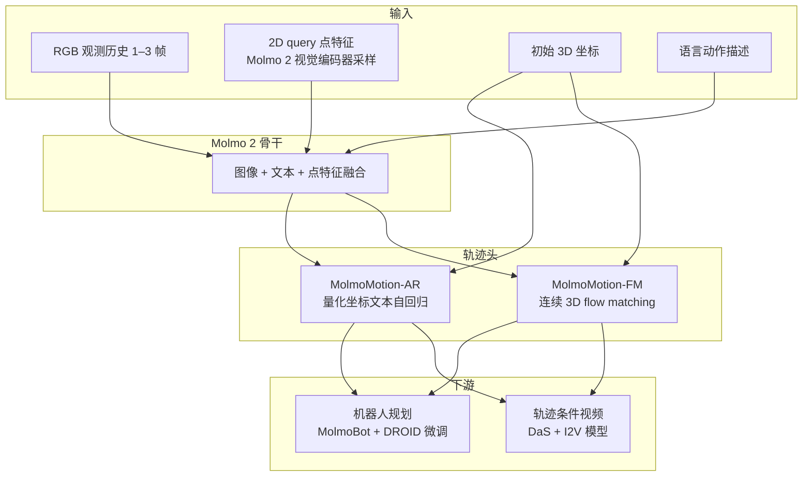

# MolmoMotion

**MolmoMotion**（[Ai2 博客](https://allenai.org/blog/molmo-motion) | [arXiv:2606.18558](https://arxiv.org/abs/2606.18558) | [项目页](https://molmomotion.github.io/) | [GitHub](https://github.com/allenai/molmo-motion) | [HF 模型集合](https://huggingface.co/collections/allenai/molmomotion)）把 **运动预测** 从「解释已发生的轨迹」推进到 **语言条件下的 3D 前瞻**：给定短视觉历史、物体上的 query 点与自然语言动作，预测各点在未来数秒 **世界坐标（米）** 中的路径。

## 一句话定义

**Molmo 2 VLM 骨干 + 物体附着 3D 点表示**：输入 RGB、2D/3D query 点与动作描述，输出 **class-agnostic、view-stable** 的未来 **metric 3D** 轨迹；提供 **AR（坐标文本自回归）** 与 **FM（连续 flow matching）** 两版，并开源 **MolmoMotion-1M** 训练语料与 **PointMotionBench** 评测。

## 英文缩写速查

| 缩写 | 英文全称 | 简要说明 |
|------|----------|----------|
| VLM | Vision-Language Model | 视觉–语言多模态模型；MolmoMotion 以 Molmo 2 为骨干 |
| AR | Autoregressive | 自回归变体 MolmoMotion-AR，逐步生成量化坐标文本 |
| FM | Flow Matching | 流匹配变体 MolmoMotion-FM，在连续 3D 空间生成轨迹 |
| 3D | Three-Dimensional | 世界坐标 metric 3D 点轨迹，非仅像素位移 |
| ADE | Average Displacement Error | PointMotionBench 主指标：预测与真值 3D 点位移误差（米） |
| I2V | Image-to-Video | 图像到视频生成；MolmoMotion 轨迹可作 motion guidance |
| DROID | Distributed Robot Interaction Dataset | 开放机器人操作数据集；MolmoMotion 下游微调来源之一 |

## 为什么重要

- **表示层折中：** 相对 **全像素视频 rollout**，稀疏 **3D 点轨迹** 更 **紧凑、跨视角稳定**，且能 **直接** 接机器人规划或 I2V 运动条件；相对 **人体/刚体模板**，**class-agnostic** 点集可覆盖 bowl、lint roller、车辆、火烈鸟等异构物体。
- **数据–模型–基准闭环：** **MolmoMotion-1M**（1.16M 视频、736 动作类）+ **PointMotionBench**（2.7K 人工校验）使 **3D 运动预测** 有可规模化训练与 **metric 3D** 评测，而非只看「轨迹像不像」。
- **跨任务迁移实证：** DROID 微调后 **MolmoBot** 规划成功率与样本效率显著优于 **Molmo 2** 初始化；**DaS + MolmoMotion** 引导 CogVideoX-5B 在 motion 指标上优于更大 Wan2.2-I2V。

## 核心结构/机制

### MolmoMotion-1M 自动标注（摘要）

| 阶段 | 作用 |
|------|------|
| Ground + 采样 | 按动作描述定位运动物体并采 query 点 |
| 2D 跟踪 → 3D lift | 稠密跟踪后提升到 **共享 metric 世界系** |
| 过滤与裁剪 | 剔除与物体不一致的点；平滑；保留 **实际运动窗口** |

### PointMotionBench（摘要）

- **2.7K clip**，**111** 物体类，**61** 运动类型（操作 / ego 手–物 / 户外）。
- 对比基线含 **像素视频 WM**（Cosmos Predict、Wan2.2 等）、Track2Act、WorldTrack、**静态/常速** 外推。
- **MolmoMotion-AR (3f)** 在 HOT3D、DAVIS 等 split 上 **ADE 最低档**（博客 Table 1 量级 ~0.1–0.2 m vs 视频基线 >1 m）。

### 下游结果（博客摘要）

| 场景 | 要点 |
|------|------|
| **仿真 pick-and-place** | MolmoMotion 初始化 **76.3%** vs Molmo 2 **56.0%** 闭环成功率 |
| **样本效率** | 10K steps **51%** vs Molmo 2 **19%**；真机 ~**2K** steps 对齐 Molmo 2 **12K** L2 |
| **I2V motion guidance** | DaS + MolmoMotion 五项 motion 指标均优于 CogVideoX-5B |

## 常见误区或局限

- **误区：MolmoMotion = 端到端 VLA。** 主输出是 **3D 点轨迹先验**，机器人侧需 **MolmoBot 等策略头** 把轨迹转为控制；与 [mimic-video](../methods/mimic-video.md) 的 **潜视频计划 + 动作解码** 或 [Qwen-RobotWorld](./qwen-robot-world.md) 的 **语言条件像素 WM** 路线不同。
- **误区：点轨迹可替代物理引擎。** 预测是 **数据驱动** 的；接触力、精确碰撞仍依赖解析仿真或闭环反馈。
- **局限：** 训练 **每物体 8 点** → **复杂可变形** 表面几何表达不足；互联网视频 **深度/跟踪噪声** 仍影响 1M 标注质量。

## 参考来源

- [MolmoMotion 博客归档](../../sources/blogs/allenai_molmo_motion.md)
- [MolmoMotion: Language-guided 3D motion forecasting（Ai2 博客）](https://allenai.org/blog/molmo-motion)
- [MolmoMotion 论文 arXiv:2606.18558](https://arxiv.org/abs/2606.18558)
- [MolmoMotion GitHub](https://github.com/allenai/molmo-motion)
- [MolmoMotion-1M 数据集](https://huggingface.co/datasets/allenai/molmo-motion-1m)
- [PointMotionBench](https://huggingface.co/datasets/allenai/PointMotionBench)

## 关联页面

- [Generative World Models](../methods/generative-world-models.md)
- [Video-as-Simulation](../concepts/video-as-simulation.md)
- [Manipulation](../tasks/manipulation.md)
- [mimic-video（Video-Action Model）](../methods/mimic-video.md)
- [Qwen-RobotWorld](./qwen-robot-world.md)

## 推荐继续阅读

- [MolmoMotion 项目页](https://molmomotion.github.io/)
- [Generative World Models 方法页](../methods/generative-world-models.md) — 像素 WM 与 **3D 轨迹先验** 的对照坐标
- [Query：操作 VLA 与视频-动作架构选型](../queries/manipulation-vla-architecture-selection.md)
