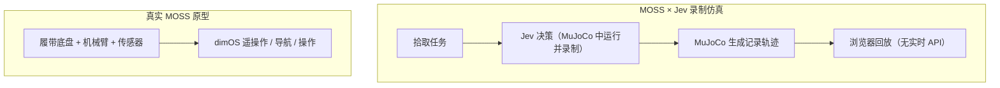

# MOSS（开源履带式垃圾拾取机器人）

MOSS 是 Show Robotics 开发的开源移动操作机器人原型：履带底盘载着收纳箱与 SO-101 衍生机械臂，目标是在户外拾取垃圾；软件和固件已公开，硬件 CAD 仍在定版。

## 英文缩写速查

| 缩写 | 英文全称 | 简要说明 |
|------|----------|----------|
| MOSS | MOSS（项目名称） | 项目名，不是官方给出的缩写展开 |
| SO-101 | SO-101 robotic arm | MOSS 采用其衍生结构的开源机械臂 |
| dimOS | Dimensional Operating System | MOSS 当前软件栈所用的机器人集成与操作系统 |
| MJCF | MuJoCo XML model format | Jev 仿真仓库中用于描述机器人和场景的模型格式 |

## 为什么重要

MOSS 把低成本开源移动操作落到一台可观察的实体原型上：打印底盘、履带、收纳箱和机械臂零件，再组合电机驱动、传感器与上层软件。它提供一个可拆解的工程案例，能分别考察移动底盘、末端抓取、仿真记录与真机软件集成接口，而无需把演示误判为已验证的自主系统。

## 核心结构与方法栈

| 子系统 | 官方当前说明 | 工程含义 |
|------|------|------|
| 移动底盘 | 双减速电机与编码器、TPU 打印履带，由 ESP32-S3 驱动 | 负责低速移动；履带张紧与户外耐久仍需原型验证 |
| 机载计算与感知 | 当前台架配置为 Jetson Orin Nano Super、RealSense D455；项目说明另有 2D LiDAR 与手腕相机 | Pi 等备选组合并非均已在实机验证 |
| 操作臂 | SO-101 衍生五舵机机械臂，搭配 NormaCore 衍生平行夹爪 | 执行靠近物体后的抓取与放入收纳箱 |
| 软件 | dimOS 负责遥操作、记录、导航与操作；ESP32-S3 运行底盘调试固件 | 可复用的软件与固件接口，和自主拾取能力需分别评估 |
| 仿真 | moss-jev 提供 MuJoCo 模型、可本地运行的 CPU 仿真器及预录任务 | 当前模型简化了底盘平移和夹爪物理，不等同标定后的履带动力学或制造 CAD |

## 流程总览：实体原型与 Jev 演示分开看

Jev 的任务动作曾在 MuJoCo 中通过 Jev API 生成，但网页只播放录制好的状态与物理轨迹。它不代表 Jev 在浏览器里实时推理，也不证明实体 MOSS 已完成自主拾取。

## 工程实践与开放状态

- **代码已公开：** MOSS 主仓库含软件、ESP32-S3 固件及文档；仓库标注软件 Apache-2.0、硬件 CERN-OHL-S-2.0、文档与媒体 CC BY 4.0。
- **实体成熟度：** 截至 2026-10-06，官方 README 称首台原型已经行驶并装上机械臂，但还没有自主完成垃圾拾取。该状态比项目页中较早的「design files and data are open」文案更具体，应以仓库最新状态为准。
- **硬件文件：** CAD 正在结合实机装配反馈定版，STL / STEP 与 BOM 尚未作为正式构建包发布。README 将 V0.5 称作开源 CAD release candidate，V0.6 增加模块化方案；发布日期不等同于文件已开放下载。
- **Jev 仿真：** 浏览器演示是预录回放，无在线推理、API 请求或后端。仓库同时公开可运行的 CPU MuJoCo 仿真与便携 MJCF 模型；其简化底盘和夹爪模型不能用来推断真机跟踪精度或 Sim2Real 性能。
- **复现阅读顺序：** 先查看 MOSS README 与 BOM / 3D 打印 / 装配文档，再读 moss-jev 的 live/README.md、模型与 integration contract；需要真机自主能力时，单独核对导航、感知、抓取策略与安全闭环是否已经实现。

## 局限与风险

当前 MOSS 是正在迭代的开源机器人原型，不是已验证的自主清洁产品。项目尚未报告自主拾取完成率、户外长时运行或仿真到真机迁移结果；moss-jev 记录的成功任务不能替代这些实测。仓库还提示电池没有认证保护，首次运行应架空底盘并采取基础电气安全措施。硬件 CAD 和 BOM 发布前，读者不能仅凭视频或演示页面完整复刻整机。

## 关联页面

- [DimOS（Dimensional 物理空间 Agent OS）](./dimensionalos-dimos.md) — MOSS README 将 dimOS 列为实机软件栈
- [Jev（TypeSafe）](./typesafe-jev.md) — Jev 在 MOSS 仿真任务中的决策模型；网页演示是录制回放
- [移动操作任务](../tasks/manipulation.md) — 移动底盘与机械臂协同的任务背景
- [移动操作与全身操作](../tasks/loco-manipulation.md) — 机器人移动与接触操作的耦合问题

## 参考来源

- [MOSS 官方项目页归档](../../sources/sites/showrobotics-moss.md)
- [MOSS 官方仓库归档](../../sources/repos/metrox-eth-moss.md)
- [MOSS × Jev 仿真仓库归档](../../sources/repos/metrox-eth-moss-jev.md)

## 推荐继续阅读

- [MOSS 官方仓库](https://github.com/metrox-eth/moss) — README、软件/固件、BOM 与硬件发布状态
- [MOSS × Jev 仿真仓库](https://github.com/metrox-eth/moss-jev) — CPU MuJoCo 仿真、MJCF 模型与演示轨迹
- [MOSS × Jev 浏览器演示](https://www.showrobotics.ai/moss-jev/) — 查看预录制的物理回放
