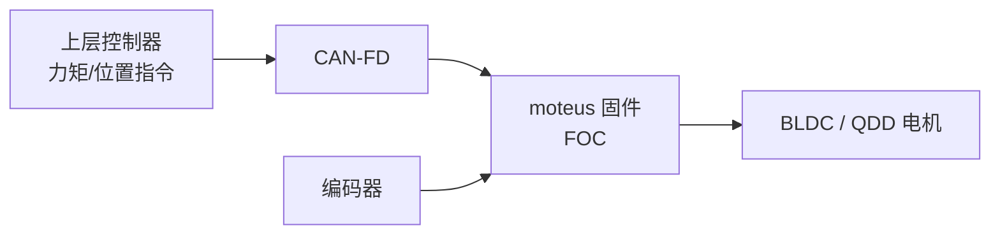

# moteus（mjbots 关节驱动器）

## 一句话定义

**moteus** 是 [mjbots](https://mjbots.com) 的开源无刷伺服控制器栈（[GitHub](https://github.com/mjbots/moteus)）：多板型驱动 PCB、固件、FOC、编码器与 **CAN-FD**，面向腿足/机械臂关节的位置、速度与力矩控制。

## 英文缩写速查

| 缩写 | 英文全称 | 简要说明 |
|------|----------|----------|
| FOC | Field-Oriented Control | 无刷电机的磁场定向控制 |
| CAN-FD | Controller Area Network with Flexible Data-rate | 更高载荷的 CAN 变体，关节总线常用 |
| BLDC | Brushless DC Motor | 无刷直流电机 |
| PCB | Printed Circuit Board | 印制电路板 |
| PWM | Pulse-Width Modulation | 脉宽调制，驱动电机与功率器件 |
| QDD | Quasi-Direct Drive | 准直驱，低减速比、高背驱动性的作动方案 |

## 为什么重要

- 在 [开源 QDD 执行器学习路线](../comparisons/open-source-qdd-actuator-projects.md) 中，它是 **SimpleFOC 之后** 学「真关节驱动板」的优先选项。
- [Urs 等 3D 打印开源执行器](./paper-3d-printed-open-source-actuators-legged.md) 选用 **moteus r4.5**；[Jeong 双摆线 QDD](./cycloidal-quasi-direct-drive-actuator.md) 选用 **moteus-c1**——学术/DIY QDD 常见底座。
- 与 [执行器驱动链选型闭环](../queries/actuator-drive-chain-selection-loop.md) 第②层对齐：可对照自研板 vs 成品驱动。

## 开源状态

| 资产 | 状态 |
|------|------|
| 固件 `fw/` | **已开源**（Apache-2.0） |
| 硬件 `hw/controller|c1|n1|x1` | **已开源** PCB 设计 |
| 客户端 `lib/` | **已开源** |
| 成品板 | 可购自 mjbots.com（商标政策见官网） |

## 板型规格（README 摘录）

| 名称 | 输入电压 | 峰值电功率 | 质量 | 无冷却/冷却/峰值相电流 | 尺寸 |
|------|----------|------------|------|------------------------|------|
| r4.11 | 10–44 V | 900 W @ 30 V | 14.2 g | 12 / 32 / 100 A | 46×53 mm |
| c1 | 10–51 V | 250 W @ 28 V | 8.9 g | 5 / 14 / 20 A | 38×38×9 mm |
| n1 | 10–54 V | 2 kW @ 36 V | 14.6 g | 9 / 26 / 100 A | 46×46×8 mm |
| x1 | 10–54 V | 1.3 kW @ 36 V | 23.8 g | 25 / 62 / 120 A | 56×56×10 mm |

- 控制/PWM：r4.11 文档给控制环约 **15–30 kHz**、PWM **15–60 kHz**；MCU **STM32G4**。
- 通信：**5 Mbps CAN-FD**。

## 核心结构/机制

| 目录 | 内容 |
|------|------|
| `hw/` | 各板型 PCB / 机械 |
| `fw/` | 控制器固件 |
| `lib/` | 主机侧库 |
| `docs/` | 文档；另有 [mjbots.github.io/moteus](https://mjbots.github.io/moteus/) |

## 工程实践

- 精读原理图：功率级、栅极驱动、电流采样、保护与 CAN-FD——对应 [力矩电机路线 Stage 4](../../roadmap/depth-torque-motor-design.md)。
- 与 [SimpleFOC](./simplefoc.md) 分工：SimpleFOC 学算法；moteus 学关节级集成与总线。
- 与 [Tinymovr](./tinymovr.md) / [VESC](./vesc.md) 对照：Tinymovr 更小巧但 v3.1+ 源码私有；VESC 功率生态更广但关节协议需自约束。
- 上游警告：中高功率电子，有火灾风险；遵循安全与商标政策。

## 局限与风险

- 力矩精度仍受电流采样、\(K_t\) 标定与热降额约束——驱动开源 ≠ 力矩闭环验收完成。
- 商标「mjbots」「moteus」受保护，产品命名须读官网政策。

## 关联页面

- [开源 QDD 执行器项目对比](../comparisons/open-source-qdd-actuator-projects.md)
- [SimpleFOC](./simplefoc.md)
- [Tinymovr](./tinymovr.md)
- [VESC](./vesc.md)
- [3D 打印开源腿式执行器论文](./paper-3d-printed-open-source-actuators-legged.md)
- [Cycloidal QDD（Jeong）](./cycloidal-quasi-direct-drive-actuator.md)
- [磁场定向控制（FOC）](../concepts/field-oriented-control.md)

## 参考来源

- [sources/repos/moteus.md](../../sources/repos/moteus.md)
- [开源 QDD 执行器学习策展](../../sources/personal/open_source_qdd_actuator_learning_curator.md)

## 推荐继续阅读

- 仓库：<https://github.com/mjbots/moteus>
- 文档：<https://mjbots.github.io/moteus/>
- 商店：<https://mjbots.com>
